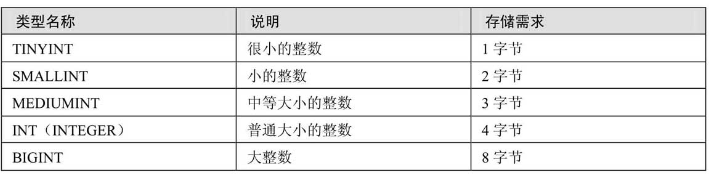
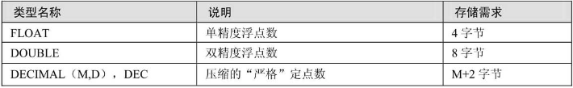
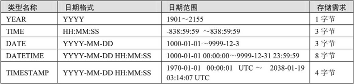
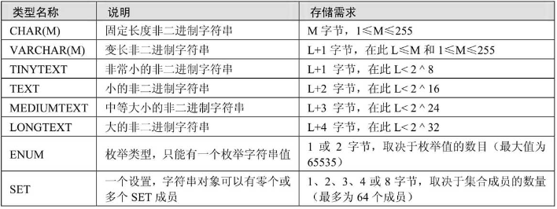
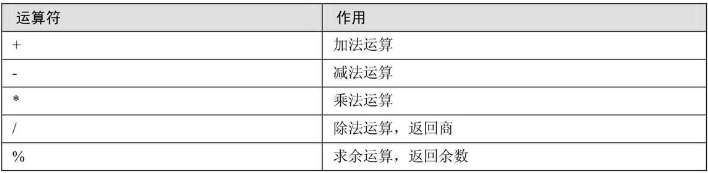
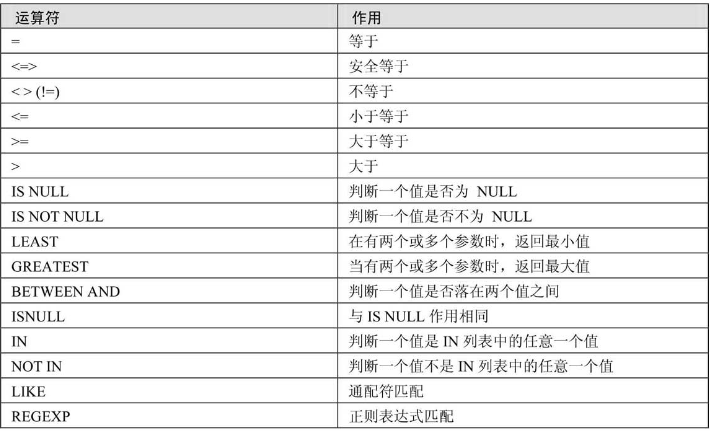
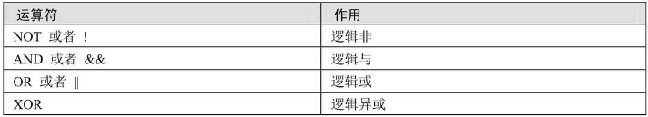
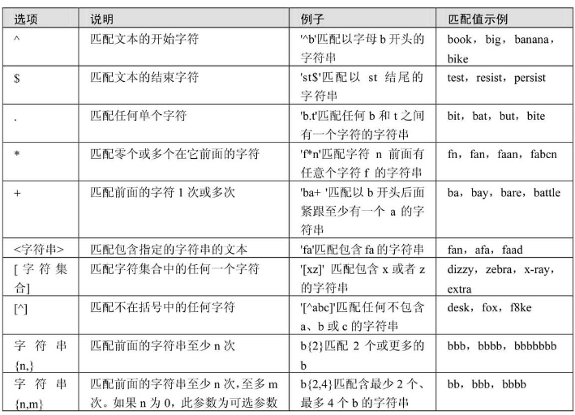
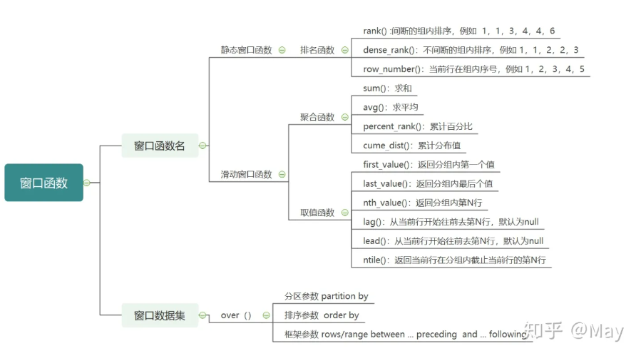

# mysql速查表

## 数据类型

### 数值型 {.tabset}

#### 整数型

```{r intx,echo=FALSE}

```

#### 浮点数

```{r floatx,echo=FALSE}

```

### 时间与日期

```{r timex,echo=FALSE}

```

### 字符串

```{r stringx,echo=FALSE}

```

## 数学运算符

```{r mathf,echo=FALSE}

```

## 比较运算符

```{r comparef,echo=FALSE}

```

## 逻辑运算符

```{r logicf,echo=FALSE}
  
```

## 函数

### 数学函数

函数|作用
-|-
ABS(X)|绝对值
SQRT(x)|平方
MOD(X)|求余
CEIL(X)|上整数
FLOOR(X)|下整数
RAND()|返回随机的一个随机数
RAND(X)|对于不同的X，有固定的相对应的随机数
ROUND(X)|四舍五入
ROUND(X,Y)|Y为保留到小数点后几位
TRUNCATE(x,y)|)返回被舍去至小数点后y位的数字
PI(x)|$\pi$
SIGN(X)|返回数值的符号，x的值为负、零或正时返回结果依次为-1、0或1
POW(x,y)|$x^y$
exp(x)|$e^x$
log(x)|$\ln x$
log10(x)|$\log_{10} x$
radians|转化为弧度制
degrees|转化为角度制
sin(x),asin(x)|正弦，反正弦
cos(x),acos(x)|余弦，反余弦
tan(X),atan(x),cot(x)|正切，反正切，余切

### 字符串函数

|    | 函数名称   | 作 用                                                                |
|----|------------|----------------------------------------------------------------------|
|  0 | LENGTH     | 计算字符串长度函数，返回字符串的字节长度                             |
|  1 | CONCAT     | 合并字符串函数，返回结果为连接参数产生的字符串，参数可以使一个或多个 |
|  2 | INSERT     | 替换字符串函数                                                       |
|  3 | LOWER      | 将字符串中的字母转换为小写                                           |
|  4 | UPPER      | 将字符串中的字母转换为大写                                           |
|  5 | LEFT       | 从左侧字截取符串，返回字符串左边的若干个字符                         |
|  6 | RIGHT      | 从右侧字截取符串，返回字符串右边的若干个字符                         |
|  7 | TRIM       | 删除字符串左右两侧的空格                                             |
|  8 | REPLACE    | 字符串替换函数，返回替换后的新字符串                                 |
|  9 | SUBSTRING  | 截取字符串，返回从指定位置开始的指定长度的字符换                     |
| 10 | REVERSE    | 字符串反转（逆序）函数，返回与原始字符串顺序相反的字符串 |  

### 聚合函数

|    | 函数名称   | 作用                             |
|----|------------|----------------------------------|
|  0 | MAX        | 查询指定列的最大值               |
|  1 | MIN        | 查询指定列的最小值               |
|  2 | COUNT      | 统计查询结果的行数               |
|  3 | SUM        | 求和，返回指定列的总和           |
|  4 | AVG        | 求平均值，返回指定列数据的平均值 |

### 时间函数

|    | 函数名称                | 作 用                                                           |
|----|-------------------------|-----------------------------------------------------------------|
|  0 | CURDATE 和 CURRENT_DATE | 两个函数作用相同，返回当前系统的日期值                          |
|  1 | CURTIME 和 CURRENT_TIME | 两个函数作用相同，返回当前系统的时间值                          |
|  2 | NOW 和 SYSDATE          | 两个函数作用相同，返回当前系统的日期和时间值                    |
|  3 | UNIX_TIMESTAMP          | 获取UNIX时间戳函数，返回一个以 UNIX 时间戳为基础的无符号整数    |
|  4 | FROM_UNIXTIME           | 将 UNIX 时间戳转换为时间格式，与UNIX_TIMESTAMP互为反函数        |
|  5 | MONTH                   | 获取指定日期中的月份                                            |
|  6 | MONTHNAME               | 获取指定日期中的月份英文名称                                    |
|  7 | DAYNAME                 | 获取指定曰期对应的星期几的英文名称                              |
|  8 | DAYOFWEEK               | 获取指定日期对应的一周的索引位置值                              |
|  9 | WEEK                    | 获取指定日期是一年中的第几周，返回值的范围是否为 0〜52 或 1〜53 |
| 10 | DAYOFYEAR               | 获取指定曰期是一年中的第几天，返回值范围是1~366                 |
| 11 | DAYOFMONTH              | 获取指定日期是一个月中是第几天，返回值范围是1~31                |
| 12 | YEAR                    | 获取年份，返回值范围是 1970〜2069                               |
| 13 | TIME_TO_SEC             | 将时间参数转换为秒数                                            |
| 14 | SEC_TO_TIME             | 将秒数转换为时间，与TIME_TO_SEC 互为反函数                      |
| 15 | DATE_ADD 和 ADDDATE     | 两个函数功能相同，都是向日期添加指定的时间间隔                  |
| 16 | DATE_SUB 和 SUBDATE     | 两个函数功能相同，都是向日期减去指定的时间间隔                  |
| 17 | ADDTIME                 | 时间加法运算，在原始时间上添加指定的时间                        |
| 18 | SUBTIME                 | 时间减法运算，在原始时间上减去指定的时间                        |
| 19 | DATEDIFF                | 获取两个日期之间间隔，返回参数 1 减去参数 2 的值                |
| 20 | DATE_FORMAT             | 格式化指定的日期，根据参数返回指定格式的值                      |
| 21 | WEEKDAY                 | 获取指定日期在一周内的对应的工作日索引                          |

### 条件函数

|    | 函数名称   | 作用           |
|----|------------|----------------|
|  0 | IF         | 判断，流程控制 |
|  1 | IFNULL     | 判断是否为空   |
|  2 | CASE       | 搜索语句       |

## 正则表达式

```{r regexp,echo=FALSE}
  
```

where expr REGXEP 正则表达式

## 窗口函数

[原文](https://zhuanlan.zhihu.com/p/165210822)

窗口函数是为了干什么，它并不会将多行查询结果合并为一行，而是将结果放回多行当中。也就是说，窗口函数是不需要GROUP BY的。它在形式上利用partition by来进行分区，然后操作，但是结果行数并没有发生变化.

语法

窗口函数

    window_function_name(window_name/expression)
    
    OVER (
    
    [partition_defintion]: partition by
    
    [order_definition] : order by
    
    [frame_definition] : 
    )

partition by:分区而非分组，对窗口函数和over中的order by，frame起作用,但是对任何聚合函数没有作用，即使是over中的聚合函数。通过partition by，可以在每个分区内通过窗口函数进行排序和求和等操作。若是想整体操作，那其实不是窗口函数的功能，可以在外部通过order by，group by操作实现.

order by:排序操作，有分区操作则对每个分区内部进行排序

frame结构:在分区内进一步细分，比如确定值范围，确定行范围，某一行之前之后的范围。

```{r windowf,echo=FALSE}
  
```

```{python window,results="asis"}
with open("./static/docs/window-function.txt","r") as f:
  w = f.read()
print(w)
```

