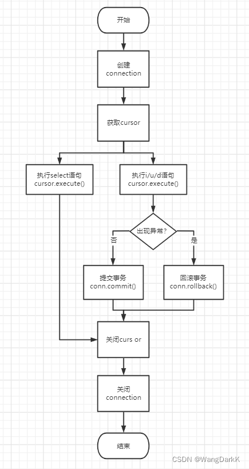

# PyMysql

PyMysql是纯python写的用来操作python的包

操作流程如下,[原文](https://blog.csdn.net/weixin_45495526/article/details/123058703)

```{r flowchart,echo=FALSE}

```

## 导入包

```{python module}
import pymysql
```

## 连接数据库

```{python connect}
conn = pymysql.connect(
  host = "localhost", #主机
  port = 3306, #端口,int
  user = "root",
  database = "订单录入", # 选择数据库
  password = "990925wcldsg" #密码
  # autocommit = True 之后做出的操作会自动提交
  # cursorclass = pymysql.cursors.DictCursor 让结果以字典形式呈现，默认是嵌套元组
)
```

### 连接对象方法

方法|功能
-|-
commit()|将更改提交。
cursor(cursor=None)|创建一个用于执行查询的新游标。cursor (Cursor, SSCursor, DictCursor, or SSDictCursor) 
rollback()|回滚当前交易。

## 创建游标

游标是SQL的一种数据访问机制，游标是一种处理数据的方法。

使用SQL的select查询操作返回的结果是一个包含一行或者是多行的数据集。如果我们要对查询的结果再进行查询，比如（查看结果的第一行、下一行、最后一行、前十行等等操作）简单的通过select语句无法实现，因为此时索要查询的结果不是数据表，而是已经查询出来的结果集。游标就是针对这种情况而出现的.我们可以将”游标“简单的看成是结果集的一个指针，可以根据需要在结果集上面来回滚动，浏览我们需要的数据。

```{python createcursor}
cursor = conn.cursor()
```

### 游标对象方法

方法|功能|参数
-|-|-
close()|Closing a cursor just exhausts all remaining data.|
execute(query, args=None)|执行语句|query (str) – Query to execute.<br/>args (tuple, list or dict) – Parameters used with query. (optional).If args is a list or tuple, %s can be used as a placeholder in the query. If args is a dict, %(name)s can be used as a placeholder in the query.
executemany(query, args)|Run several data against one query.|query (str) – Query to execute.<br/>args (tuple or list) – Sequence of sequences or mappings. It is used as parameter.This method improves performance on multiple-row INSERT and REPLACE. Otherwise it is equivalent to looping over args with execute().
fetchall()|Fetch all the rows.|
fetchmany(size=None)|Fetch several rows.|
fetchone()|Fetch the next row.|

### 使用游标执行语句

```{python cursorselect}
sql = "SELECT * FROM Customers"
cursor.execute(sql)
```

### 获取结果

```{python fetch}
cursor.fetchone()
```

### 设置游标所在行

此时再用游标取所有的数，会发现第1行没有被取，因为之前取完第一行后，游标的位置已经到了下一行了，可以通过设置cursor.rownumber=0重新开始取。

```{python rownumber}
cursor.rownumber
cursor.fetchall()
cursor.rownumber = 1
#下面会返回第二行的数据
cursor.fetchone()
```

## 提交变化

当涉及对表的改变时，要提交变化，或者在创建conn设置autocommit为True。`conn.commit()`

## 关闭游标

```{python closecursor}
cursor.close()
```

## 关闭连接

```{python closeconn}
conn.close()
```

## 使用with自动关闭

先创建连接

    with conn:
      with conn.cursor() as cursor:
        cursor()
      with conn.cursor() as cursor:
        cursor()
      ...

## 总结操作

```{python summary}
# Connect to the database
connection = pymysql.connect(host='localhost',
                             user='root',
                             port=3306,
                             password='990925wcldsg',
                             database='订单录入'
                             #charset='utf8mb4'
                             )
with connection:
    with connection.cursor() as cursor:
        # Read a single record
        sql = "select quantity,item_price from orderitems where quantity>%s"
        cursor.execute(sql, (5,))
        result = cursor.fetchone()
        print(result)
    with connection.cursor() as cursor:
        # 似乎参数不能作为列名
        sql = "select cust_id,%s from customers"
        cursor.execute(sql, ("cust_name",))
        cursor.fetchone()


```

