# matplotlib


```python
import pandas as pd
import numpy as np
import re
import datetime
import matplotlib.pyplot as plt
import matplotlib as mpl
from matplotlib.lines import Line2D   
from matplotlib.patches import Circle, Wedge
from matplotlib.collections import PatchCollection
import matplotlib.dates as mdates
plt.rcParams['font.sans-serif']=['Simhei']; #SimHei黑体 
plt.rcParams['axes.unicode_minus']=False; #正常显示图中负号
```

[**原文**](https://datawhalechina.github.io/fantastic-matplotlib/)

## 认识matplotlib

Matplotlib是一个Python 2D绘图库，能够以多种硬拷贝格式和跨平台的交互式环境生成出版物质量的图形，用来绘制各种静态，动态，交互式的图表。

Matplotlib可用于Python脚本，Python和IPython Shell、Jupyter notebook，Web应用程序服务器和各种图形用户界面工具包等。

Matplotlib是Python数据可视化库中的泰斗，它已经成为python中公认的数据可视化工具，我们所熟知的pandas和seaborn的绘图接口其实也是基于matplotlib所作的高级封装。

为了对matplotlib有更好的理解，让我们从一些最基本的概念开始认识它，再逐渐过渡到一些高级技巧中。

## 一个最简单的绘图例子

Matplotlib的图像是画在figure（如windows，jupyter窗体）上的，每一个figure又包含了一个或多个axes（一个可以指定坐标系的子区域）。最简单的创建figure以及axes的方式是通过`pyplot.subplots`命令，创建axes以后，可以使用`Axes.plot`绘制最简易的折线图。


```python
fig,ax = plt.subplots()  # 创建一个包含一个axes的figure
ax.plot([1, 2, 3, 4], [1, 4, 2, 3]);  # 绘制图像
```

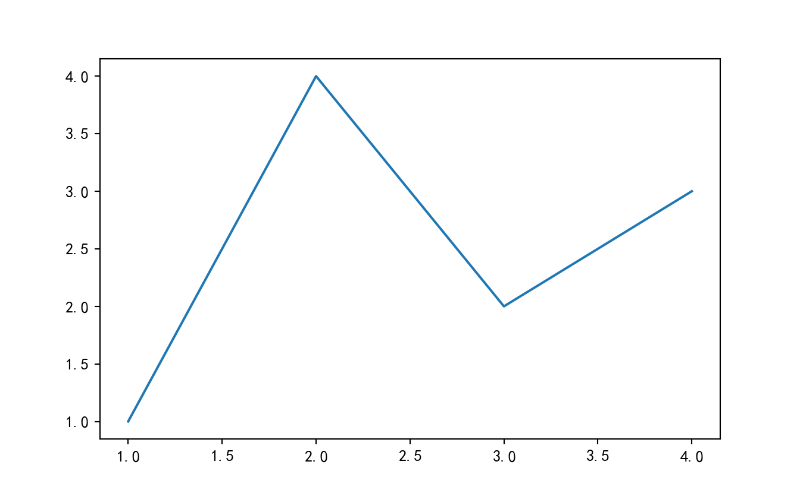

**Trick**：
在jupyter notebook中使用matplotlib时会发现，代码运行后自动打印出类似`<matplotlib.lines.Line2D at 0x23155916dc0>`这样一段话，这是因为matplotlib的绘图代码默认打印出最后一个对象。如果不想显示这句话，有以下三种方法，在本章节的代码示例中你能找到这三种方法的使用。

1. 在代码块最后加一个分号`;`
2. 在代码块最后加一句plt.show()
3. 在绘图时将绘图对象显式赋值给一个变量，如将plt.plot([1, 2, 3, 4]) 改成line =plt.plot([1, 2, 3, 4]) 

和MATLAB命令类似，你还可以通过一种更简单的方式绘制图像，`matplotlib.pyplot`方法能够直接在当前axes上绘制图像，如果用户未指定axes，matplotlib会帮你自动创建一个。所以上面的例子也可以简化为以下这一行代码。


```python
line =plt.plot([1, 2, 3, 4], [1, 4, 2, 3]) 
```

## Figure的组成

现在我们来深入看一下figure的组成。通过一张figure解剖图，我们可以看到一个完整的matplotlib图像通常会包括以下四个层级，这些层级也被称为容器（container），下一节会详细介绍。在matplotlib的世界中，我们将通过各种命令方法来操纵图像中的每一个部分，从而达到数据可视化的最终效果，一副完整的图像实际上是各类子元素的集合。

- `Figure`：顶层级，用来容纳所有绘图元素 

- `Axes`：matplotlib宇宙的核心，容纳了大量元素用来构造一幅幅子图，一个figure可以由一个或多个子图组成

- `Axis`：axes的下属层级，用于处理所有和坐标轴，网格有关的元素

- `Tick`：axis的下属层级，用来处理所有和刻度有关的元素


## 两种绘图接口

matplotlib提供了两种最常用的绘图接口

1. 显式创建figure和axes，在上面调用绘图方法，也被称为OO模式（object-oriented style)

2. 依赖pyplot自动创建figure和axes，并绘图

使用第一种绘图接口，是这样的：


```python
x = np.linspace(0, 2, 100)

fig, ax = plt.subplots()  
ax.plot(x, x, label='linear')  
ax.plot(x, x**2, label='quadratic')  
ax.plot(x, x**3, label='cubic')  
ax.set_xlabel('x label') 
ax.set_ylabel('y label') 
ax.set_title("Simple Plot")  
ax.legend() 
plt.show()
```


而如果采用第二种绘图接口，绘制同样的图，代码是这样的：


```python
x = np.linspace(0, 2, 100)

plt.plot(x, x, label='linear') 
plt.plot(x, x**2, label='quadratic')  
plt.plot(x, x**3, label='cubic')
plt.xlabel('x label')
plt.ylabel('y label')
plt.title("Simple Plot")
plt.legend()
plt.show()
```

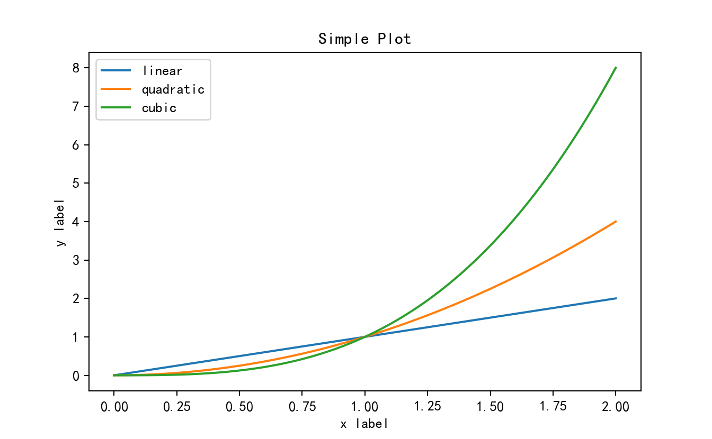

## 通用绘图模板

由于matplotlib的知识点非常繁杂，在实际使用过程中也不可能将全部API都记住，很多时候都是边用边查。因此这里提供一个通用的绘图基础模板，任何复杂的图表几乎都可以基于这个模板骨架填充内容而成。初学者刚开始学习时只需要牢记这一模板就足以应对大部分简单图表的绘制，在学习过程中可以将这个模板模块化，了解每个模块在做什么，在绘制复杂图表时如何修改，填充对应的模块。


```python
# step1 准备数据
x = np.linspace(0, 2, 100)
y = x**2

# step2 设置绘图样式，这一模块的扩展参考第五章进一步学习，这一步不是必须的，样式也可以在绘制图像是进行设置
mpl.rc('lines', linewidth=4, linestyle='-.')

# step3 定义布局， 这一模块的扩展参考第三章进一步学习
fig, ax = plt.subplots()  

# step4 绘制图像， 这一模块的扩展参考第二章进一步学习
ax.plot(x, y, label='linear')  

# step5 添加标签，文字和图例，这一模块的扩展参考第四章进一步学习
ax.set_xlabel('x label') 
ax.set_ylabel('y label') 
ax.set_title("Simple Plot")  
ax.legend()
plt.show()
```

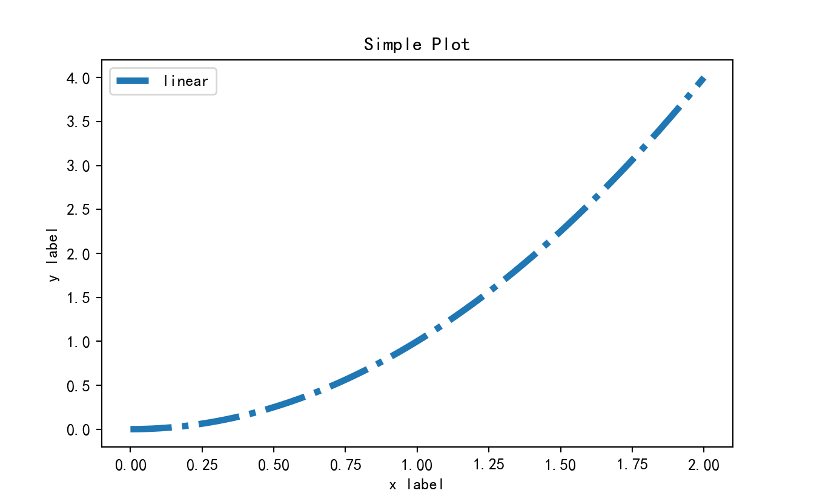

## 思考题

- 请思考两种绘图模式的优缺点和各自适合的使用场景
- 在第五节绘图模板中我们是以OO模式作为例子展示的，请思考并写一个pyplot绘图模式的简单模板

## 概述

### matplotlib的三层api

matplotlib的原理或者说基础逻辑是，用Artist对象在画布(canvas)上绘制(Render)图形。  
就和人作画的步骤类似：  

1. 准备一块画布或画纸
2. 准备好颜料、画笔等制图工具
3. 作画

所以matplotlib有三个层次的API：  

`matplotlib.backend_bases.FigureCanvas` 代表了绘图区，所有的图像都是在绘图区完成的  
`matplotlib.backend_bases.Renderer` 代表了渲染器，可以近似理解为画笔，控制如何在 FigureCanvas 上画图。  
`matplotlib.artist.Artist` 代表了具体的图表组件，即调用了Renderer的接口在Canvas上作图。  
前两者处理程序和计算机的底层交互的事项，第三项Artist就是具体的调用接口来做出我们想要的图，比如图形、文本、线条的设定。所以通常来说，我们95%的时间，都是用来和matplotlib.artist.Artist类打交道的。

### Artist的分类

Artist有两种类型：`primitives` 和`containers`。 

`primitive`是基本要素，它包含一些我们要在绘图区作图用到的标准图形对象，如**曲线Line2D，文字text，矩形Rectangle，图像image**等。   

`container`是容器，即用来装基本要素的地方，包括**图形figure、坐标系Axes和坐标轴Axis**。他们之间的关系如下图所示：  
  

可视化中常见的artist类可以参考下图这张表格，解释下每一列的含义。  
第一列表示matplotlib中子图上的辅助方法，可以理解为可视化中不同种类的图表类型，如柱状图，折线图，直方图等，这些图表都可以用这些辅助方法直接画出来，属于更高层级的抽象。 

第二列表示不同图表背后的artist类，比如折线图方法`plot`在底层用到的就是`Line2D`这一artist类。

第三列是第二列的列表容器，例如所有在子图中创建的`Line2D`对象都会被自动收集到`ax.lines`返回的列表中。 

下一节的具体案例更清楚地阐释了这三者的关系，其实在很多时候，我们只用记住第一列的辅助方法进行绘图即可，而无需关注具体底层使用了哪些类，但是了解底层类有助于我们绘制一些复杂的图表，因此也很有必要了解。

| Axes helper method   | Artist | Container   |
| -------------------  | ------ | ----------- |
| `bar` - bar charts | `Rectangle` | ax.patches  |
| `errorbar` - error bar plots | `Line2D` and `Rectangle` | ax.lines and ax.patches |
| `fill` - shared area | `Polygon` | ax.patches   |
| `hist` - histograms | `Rectangle` | ax.patches    |
|`imshow` - image data | `AxesImage` | ax.images     |
| `plot` - xy plots | `Line2D` | ax.lines        |
| `scatter` - scatter charts | `PolyCollection` | ax.collections   |

## 基本元素 - primitives

各容器中可能会包含多种`基本要素-primitives`, 所以先介绍下primitives，再介绍容器。

本章重点介绍下 `primitives` 的几种类型：**曲线-Line2D，矩形-Rectangle，多边形-Polygon，图像-image** 

### 2DLines

在matplotlib中曲线的绘制，主要是通过类 `matplotlib.lines.Line2D` 来完成的。   

matplotlib中`线-line`的含义：它表示的可以是连接所有顶点的实线样式，也可以是每个顶点的标记。此外，这条线也会受到绘画风格的影响，比如，我们可以创建虚线种类的线。

它的构造函数：

>class matplotlib.lines.Line2D(xdata, ydata, linewidth=None, linestyle=None, color=None, marker=None, markersize=None, markeredgewidth=None, markeredgecolor=None, markerfacecolor=None, markerfacecoloralt='none', fillstyle=None, antialiased=None, dash_capstyle=None, solid_capstyle=None, dash_joinstyle=None, solid_joinstyle=None, pickradius=5, drawstyle=None, markevery=None, **kwargs)

其中常用的的参数有：

+ **xdata**:需要绘制的line中点的在x轴上的取值，若忽略，则默认为range(1,len(ydata)+1)
+ **ydata**:需要绘制的line中点的在y轴上的取值
+ **linewidth**:线条的宽度
+ **linestyle**:线型
+ **color**:线条的颜色
+ **marker**:点的标记，详细可参考[markers API](https://matplotlib.org/api/markers_api.html#module-matplotlib.markers)
+ **markersize**:标记的size

其他详细参数可参考[Line2D官方文档](https://matplotlib.org/stable/api/_as_gen/matplotlib.lines.Line2D.html)

### 如何设置Line2D的属性

有三种方法可以用设置线的属性。  

1) 直接在plot()函数中设置  
2) 通过获得线对象，对线对象进行设置   
3) 获得线属性，使用setp()函数设置  


```python
# 1) 直接在plot()函数中设置
x = range(0,5)
y = [2,5,7,8,10]
plt.plot(x,y, linewidth=10) # 设置线的粗细参数为10
plt.show()
```


```python
# 2) 通过获得线对象，对线对象进行设置
x = range(0,5)
y = [2,5,7,8,10]
line, = plt.plot(x, y, '-') # 这里等号坐标的line,是一个列表解包的操作，目的是获取plt.plot返回列表中的Line2D对象
line.set_antialiased(False)
plt.show() # 关闭抗锯齿功能
```

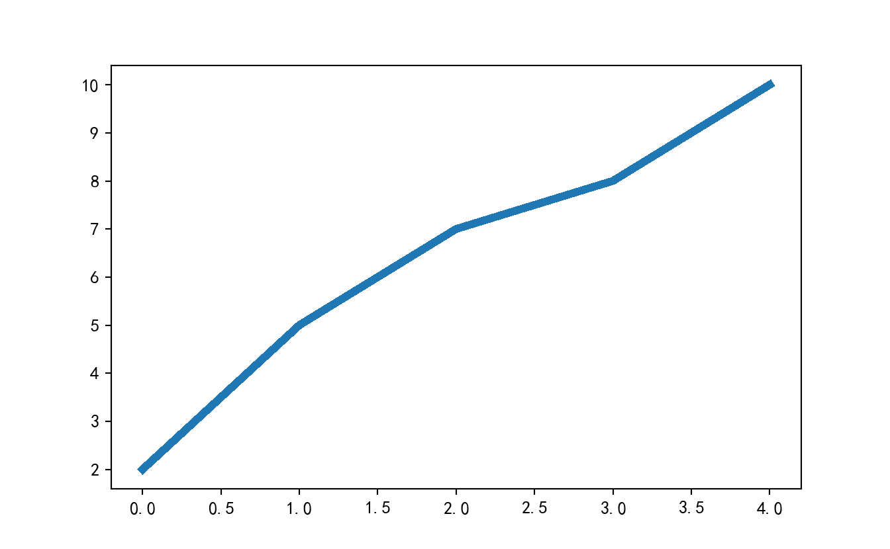


```python
# 3) 获得线属性，使用setp()函数设置
x = range(0,5)
y = [2,5,7,8,10]
lines = plt.plot(x, y)
plt.setp(lines, color='r', linewidth=10)
```

```{.scroll-200}
[None, None]
```

```python
plt.show()
```


### 如何绘制lines

1) 绘制直线line  
2) errorbar绘制误差折线图  

介绍两种绘制直线line常用的方法:    
+ **plot方法绘制**  
+ **Line2D对象绘制**  


```python
# 1. plot方法绘制
x = range(0,5)
y1 = [2,5,7,8,10]
y2= [3,6,8,9,11]

fig,ax= plt.subplots()
ax.plot(x,y1)
ax.plot(x,y2)
print(ax.lines)
```

```{.scroll-200}
<Axes.ArtistList of 2 lines>
```

```python
plt.show() # 通过直接使用辅助方法画线，打印ax.lines后可以看到在matplotlib在底层创建了两个Line2D对象
```


```python
# 2. Line2D对象绘制

x = range(0,5)
y1 = [2,5,7,8,10]
y2= [3,6,8,9,11]
fig,ax= plt.subplots()
lines = [Line2D(x, y1), Line2D(x, y2,color='orange')]  # 显式创建Line2D对象
for line in lines:
    ax.add_line(line) # 使用add_line方法将创建的Line2D添加到子图中
ax.set_xlim(0,4)
```

```{.scroll-200}
(0.0, 4.0)
```

```python
ax.set_ylim(2, 11)
```

```{.scroll-200}
(2.0, 11.0)
```

```python
plt.show()
```

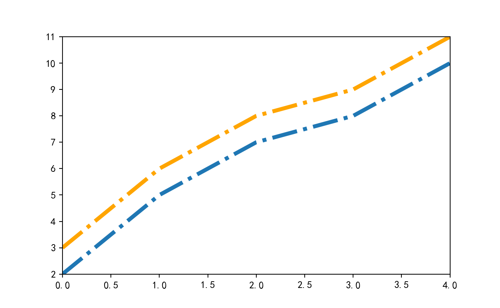

**2) errorbar绘制误差折线图**  

pyplot里有个专门绘制误差线的功能，通过`errorbar`类实现，它的构造函数： 

>matplotlib.pyplot.errorbar(x, y, yerr=None, xerr=None, fmt='', ecolor=None, elinewidth=None, capsize=None, barsabove=False, lolims=False, uplims=False, xlolims=False, xuplims=False, errorevery=1, capthick=None, \*, data=None, \**kwargs)

其中最主要的参数是前几个: 

+ **x**：需要绘制的line中点的在x轴上的取值  
+ **y**：需要绘制的line中点的在y轴上的取值  
+ **yerr**：指定y轴水平的误差  
+ **xerr**：指定x轴水平的误差   
+ **fmt**：指定折线图中某个点的颜色，形状，线条风格，例如‘co--’  
+ **ecolor**：指定error bar的颜色  
+ **elinewidth**：指定error bar的线条宽度  

绘制errorbar


```python
fig = plt.figure()
x = np.arange(10)
y = 2.5 * np.sin(x / 20 * np.pi)
yerr = np.linspace(0.05, 0.2, 10)
plt.errorbar(x,y+3,yerr=yerr,fmt='o-',ecolor='r',elinewidth=2)
```

```{.scroll-200}
<ErrorbarContainer object of 3 artists>
```

```python
plt.show()
```

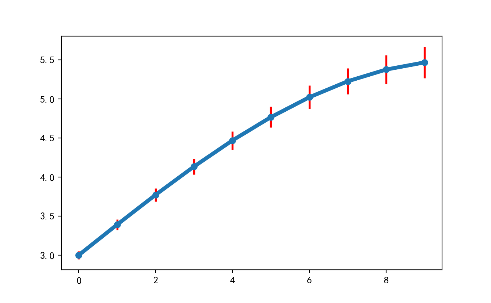

### patches {.tabset}

matplotlib.patches.Patch类是二维图形类，并且它是众多二维图形的父类，它的所有子类见[matplotlib.patches API](https://matplotlib.org/stable/api/patches_api.html)  ，  
Patch类的构造函数：  

>Patch(edgecolor=None, facecolor=None, color=None,
  linewidth=None, linestyle=None, antialiased=None,
  hatch=None, fill=True, capstyle=None, joinstyle=None,
  **kwargs)  

本小节重点讲述三种最常见的子类，矩形，多边形和楔形。

#### Rectangle-矩形

`Rectangle`矩形类在官网中的定义是： 通过锚点xy及其宽度和高度生成。
Rectangle本身的主要比较简单，即xy控制锚点，width和height分别控制宽和高。它的构造函数：

> class matplotlib.patches.Rectangle(xy, width, height, angle=0.0, **kwargs)

在实际中最常见的矩形图是`hist直方图`和`bar条形图`。  

**1) hist-直方图**  

>matplotlib.pyplot.hist(x,bins=None,range=None, density=None, bottom=None, histtype='bar', align='mid', log=False, color=None, label=None, stacked=False, normed=None)

下面是一些常用的参数：  

+ **x**: 数据集，最终的直方图将对数据集进行统计
+ **bins**: 统计的区间分布
+ **range**: tuple, 显示的区间，range在没有给出bins时生效
+ **density**: bool，默认为false，显示的是频数统计结果，为True则显示频率统计结果，这里需要注意，频率统计结果=区间数目/(总数*区间宽度)，和normed效果一致，官方推荐使用density
+ **histtype**: 可选{'bar', 'barstacked', 'step', 'stepfilled'}之一，默认为bar，推荐使用默认配置，step使用的是梯状，stepfilled则会对梯状内部进行填充，效果与bar类似
+ **align**: 可选{'left', 'mid', 'right'}之一，默认为'mid'，控制柱状图的水平分布，left或者right，会有部分空白区域，推荐使用默认
+ **log**: bool，默认False,即y坐标轴是否选择指数刻度
+ **stacked**: bool，默认为False，是否为堆积状图


```python
# hist绘制直方图
x=np.random.randint(0,100,100) #生成[0-100)之间的100个数据,即 数据集 
bins=np.arange(0,101,10) #设置连续的边界值，即直方图的分布区间[0,10),[10,20)... 
plt.hist(x,bins,color='fuchsia',alpha=0.5)#alpha设置透明度，0为完全透明 
```

```{.scroll-200}
(array([ 5.,  9.,  8., 15., 12., 15., 11.,  5., 10., 10.]), array([  0.,  10.,  20.,  30.,  40.,  50.,  60.,  70.,  80.,  90., 100.]), <BarContainer object of 10 artists>)
```

```python
plt.xlabel('scores') 
plt.ylabel('count') 
plt.xlim(0,100)
```

```{.scroll-200}
(0.0, 100.0)
```

```python
plt.show() #设置x轴分布范围 plt.show()
```


```python
# Rectangle矩形类绘制直方图
df = pd.DataFrame(columns = ['data'])
df.loc[:,'data'] = x
df['fenzu'] = pd.cut(df['data'], bins=bins, right = False,include_lowest=True)

df_cnt = df['fenzu'].value_counts().reset_index()
df_cnt.loc[:,'mini'] = df_cnt['index'].astype(str).map(lambda x:re.findall('\[(.*)\,',x)[0]).astype(int)
df_cnt.loc[:,'maxi'] = df_cnt['index'].astype(str).map(lambda x:re.findall('\,(.*)\)',x)[0]).astype(int)
df_cnt.loc[:,'width'] = df_cnt['maxi']- df_cnt['mini']
df_cnt.sort_values('mini',ascending = True,inplace = True)
df_cnt.reset_index(inplace = True,drop = True)

#用Rectangle把hist绘制出来

fig = plt.figure()
ax1 = fig.add_subplot(111)

for i in df_cnt.index:
    rect =  plt.Rectangle((df_cnt.loc[i,'mini'],0),df_cnt.loc[i,'width'],df_cnt.loc[i,'fenzu'])
    ax1.add_patch(rect)

ax1.set_xlim(0, 100)
```

```{.scroll-200}
(0.0, 100.0)
```

```python
ax1.set_ylim(0, 16)
```

```{.scroll-200}
(0.0, 16.0)
```

```python
plt.show()
```

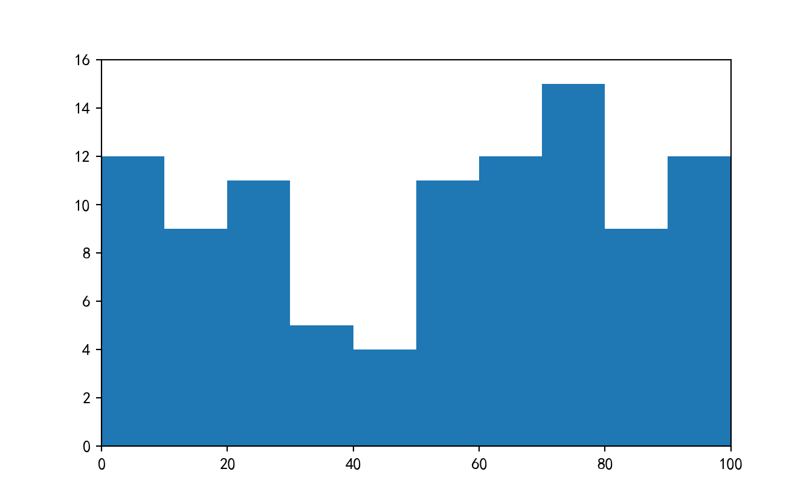

**2) bar-柱状图**   

>matplotlib.pyplot.bar(left, height, alpha=1, width=0.8, color=, edgecolor=, label=, lw=3)

下面是一些常用的参数：    

+ **left**：x轴的位置序列，一般采用range函数产生一个序列，但是有时候可以是字符串  
+ **height**：y轴的数值序列，也就是柱形图的高度，一般就是我们需要展示的数据；  
+ **alpha**：透明度，值越小越透明  
+ **width**：为柱形图的宽度，一般这是为0.8即可；  
+ **color或facecolor**：柱形图填充的颜色；  
+ **edgecolor**：图形边缘颜色   
+ **label**：解释每个图像代表的含义，这个参数是为legend()函数做铺垫的，表示该次bar的标签      

有两种方式绘制柱状图

+ bar绘制柱状图  
+ `Rectangle`矩形类绘制柱状图


```python
# bar绘制柱状图
y = range(1,17)
plt.bar(np.arange(16), y, alpha=0.5, width=0.5, color='yellow', edgecolor='red', label='The First Bar', lw=3)
```

```{.scroll-200}
<BarContainer object of 16 artists>
```

```python
plt.show()
```

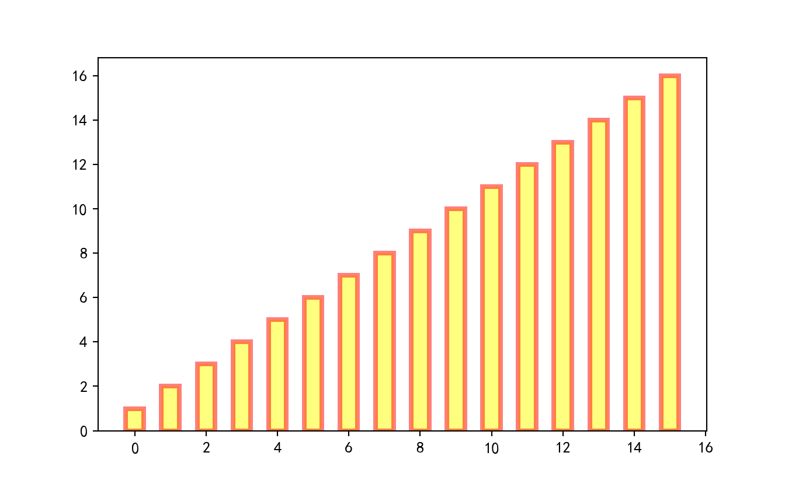


```python
# Rectangle矩形类绘制柱状图
fig = plt.figure()
ax1 = fig.add_subplot(111)

for i in range(1,17):
    rect =  plt.Rectangle((i+0.25,0),0.5,i)
    ax1.add_patch(rect)
ax1.set_xlim(0, 16)
```

```{.scroll-200}
(0.0, 16.0)
```

```python
ax1.set_ylim(0, 16)
```

```{.scroll-200}
(0.0, 16.0)
```

```python
plt.show()
```

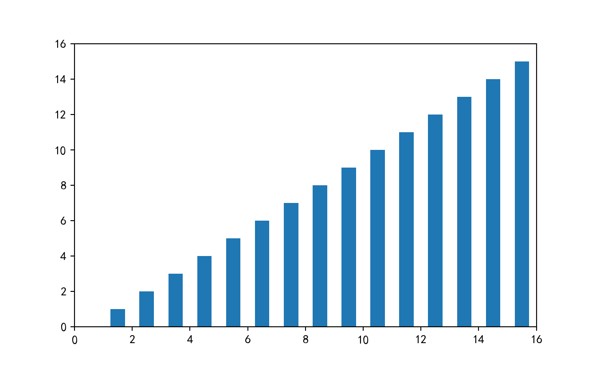

#### Polygon-多边形

matplotlib.patches.Polygon类是多边形类。它的构造函数：

>class matplotlib.patches.Polygon(xy, closed=True, **kwargs)  

xy是一个N×2的numpy array，为多边形的顶点。  
closed为True则指定多边形将起点和终点重合从而显式关闭多边形。  

matplotlib.patches.Polygon类中常用的是fill类，它是基于xy绘制一个填充的多边形，它的定义：

>matplotlib.pyplot.fill(*args, data=None, **kwargs)

参数说明 : 关于x、y和color的序列，其中color是可选的参数，每个多边形都是由其节点的x和y位置列表定义的，后面可以选择一个颜色说明符。您可以通过提供多个x、y、[颜色]组来绘制多个多边形。


```python
# 用fill来绘制图形
x = np.linspace(0, 5 * np.pi, 1000) 
y1 = np.sin(x)
y2 = np.sin(2 * x) 
plt.fill(x, y1, color = "g", alpha = 0.3)
plt.show()
```

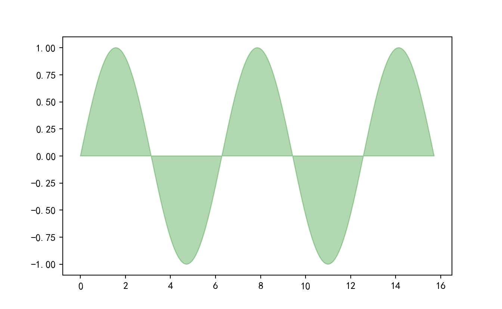

#### Wedge-契形

matplotlib.patches.Wedge类是楔型类。其基类是matplotlib.patches.Patch，它的构造函数：

>class matplotlib.patches.Wedge(center, r, theta1, theta2, width=None, **kwargs)  

一个Wedge-楔型 是以坐标x,y为中心，半径为r，从θ1扫到θ2(单位是度)。  
如果宽度给定，则从内半径r -宽度到外半径r画出部分楔形。wedge中比较常见的是绘制饼状图。  

matplotlib.pyplot.pie语法： 

>matplotlib.pyplot.pie(x, explode=None, labels=None, colors=None, autopct=None, pctdistance=0.6, shadow=False, labeldistance=1.1, startangle=0, radius=1, counterclock=True, wedgeprops=None, textprops=None, center=0, 0, frame=False, rotatelabels=False, *, normalize=None, data=None)

制作数据x的饼图，每个楔子的面积用x/sum(x)表示。    
其中最主要的参数是前4个： 

+ **x**：楔型的形状，一维数组。
+ **explode**：如果不是等于None，则是一个len(x)数组，它指定用于偏移每个楔形块的半径的分数。  
+ **labels**：用于指定每个楔型块的标记，取值是列表或为None。  
+ **colors**：饼图循环使用的颜色序列。如果取值为None，将使用当前活动循环中的颜色。  
+ **startangle**：饼状图开始的绘制的角度。   


```python
# pie绘制饼状图
labels = 'Frogs', 'Hogs', 'Dogs', 'Logs'
sizes = [15, 30, 45, 10] 
explode = (0, 0.1, 0, 0) 
fig1, ax1 = plt.subplots() 
ax1.pie(sizes, explode=explode, labels=labels, autopct='%1.1f%%', shadow=True, startangle=90) 
```

```{.scroll-200}
([<matplotlib.patches.Wedge object at 0x0000024F0BCA75B0>, <matplotlib.patches.Wedge object at 0x0000024F0BCA73A0>, <matplotlib.patches.Wedge object at 0x0000024F0BCC07F0>, <matplotlib.patches.Wedge object at 0x0000024F0BB4CFA0>], [Text(-0.4993895680663527, 0.9801071672559598, 'Frogs'), Text(-1.1412677917792124, -0.3708204787324995, 'Hogs'), Text(0.9801072140121813, -0.4993894763020948, 'Dogs'), Text(0.33991864973549485, 1.0461621822461364, 'Logs')], [Text(-0.2723943098543742, 0.5346039094123416, '15.0%'), Text(-0.6657395452045406, -0.2163119459272914, '30.0%'), Text(0.5346039349157352, -0.27239425980114257, '45.0%'), Text(0.1854101725829972, 0.5706339175888016, '10.0%')])
```

```python
ax1.axis('equal')
```

```{.scroll-200}
(-1.1998593997207163, 1.1047438740833693, -1.0999843660947275, 1.0999992555283205)
```

```python
plt.show() # Equal aspect ratio ensures that pie is drawn as a circle. 
```

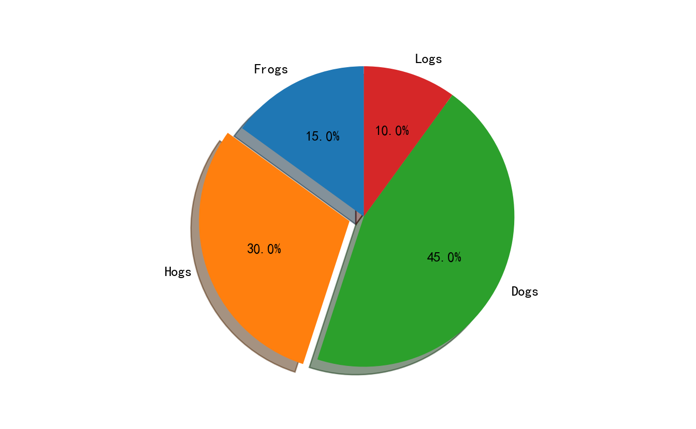


```python
# wedge绘制饼图
fig = plt.figure(figsize=(5,5))
ax1 = fig.add_subplot(111)
theta1 = 0
sizes = [15, 30, 45, 10] 
patches = []
patches += [
    Wedge((0.5, 0.5), .4, 0, 54),           
    Wedge((0.5, 0.5), .4, 54, 162),  
    Wedge((0.5, 0.5), .4, 162, 324),           
    Wedge((0.5, 0.5), .4, 324, 360),  
]
colors = 100 * np.random.rand(len(patches))
p = PatchCollection(patches, alpha=0.8)
p.set_array(colors)
ax1.add_collection(p)
plt.show()
```

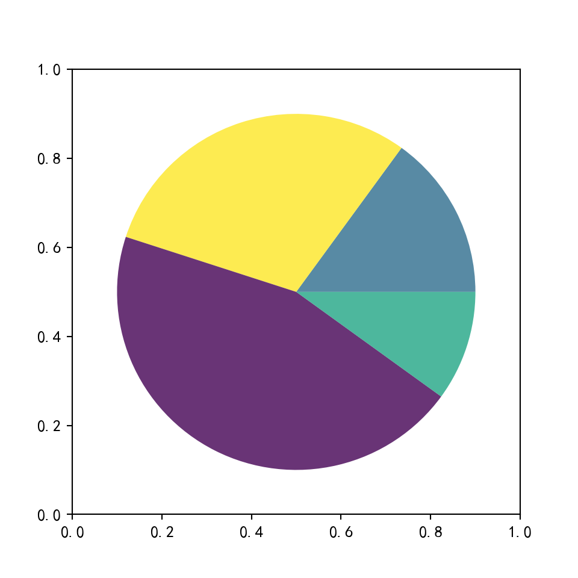

### collections

collections类是用来绘制一组对象的集合，collections有许多不同的子类，如RegularPolyCollection, CircleCollection, Pathcollection, 分别对应不同的集合子类型。其中比较常用的就是散点图，它是属于PathCollection子类，scatter方法提供了该类的封装，根据x与y绘制不同大小或颜色标记的散点图。 它的构造方法：

>Axes.scatter(self, x, y, s=None, c=None, marker=None, cmap=None, norm=None, vmin=None, vmax=None, alpha=None, linewidths=None, verts=<deprecated parameter>, edgecolors=None, *, plotnonfinite=False, data=None, **kwargs)

其中最主要的参数是前5个： 

+ **x**：数据点x轴的位置  
+ **y**：数据点y轴的位置  
+ **s**：尺寸大小  
+ **c**：可以是单个颜色格式的字符串，也可以是一系列颜色  
+ **marker**: 标记的类型  


```python
# 用scatter绘制散点图
x = [0,2,4,6,8,10] 
y = [10]*len(x) 
s = [20*2**n for n in range(len(x))] 
plt.scatter(x,y,s=s) 
plt.show()
```

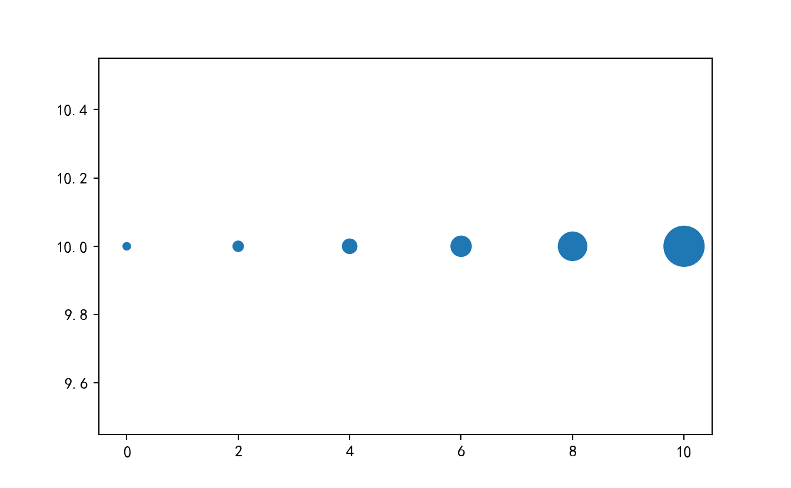

### images

images是matplotlib中绘制image图像的类，其中最常用的imshow可以根据数组绘制成图像，它的构造函数：

>class matplotlib.image.AxesImage(ax, cmap=None, norm=None, interpolation=None, origin=None, extent=None, filternorm=True, filterrad=4.0, resample=False, **kwargs)

imshow根据数组绘制图像

>matplotlib.pyplot.imshow(X, cmap=None, norm=None, aspect=None, interpolation=None, alpha=None, vmin=None, vmax=None, origin=None, extent=None, shape=<deprecated parameter>, filternorm=1, filterrad=4.0, imlim=<deprecated parameter>, resample=None, url=None, *, data=None, **kwargs）

使用imshow画图时首先需要传入一个数组，数组对应的是空间内的像素位置和像素点的值，interpolation参数可以设置不同的差值方法，具体效果如下。


```python
methods = [None, 'none', 'nearest', 'bilinear', 'bicubic', 'spline16',
           'spline36', 'hanning', 'hamming', 'hermite', 'kaiser', 'quadric',
           'catrom', 'gaussian', 'bessel', 'mitchell', 'sinc', 'lanczos']

grid = np.random.rand(4, 4)

fig, axs = plt.subplots(nrows=3, ncols=6, figsize=(9, 6),
                        subplot_kw={'xticks': [], 'yticks': []})

for ax, interp_method in zip(axs.flat, methods):
    ax.imshow(grid, interpolation=interp_method, cmap='viridis')
    ax.set_title(str(interp_method))

plt.tight_layout()
plt.show()
```

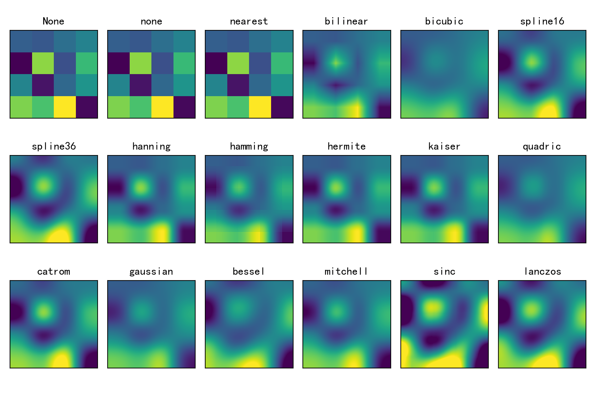

## 对象容器 - Object container

容器会包含一些`primitives`，并且容器还有它自身的属性。  
比如`Axes Artist`，它是一种容器，它包含了很多`primitives`，比如`Line2D`，`Text`；同时，它也有自身的属性，比如`xscal`，用来控制X轴是`linear`还是`log`的。  

### Figure容器

`matplotlib.figure.Figure`是`Artist`最顶层的`container`对象容器，它包含了图表中的所有元素。一张图表的背景就是在`Figure.patch`的一个矩形`Rectangle`。  
当我们向图表添加`Figure.add_subplot()`或者`Figure.add_axes()`元素时，这些都会被添加到`Figure.axes`列表中。


```python
fig = plt.figure()
ax1 = fig.add_subplot(211) # 作一幅2*1的图，选择第1个子图
ax2 = fig.add_axes([0.1, 0.1, 0.7, 0.3]) # 位置参数，四个数分别代表了(left,bottom,width,height)
print(ax1) 
```

```{.scroll-200}
Axes(0.125,0.53;0.775x0.35)
```

```python
print(fig.axes) # fig.axes 中包含了subplot和axes两个实例, 刚刚添加的
```

```{.scroll-200}
[<Axes: >, <Axes: >]
```

由于`Figure`维持了`current axes`，因此你不应该手动的从`Figure.axes`列表中添加删除元素，而是要通过`Figure.add_subplot()`、`Figure.add_axes()`来添加元素，通过`Figure.delaxes()`来删除元素。但是你可以迭代或者访问`Figure.axes`中的`Axes`，然后修改这个`Axes`的属性。   

比如下面的遍历axes里的内容，并且添加网格线：


```python
fig = plt.figure()
ax1 = fig.add_subplot(211)

for ax in fig.axes:
    ax.grid(True)
```

`Figure`也有它自己的`text、line、patch、image`。你可以直接通过`add primitive`语句直接添加。但是注意`Figure`默认的坐标系是以像素为单位，你可能需要转换成figure坐标系：(0,0)表示左下点，(1,1)表示右上点。

**Figure容器的常见属性：**  

`Figure.patch`属性：Figure的背景矩形  
`Figure.axes`属性：一个Axes实例的列表（包括Subplot)  
`Figure.images`属性：一个FigureImages patch列表  
`Figure.lines`属性：一个Line2D实例的列表（很少使用）  
`Figure.legends`属性：一个Figure Legend实例列表（不同于Axes.legends)  
`Figure.texts`属性：一个Figure Text实例列表  

### Axes容器

`matplotlib.axes.Axes`是matplotlib的核心。大量的用于绘图的`Artist`存放在它内部，并且它有许多辅助方法来创建和添加`Artist`给它自己，而且它也有许多赋值方法来访问和修改这些`Artist`。  

和`Figure`容器类似，`Axes`包含了一个patch属性，对于笛卡尔坐标系而言，它是一个`Rectangle`；对于极坐标而言，它是一个`Circle`。这个patch属性决定了绘图区域的形状、背景和边框。


```python
fig = plt.figure()
ax = fig.add_subplot(111)
rect = ax.patch  # axes的patch是一个Rectangle实例
rect.set_facecolor('green')
```

`Axes`有许多方法用于绘图，如`.plot()、.text()、.hist()、.imshow()`等方法用于创建大多数常见的`primitive`(如`Line2D，Rectangle，Text，Image`等等）。在`primitives`中已经涉及，不再赘述。   

Subplot就是一个特殊的Axes，其实例是位于网格中某个区域的Subplot实例。其实你也可以在任意区域创建Axes，通过Figure.add_axes([left,bottom,width,height])来创建一个任意区域的Axes，其中left,bottom,width,height都是[0—1]之间的浮点数，他们代表了相对于Figure的坐标。

你不应该直接通过`Axes.lines`和`Axes.patches`列表来添加图表。因为当创建或添加一个对象到图表中时，`Axes`会做许多自动化的工作:  
它会设置Artist中figure和axes的属性，同时默认Axes的转换；  
它也会检视Artist中的数据，来更新数据结构，这样数据范围和呈现方式可以根据作图范围自动调整。  

你也可以使用Axes的辅助方法`.add_line()`和`.add_patch()`方法来直接添加。  

另外Axes还包含两个最重要的Artist container：

`ax.xaxis`：XAxis对象的实例，用于处理x轴tick以及label的绘制  
`ax.yaxis`：YAxis对象的实例，用于处理y轴tick以及label的绘制  

**Axes容器**的常见属性有： 

`artists`:    Artist实例列表  
`patch`:     Axes所在的矩形实例  
`collections`: Collection实例  
`images`:    Axes图像  
`legends`:	  Legend 实例  
`lines`:	  Line2D 实例  
`patches`:	  Patch 实例  
`texts`:	  Text 实例  
`xaxis`:	  matplotlib.axis.XAxis 实例  
`yaxis`:	  matplotlib.axis.YAxis 实例  

### Axis容器

`matplotlib.axis.Axis`实例处理`tick line`、`grid line`、`tick label`以及`axis label`的绘制，它包括坐标轴上的刻度线、刻度`label`、坐标网格、坐标轴标题。通常你可以独立的配置y轴的左边刻度以及右边的刻度，也可以独立地配置x轴的上边刻度以及下边的刻度。

刻度包括主刻度和次刻度，它们都是Tick刻度对象。  

`Axis`也存储了用于自适应，平移以及缩放的`data_interval`和`view_interval`。它还有Locator实例和Formatter实例用于控制刻度线的位置以及刻度label。

每个Axis都有一个`label`属性，也有主刻度列表和次刻度列表。这些`ticks`是`axis.XTick`和`axis.YTick`实例，它们包含着`line primitive`以及`text primitive`用来渲染刻度线以及刻度文本。

刻度是动态创建的，只有在需要创建的时候才创建（比如缩放的时候）。Axis也提供了一些辅助方法来获取刻度文本、刻度线位置等等：  
常见的如下：


```python
# 不用print，直接显示结果
from IPython.core.interactiveshell import InteractiveShell
InteractiveShell.ast_node_interactivity = "all"

fig, ax = plt.subplots()
x = range(0,5)
y = [2,5,7,8,10]
plt.plot(x, y, '-')

axis = ax.xaxis # axis为X轴对象
axis.get_ticklocs()     # 获取刻度线位置
```

```{.scroll-200}
array([-0.5,  0. ,  0.5,  1. ,  1.5,  2. ,  2.5,  3. ,  3.5,  4. ,  4.5])
```

```python
axis.get_ticklabels()   # 获取刻度label列表(一个Text实例的列表）。 可以通过minor=True|False关键字参数控制输出minor还是major的tick label。
axis.get_ticklines()    # 获取刻度线列表(一个Line2D实例的列表）。 可以通过minor=True|False关键字参数控制输出minor还是major的tick line。
axis.get_data_interval()# 获取轴刻度间隔
```

```{.scroll-200}
array([0., 4.])
```

```python
axis.get_view_interval()# 获取轴视角（位置）的间隔
```

```{.scroll-200}
array([-0.2,  4.2])
```

下面的例子展示了如何调整一些轴和刻度的属性(忽略美观度，仅作调整参考)：  


```python
fig = plt.figure() # 创建一个新图表
rect = fig.patch   # 矩形实例并将其设为黄色
rect.set_facecolor('lightgoldenrodyellow')

ax1 = fig.add_axes([0.1, 0.3, 0.4, 0.4]) # 创一个axes对象，从(0.1,0.3)的位置开始，宽和高都为0.4，
rect = ax1.patch   # ax1的矩形设为灰色
rect.set_facecolor('lightslategray')

for label in ax1.xaxis.get_ticklabels(): 
    # 调用x轴刻度标签实例，是一个text实例
    label.set_color('red') # 颜色
    label.set_rotation(45) # 旋转角度
    label.set_fontsize(16) # 字体大小

for line in ax1.yaxis.get_ticklines():
    # 调用y轴刻度线条实例, 是一个Line2D实例
    line.set_markeredgecolor('green')    # 颜色
    line.set_markersize(25)    # marker大小
    line.set_markeredgewidth(2)# marker粗细
```

### Tick容器

`matplotlib.axis.Tick`是从`Figure`到`Axes`到`Axis`到`Tick`中最末端的容器对象。  
`Tick`包含了`tick`、`grid line`实例以及对应的`label`。 

所有的这些都可以通过`Tick`的属性获取，常见的`tick`属性有     
`Tick.tick1line`：Line2D实例  
`Tick.tick2line`：Line2D实例  
`Tick.gridline`：Line2D实例  
`Tick.label1`：Text实例  
`Tick.label2`：Text实例  

y轴分为左右两个，因此tick1对应左侧的轴；tick2对应右侧的轴。   
x轴分为上下两个，因此tick1对应下侧的轴；tick2对应上侧的轴。  

下面的例子展示了，如何将Y轴右边轴设为主轴，并将标签设置为美元符号且为绿色：


```python
fig, ax = plt.subplots()
ax.plot(100*np.random.rand(20))

# 设置ticker的显示格式
formatter = mpl.ticker.FormatStrFormatter('$%1.2f')
ax.yaxis.set_major_formatter(formatter)

# 设置ticker的参数，右侧为主轴，颜色为绿色
ax.yaxis.set_tick_params(which='major', labelcolor='green',
                         labelleft=False, labelright=True)
plt.show()
```

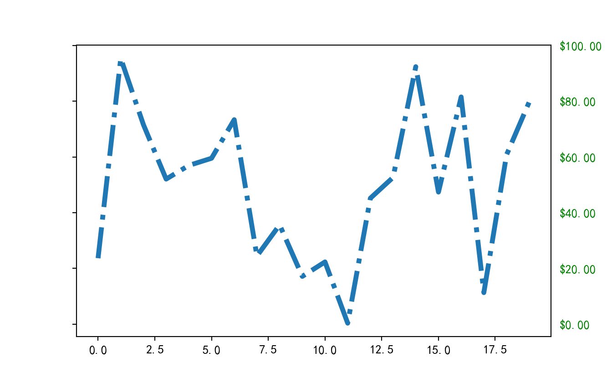

## 思考题

- primitives 和 container的区别和联系是什么，分别用于控制可视化图表中的哪些要素

- 使用提供的drug数据集，对第一列yyyy和第二列state分组求和，画出下面折线图。PA加粗标黄，其他为灰色。    
图标题和横纵坐标轴标题，以及线的文本暂不做要求。  
  


- 分别用一组长方形柱和填充面积的方式模仿画出下图，函数 y = -1 * (x - 2) * (x - 8) +10 在区间[2,9]的积分面积  
  
  

## 参考资料

[1. matplotlib设计的基本逻辑](https://zhuanlan.zhihu.com/p/32693665)  
[2. AI算法工程师手册](https://www.bookstack.cn/read/huaxiaozhuan-ai/spilt.2.333f5abdbabf383d.md)  

## 子图

### 使用 `plt.subplots` 绘制均匀状态下的子图

返回元素分别是画布和子图构成的列表，第一个数字为行，第二个为列，不传入时默认值都为1

`figsize` 参数可以指定整个画布的大小

`sharex` 和 `sharey` 分别表示是否共享横轴和纵轴刻度

`tight_layout` 函数可以调整子图的相对大小使字符不会重叠


```python
fig, axs = plt.subplots(2, 5, figsize=(10, 4), sharex=True, sharey=True)
fig.suptitle('样例1', size=20)
for i in range(2):
    for j in range(5):
        axs[i][j].scatter(np.random.randn(10), np.random.randn(10))
        axs[i][j].set_title('第%d行，第%d列'%(i+1,j+1))
        axs[i][j].set_xlim(-5,5)
        axs[i][j].set_ylim(-5,5)
        if i==1: axs[i][j].set_xlabel('横坐标')
        if j==0: axs[i][j].set_ylabel('纵坐标')
fig.tight_layout()
```

`subplots`是基于OO模式的写法，显式创建一个或多个axes对象，然后在对应的子图对象上进行绘图操作。  
还有种方式是使用`subplot`这样基于pyplot模式的写法，每次在指定位置新建一个子图，并且之后的绘图操作都会指向当前子图，本质上`subplot`也是`Figure.add_subplot`的一种封装。

在调用`subplot`时一般需要传入三位数字，分别代表总行数，总列数，当前子图的index


```python
plt.figure()
# 子图1
plt.subplot(2,2,1) 
plt.plot([1,2], 'r')
# 子图2
plt.subplot(2,2,2)
plt.plot([1,2], 'b')
#子图3
plt.subplot(224)  # 当三位数都小于10时，可以省略中间的逗号，这行命令等价于plt.subplot(2,2,4) 
plt.plot([1,2], 'g')
plt.show()
```

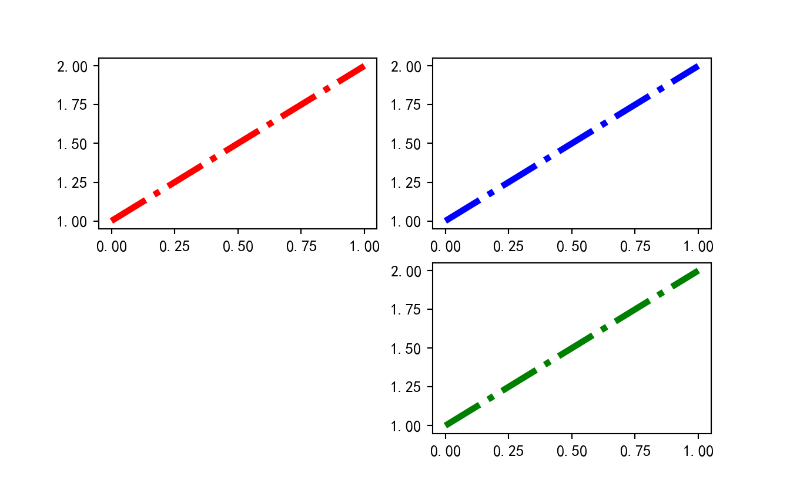

除了常规的直角坐标系，也可以通过`projection`方法创建极坐标系下的图表


```python
N = 150
r = 2 * np.random.rand(N)
theta = 2 * np.pi * np.random.rand(N)
area = 200 * r**2
colors = theta

plt.subplot(projection='polar')
plt.scatter(theta, r, c=colors, s=area, cmap='hsv', alpha=0.75)
plt.show()
```

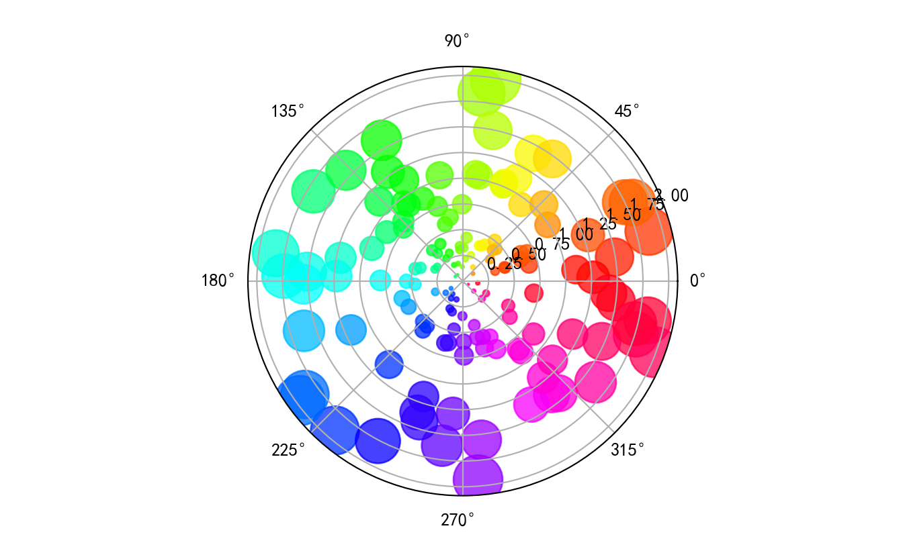

<p>请思考如何用极坐标系画出类似的玫瑰图</p>


### 使用 `GridSpec` 绘制非均匀子图

所谓非均匀包含两层含义，第一是指图的比例大小不同但没有跨行或跨列，第二是指图为跨列或跨行状态

利用 `add_gridspec` 可以指定相对宽度比例 `width_ratios` 和相对高度比例参数 `height_ratios`


```python
fig = plt.figure(figsize=(10, 4))
spec = fig.add_gridspec(nrows=2, ncols=5, width_ratios=[1,2,3,4,5], height_ratios=[1,3])
fig.suptitle('样例2', size=20)
for i in range(2):
    for j in range(5):
        ax = fig.add_subplot(spec[i, j])
        ax.scatter(np.random.randn(10), np.random.randn(10))
        ax.set_title('第%d行，第%d列'%(i+1,j+1))
        if i==1: ax.set_xlabel('横坐标')
        if j==0: ax.set_ylabel('纵坐标')
fig.tight_layout()
plt.show()
```

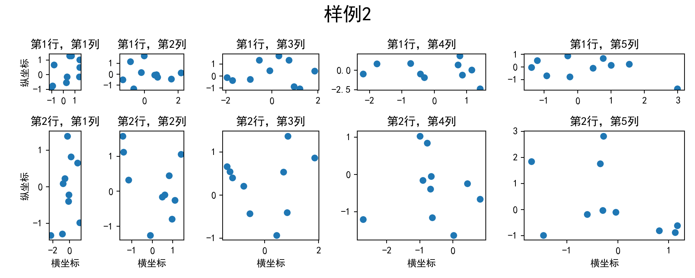

在上面的例子中出现了 `spec[i, j]` 的用法，事实上通过切片就可以实现子图的合并而达到跨图的共能


```python
fig = plt.figure(figsize=(10, 4))
```

```{.scroll-200}
<string>:1: RuntimeWarning: More than 20 figures have been opened. Figures created through the pyplot interface (`matplotlib.pyplot.figure`) are retained until explicitly closed and may consume too much memory. (To control this warning, see the rcParam `figure.max_open_warning`). Consider using `matplotlib.pyplot.close()`.
```

```python
spec = fig.add_gridspec(nrows=2, ncols=6, width_ratios=[2,2.5,3,1,1.5,2], height_ratios=[1,2])
fig.suptitle('样例3', size=20)
# sub1
ax = fig.add_subplot(spec[0, :3])
ax.scatter(np.random.randn(10), np.random.randn(10))
# sub2
ax = fig.add_subplot(spec[0, 3:5])
ax.scatter(np.random.randn(10), np.random.randn(10))
# sub3
ax = fig.add_subplot(spec[:, 5])
ax.scatter(np.random.randn(10), np.random.randn(10))
# sub4
ax = fig.add_subplot(spec[1, 0])
ax.scatter(np.random.randn(10), np.random.randn(10))
# sub5
ax = fig.add_subplot(spec[1, 1:5])
ax.scatter(np.random.randn(10), np.random.randn(10))
fig.tight_layout()
plt.show()
```

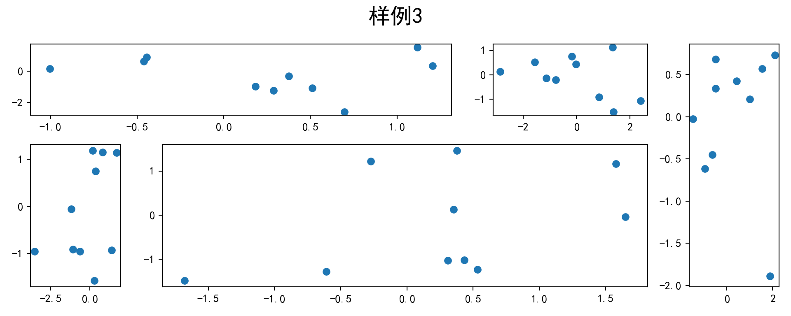

## 子图上的方法

补充介绍一些子图上的方法

常用直线的画法为： `axhline, axvline, axline` （水平、垂直、任意方向）


```python
fig, ax = plt.subplots(figsize=(4,3))
ax.axhline(0.5,0.2,0.8)
ax.axvline(0.5,0.2,0.8)
ax.axline([0.3,0.3],[0.7,0.7])
plt.show()
```

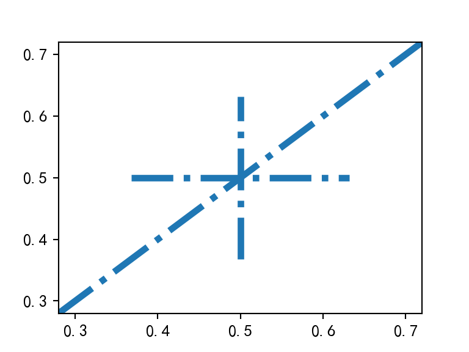

使用 `grid` 可以加灰色网格


```python
fig, ax = plt.subplots(figsize=(4,3))
ax.grid(True)
```

使用 `set_xscale` 可以设置坐标轴的规度（指对数坐标等）


```python
fig, axs = plt.subplots(1, 2, figsize=(10, 4))
for j in range(2):
    axs[j].plot(list('abcd'), [10**i for i in range(4)])
    if j==0:
        axs[j].set_yscale('log')
    else:
        pass
fig.tight_layout()
```

## 思考题

- 墨尔本1981年至1990年的每月温度情况  

数据集来自github仓库下data/layout_ex1.csv  
请利用数据，画出如下的图：


-  画出数据的散点图和边际分布

用 `np.random.randn(2, 150)` 生成一组二维数据，使用两种非均匀子图的分割方法，做出该数据对应的散点图和边际分布图


## Figure和Axes上的文本

Matplotlib具有广泛的文本支持，包括对数学表达式的支持、对栅格和矢量输出的TrueType支持、具有任意旋转的换行分隔文本以及Unicode支持。

### 文本API示例

下面的命令是介绍了通过pyplot API和objected-oriented API分别创建文本的方式。

| pyplot API | OO API  | description  |
| ---------- | ------- | ------------ |
| `text` | `text` | 在子图axes的任意位置添加文本|
| `annotate` | `annotate` | 在子图axes的任意位置添加注解，包含指向性的箭头|
| `xlabel` | `set_xlabel` | 为子图axes添加x轴标签 |
| `ylabel` | `set_ylabel` | 为子图axes添加y轴标签 |
| `title` | `set_title` | 为子图axes添加标题 |
| `figtext` | `text` | 在画布figure的任意位置添加文本  |
| `suptitle` | `suptitle` | 为画布figure添加标题 |

通过一个综合例子，以OO模式展示这些API是如何控制一个图像中各部分的文本，在之后的章节我们再详细分析这些api的使用技巧


```python

fig = plt.figure()
ax = fig.add_subplot()

# 分别为figure和ax设置标题，注意两者的位置是不同的
fig.suptitle('bold figure suptitle', fontsize=14, fontweight='bold')
ax.set_title('axes title')

# 设置x和y轴标签
ax.set_xlabel('xlabel')
ax.set_ylabel('ylabel')

# 设置x和y轴显示范围均为0到10
ax.axis([0, 10, 0, 10])

# 在子图上添加文本
```

```{.scroll-200}
(0.0, 10.0, 0.0, 10.0)
```

```python
ax.text(3, 8, 'boxed italics text in data coords', style='italic',
        bbox={'facecolor': 'red', 'alpha': 0.5, 'pad': 10})

# 在画布上添加文本，一般在子图上添加文本是更常见的操作，这种方法很少用
fig.text(0.4,0.8,'This is text for figure')

ax.plot([2], [1], 'o')
# 添加注解
ax.annotate('annotate', xy=(2, 1), xytext=(3, 4),arrowprops=dict(facecolor='black', shrink=0.05))
plt.show()
```

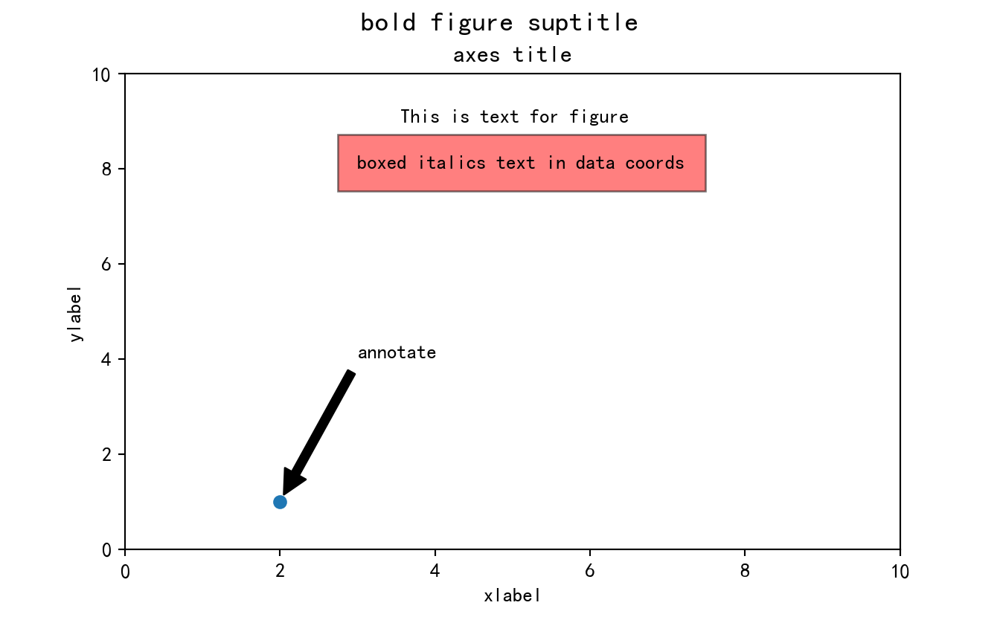

### text - 子图上的文本

text的调用方式为`Axes.text(x, y, s, fontdict=None, **kwargs) `  
其中`x`,`y`为文本出现的位置，默认状态下即为当前坐标系下的坐标值，  
`s`为文本的内容，  
`fontdict`是可选参数，用于覆盖默认的文本属性，  
`**kwargs`为关键字参数，也可以用于传入文本样式参数

重点解释下fontdict和\*\*kwargs参数，这两种方式都可以用于调整呈现的文本样式，最终效果是一样的，不仅text方法，其他文本方法如set_xlabel,set_title等同样适用这两种方式修改样式。通过一个例子演示这两种方法是如何使用的。


```python
fig = plt.figure(figsize=(10,3))
axes = fig.subplots(1,2)

# 使用关键字参数修改文本样式
axes[0].text(0.3, 0.8, 'modify by **kwargs', style='italic',
        bbox={'facecolor': 'red', 'alpha': 0.5, 'pad': 10});

# 使用fontdict参数修改文本样式
font = {'bbox':{'facecolor': 'red', 'alpha': 0.5, 'pad': 10}, 'style':'italic'}
axes[1].text(0.3, 0.8, 'modify by fontdict', fontdict=font)
plt.show()
```

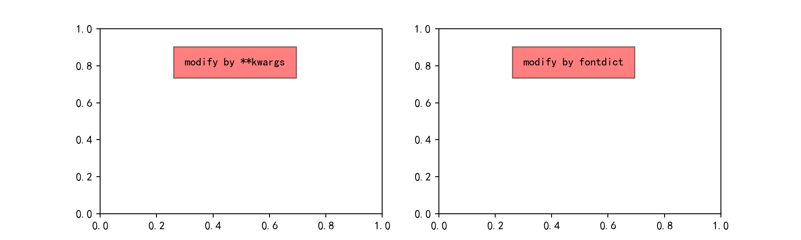

matplotlib中所有支持的样式参数请参考[官网文档说明](https://matplotlib.org/stable/api/_as_gen/matplotlib.axes.Axes.text.html#matplotlib.axes.Axes.text)，大多数时候需要用到的时候再查询即可。  

下表列举了一些常用的参数供参考。

| Property                      | Description                                |
| ------------------------ | :-------------------------- |
| `alpha` |float or None   透明度，越接近0越透明，越接近1越不透明   |
| `backgroundcolor` | color  文本的背景颜色                   |
| `bbox` | dict with properties for patches.FancyBboxPatch 用来设置text周围的box外框 |
| `color` or c | color 字体的颜色             |
| `fontfamily` or family | {FONTNAME, 'serif', 'sans-serif', 'cursive', 'fantasy', 'monospace'} 字体的类型|
| `fontsize` or size | float or {'xx-small', 'x-small', 'small', 'medium', 'large', 'x-large', 'xx-large'} 字体大小|
| `fontstyle` or style | {'normal', 'italic', 'oblique'} 字体的样式是否倾斜等     |
| `fontweight` or weight | {a numeric value in range 0-1000, 'ultralight', 'light', 'normal', 'regular', 'book', 'medium', 'roman', 'semibold', 'demibold', 'demi', 'bold', 'heavy', 'extra bold', 'black'} 文本粗细|
| `horizontalalignment` or ha | {'center', 'right', 'left'}  选择文本左对齐右对齐还是居中对齐         |
| `linespacing` | float (multiple of font size)   文本间距 |
| `rotation` | float or {'vertical', 'horizontal'} 指text逆时针旋转的角度，“horizontal”等于0，“vertical”等于90  |
| `verticalalignment` or va | {'center', 'top', 'bottom', 'baseline', 'center_baseline'}  文本在垂直角度的对齐方式 |

### xlabel和ylabel - 子图的x，y轴标签

xlabel的调用方式为`Axes.set_xlabel(xlabel, fontdict=None, labelpad=None, *, loc=None, **kwargs)`  
ylabel方式类似，这里不重复写出。  
其中`xlabel`即为标签内容,  
`fontdict`和`**kwargs`用来修改样式，上一小节已介绍,  
`labelpad`为标签和坐标轴的距离，默认为4，  
`loc`为标签位置，可选的值为'left', 'center', 'right'之一，默认为居中


```python
# 观察labelpad和loc参数的使用效果
fig = plt.figure(figsize=(10,3))
axes = fig.subplots(1,2)
axes[0].set_xlabel('xlabel',labelpad=20,loc='left')

# loc参数仅能提供粗略的位置调整，如果想要更精确的设置标签的位置，可以使用position参数+horizontalalignment参数来定位
# position由一个元组过程，第一个元素0.2表示x轴标签在x轴的位置，第二个元素对于xlabel其实是无意义的，随便填一个数都可以
# horizontalalignment='left'表示左对齐，这样设置后x轴标签就能精确定位在x=0.2的位置处
axes[1].set_xlabel('xlabel', position=(0.2, _), horizontalalignment='left')
plt.show()
```

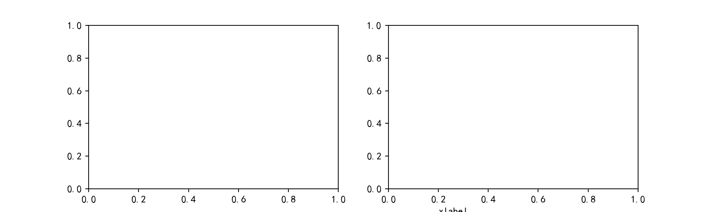

### title和suptitle - 子图和画布的标题

title的调用方式为`Axes.set_title(label, fontdict=None, loc=None, pad=None, *, y=None, **kwargs)`  
其中label为子图标签的内容，`fontdict`,`loc`,`**kwargs`和之前小节相同不重复介绍  
`pad`是指标题偏离图表顶部的距离，默认为6    
`y`是title所在子图垂向的位置。默认值为1，即title位于子图的顶部。  

suptitle的调用方式为`figure.suptitle(t, **kwargs)`  
其中`t`为画布的标题内容


```python
# 观察pad参数的使用效果
fig = plt.figure(figsize=(10,3))
fig.suptitle('This is figure title',y=1.2) # 通过参数y设置高度
axes = fig.subplots(1,2)
axes[0].set_title('This is title',pad=15)
axes[1].set_title('This is title',pad=6)
plt.show()
```

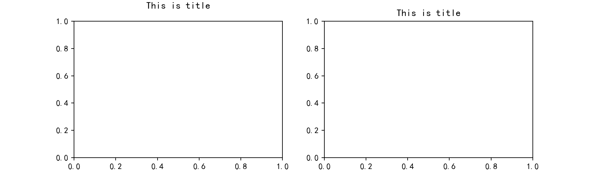

### annotate - 子图的注解

annotate的调用方式为`Axes.annotate(text, xy, *args, **kwargs)`  
其中`text`为注解的内容，  
`xy`为注解箭头指向的坐标，  
其他常用的参数包括：  
`xytext`为注解文字的坐标，  
`xycoords`用来定义xy参数的坐标系，   
`textcoords`用来定义xytext参数的坐标系，  
`arrowprops`用来定义指向箭头的样式

annotate的参数非常复杂，这里仅仅展示一个简单的例子，更多参数可以查看[官方文档中的annotate介绍](https://matplotlib.org/stable/tutorials/text/annotations.html#plotting-guide-annotation)


```python
fig = plt.figure()
ax = fig.add_subplot()
ax.annotate("",
            xy=(0.2, 0.2), xycoords='data',
            xytext=(0.8, 0.8), textcoords='data',
            arrowprops=dict(arrowstyle="->", connectionstyle="arc3,rad=0.2")
            )
plt.show()
```

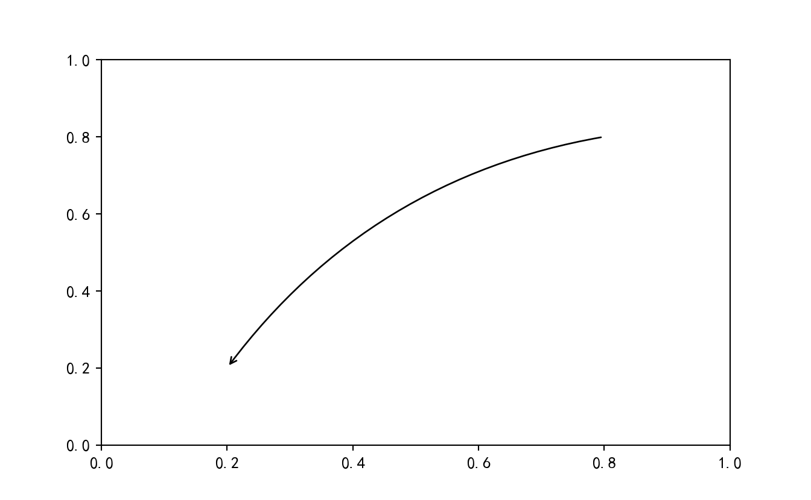

### 字体的属性设置

 字体设置一般有全局字体设置和自定义局部字体设置两种方法。

  [为方便在图中加入合适的字体，可以尝试了解中文字体的英文名称,该链接告诉了常用中文的英文名称](https://www.cnblogs.com/chendc/p/9298832.html)


```python
#该block讲述如何在matplotlib里面，修改字体默认属性，完成全局字体的更改。
plt.rcParams['font.sans-serif'] = ['SimSun']    # 指定默认字体为新宋体。
plt.rcParams['axes.unicode_minus'] = False      # 解决保存图像时 负号'-' 显示为方块和报错的问题。
```


```python
#局部字体的修改方法1
x = [1, 2, 3, 4, 5, 6, 7, 8, 9, 10]
plt.plot(x, label='小示例图标签')

# 直接用字体的名字
plt.xlabel('x 轴名称参数', fontproperties='Microsoft YaHei', fontsize=16)         # 设置x轴名称，采用微软雅黑字体
plt.ylabel('y 轴名称参数', fontproperties='Microsoft YaHei', fontsize=14)         # 设置Y轴名称
plt.title('坐标系的标题',  fontproperties='Microsoft YaHei', fontsize=20)         # 设置坐标系标题的字体
plt.legend(loc='lower right', prop={"family": 'Microsoft YaHei'}, fontsize=10) 
plt.show()   # 小示例图的字体设置
```

```{.scroll-200}
Traceback (most recent call last):
  File "D:\anaconda\lib\site-packages\matplotlib\backends\backend_qt.py", line 468, in _draw_idle
    self.draw()
  File "D:\anaconda\lib\site-packages\matplotlib\backends\backend_agg.py", line 400, in draw
    self.figure.draw(self.renderer)
  File "D:\anaconda\lib\site-packages\matplotlib\artist.py", line 95, in draw_wrapper
    result = draw(artist, renderer, *args, **kwargs)
  File "D:\anaconda\lib\site-packages\matplotlib\artist.py", line 72, in draw_wrapper
    return draw(artist, renderer)
  File "D:\anaconda\lib\site-packages\matplotlib\figure.py", line 3125, in draw
    mimage._draw_list_compositing_images(
  File "D:\anaconda\lib\site-packages\matplotlib\image.py", line 131, in _draw_list_compositing_images
    a.draw(renderer)
  File "D:\anaconda\lib\site-packages\matplotlib\artist.py", line 72, in draw_wrapper
    return draw(artist, renderer)
  File "D:\anaconda\lib\site-packages\matplotlib\axes\_base.py", line 3030, in draw
    self._update_title_position(renderer)
  File "D:\anaconda\lib\site-packages\matplotlib\axes\_base.py", line 2963, in _update_title_position
    if (ax.xaxis.get_ticks_position() in ['top', 'unknown']
  File "D:\anaconda\lib\site-packages\matplotlib\axis.py", line 2455, in get_ticks_position
    self._get_ticks_position()]
  File "D:\anaconda\lib\site-packages\matplotlib\axis.py", line 2159, in _get_ticks_position
    major = self.majorTicks[0]
IndexError: list index out of range
```

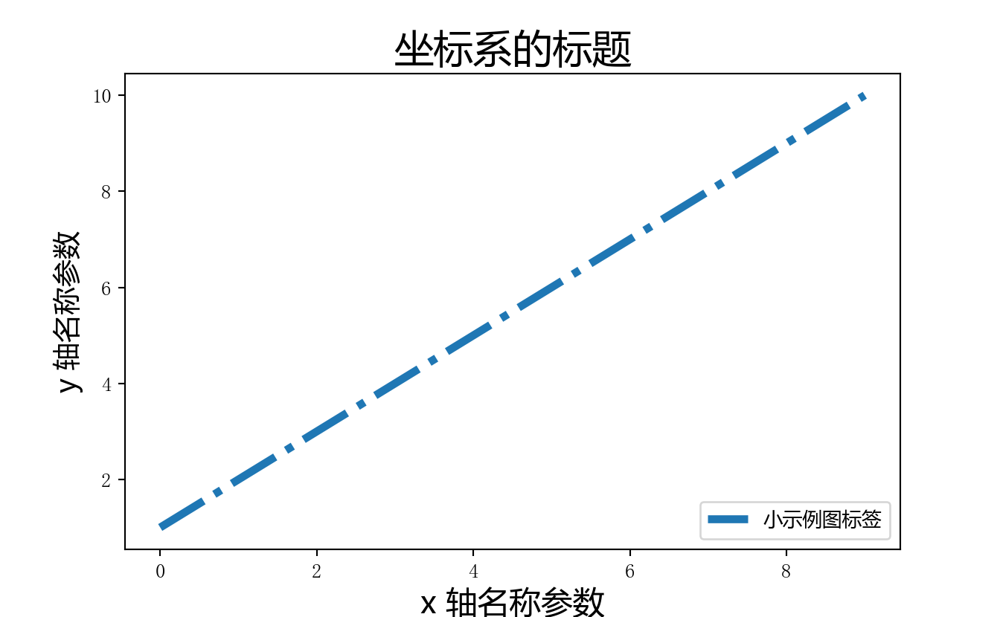

## Tick上的文本

设置tick（刻度）和ticklabel（刻度标签）也是可视化中经常需要操作的步骤，matplotlib既提供了自动生成刻度和刻度标签的模式（默认状态），同时也提供了许多让使用者灵活设置的方式。

### 简单模式

可以使用axis的`set_ticks`方法手动设置标签位置，使用axis的`set_ticklabels`方法手动设置标签格式


```python
x1 = np.linspace(0.0, 5.0, 100)
y1 = np.cos(2 * np.pi * x1) * np.exp(-x1)
```


```python
# 使用axis的set_ticks方法手动设置标签位置的例子，该案例中由于tick设置过大，所以会影响绘图美观，不建议用此方式进行设置tick
fig, axs = plt.subplots(2, 1, figsize=(5, 3), tight_layout=True)
axs[0].plot(x1, y1)
axs[1].plot(x1, y1)
axs[1].xaxis.set_ticks(np.arange(0., 10.1, 2.))
plt.show()
```

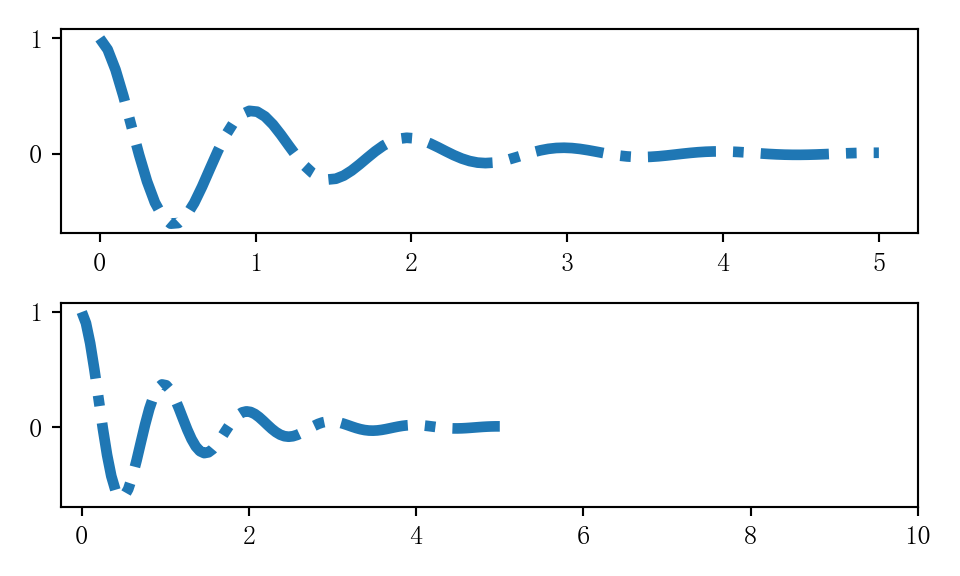


```python
# 使用axis的set_ticklabels方法手动设置标签格式的例子
fig, axs = plt.subplots(2, 1, figsize=(5, 3), tight_layout=True)
axs[0].plot(x1, y1)
axs[1].plot(x1, y1)
ticks = np.arange(0., 8.1, 2.)
tickla = [f'{tick:1.2f}' for tick in ticks]
axs[1].xaxis.set_ticks(ticks)
axs[1].xaxis.set_ticklabels(tickla)
plt.show()
```

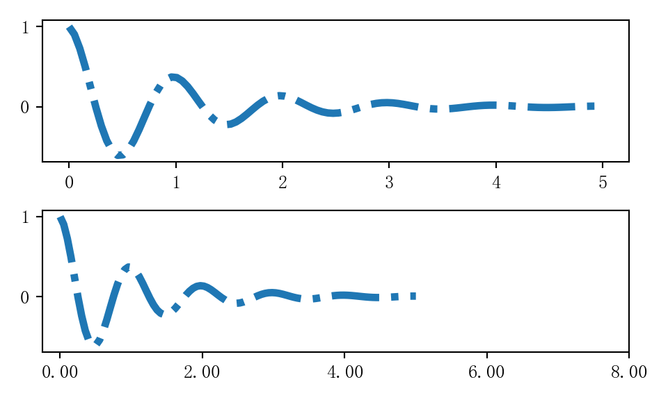


```python
#一般绘图时会自动创建刻度，而如果通过上面的例子使用set_ticks创建刻度可能会导致tick的范围与所绘制图形的范围不一致的问题。
#所以在下面的案例中，axs[1]中set_xtick的设置要与数据范围所对应，然后再通过set_xticklabels设置刻度所对应的标签
import numpy as np
import matplotlib.pyplot as plt
fig, axs = plt.subplots(2, 1, figsize=(6, 4), tight_layout=True)
x1 = np.linspace(0.0, 6.0, 100)
y1 = np.cos(2 * np.pi * x1) * np.exp(-x1)
axs[0].plot(x1, y1)
axs[0].set_xticks([0,1,2,3,4,5,6])

axs[1].plot(x1, y1)
axs[1].set_xticks([0,1,2,3,4,5,6])#要将x轴的刻度放在数据范围中的哪些位置
axs[1].set_xticklabels(['zero','one', 'two', 'three', 'four', 'five','six'],#设置刻度对应的标签
                   rotation=30, fontsize='small')#rotation选项设定x刻度标签倾斜30度。
axs[1].xaxis.set_ticks_position('bottom')#set_ticks_position()方法是用来设置刻度所在的位置，常用的参数有bottom、top、both、none
print(axs[1].xaxis.get_ticklines())
```

```{.scroll-200}
<a list of 14 Line2D ticklines objects>
```

```python
plt.show()
```

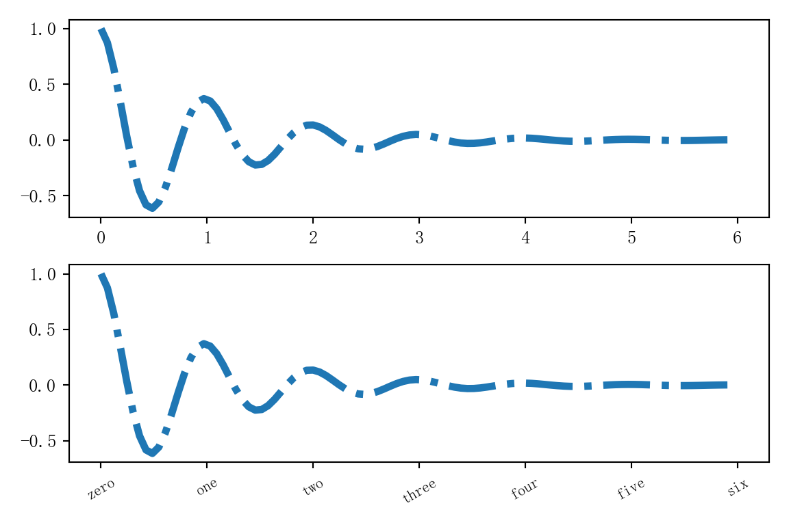

### Tick Locators and Formatters

除了上述的简单模式，还可以使用`Tick Locators and Formatters`完成对于刻度位置和刻度标签的设置。
其中[Axis.set_major_locator](https://matplotlib.org/api/_as_gen/matplotlib.axis.Axis.set_major_locator.html#matplotlib.axis.Axis.set_major_locator)和[Axis.set_minor_locator](https://matplotlib.org/api/_as_gen/matplotlib.axis.Axis.set_minor_locator.html#matplotlib.axis.Axis.set_minor_locator)方法用来设置标签的位置，[Axis.set_major_formatter](https://matplotlib.org/api/_as_gen/matplotlib.axis.Axis.set_major_formatter.html#matplotlib.axis.Axis.set_major_formatter)和[Axis.set_minor_formatter](https://matplotlib.org/api/_as_gen/matplotlib.axis.Axis.set_minor_formatter.html#matplotlib.axis.Axis.set_minor_formatter)方法用来设置标签的格式。这种方式的好处是不用显式地列举出刻度值列表。

set_major_formatter和set_minor_formatter这两个formatter格式命令可以接收字符串格式（matplotlib.ticker.StrMethodFormatter）或函数参数（matplotlib.ticker.FuncFormatter）来设置刻度值的格式 。

### Tick Formatters


```python
# 接收字符串格式的例子
fig, axs = plt.subplots(2, 2, figsize=(8, 5), tight_layout=True)
for n, ax in enumerate(axs.flat):
    ax.plot(x1*10., y1)

formatter = mpl.ticker.FormatStrFormatter('%1.1f')
axs[0, 1].xaxis.set_major_formatter(formatter)

formatter = mpl.ticker.FormatStrFormatter('-%1.1f')
axs[1, 0].xaxis.set_major_formatter(formatter)

formatter = mpl.ticker.FormatStrFormatter('%1.5f')
axs[1, 1].xaxis.set_major_formatter(formatter)
plt.show()
```

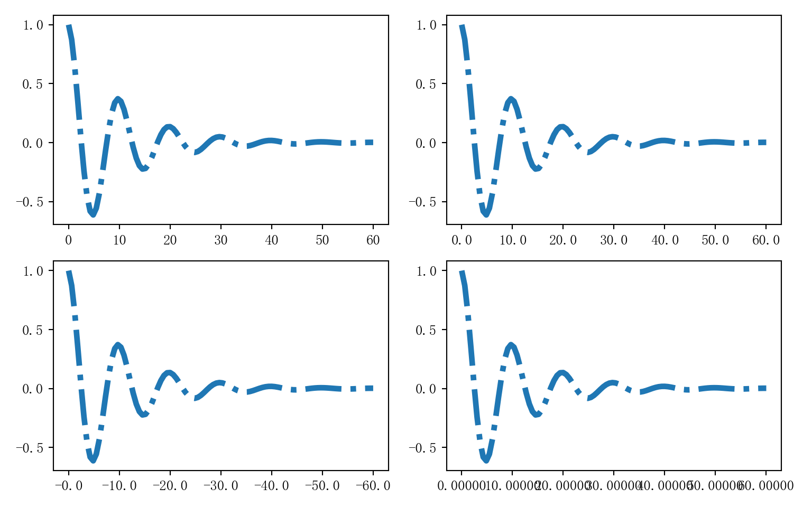


```python
# 接收函数的例子
def formatoddticks(x, pos):
    """Format odd tick positions."""
    if x % 2:
        return f'{x:1.2f}'
    else:
        return ''

fig, ax = plt.subplots(figsize=(5, 3), tight_layout=True)
ax.plot(x1, y1)
ax.xaxis.set_major_formatter(formatoddticks)
plt.show()
```

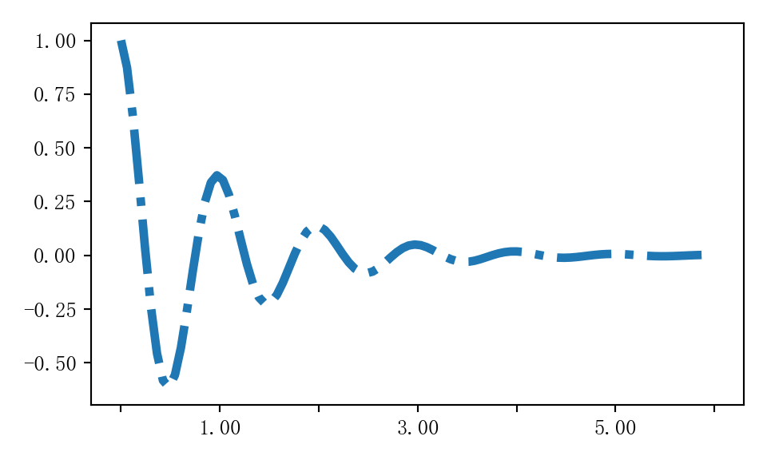

### Tick Locators 

在普通的绘图中，我们可以直接通过上图的set_ticks进行设置刻度的位置，缺点是需要自己指定或者接受matplotlib默认给定的刻度。当需要更改刻度的位置时，matplotlib给了常用的几种locator的类型。如果要绘制更复杂的图，可以先设置locator的类型，然后通过axs.xaxis.set_major_locator(locator)绘制即可  

    locator=plt.MaxNLocator(nbins=7)#自动选择合适的位置，并且刻度之间最多不超过7（nbins）个间隔
    locator=plt.FixedLocator(locs=[0,0.5,1.5,2.5,3.5,4.5,5.5,6])#直接指定刻度所在的位置  
    locator=plt.AutoLocator()#自动分配刻度值的位置  
    locator=plt.IndexLocator(offset=0.5, base=1)#面元间距是1，从0.5开始  
    locator=plt.MultipleLocator(1.5)#将刻度的标签设置为1.5的倍数  
    locator=plt.LinearLocator(numticks=5)#线性划分5等分，4个刻度  


```python
# 接收各种locator的例子
fig, axs = plt.subplots(2, 2, figsize=(8, 5), tight_layout=True)
for n, ax in enumerate(axs.flat):
    ax.plot(x1*10., y1)

locator = mpl.ticker.AutoLocator()
axs[0, 0].xaxis.set_major_locator(locator)

locator = mpl.ticker.MaxNLocator(nbins=3)
axs[0, 1].xaxis.set_major_locator(locator)

locator = mpl.ticker.MultipleLocator(5)
axs[1, 0].xaxis.set_major_locator(locator)

locator = mpl.ticker.FixedLocator([0,7,14,21,28])
axs[1, 1].xaxis.set_major_locator(locator)
plt.show()
```

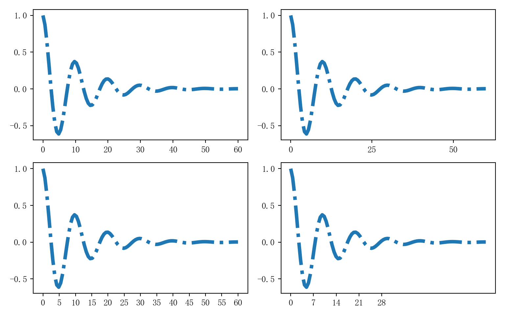

 此外`matplotlib.dates` 模块还提供了特殊的设置日期型刻度格式和位置的方式


```python
# 特殊的日期型locator和formatter
locator = mdates.DayLocator(bymonthday=[1,15,25])
formatter = mdates.DateFormatter('%b %d')

fig, ax = plt.subplots(figsize=(5, 3), tight_layout=True)
ax.xaxis.set_major_locator(locator)
ax.xaxis.set_major_formatter(formatter)
base = datetime.datetime(2017, 1, 1, 0, 0, 1)
time = [base + datetime.timedelta(days=x) for x in range(len(x1))]
ax.plot(time, y1)
ax.tick_params(axis='x', rotation=70)
plt.show()
```

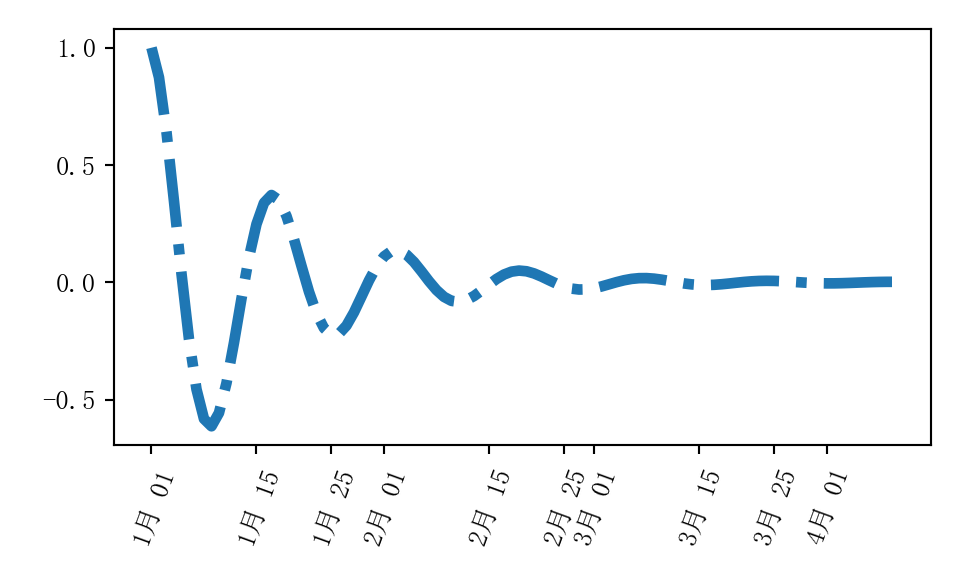

## legend（图例）

在具体学习图例之前，首先解释几个术语：  
**legend entry（图例条目)**    
每个图例由一个或多个legend entries组成。一个entry包含一个key和其对应的label。  
**legend key（图例键)**  
每个legend label左面的colored/patterned marker（彩色/图案标记）  
**legend label（图例标签)**  
描述由key来表示的handle的文本  
**legend handle（图例句柄)**  
用于在图例中生成适当图例条目的原始对象  

以下面这个图为例，右侧的方框中的共有两个legend entry；两个legend key，分别是一个蓝色和一个黄色的legend key；两个legend label，一个名为‘Line up’和一个名为‘Line Down’的legend label


图例的绘制同样有OO模式和pyplot模式两种方式，写法都是一样的，使用legend()即可调用。  
以下面的代码为例，在使用legend方法时，我们可以手动传入两个变量，句柄和标签，用以指定条目中的特定绘图对象和显示的标签值。  
当然通常更简单的操作是不传入任何参数，此时matplotlib会自动寻找合适的图例条目。


```python
fig, ax = plt.subplots()
line_up, = ax.plot([1, 2, 3], label='Line 2')
line_down, = ax.plot([3, 2, 1], label='Line 1')
ax.legend(handles = [line_up, line_down], labels = ['Line Up', 'Line Down'])
plt.show()
```

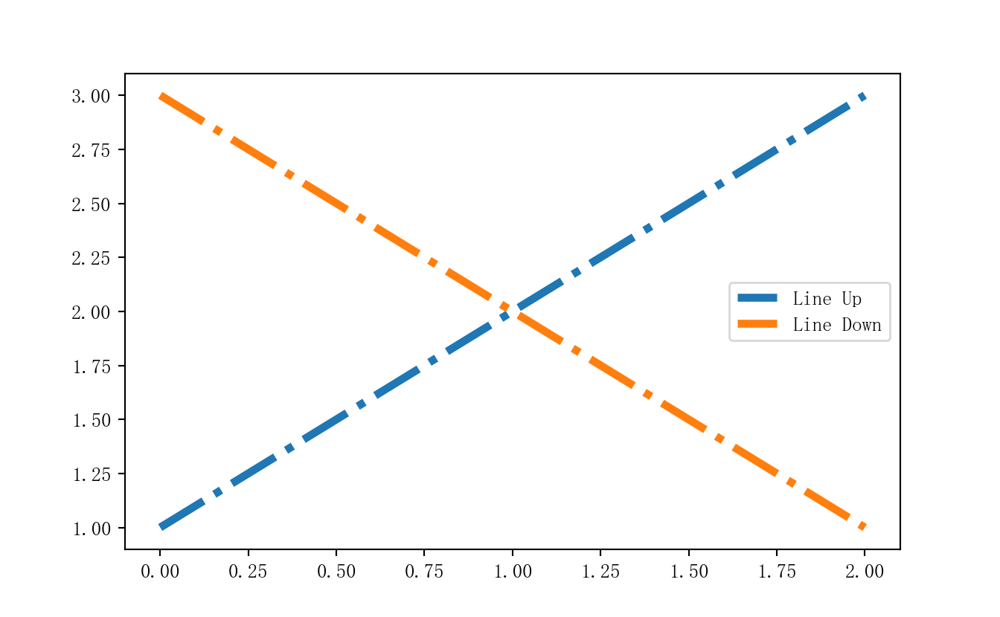

legend其他常用的几个参数如下：

**设置图例位置**  
loc参数接收一个字符串或数字表示图例出现的位置  
ax.legend(loc='upper center') 等同于ax.legend(loc=9)

| Location String | Location Code |
| --------------- | ------------- |
| 'best'          | 0             |
| 'upper right'   | 1             |
| 'upper left'    | 2             |
| 'lower left'    | 3             |
| 'lower right'   | 4             |
| 'right'         | 5             |
| 'center left'   | 6             |
| 'center right'  | 7             |
| 'lower center'  | 8             |
| 'upper center'  | 9             |
| 'center'        | 10            |


```python
fig,axes = plt.subplots(1,4,figsize=(10,4))
for i in range(4):
    axes[i].plot([0.5],[0.5])
    axes[i].legend(labels='a',loc=i)  # 观察loc参数传入不同值时图例的位置
fig.tight_layout()
```

**设置图例边框及背景**


```python
fig = plt.figure(figsize=(10,3))
axes = fig.subplots(1,3)
for i, ax in enumerate(axes):
    ax.plot([1,2,3],label=f'ax {i}')
axes[0].legend(frameon=False) #去掉图例边框
axes[1].legend(edgecolor='blue') #设置图例边框颜色
axes[2].legend(facecolor='gray')
plt.show() #设置图例背景颜色,若无边框,参数无效
```

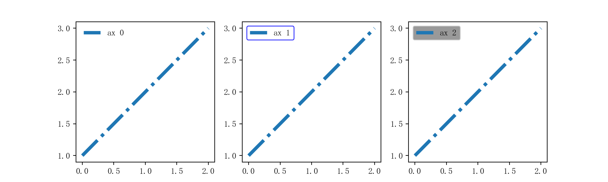

​    

**设置图例标题** 


```python
fig,ax =plt.subplots()
ax.plot([1,2,3],label='label')
ax.legend(title='legend title')
plt.show()
```

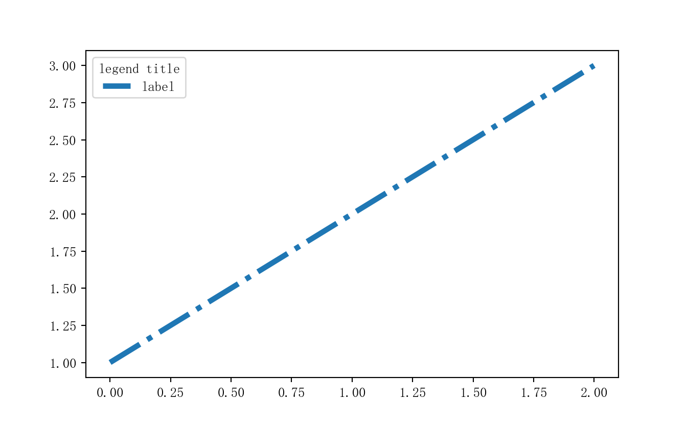

## 思考题

- 请尝试使用两种方式模仿画出下面的图表(重点是柱状图上的标签)，本文学习的text方法和matplotlib自带的柱状图标签方法bar_label


第五回详细介绍matplotlib中样式和颜色的使用，绘图样式和颜色是丰富可视化图表的重要手段，因此熟练掌握本章可以让可视化图表变得更美观，突出重点和凸显艺术性。  
关于绘图样式，常见的有3种方法，分别是修改预定义样式，自定义样式和rcparams。  
关于颜色使用，本章介绍了常见的5种表示单色颜色的基本方法，以及colormap多色显示的方法。

## matplotlib的绘图样式（style）

在matplotlib中，要想设置绘制样式，最简单的方法是在绘制元素时单独设置样式。
但是有时候，当用户在做专题报告时，往往会希望保持整体风格的统一而不用对每张图一张张修改，因此matplotlib库还提供了四种批量修改全局样式的方式

### matplotlib预先定义样式

matplotlib贴心地提供了许多内置的样式供用户使用，使用方法很简单，只需在python脚本的最开始输入想使用style的名称即可调用，尝试调用不同内置样式，比较区别


```python
plt.style.use('default')
plt.plot([1,2,3,4],[2,3,4,5])
plt.show()
```

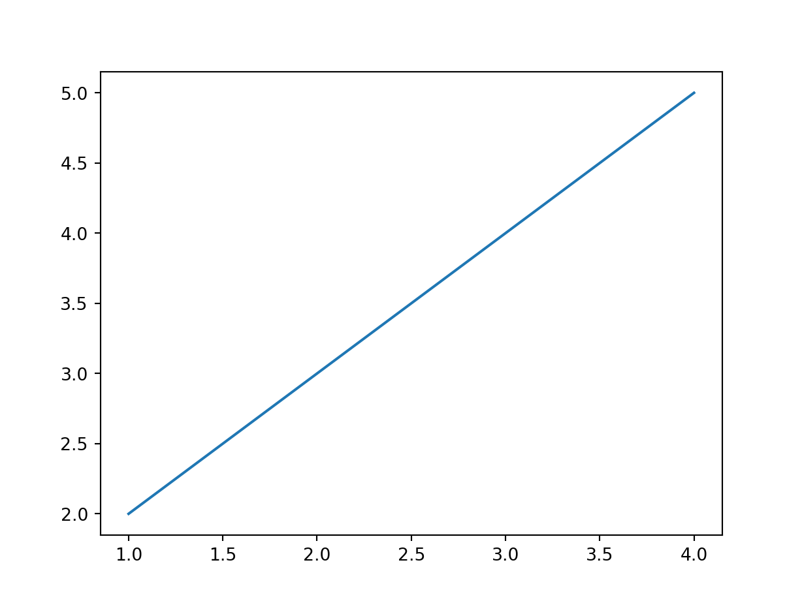


```python
plt.style.use('ggplot')
plt.plot([1,2,3,4],[2,3,4,5])
plt.show()
```


那么matplotlib究竟内置了那些样式供使用呢？总共以下26种丰富的样式可供选择。


```python
print(plt.style.available)
```

```{.scroll-200}
['Solarize_Light2', '_classic_test_patch', '_mpl-gallery', '_mpl-gallery-nogrid', 'bmh', 'classic', 'dark_background', 'fast', 'fivethirtyeight', 'ggplot', 'grayscale', 'seaborn-v0_8', 'seaborn-v0_8-bright', 'seaborn-v0_8-colorblind', 'seaborn-v0_8-dark', 'seaborn-v0_8-dark-palette', 'seaborn-v0_8-darkgrid', 'seaborn-v0_8-deep', 'seaborn-v0_8-muted', 'seaborn-v0_8-notebook', 'seaborn-v0_8-paper', 'seaborn-v0_8-pastel', 'seaborn-v0_8-poster', 'seaborn-v0_8-talk', 'seaborn-v0_8-ticks', 'seaborn-v0_8-white', 'seaborn-v0_8-whitegrid', 'tableau-colorblind10']
```

### 用户自定义stylesheet

在任意路径下创建一个后缀名为mplstyle的样式清单，编辑文件添加以下样式内容  

> axes.titlesize : 24     
> axes.labelsize : 20   
> lines.linewidth : 3   
> lines.markersize : 10   
> xtick.labelsize : 16   
> ytick.labelsize : 16  

引用自定义stylesheet后观察图表变化。


```python
plt.style.use('static/docs/presentation.mplstyle')
plt.plot([1,2,3,4],[2,3,4,5])
plt.show()
```

值得特别注意的是，matplotlib支持混合样式的引用，只需在引用时输入一个样式列表，若是几个样式中涉及到同一个参数，右边的样式表会覆盖左边的值。


```python
plt.style.use(['dark_background', 'file/presentation.mplstyle'])
plt.plot([1,2,3,4],[2,3,4,5])
plt.show()
```

### 设置rcparams

我们还可以通过修改默认rc设置的方式改变样式，所有rc设置都保存在一个叫做 matplotlib.rcParams的变量中。  
修改过后再绘图，可以看到绘图样式发生了变化。


```python
plt.style.use('default') # 恢复到默认样式
plt.plot([1,2,3,4],[2,3,4,5])
plt.show()
```


```python
mpl.rcParams['lines.linewidth'] = 2
mpl.rcParams['lines.linestyle'] = '--'
plt.plot([1,2,3,4],[2,3,4,5])
plt.show()
```

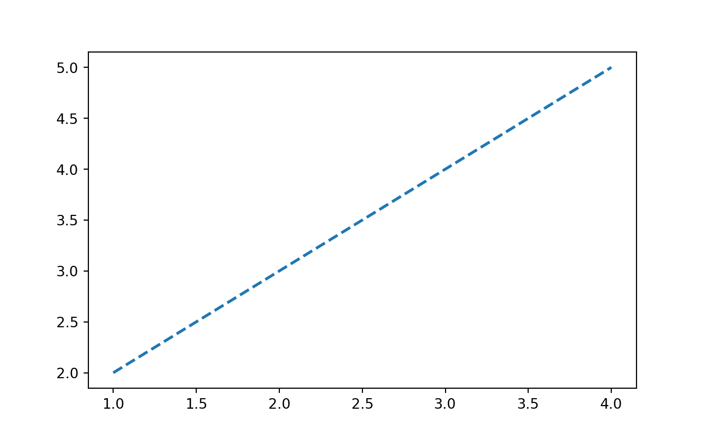

另外matplotlib也还提供了一种更便捷的修改样式方式，可以一次性修改多个样式。


```python
mpl.rc('lines', linewidth=4, linestyle='-.')
plt.plot([1,2,3,4],[2,3,4,5])
plt.show()
```

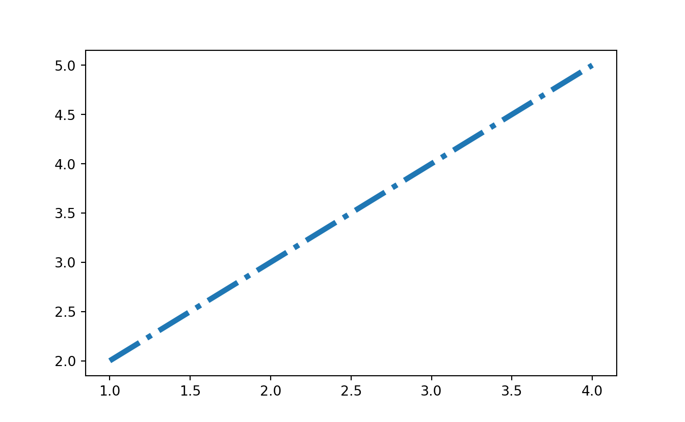

## matplotlib的色彩设置（color）

在可视化中，如何选择合适的颜色和搭配组合也是需要仔细考虑的，色彩选择要能够反映出可视化图像的主旨。  
从可视化编码的角度对颜色进行分析，可以将颜色分为`色相、亮度和饱和度`三个视觉通道。通常来说：  
`色相`： 没有明显的顺序性、一般不用来表达数据量的高低，而是用来表达数据列的类别。  
`明度和饱和度`： 在视觉上很容易区分出优先级的高低、被用作表达顺序或者表达数据量视觉通道。  
具体关于色彩理论部分的知识，不属于本教程的重点，请参阅有关拓展材料学习。  
[学会这6个可视化配色基本技巧，还原数据本身的意义](https://zhuanlan.zhihu.com/p/88892542)

在matplotlib中，设置颜色有以下几种方式：

### RGB或RGBA


```python
plt.style.use('default')
```


```python
# 颜色用[0,1]之间的浮点数表示，四个分量按顺序分别为(red, green, blue, alpha)，其中alpha透明度可省略
plt.plot([1,2,3],[4,5,6],color=(0.1, 0.2, 0.5))
plt.plot([4,5,6],[1,2,3],color=(0.1, 0.2, 0.5, 0.5))
plt.show()
```

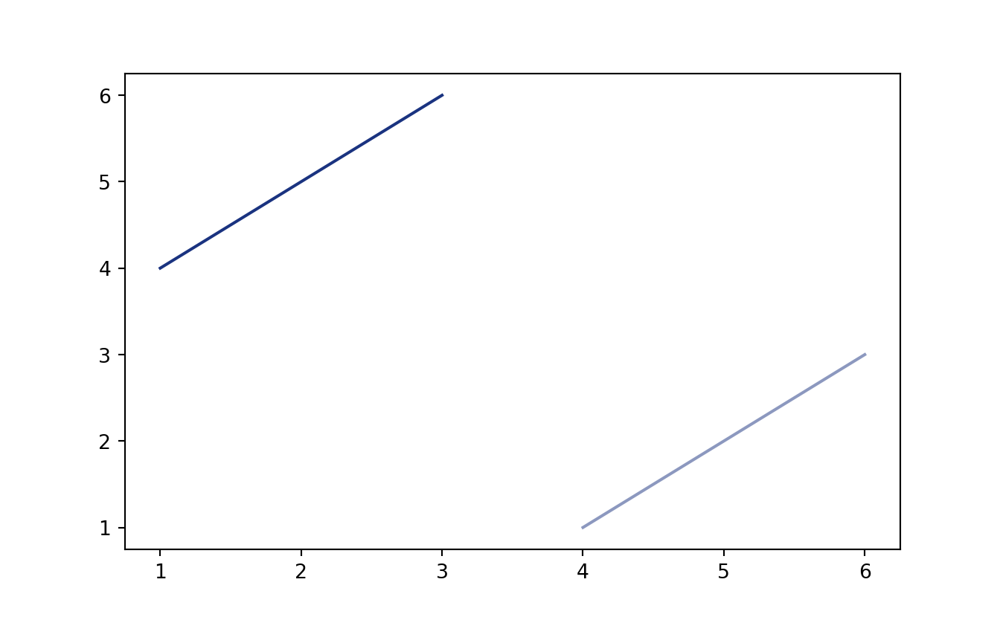

### HEX RGB 或 RGBA 


```python
# 用十六进制颜色码表示，同样最后两位表示透明度，可省略
plt.plot([1,2,3],[4,5,6],color='#0f0f0f')
plt.plot([4,5,6],[1,2,3],color='#0f0f0f80')
plt.show()
```

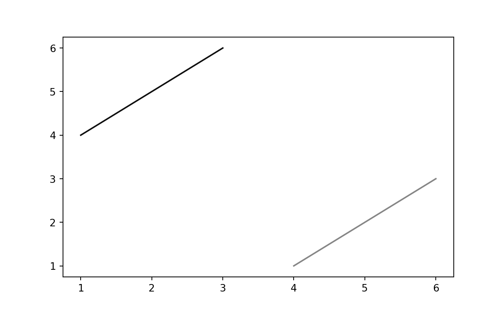

RGB颜色和HEX颜色之间是可以一一对应的，以下网址提供了两种色彩表示方法的转换工具。  
[https://www.colorhexa.com/](https://www.colorhexa.com/)

### 灰度色阶


```python
# 当只有一个位于[0,1]的值时，表示灰度色阶
plt.plot([1,2,3],[4,5,6],color='0.5')
plt.show()
```

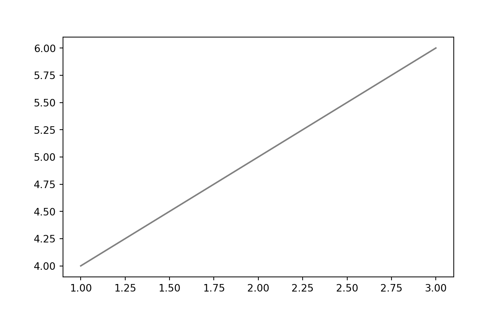

### 单字符基本颜色


```python
# matplotlib有八个基本颜色，可以用单字符串来表示，分别是'b', 'g', 'r', 'c', 'm', 'y', 'k', 'w'，对应的是blue, green, red, cyan, magenta, yellow, black, and white的英文缩写
plt.plot([1,2,3],[4,5,6],color='m')
plt.show()
```


### 颜色名称


```python
# matplotlib提供了颜色对照表，可供查询颜色对应的名称
plt.plot([1,2,3],[4,5,6],color='tan')
plt.show()
```


### 使用colormap设置一组颜色

有些图表支持使用colormap的方式配置一组颜色，从而在可视化中通过色彩的变化表达更多信息。

在matplotlib中，colormap共有五种类型:

- 顺序（Sequential）。通常使用单一色调，逐渐改变亮度和颜色渐渐增加，用于表示有顺序的信息
- 发散（Diverging）。改变两种不同颜色的亮度和饱和度，这些颜色在中间以不饱和的颜色相遇;当绘制的信息具有关键中间值（例如地形）或数据偏离零时，应使用此值。
- 循环（Cyclic）。改变两种不同颜色的亮度，在中间和开始/结束时以不饱和的颜色相遇。用于在端点处环绕的值，例如相角，风向或一天中的时间。
- 定性（Qualitative）。常是杂色，用来表示没有排序或关系的信息。
- 杂色（Miscellaneous）。一些在特定场景使用的杂色组合，如彩虹，海洋，地形等。


```python
x = np.random.randn(50)
y = np.random.randn(50)
plt.scatter(x,y,c=x,cmap='RdPu')
plt.show()
```


在以下官网页面可以查询上述五种colormap的字符串表示和颜色图的对应关系    
[https://matplotlib.org/stable/tutorials/colors/colormaps.html](https://matplotlib.org/stable/tutorials/colors/colormaps.html)

## 思考题

- 学习如何自定义colormap，并将其应用到任意一个数据集中，绘制一幅图像，注意colormap的类型要和数据集的特性相匹配，并做简单解释

