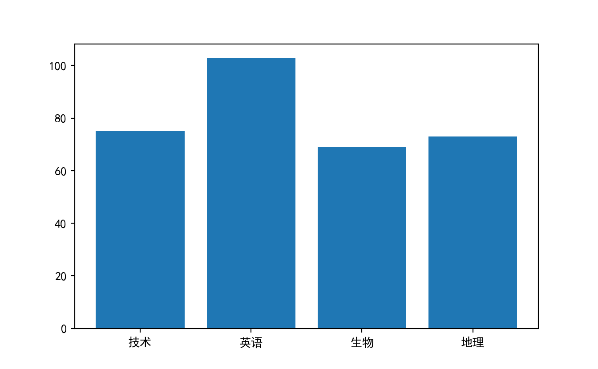
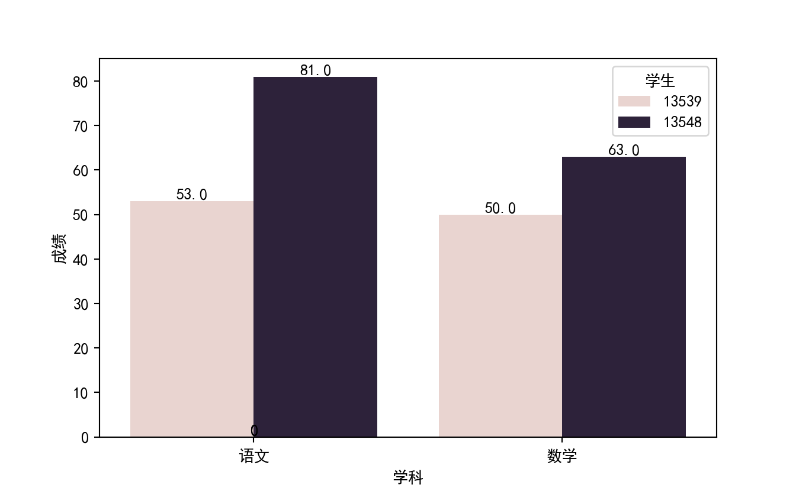
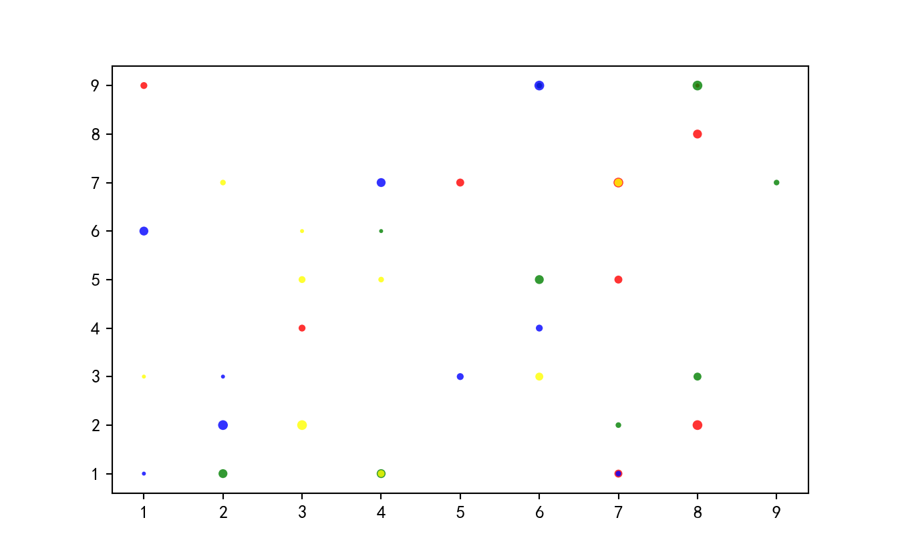
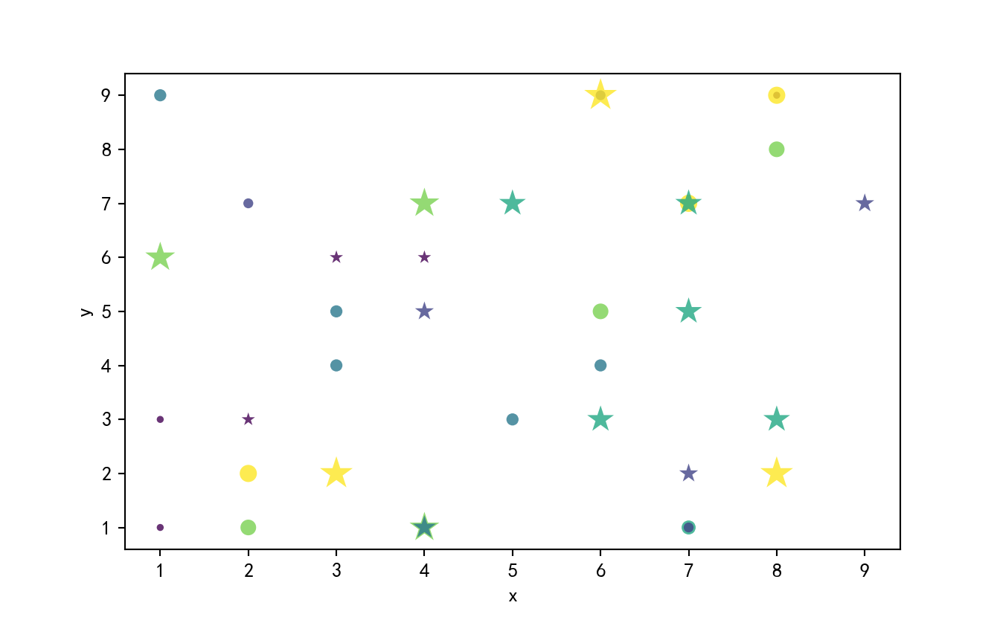
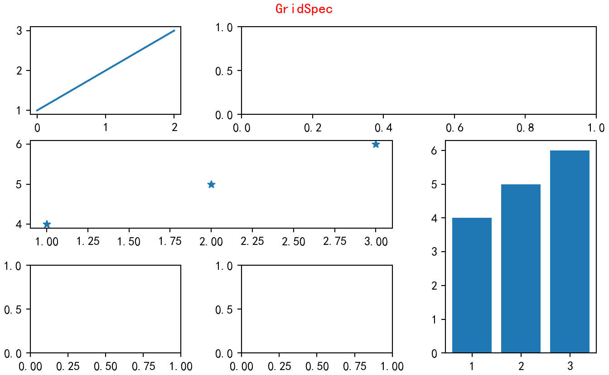

# 图表实例

[**参考作者pythonic生物人**](https://www.zhihu.com/column/c_1257815636945915904)


```python
import pandas as pd
import numpy as np
import matplotlib as mpl
#mpl.use("agg")
import matplotlib.pyplot as plt
import matplotlib.lines as mlines
import matplotlib.patches as mpatches
from matplotlib.legend_handler import HandlerLine2D, HandlerTuple 
from numpy.random import randn
import seaborn as sns
from matplotlib import ticker
from matplotlib.gridspec import GridSpec
plt.rcParams['font.sans-serif']=['Simhei']; #SimHei黑体 
plt.rcParams['axes.unicode_minus']=False; #正常显示图中负号
#teacher = pd.read_csv("data/数据/school/1_teacher.csv")
student = pd.read_csv("data/数据/school/2_student_info.csv")
#kaoqin = pd.read_csv("data/数据/school/3_kaoqin.csv")
#kaoqin_type = pd.read_csv("data/数据/school/4_kaoqintype.csv")
chengji = pd.read_csv("data/数据/school/5_chengji.csv")
#exam_type = pd.read_csv("data/数据/school/6_exam_type.csv")
#consumption = pd.read_csv("data/数据/school/7_consumption.csv")
#teacher.head().pipe(lambda df:print(df.to_markdown(tablefmt="github")))
student.head().pipe(lambda df:print(df.to_markdown(tablefmt="github")))
#kaoqin.head().pipe(lambda df:print(df.to_markdown(tablefmt="github")))
#kaoqin_type.head().pipe(lambda df:print(df.to_markdown(tablefmt="github")))
```

|    |   bf_StudentID | bf_Name   | bf_sex   | bf_nation   |   bf_BornDate | cla_Name    | bf_NativePlace   | Bf_ResidenceType   | bf_policy   |   cla_id | cla_term    |   bf_zhusu |   bf_leaveSchool |   bf_qinshihao |
|----|----------------|-----------|----------|-------------|---------------|-------------|------------------|--------------------|-------------|----------|-------------|------------|------------------|----------------|
|  0 |          14454 | 陈某某    | 女       | 汉族        |          2001 | 白-高二(01) | 宁波             | 城镇               | 共青团员    |      901 | 2018-2019-1 |        nan |              nan |            nan |
|  1 |          14479 | 曹某某    | 男       | 汉族        |           nan | 白-高二(01) | nan              | 城镇               | 共青团员    |      901 | 2018-2019-1 |          1 |              nan |            315 |
|  2 |          14486 | 金某某    | 男       | 汉族        |           nan | 白-高二(01) | nan              | 城镇               | 共青团员    |      901 | 2018-2019-1 |          1 |              nan |            321 |
|  3 |          14549 | 张某某    | 女       | 汉族        |          2002 | 白-高二(07) | 浙江平湖         | 城镇               | 共青团员    |      907 | 2018-2019-1 |        nan |              nan |            nan |
|  4 |          14550 | 张某某    | 女       | 汉族        |          2001 | 白-高二(04) | 浙江宁波         | 城镇               | 共青团员    |      904 | 2018-2019-1 |        nan |              nan |            nan |

```python
chengji.head().pipe(lambda df:print(df.to_markdown(tablefmt="github")))
#exam_type.head().pipe(lambda df:print(df.to_markdown(tablefmt="github")))
#consumption.head().pipe(lambda df:print(df.to_markdown(tablefmt="github")))
```

|    |   mes_TestID |   exam_number | exam_numname              |   mes_sub_id | mes_sub_name   | exam_term   |   exam_type | exam_sdate         |   mes_StudentID |   mes_Score |   mes_Z_Score |   mes_T_Score |   mes_dengdi |
|----|--------------|---------------|---------------------------|--------------|----------------|-------------|-------------|--------------------|-----------------|-------------|---------------|---------------|--------------|
|  0 |       136424 |           282 | 2017年9月宁波市“十校联考” |           17 | 政治           | 2017-2018-1 |           7 | 2017/9/20 00:00:00 |           13539 |          -2 |     nan       |      nan      |  nan         |
|  1 |       136424 |           282 | 2017年9月宁波市“十校联考” |           17 | 政治           | 2017-2018-1 |           7 | 2017/9/20 00:00:00 |           13548 |          90 |       1.07451 |       88.5961 |    0.137615  |
|  2 |       136424 |           282 | 2017年9月宁波市“十校联考” |           17 | 政治           | 2017-2018-1 |           7 | 2017/9/20 00:00:00 |           13551 |          91 |       1.19415 |       89.5532 |    0.0917431 |
|  3 |       136424 |           282 | 2017年9月宁波市“十校联考” |           17 | 政治           | 2017-2018-1 |           7 | 2017/9/20 00:00:00 |           13555 |          -2 |     nan       |      nan      |  nan         |
|  4 |       136424 |           282 | 2017年9月宁波市“十校联考” |           17 | 政治           | 2017-2018-1 |           7 | 2017/9/20 00:00:00 |           13559 |          -2 |     nan       |      nan      |  nan         |

## 绘制流程


## 参考

```{=html}
<a href="./static/html/python可视化.html" target="_blank">python可视化.html</a><br/>
<iframe src="./static/html/python可视化.html" 
        scrolling="no" 
        border="0" 
        frameborder="no" 
        framespacing="0" 
        allowfullscreen="true"
        width="100%" 
        height="500">
</iframe>
```

## axes参数设置

### tick_labels

    #获取label对象
    ax.xaxis.get_ticklabels()
    #获取label对象并且设置label
    for label in ax.xaxis.get_ticklabels():
        # 调用x轴刻度标签实例，是一个text实例
        label.set_color('red') # 颜色
        label.set_rotation(45) # 旋转角度
        label.set_fontsize(16) # 字体大小
    #更改label和tick值,tick设置为[]，ticks消失
    # ax.xaxis.set_ticklabels()不被鼓励
    ax.set_xticks(ticks,labels,minor=False,)
    ax.yaxis.set_ticks(ticks,labels,minor=False)

###  ticks

grid被包括在ticks中

    #获取ticks在一条轴上的位置
    ax.xaxis.get_ticklocs(minor=False)
    
    #设置一条轴的位置 上下左右或者让ticks和轴消失，label不消失
    ax.xaxis.set_ticks_position()#{'top', 'bottom', 'both', 'default', 'none'}
    
    # 获取ticks的线条,并且设置格式
    for line in ax.xaxis.get_ticklines(minor=False):
        # 调用y轴刻度线条实例, 是一个Line2D实例
        line.set_markeredgecolor('green')    # 颜色
        line.set_markersize(25)    # marker大小
        line.set_markeredgewidth(2)# marker粗细
    
    #设置ticks的参数
    ax.xaxis.set_tick_params(which="major",rotation=45)#left,right,labelleft,labelright,gridon
    ax.tick_params(axis=,which=,rotation=)
    
    #设置刻度规模
    ax.set_yscale()#设置x轴的规模，也就是量级，比如"linear", "log", "symlog", "logit"
    ax.set_xscale()
    ax.autoscale_view()#自动调整比例
    - `matplotlib.scale.LinearScale`
    - `matplotlib.scale.LogScale`
    - `matplotlib.scale.SymmetricalLogScale`
    - `matplotlib.scale.LogitScale`
    - `matplotlib.scale.FuncScale`

    direction : {'in', 'out', 'inout'}
        Puts ticks inside the Axes, outside the Axes, or both.
    length : float
        Tick length in points.
    width : float
        Tick width in points.
    color : color
        Tick color.
    pad : float
        Distance in points between tick and label.
    labelsize : float or str
        Tick label font size in points or as a string (e.g., 'large').
    labelcolor : color
        Tick label color.
    colors : color
        Tick color and label color.
    zorder : float
        Tick and label zorder.
    bottom, top, left, right : bool
        Whether to draw the respective ticks.
    labelbottom, labeltop, labelleft, labelright : bool
        Whether to draw the respective tick labels.
    labelrotation : float
        Tick label rotation
    grid_color : color
        Gridline color.
    grid_alpha : float
        Transparency of gridlines: 0 (transparent) to 1 (opaque).
    grid_linewidth : float
        Width of gridlines in points.
    grid_linestyle : str
        Any valid `.Line2D` line style spec.


### ticks-formator


### ticks-locator

    locator=plt.MaxNLocator(nbins=7)#自动选择合适的位置，并且刻度之间最多不超过7（nbins）个间隔
    locator=plt.FixedLocator(locs=[0,0.5,1.5,2.5,3.5,4.5,5.5,6])#直接指定刻度所在的位置  
    locator=plt.AutoLocator()#自动分配刻度值的位置  
    locator=plt.IndexLocator(offset=0.5, base=1)#面元间距是1，从0.5开始  
    locator=plt.MultipleLocator(1.5)#将刻度的标签设置为1.5的倍数  
    locator=plt.LinearLocator(numticks=5)#线性划分5等分，4个刻度  

### pad

控制ticks与轴标签之间的距离

    ax.xaxis.labelpad = 5
    ax.yaxis.labelpad = 5

### spines

设置四个轴线

    ax.spines['left'].set_position('center')#set_position('center')将 x 和 y 轴放置在相应数据范围之间。 在这种情况下， y 轴上的数据范围是 -1 到 +1，所以中心点是 0，而 x 轴上的数据范围是 0 到 6，所以中心点是3。 因此，交点为(3, 0)。
    ax.spines['right'].set_visible(False)#设置轴是否可见
    ax.spines['top'].set_color('r')
    ax.spines['top'].set_linewidth(1.7)
    #关闭所有轴线
    for spine in ax.spines.values():
        spine.set_visible(False)
        
### 轴范围

    ax.set_[xy]lim()#设置轴范围
    ax.xaxis.get_data_interval()# 获取轴刻度范围
    
### 调整多图间距


也可以在最后加上fig.tight_layout(),会默认起到优化作用


## 图例


### 图例样式设置 {.tabset}

#### 主要参数

    handles : sequence of `.Artist`, optional
    A list of Artists (lines, patches) to be added to the legend.
    Use this together with *labels*, if you need full control on what
    is shown in the legend and the automatic mechanism described above
    is not sufficient.

    The length of handles and labels should be the same in this
    case. If they are not, they are truncated to the smaller length.

    labels : list of str, optional
    A list of labels to show next to the artists.
    Use this together with *handles*, if you need full control on what
    is shown in the legend and the automatic mechanism described above
    is not sufficient.

    bbox_to_anchor : `.BboxBase`, 2-tuple, or 4-tuple of floats
    Box that is used to position the legend in conjunction with *loc*.
    Defaults to `axes.bbox` (if called as a method to `.Axes.legend`) or
    `figure.bbox` (if `.Figure.legend`).  This argument allows arbitrary
    placement of the legend.

    Bbox coordinates are interpreted in the coordinate system given by
    *bbox_transform*, with the default transform
    Axes or Figure coordinates, depending on which ``legend`` is called.

    If a 4-tuple or `.BboxBase` is given, then it specifies the bbox
    ``(x, y, width, height)`` that the legend is placed in.
    To put the legend in the best location in the bottom right
    quadrant of the axes (or figure)::

        loc='best', bbox_to_anchor=(0.5, 0., 0.5, 0.5)

    A 2-tuple ``(x, y)`` places the corner of the legend specified by *loc* at
    x, y.  For example, to put the legend's upper right-hand corner in the
    center of the axes (or figure) the following keywords can be used::

        loc='upper right', bbox_to_anchor=(0.5, 0.5)

ncols : int, default: 1
    The number of columns that the legend has.

#### 其他参数

    For backward compatibility, the spelling *ncol* is also supported
    but it is discouraged. If both are given, *ncols* takes precedence.

    loc : str or pair of floats, default: :rc:`legend.loc`
      The location of the legend.
    
      The strings
      ``'upper left', 'upper right', 'lower left', 'lower right'``
      place the legend at the corresponding corner of the axes/figure.
    
      The strings
      ``'upper center', 'lower center', 'center left', 'center right'``
      place the legend at the center of the corresponding edge of the
      axes/figure.
    
      The string ``'center'`` places the legend at the center of the axes/figure.
    
      The string ``'best'`` places the legend at the location, among the nine
      locations defined so far, with the minimum overlap with other drawn
      artists.  This option can be quite slow for plots with large amounts of
      data; your plotting speed may benefit from providing a specific location.
    
      The location can also be a 2-tuple giving the coordinates of the lower-left
      corner of the legend in axes coordinates (in which case *bbox_to_anchor*
      will be ignored).
    
      For back-compatibility, ``'center right'`` (but no other location) can also
      be spelled ``'right'``, and each "string" locations can also be given as a
      numeric value:
    
          ===============   =============
          Location String   Location Code
          ===============   =============
          'best'            0
          'upper right'     1
          'upper left'      2
          'lower left'      3
          'lower right'     4
          'right'           5
          'center left'     6
          'center right'    7
          'lower center'    8
          'upper center'    9
          'center'          10
          ===============   =============
    
    prop : None or `matplotlib.font_manager.FontProperties` or dict
      The font properties of the legend. If None (default), the current
      :data:`matplotlib.rcParams` will be used.
    
    fontsize : int or {'xx-small', 'x-small', 'small', 'medium', 'large', 'x-large', 'xx-large'}
      The font size of the legend. If the value is numeric the size will be the
      absolute font size in points. String values are relative to the current
      default font size. This argument is only used if *prop* is not specified.
    
    labelcolor : str or list, default: :rc:`legend.labelcolor`
      The color of the text in the legend. Either a valid color string
      (for example, 'red'), or a list of color strings. The labelcolor can
      also be made to match the color of the line or marker using 'linecolor',
      'markerfacecolor' (or 'mfc'), or 'markeredgecolor' (or 'mec').
    
      Labelcolor can be set globally using :rc:`legend.labelcolor`. If None,
      use :rc:`text.color`.
    
    numpoints : int, default: :rc:`legend.numpoints`
      The number of marker points in the legend when creating a legend
      entry for a `.Line2D` (line).
    
    scatterpoints : int, default: :rc:`legend.scatterpoints`
      The number of marker points in the legend when creating
      a legend entry for a `.PathCollection` (scatter plot).
    
    scatteryoffsets : iterable of floats, default: ``[0.375, 0.5, 0.3125]``
      The vertical offset (relative to the font size) for the markers
      created for a scatter plot legend entry. 0.0 is at the base the
      legend text, and 1.0 is at the top. To draw all markers at the
      same height, set to ``[0.5]``.
    
    markerscale : float, default: :rc:`legend.markerscale`
      The relative size of legend markers compared with the originally
      drawn ones.
    
    markerfirst : bool, default: True
      If *True*, legend marker is placed to the left of the legend label.
      If *False*, legend marker is placed to the right of the legend label.
    
    reverse : bool, default: False
      If *True*, the legend labels are displayed in reverse order from the input.
      If *False*, the legend labels are displayed in the same order as the input.
    
      .. versionadded:: 3.7
    
    frameon : bool, default: :rc:`legend.frameon`
      Whether the legend should be drawn on a patch (frame).
    
    fancybox : bool, default: :rc:`legend.fancybox`
      Whether round edges should be enabled around the `.FancyBboxPatch` which
      makes up the legend's background.
    
    shadow : bool, default: :rc:`legend.shadow`
      Whether to draw a shadow behind the legend.
    
    framealpha : float, default: :rc:`legend.framealpha`
      The alpha transparency of the legend's background.
      If *shadow* is activated and *framealpha* is ``None``, the default value is
      ignored.
    
    facecolor : "inherit" or color, default: :rc:`legend.facecolor`
      The legend's background color.
      If ``"inherit"``, use :rc:`axes.facecolor`.
    
    edgecolor : "inherit" or color, default: :rc:`legend.edgecolor`
      The legend's background patch edge color.
      If ``"inherit"``, use take :rc:`axes.edgecolor`.
    
    mode : {"expand", None}
      If *mode* is set to ``"expand"`` the legend will be horizontally
      expanded to fill the axes area (or *bbox_to_anchor* if defines
      the legend's size).
    
    bbox_transform : None or `matplotlib.transforms.Transform`
      The transform for the bounding box (*bbox_to_anchor*). For a value
      of ``None`` (default) the Axes'
      :data:`~matplotlib.axes.Axes.transAxes` transform will be used.
    
    title : str or None
      The legend's title. Default is no title (``None``).
    
    title_fontproperties : None or `matplotlib.font_manager.FontProperties` or dict
      The font properties of the legend's title. If None (default), the
      *title_fontsize* argument will be used if present; if *title_fontsize* is
      also None, the current :rc:`legend.title_fontsize` will be used.
    
    title_fontsize : int or {'xx-small', 'x-small', 'small', 'medium', 'large', 'x-large', 'xx-large'}, default: :rc:`legend.title_fontsize`
      The font size of the legend's title.
      Note: This cannot be combined with *title_fontproperties*. If you want
      to set the fontsize alongside other font properties, use the *size*
      parameter in *title_fontproperties*.
    
    alignment : {'center', 'left', 'right'}, default: 'center'
      The alignment of the legend title and the box of entries. The entries
      are aligned as a single block, so that markers always lined up.
    
    borderpad : float, default: :rc:`legend.borderpad`
      The fractional whitespace inside the legend border, in font-size units.
    
    labelspacing : float, default: :rc:`legend.labelspacing`
      The vertical space between the legend entries, in font-size units.
    
    handlelength : float, default: :rc:`legend.handlelength`
      The length of the legend handles, in font-size units.
    
    handleheight : float, default: :rc:`legend.handleheight`
      The height of the legend handles, in font-size units.
    
    handletextpad : float, default: :rc:`legend.handletextpad`
      The pad between the legend handle and text, in font-size units.
    
    borderaxespad : float, default: :rc:`legend.borderaxespad`
      The pad between the axes and legend border, in font-size units.
    
    columnspacing : float, default: :rc:`legend.columnspacing`
      The spacing between columns, in font-size units.
    
    handler_map : dict or None
      The custom dictionary mapping instances or types to a legend
      handler. This *handler_map* updates the default handler map
      found at `matplotlib.legend.Legend.get_legend_handler_map`.
    
    draggable : bool, default: False
      Whether the legend can be dragged with the mouse.

### 双轴或者多图


```python
fig1 = plt.figure()
ax1 = fig1.add_subplot(111)
ax2 = ax1.twinx()
legend_1 = ax1.bar(list("abc"),[1,2,3],width=0.6,color="red")
legend_2 = ax2.bar(list("abc"),[4,5,6],width=0.5)
ax1.legend(handles=[legend_1,legend_2],labels=["a","b"])
plt.show()
```


```python
plt.close()
```

### 自定义图例

`from matplotlib.legend_handler import`

#### 创造

自定义用于图例显示的图形`import matplotlib.patches as mpatches`


```python
fig, ax = plt.subplots()
red_patch = mpatches.Patch(color='red', label='The red data')
blue_line = mlines.Line2D([], [], color='blue', marker='*',
                          markersize=15, label='Blue stars')
ax.legend(handles=[red_patch,blue_line])

plt.show()
```


```python
plt.close()
```

#### 分组

将某几个图例分为一组,同代表某一类,默认一个tuple内的叠加显示。


```python
fig, ax = plt.subplots()
p1, = ax.plot([1, 2.5, 3], 'r-d')
p2, = ax.plot([3, 2, 1], 'k-o')
l = ax.legend([(p1, p2)], ['Two keys'], numpoints=1,
              handler_map={tuple: HandlerTuple(ndivide=None)})
plt.show()
```


```python
plt.close()
```

#### 分离

即在一个axes上显示多个图例,legend可以多次调用


```python
fig, ax = plt.subplots()
line1, = ax.plot([1, 2, 3], label="Line 1", linestyle='--')
line2, = ax.plot([3, 2, 1], label="Line 2", linewidth=4)

# Create a legend for the first line.
first_legend = ax.legend(handles=[line1], loc='upper right')

# Add the legend manually to the Axes.
ax.add_artist(first_legend)

# Create another legend for the second line.
ax.legend(handles=[line2], loc='lower right')

plt.show()
```


```python
plt.close()
```

#### 叠加


```python


z = randn(10)

fig, ax = plt.subplots()
red_dot, = ax.plot(z, "ro", markersize=15)
# Put a white cross over some of the data.
white_cross, = ax.plot(z[:5], "w+", markeredgewidth=3, markersize=15)

ax.legend([red_dot, (red_dot, white_cross)], ["Attr A", "Attr A+B"])

plt.show()
```


```python
plt.close()
```

#### 位置

* 用`bbox_to_anchor`参数


```python
fig,ax = plt.subplots(1,1,figsize=(8,8))
l1=ax.bar(list("abc"),[1,2,3],label="a")
l2=ax.bar(list("abc"),[4,5,6],label="b")
z = ax.legend(handles=[l1,l2],bbox_to_anchor=(1,1.1),ncols=2,loc="best",handleheight=4,handlelength=4)
for i in z.get_patches():
    i.set_height(30)
plt.show()
```


```python
plt.close()
```

* 用loc


```python
ucl = ['upper', 'center', 'lower']
lcr = ['left', 'center', 'right']
fig, ax = plt.subplots(figsize=(6, 4), layout='constrained', facecolor='0.7')

ax.plot([1, 2], [1, 2], label='TEST')
# Place a legend to the right of this smaller subplot.
for loc in [
        'outside upper left',
        'outside upper center',
        'outside upper right',
        'outside lower left',
        'outside lower center',
        'outside lower right']:
    t = fig.legend(loc=loc, title=loc)

fig, ax = plt.subplots(figsize=(6, 4), layout='constrained', facecolor='0.7')
ax.plot([1, 2], [1, 2], label='test')

for loc in [
        'outside left upper',
        'outside right upper',
        'outside left lower',
        'outside right lower']:
    t = fig.legend(loc=loc, title=loc)
plt.show()
```


```python
plt.close()
```

### 颜色 {.tabset}

#### colormap

可以指定colormap参数，则默认颜色会从该颜色表中选取

#### colors+cmap

colors指定数值序列，cmap指定颜色表建立颜色关系,cmap=mapl.cm.颜色表名

#### plt.cm.表名

plt.cm.颜色表名(数值序列),可以直接选定n种颜色

使用colors

## 柱形图/条形图

### 基本柱形图 {.tabset}

#### 简单示例

可以展示一个种类的各个数值，适用与分类数据


```python
# 展示某一次考试某位学生的各科成绩柱形图
sub_score = chengji[(chengji.mes_StudentID == 13539) & (chengji.exam_number == 282)][["mes_sub_name","mes_Score"]].query("mes_Score>0")
con = plt.bar("mes_sub_name","mes_Score",data=sub_score)
plt.show()
```



```python
plt.close()
```

#### 调优


```python
fig = plt.figure(figsize=(4.8,5))
ax = fig.add_subplot(111)
#返回barcontainer
bc = plt.bar(
    "mes_sub_name",
    "mes_Score",
    width=0.6,
    data=sub_score
)

# 轴和刻度设置
for spine in ax.spines.values():
    spine.set_visible(False)
ax.xaxis.set_ticks_position("none")
#ax.yaxis.grid(True)

# 在正上方添加数值标签
for bar in ax.patches:
    t = ax.text(bar.get_x()+1/2*bar.get_width(),bar.get_height(),bar.get_height(),ha="center",va="bottom")

# 设置第一个bar为红色
bc.patches[0].set_facecolor("red")

plt.show()
```


```python
plt.close()
```

### 排列柱形图

比较两位同学同一次考试的各科成绩

```python
two_student_score = chengji.query("mes_StudentID == [13539,13548] & exam_number == 284")[["mes_StudentID","mes_sub_name","mes_Score"]]
two_student_score
```

```{.scroll-200}
       mes_StudentID mes_sub_name  mes_Score
25373          13539           语文       53.0
25374          13548           语文       81.0
26481          13539           数学       50.0
26482          13548           数学       63.0
```

```python
fig,ax = plt.subplots(1,1)
ax1 = two_student_score.pivot(index="mes_sub_name",columns="mes_StudentID",values="mes_Score").plot(kind="bar",ax=ax)
for bar in ax.patches:
    t = ax.text(bar.get_x()+1/2*bar.get_width(),bar.get_height(),bar.get_height(),ha="center",va="bottom")
ax.xaxis.set_tick_params(rotation=0)
t = ax.set_xlabel('学科')
t = ax.set_ylabel('成绩')
t = ax.legend(title="学生")
plt.show()
```


```python
plt.close()
```


```python
fig,ax = plt.subplots(1,1)
ax1 = sns.barplot(data=two_student_score,x="mes_sub_name",y="mes_Score",hue="mes_StudentID",ax=ax)
for bar in ax.patches:
    t = ax.text(bar.get_x()+1/2*bar.get_width(),bar.get_height(),bar.get_height(),ha="center",va="bottom")
ax.xaxis.set_tick_params(rotation=0)
t = ax.set_xlabel('学科')
t = ax.set_ylabel('成绩')
t = ax.legend(title="学生")
plt.show()
```



```python
plt.close()
```

### 堆叠条形图


```python
#我们要计算各个学生的总成绩
#横轴将变为学生，列将变成堆叠形式
fig,ax=plt.subplots(1,1)
student_sum_grade=two_student_score.pivot(index="mes_StudentID",columns="mes_sub_name",values="mes_Score")
ax1 = student_sum_grade.plot(kind="bar",ax=ax,stacked=True)
#改成绘制在顶端,这里需要计算cumsum，并且按照列展开，所以需要先转置
cums = student_sum_grade.apply(np.cumsum,axis=1).values.T.flatten()
for bar,height in zip(ax.patches,cums):
    t = ax.text(bar.get_x()+1/2*bar.get_width(),height,bar.get_height(),ha="center",va="top")
ax.xaxis.set_tick_params(rotation=0)
plt.show()
```


```python
plt.close()
```

### 双向条形图

主要是bottom和left参数


```python
#设计90分为及格线,绘制出一个班级的学生的数学成绩
class_student_math = pd.merge(student.query("cla_id == 901"),chengji.query("exam_number == 284 & mes_sub_name == '数学'" ),
         how="inner",left_on="bf_StudentID",right_on="mes_StudentID")[["bf_Name","mes_Score"]].set_index("bf_Name")
fig,ax = plt.subplots(figsize=(5,10))
#注意这里取序列求平均值
grade_mean = round(class_student_math.mes_Score.mean(),0)
mean_student_math = class_student_math - grade_mean
ax1 = mean_student_math.plot(kind="barh",width=0.5,ax=ax,left=grade_mean)
ax.xaxis.set_ticks_position("top")
ax.get_legend().set_visible(False)
t = ax.set_ylabel("")
t= ax.set_xlim(50,105)
for bar in ax.patches:
    tc = ax.text(bar.get_width()+grade_mean,bar.get_y()+bar.get_height()/2,
                 bar.get_width()+grade_mean,ha="right" if bar.get_width() < 0 else "left",va="center")
plt.show()
```


```python
plt.close()
```

### 组合条形图


```python
# 绘制多图
class_student_three = pd.merge(student.query("cla_id == 901"),chengji.query("exam_number == 284 & mes_sub_name == ['数学','英语','语文']"),
         how="inner",left_on="bf_StudentID",right_on="mes_StudentID").pivot(index="mes_sub_name",columns="bf_StudentID",values="mes_Score")
#返回axes的集合
axs = class_student_three.plot(
    kind = "bar",
    subplots = True,
    layout = (5,-1),
    figsize = (8,6),
    width = 0.9,
    xlabel = "",
    ylabel = "",
    legend = False
)
plt.subplots_adjust(wspace=0.5,hspace=0.5)
mean = class_student_three.apply(np.mean,axis=1).values.flatten()
for ax in axs.flatten():
    ax.set_axis_off()  
    ax.title.set_fontsize(10)
    #ax.get_legend().set_visible(False)
    #低于平均分为灰色，其他为黑色
    for m,patch in zip(mean,ax.patches):
        patch.set_facecolor("grey" if patch.get_height()<m else "black")
grey_patch = mpatches.Patch(color="grey")
black_patch = mpatches.Patch(color="black")
plt.legend(handles=[grey_patch,black_patch],labels=["低于均分","不低于均分"],ncols=2,bbox_to_anchor=(1,8))
plt.show()
```


```python
plt.close()
```


```python
# 要想在某个可调用的fig下绘制,可以指定ax=某个多图的ax集合，但是layout参数就不能使用了
fig,axc= plt.subplots(5,9,figsize=(8,6))
axs = class_student_three.plot(
    kind = "bar",
    subplots = True,
    #layout = (5,-1),
    #figsize = (8,6),
    width = 0.9,
    xlabel = "",
    ylabel = "",
    legend = False,
    ax = axc
)
fig.subplots_adjust(wspace=0.5,hspace=0.5)
mean = class_student_three.apply(np.mean,axis=1).values.flatten()
for ax in axs.flatten():
    ax.set_axis_off()  
    ax.title.set_fontsize(10)
    #低于平均分为灰色，其他为黑色
    for m,patch in zip(mean,ax.patches):
        patch.set_facecolor("grey" if patch.get_height()<m else "black")
grey_patch = mpatches.Patch(color="grey")
black_patch = mpatches.Patch(color="black")
fig.legend(handles=[grey_patch,black_patch],labels=["低于均分","不低于均分"],ncols=2,bbox_to_anchor=(0.9,1))
t = fig.suptitle("某班学生语数英成绩对比",x=0.15,y=0.95,va="bottom",ha="left")
plt.show()
```


```python
plt.close()
```

## 折线图

`line, = plt.plot()` 是为了将返回的列表类型给解包，变成单个对象

### 基础折线图


```python
# 一个学生各科历次考试成绩变化,只取期中，期末和五校的三门主课成绩
a_student_grade = chengji.query("mes_StudentID  == 14933 & exam_type == [2,3,6]").query("mes_sub_name == ['语文','数学','英语']").sort_values(["exam_number"]).dropna(subset=["mes_Score"])[["exam_number","exam_sdate","mes_sub_name","mes_Score"]]
a_student_grade["exam_sdate"] = pd.to_datetime(a_student_grade.exam_sdate).dt.date #如果不加后面的提取日期是时间类型，加了则不是
exam_subject_score = a_student_grade.pivot(index="exam_number",columns="mes_sub_name",values="mes_Score").applymap(int)
exam_subject_score
```

```{.scroll-200}
mes_sub_name  数学   英语  语文
exam_number              
284           53   77  65
288           78  124  81
292           63   75  68
298           67  106  91
304           78   79  57
```

```python
et_subject_score = a_student_grade.pivot(index="exam_sdate",columns="mes_sub_name",values="mes_Score").applymap(int)
et_subject_score
```

```{.scroll-200}
mes_sub_name  数学   英语  语文
exam_sdate               
2017-11-15    53   77  65
2018-01-26    78  124  81
2018-04-23    63   75  68
2018-06-24    67  106  91
2018-11-05    78   79  57
```

```python
fig,ax = plt.subplots(1,1)
ls = exam_subject_score.plot(
# fmt: 该关键字不能写，直接写值。"[marker][line][color]" 
# 如果没有marker，有line，则是一条线，无点，
# 比如直接写".-r"，不要写fmt=".-r"
    mec = "r",    # markeredgecolor
    mew = 2,      # markeredgewidth
    mfc = 'black',#  markerfacecolor='red',#marker填充色
    ms = 5,       #  markersize='15',#marker大小
    lw = 2,
    ls = '--',
    marker='^',#marker形状
    fillstyle='top',#marker填充形式，可选{'full', 'left', 'right', 'bottom', 'top', 'none'}
    markerfacecoloralt='blue',#marker未被填充部分颜色
    markevery=2,#每隔一个画一个marker
    # label='',#图例
    alpha=0.8,#线和marker的透明度   
    ax = ax
)
#如果类别以数值表示的话，它的tick的interval会发生根据数值差发生变化
ax.xaxis.set_major_locator(ticker.FixedLocator(exam_subject_score.index))
# 添加标签
for i,ds in exam_subject_score.iterrows():
    for d in ds:
        t = ax.text(i,d,d,va="bottom",ha="center")
plt.show()
```


```python
plt.close()
```


```python
ax = et_subject_score.plot(subplots=[("数学","语文"),("英语",)],layout=(1,2),figsize=(10,5))
t = ax[0,0].set_xlabel("exam_time")
plt.show()
```


```python
plt.close()
```

## 直方图

`n, bins, patches=plt.hist()`

`plt.xticks(bins)`#x轴刻度设置为箱子边界

### 基础直方图


```python
class_student_math.plot(kind="hist",
##箱子数(bins)设置，以下三种不能同时并存
#bins=20,#default: 10
#bins=[4,6,8],#分两个箱子，边界分别为[4,6),[6,8]
#bins='auto',# 可选'auto', 'fd', 'doane', 'scott', 'stone', 'rice', 'sturges', or 'sqrt'.
#选择最合适的bin宽，绘制一个最能反映数据频率分布的直方图 

#range=(5,7),#最左边和最右边箱子边界，不指定时，为(x.min(), x.max())
#density=True, #默认为False，y轴显示频数；为True y轴显示频率，频率统计结果=该区间频数/(x中总样本数*该区间宽度)
#weights=np.random.rand(len(x)),#对x中每一个样本设置权重，这里随机设置了权重
cumulative=False,#默认False，是否累加频数或者频率，及后面一个柱子是前面所有柱子的累加
bottom=0,#设置箱子y轴方向基线，默认为0，箱子高度=bottom to bottom + hist(x, bins)
histtype='bar',#直方图的类型默认为bar{'bar', 'barstacked', 'step', 'stepfilled'}
align='mid',#箱子边界值的对齐方式，默认为mid{'left', 'mid', 'right'}
orientation='vertical',#箱子水平还是垂直显示，默认垂直显示('vertical')，可选'horizontal'
rwidth=1.0,#每个箱子宽度，默认为1，此时显示50%
log=False,#y轴数据是否取对数，默认不取对数为False
label='sepal length(cm)',#图例
#normed=0,#功能和density一样，二者不能同时使用
facecolor='blue',#箱子颜色 
edgecolor="black",#箱子边框颜色
stacked=False,#多组数据是否堆叠
alpha=0.5#箱子透明度
)
plt.show()
```


```python
plt.close()
```

### 组合直方图


```python
 # 某班级三次考试中数学成绩的变化
class_three_math = pd.merge(student.query("cla_id == 901"),
         chengji.query("exam_number == [284,289,292] & mes_sub_name == '数学'" ),
         how="inner",
         left_on="bf_StudentID",
         right_on="mes_StudentID").pivot(index="bf_StudentID",columns="exam_number",values="mes_Score")
# 绘制图片，axs是axes的array
axs = class_three_math.plot(
    kind = "hist",
    bins = 10,
    subplots = True,
    layout = (1,3),
    orientation = "horizontal",
    color = "grey",
    ylim = (50,100),
    figsize = (10,6),
    title = "某班级连续三次考试数学成绩对比",
    sharey = True
)

#参数设置
for ax in axs.flatten():
    ax.get_legend().set_visible(False)
    for spine in ax.spines.values():
        spine.set_visible(False)
    ax.xaxis.set_ticks_position("none")
    ax.xaxis.set_major_locator(ticker.FixedLocator([10,20]))
    t = ax.set_xlabel("")
    for tl in ax.yaxis.get_ticklines():
        tl.set_visible(False)

xl = axs[0,0].set_xlim(-5,30)

#计算均值并标记
mean  = round(class_three_math.apply(np.mean),1).values.flatten()
for i,m in enumerate(mean):
    l = axs[0,i].plot([20],[m],'.k')
    t = axs[0,i].text(20+2,m,m,va="center",ha="left")

plt.show()
```


```python
plt.close()
```

## 箱线图

plt.boxplot()返回dict

    dict
      A dictionary mapping each component of the boxplot to a list
      of the `.Line2D` instances created. That dictionary has the
      following keys (assuming vertical boxplots):
    
      - ``boxes``: the main body of the boxplot showing the
        quartiles and the median's confidence intervals if
        enabled.
    
      - ``medians``: horizontal lines at the median of each box.
    
      - ``whiskers``: the vertical lines extending to the most
        extreme, non-outlier data points.
    
      - ``caps``: the horizontal lines at the ends of the
        whiskers.
    
      - ``fliers``: points representing data that extend beyond
        the whiskers (fliers).
    
      - ``means``: points or lines representing the means.

### 获取返回数据


```python
class_student_grade = pd.merge(student.query("cla_id == 901"),chengji.query("exam_number == 284"),
         how="inner",left_on="bf_StudentID",right_on="mes_StudentID")[["bf_StudentID","mes_sub_name","mes_Score"]].pivot(index="bf_StudentID",columns="mes_sub_name",values="mes_Score")

point = plt.boxplot(
    x = "数学",
    data = class_student_grade[["数学"]]
)
point["fliers"][0].get_ydata()
```

```{.scroll-200}
array([ 56.,  63.,  61.,  55., 100.])
```

### 组合箱线图


```python
# 一个班某一次考试各科成绩的箱线图
point = class_student_grade.boxplot(
  whis = 1.5, # 指定1.5倍的四分位差
  widths = 0.7, # 指定箱线图的宽度为0.8
  patch_artist = True, # 指定需要填充箱体颜色
  showmeans = True, # 指定需要显示均值
  boxprops = {'facecolor':'steelblue'}, # 指定箱体的填充色为铁蓝色
  flierprops = {'markerfacecolor':'red', 'markeredgecolor':'red', 'markersize':4},#  指定异常点的填充色、边框色和大小
  meanprops = {'marker':'D','markerfacecolor':'black', 'markersize':4},# 指定均值点的标记符号（菱形）、填充色和大小
  medianprops = {'linestyle':'--','color':'orange'},#指定中位数的标记符号（虚线）和颜色
  #labels = [''] # 去除箱线图的x轴刻度值
  vert = True,#默认绘制垂直箱线图
  return_type = "dict",#确定返回类型，“dict，axes，both（ax,lines）”
)
plt.show()
plt.close()
#获取异常点值
for p in point["fliers"]:
    print(p.get_ydata())
```


## 饼图

### 基础饼图

返回每个扇，label和autotext（百分比)


```python
# 一个学生各科成绩的占比
patches,texts,autotexts = plt.pie(
    data=sub_score,
    x = "mes_Score",#数值
    labels = "mes_sub_name",#标签名
    colors=["#d5695d","#5d8ca8","#65a479","#72384f"],#修改饼图颜色，传入颜色list
    explode=(0.2, 0,0, 0),#某部分突出显示，值越大，距离中心越远，该法可解决饼图字体重叠的问题
    autopct='%.1f%%',#格式化输出百分比
    pctdistance=0.8,#百分比标签与圆心的距离
    labeldistance=1.1,#labels与圈边界的距离，默认为1.1
    startangle=45,#饼图的开始角度，默认为0度,为数学意义上的象限的0度，根据旋转方向旋转对应角度
    radius=1.3,#饼图半径，默认为1
    counterclock=False,#关闭逆时针显示
    #设置框属性
    wedgeprops={'edgecolor':'r',#内外框颜色
                'linestyle':'--',#线型
                'alpha':0.5,#透明度
                #更多参考matplotlib.patches.Wedge                   
               },
            #饼图中文本的属性
    textprops={'color':'r',#文本颜色
               'fontsize':16,#文本大小
               'fontfamily':'Microsoft JhengHei',#设置微软雅黑字体
               #更多参考matplotlib.pyplot.text                 
              }
)
patches[0].set_facecolor('red')#设置第一个弧形块的颜色
texts[0].set_size(40)#设置第一个标签的大小
autotexts[0].set_color('white')#修改第一个百分比的颜色
plt.show()
```


```python
plt.close()
```

### 玫瑰图

结合极坐标


```python
# 不同长度rad的极坐标柱形图
#设置theta，rad，width，colors
fig,ax = plt.subplots(1,1,layout='constrained',subplot_kw={'projection':"polar"})
theta = np.pi*np.linspace(0,2,len(class_student_math)+1)[:-1]
line,label = ax.set_thetagrids(theta*180/np.pi,class_student_math.index,ha="center",va="top",fontsize=10) 
#ax.set_rlabel_position()
#ax.grid(False)
rad = class_student_math.sort_values("mes_Score",ascending=False).mes_Score
width = 2*np.pi/len(class_student_math)
#颜色利用数值归一化后传入
ax.bar(theta,rad,width=width, bottom=0.0,alpha=0.8,color=plt.cm.viridis((rad-rad.min())/(rad.max()-rad.min())))
#color=plt.cm.viridis((rad-rad.min())/(rad.max()-rad.min())*256)
#,edgecolor="white"
```

```{.scroll-200}
<BarContainer object of 45 artists>
```

```python
ax.set_theta_zero_location('N')         #设置极轴方向
#t = ax.set_rticks([])
ax.set_axis_off()
for t,v,l in zip(theta,rad,rad.index):
    nt = ax.text(t,v,str(l)+"\n"+str(v),ha="center",va="center",fontsize=8,rotation=t*180/np.pi,color="black",fontfamily="KaiTi")
plt.show()
```


```python
plt.close()
```

## 散点图

### 基础散点图


```python
scatter_data = pd.DataFrame(
    {
        "x":np.random.randint(1,10,36),
        "y":np.random.randint(1,10,36),
        "c":np.random.permutation(['a','b','c','d']*9),
        "s":np.random.permutation([5,10,15,20,25,30]*6),
        "m":np.random.permutation(["one","two"]*18)
    }
)
plt.scatter(
    data = scatter_data,
    x = "x",
    y = "y",
    s = "s",
    c = scatter_data.c.map({"a":"red","b":"blue","c":"yellow","d":"green"}),
    #marker = ,marker形状,如果想要绘制不同的形状，则需要利用循环
    #marker=matplotlib.markers.MarkerStyle(marker = markers[i],fillstyle='full'),#设置marker的填充
    alpha=0.8,#marker透明度，范围为0-1
    facecolors='r',#marker的填充颜色，当上面c参数设置了颜色，优先c
    edgecolors='none',#marker的边缘线色
    linewidths=1,#marker边缘线宽度，edgecolors不设置时，改参数不起作用
    #label = 后面图例的名称取自label
)
plt.show()
```



```python
plt.close()
```

### 不同形状的散点


```python
fig,ax = plt.subplots(1,1)
mark = {"one":".","two":"*"}
#不要colorbar
#markersize的比较合适大小在100左右
#利用cmap将color中的数值映射到颜色
for m,md in scatter_data.groupby("m"):
    p = md.plot(
    kind="scatter",
    marker = mark[m],
    x = "x",
    y = "y",
    s = 10*md.s,
    c = md.s,
    cmap = mpl.cm.viridis,
    #marker = ,marker形状,如果想要绘制不同的形状，则需要利用循环
    #marker=matplotlib.markers.MarkerStyle(marker = markers[i],fillstyle='full'),#设置marker的填充
    alpha=0.8,#marker透明度，范围为0-1
    facecolors='r',#marker的填充颜色，当上面c参数设置了颜色，优先c
    edgecolors='none',#marker的边缘线色
    linewidths=1,#marker边缘线宽度，edgecolors不设置时，改参数不起作用
    #label = 后面图例的名称取自label
    colorbar = False,
    ax=ax,
    )
plt.show()
```



```python
plt.close()
```

## 极坐标

    #创建极坐标
    fig = plt.figure()
    ax = fig.add_subplot(polar=True)
    #创建极坐标
    fig,ax = plt.subplots(subplot_kw={'projection':"polar"})

### 基础极坐标


```python
fig = plt.figure()
ax = fig.add_subplot(polar=True)
fig.clear()
#创建极坐标图
fig,ax = plt.subplots(subplot_kw={'projection':"polar"})
#绘制点图，即雷达图，只需确定几等分，以及label即可
#获取两位同学的某次考试各科成绩
two_student = chengji.query("mes_StudentID == [13543,13544] & exam_number == 288 & mes_Score >0").pivot(index="mes_sub_name",columns="mes_StudentID",values="mes_Score")
#这里要多生成一个角度，因为0,2pi是一样的位置
theta = np.linspace(0,2*np.pi,len(two_student)+1)[:-1]
name = two_student.index
tn = ax.set_thetagrids(theta*180/np.pi,name)         #替换轴线和标签
s1, = ax.plot(theta,two_student.iloc[:,0],'.m')
s2, = ax.plot(theta,two_student.iloc[:,1],'.g')
ax.set_rmax(160)
t = ax.set_rticks([20,40,60,80,100,120,140,160])  # Less radial ticks
ax.set_rlabel_position(-22.5)  # Move radial labels away from plotted line
ax.grid(True)
p1 = ax.fill(theta,two_student.iloc[:,0],'m',alpha = 0.75)           #填充
p2 = ax.fill(theta,two_student.iloc[:,1],color='grey',alpha = 0.75)           #填充
ax.set_theta_zero_location('E')         #设置极轴方向
t = ax.set_title("A plot", va='bottom')
l = ax.legend(handles=[s1,s2],labels=list(two_student.columns),bbox_to_anchor=(1.3,1))
plt.show()
```


```python
plt.close()
```

## 帕累托图

主要用来绘制顺序数据


```python
# 即要绘制双轴
pdata = pd.DataFrame({"one":[1,2,3]},index=["a","b","c"]) 
fig,ax = plt.subplots(1,1,figsize=(8,8))
b = pdata.plot(kind="bar",ax=ax,legend=False)
ax.set_ylim(0,6)
```

```{.scroll-200}
(0.0, 6.0)
```

```python
ax.yaxis.set_major_locator(ticker.LinearLocator(3))
ax2 = ax.twinx()
pdatacum = pdata.apply(lambda x:x.cumsum()/sum(x))
l = pdatacum.plot(ax=ax2,legend=False,marker=".")
ax2.set_ylim(0,1)
```

```{.scroll-200}
(0.0, 1.0)
```

```python
ax2.yaxis.set_major_locator(ticker.LinearLocator(6))
ax2.yaxis.set_major_formatter(ticker.PercentFormatter(xmax=1))
plt.show()
```


```python
plt.close()
```

## 多图

主要介绍进行任意axes组合的方法

`matplotlib.gridspec.GridSpec(nrows, ncols, figure=None, left=None, bottom=None, right=None, top=None, wspace=None, hspace=None, width_ratios=None, height_ratios=None)`


```python
# 生成任意排列的图形
fig = plt.figure(dpi=100,
                 constrained_layout=True,#类似于tight_layout，使得各子图之间的距离自动调整【类似excel中行宽根据内容自适应】
                )
gs = GridSpec(3, 3, figure=fig)#GridSpec将fiure分为3行3列，每行三个axes，gs为一个matplotlib.gridspec.GridSpec对象，可灵活的切片figure
ax1 = fig.add_subplot(gs[0, 0:1])
plt.plot([1,2,3])
ax2 = fig.add_subplot(gs[0, 1:3])#gs[0, 0:3]中0选取figure的第一行，0:3选取figure第二列和第三列

#ax3 = fig.add_subplot(gs[1, 0:2])
plt.subplot(gs[1, 0:2])#同样可以使用基于pyplot api的方式
plt.scatter([1,2,3],[4,5,6],marker='*')

ax4 = fig.add_subplot(gs[1:3, 2:3])
plt.bar([1,2,3],[4,5,6])
```

```{.scroll-200}
<BarContainer object of 3 artists>
```

```python
ax5 = fig.add_subplot(gs[2, 0:1])
ax6 = fig.add_subplot(gs[2, 1:2])

fig.suptitle("GridSpec",color='r')
plt.show()
```



```python
plt.close()
```


