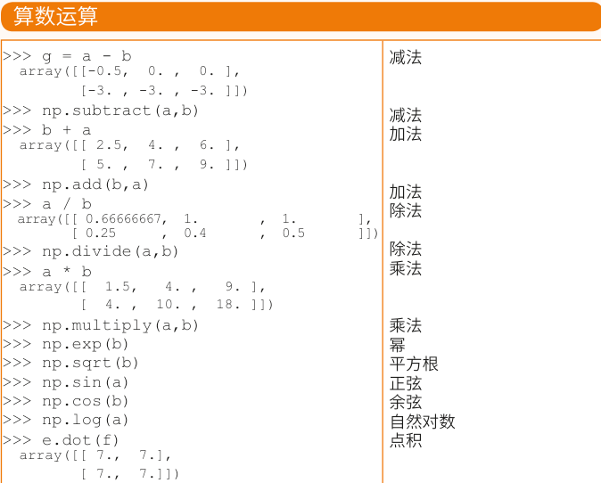
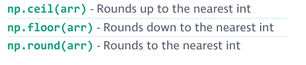
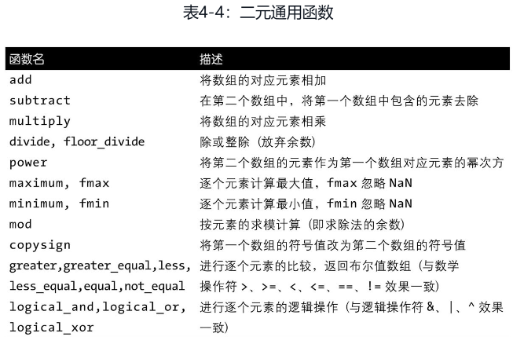
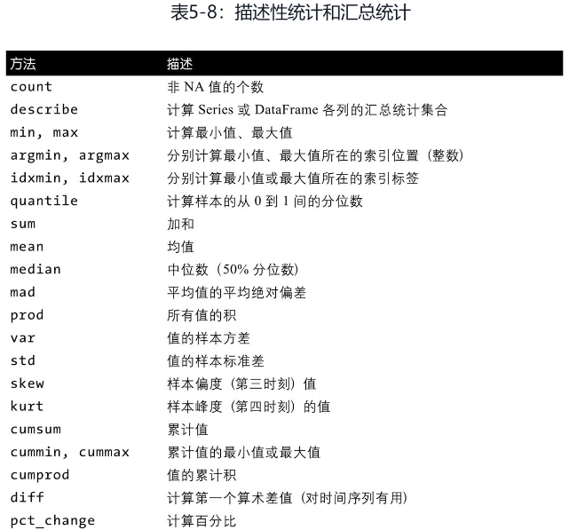
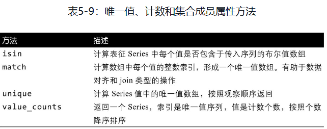

# 数据操作


```python
import pandas as pd
import numpy as np
import matplotlib.pyplot as plt
pd.set_option('mode.chained_assignment', None)
plt.rcParams['font.sans-serif']=['Simhei']; #SimHei黑体 
plt.rcParams['axes.unicode_minus']=False; #正常显示图中负号
data = pd.read_csv("data/数据/学生.csv")
sd = data.head()
sd.columns = ["name","sex","class","math","chinese","english"]
data.head().pipe(lambda df:print(df.to_markdown(tablefmt="github")))
```

|    | 姓名   | 性别   | 班级      |   数学 |   语文 |   英语 |
|----|--------|--------|-----------|--------|--------|--------|
|  0 | a1     | 男     | 高一(1)班 |     61 |     59 |     70 |
|  1 | a2     | 女     | 高一(2)班 |     62 |     77 |     74 |
|  2 | a3     | 女     | 高一(3)班 |     58 |     71 |     83 |
|  3 | a4     | 男     | 高一(4)班 |     65 |     57 |     71 |
|  4 | a5     | 男     | 高一(5)班 |     56 |     83 |     72 |

```python
sd.pipe(lambda df:print(df.to_markdown(tablefmt="github")))
```

|    | name   | sex   | class     |   math |   chinese |   english |
|----|--------|-------|-----------|--------|-----------|-----------|
|  0 | a1     | 男    | 高一(1)班 |     61 |        59 |        70 |
|  1 | a2     | 女    | 高一(2)班 |     62 |        77 |        74 |
|  2 | a3     | 女    | 高一(3)班 |     58 |        71 |        83 |
|  3 | a4     | 男    | 高一(4)班 |     65 |        57 |        71 |
|  4 | a5     | 男    | 高一(5)班 |     56 |        83 |        72 |

## 列


```python
(
pd.DataFrame(
  [
   ["返回列名","sd.columns<br/>{}".format(sd.columns)],
   ["非列表","type(sd.columns):{}".format(type(sd.columns))]
],columns=["特性","操作"]
)
.set_index("特性")
.pipe(lambda df:print(df.to_markdown(tablefmt="github")))
)
```

| 特性     | 操作                                                                                         |
|----------|----------------------------------------------------------------------------------------------|
| 返回列名 | sd.columns<br/>Index(['name', 'sex', 'class', 'math', 'chinese', 'english'], dtype='object') |
| 非列表   | type(sd.columns):<class 'pandas.core.indexes.base.Index'>                                    |

### 选取列 {.tabset}

#### 选取一列


```python
(
pd.DataFrame(
  [
    ["sd.sex","返回序列,列名不能存在空格<br/>{}".format(sd.sex).replace("\n","<br/>")],
    ['sd["sex"]',"返回序列<br/>{}".format(sd["sex"]).replace("\n","<br/>")],
    ['sd[["sex"]]',"返回数据框，数据框的任何切片返回的都是数据框<br/>{}".format(sd[["sex"]]).replace("\n","<br/>")]
],columns=["方法","解释"]
)
.set_index("方法")
.pipe(lambda df:print(df.to_markdown(tablefmt="github")))
)
```

| 方法        | 解释                                                                                                               |
|-------------|--------------------------------------------------------------------------------------------------------------------|
| sd.sex      | 返回序列,列名不能存在空格<br/>0    男<br/>1    女<br/>2    女<br/>3    男<br/>4    男<br/>Name: sex, dtype: object |
| sd["sex"]   | 返回序列<br/>0    男<br/>1    女<br/>2    女<br/>3    男<br/>4    男<br/>Name: sex, dtype: object                  |
| sd[["sex"]] | 返回数据框，数据框的任何切片返回的都是数据框<br/>  sex<br/>0   男<br/>1   女<br/>2   女<br/>3   男<br/>4   男      |

#### 选取多列


```python
(
  pd.DataFrame(
    [
      ['sd[["name","sex"]]',"{}".format(sd[["name","sex"]]).replace("\n","</br>")],
],columns=["方法","解释"]
)
.set_index("方法")
.pipe(lambda df:print(df.to_markdown(tablefmt="github")))
)
```

| 方法               | 解释                                                                                     |
|--------------------|------------------------------------------------------------------------------------------|
| sd[["name","sex"]] | name sex</br>0   a1   男</br>1   a2   女</br>2   a3   女</br>3   a4   男</br>4   a5   男 |

#### 根据类型选取列


```python
(
sd.select_dtypes(include=[int])
.pipe(lambda df:print(df.to_markdown(tablefmt="github")))
)
```

|    |   math |   chinese |   english |
|----|--------|-----------|-----------|
|  0 |     61 |        59 |        70 |
|  1 |     62 |        77 |        74 |
|  2 |     58 |        71 |        83 |
|  3 |     65 |        57 |        71 |
|  4 |     56 |        83 |        72 |

### 增加列 {.tabset}

#### 增加一列

本质上是增加相同长度的序列,例外情况是当添加序列时存在`对齐`的情况

会存在SettingWithCopyWarning, 关闭命令:`pd.set_option('mode.chained_assignment', None)`


```python
# 增加相同长度的序列
# sd.newcol1 = np.random.randn(5)不允许属性方式
# 通过计算
sd["total"] = sd.math + sd.english + sd.chinese
sd["newcol2"] = np.random.randn(5)
# 通过序列的index对齐,最好不要这样做
age = pd.Series([12,13,14,15],index=[1,3,5,7])
sd["age"] = age
sd.pipe(lambda df:print(df.to_markdown(tablefmt="github")))
```

|    | name   | sex   | class     |   math |   chinese |   english |   total |   newcol2 |   age |
|----|--------|-------|-----------|--------|-----------|-----------|---------|-----------|-------|
|  0 | a1     | 男    | 高一(1)班 |     61 |        59 |        70 |     190 |  1.03998  |   nan |
|  1 | a2     | 女    | 高一(2)班 |     62 |        77 |        74 |     213 | -0.808134 |    12 |
|  2 | a3     | 女    | 高一(3)班 |     58 |        71 |        83 |     212 | -0.338002 |   nan |
|  3 | a4     | 男    | 高一(4)班 |     65 |        57 |        71 |     193 |  0.379385 |    13 |
|  4 | a5     | 男    | 高一(5)班 |     56 |        83 |        72 |     211 | -0.702639 |   nan |

#### 增加多列


```python
# 直接赋值
sd[["newcol3","newcol4"]] = np.ones((5,2))
sd.iloc[:,-5:].pipe(lambda df:print(df.to_markdown(tablefmt="github")))
```

|    |   total |   newcol2 |   age |   newcol3 |   newcol4 |
|----|---------|-----------|-------|-----------|-----------|
|  0 |     190 |  1.03998  |   nan |         1 |         1 |
|  1 |     213 | -0.808134 |    12 |         1 |         1 |
|  2 |     212 | -0.338002 |   nan |         1 |         1 |
|  3 |     193 |  0.379385 |    13 |         1 |         1 |
|  4 |     211 | -0.702639 |   nan |         1 |         1 |

#### assign

assign函数的优点在于当我们并没有DataFrame的引用时，我们只需传递一个可调用对象定义一个操作链即可

返回副本

参数是**kwargs，既可以是等式也可以是lambda 函数（x是assigned to的数据框），函数名和表达式名是列名，（python>=3.6）,后面的参数可以引用前面的参数创造出来的列

    dfa = pd.DataFrame({"A": [1, 2, 3], "B": [4, 5, 6]})
    dfa.assign(C=lambda x: x["A"] + x["B"], D=lambda x: x["A"] + x["C"])


```python
sd.assign(newcol5 = sd.newcol3+sd.newcol4).iloc[:,-5:].pipe(lambda df:print(df.to_markdown(tablefmt="github")))
```

|    |   newcol2 |   age |   newcol3 |   newcol4 |   newcol5 |
|----|-----------|-------|-----------|-----------|-----------|
|  0 |  1.03998  |   nan |         1 |         1 |         2 |
|  1 | -0.808134 |    12 |         1 |         1 |         2 |
|  2 | -0.338002 |   nan |         1 |         1 |         2 |
|  3 |  0.379385 |    13 |         1 |         1 |         2 |
|  4 | -0.702639 |   nan |         1 |         1 |         2 |

```python
sd.assign(newcol6 = lambda df:df.newcol2*df.newcol4).iloc[:,-5:].pipe(lambda df:print(df.to_markdown(tablefmt="github")))#df代表操作的df
```

|    |   newcol2 |   age |   newcol3 |   newcol4 |   newcol6 |
|----|-----------|-------|-----------|-----------|-----------|
|  0 |  1.03998  |   nan |         1 |         1 |  1.03998  |
|  1 | -0.808134 |    12 |         1 |         1 | -0.808134 |
|  2 | -0.338002 |   nan |         1 |         1 | -0.338002 |
|  3 |  0.379385 |    13 |         1 |         1 |  0.379385 |
|  4 | -0.702639 |   nan |         1 |         1 | -0.702639 |

#### insert

可以选择位置添加列，操作原数据


```python
sd.insert(1,"newcol1",sd.sex)#location,name,data
sd.pipe(lambda df:print(df.to_markdown(tablefmt="github")))
```

|    | name   | newcol1   | sex   | class     |   math |   chinese |   english |   total |   newcol2 |   age |   newcol3 |   newcol4 |
|----|--------|-----------|-------|-----------|--------|-----------|-----------|---------|-----------|-------|-----------|-----------|
|  0 | a1     | 男        | 男    | 高一(1)班 |     61 |        59 |        70 |     190 |  1.03998  |   nan |         1 |         1 |
|  1 | a2     | 女        | 女    | 高一(2)班 |     62 |        77 |        74 |     213 | -0.808134 |    12 |         1 |         1 |
|  2 | a3     | 女        | 女    | 高一(3)班 |     58 |        71 |        83 |     212 | -0.338002 |   nan |         1 |         1 |
|  3 | a4     | 男        | 男    | 高一(4)班 |     65 |        57 |        71 |     193 |  0.379385 |    13 |         1 |         1 |
|  4 | a5     | 男        | 男    | 高一(5)班 |     56 |        83 |        72 |     211 | -0.702639 |   nan |         1 |         1 |

#### merge

pandas provides a single function, merge(), as the entry point for all standard database join operations between DataFrame or named Series objects:

    pd.merge(
    left,#DataFrame or named Series
    right,#DataFrame or named Series
    how="inner",# 'left','right','outer','inner','cross'
    on=None,#当left与right的关系列同名时，使用on,如果没有被传递且left_index和right_index都是False,he intersection of the columns in the DataFrames and/or Series will be inferred to be the join keys.
    left_on=None,#left中被用作key的列名
    right_on=None,#right中被用作key的列名
    left_index=False,#if True,index被用作key
    right_index=False,# if True,index被用作key
    sort=True,#sort by tht join key
    suffixes=("_x", "_y"),#当合并过后的对象仍然存在着来自两个不同对象的相同列名，可以加后缀
    copy=True,
    indicator=False,
    validate=None,#检查是一对多等等
    )
    
* how

Merge method|	SQL Join Name	|Description
-|-|-
left|	LEFT OUTER JOIN|	Use keys from left frame only
right|	RIGHT OUTER JOIN|	Use keys from right frame only
outer|	FULL OUTER JOIN|	Use union of keys from both frames
inner|	INNER JOIN|	Use intersection of keys from both frames
cross|	CROSS JOIN|	Create the cartesian product of rows of both frames
    
* validate:当不满足validate设置的参数时，会发生报错
  * “one_to_one” or “1:1”: checks if merge keys are unique in both left and right datasets.
  * “one_to_many” or “1:m”: checks if merge keys are unique in left dataset.
  * “many_to_one” or “m:1”: checks if merge keys are unique in right dataset.
  * “many_to_many” or “m:m”: allowed, but does not result in checks.

* indicator
  * 当设置为True时，可以添加一列表明该行的key存在于left还是right还是both都有
  * 当设置为字符串时，该列的名则为该字符串


```python
df1 = pd.DataFrame({"col1": [0, 1], "col_left": ["a", "b"]})
df2 = pd.DataFrame({"col1": [1, 2, 2], "col_right": [2, 2, 2]})
pd.merge(df1, df2, on="col1", how="outer", indicator=True)
```

```scroll-200
   col1 col_left  col_right      _merge
0     0        a        NaN   left_only
1     1        b        2.0        both
2     2      NaN        2.0  right_only
3     2      NaN        2.0  right_only
```

#### join

    DataFrame.join():
    left.join(right)#按照index，how='left'的方式来join，join后索引依然是索引
    左右一个MultiIndex,一个singly-indexed，将会匹配两个index中的同名的level，所以传入的index应该有name,最后所有level都会被保存
    两边都是MultiIndex,则右边的所有level的index都会被匹配，且必须是左边的index的子集
    当两边是MultiIndex，但是只需要匹配一个时，可以result = pd.merge(left.reset_index(), right.reset_index(), on=["key"], how="inner").set_index(["key", "X", "Y"])
    left.join(right,on=key_or_Keys)，左边的列和右边的index，保留左边的index         pd.merge(left,right,left_on=key_or_keys, right_index=True, how="left", sort=False)
    left.join(right,on=keys) 则right必须是Multiindex
    left.join(right,lsuffix="_x",rsuffix="_r")#可以给两个同名列加后缀
    left.join([right1,right2]):可以根据index合并多个DataFrame

### 替换列

利用增加同名列替换列


```python
sd["sex"] = sd.sex.map({"男":"men","女":"women"})
sd.iloc[:,:5].pipe(lambda df:print(df.to_markdown(tablefmt="github")))
```

|    | name   | newcol1   | sex   | class     |   math |
|----|--------|-----------|-------|-----------|--------|
|  0 | a1     | 男        | men   | 高一(1)班 |     61 |
|  1 | a2     | 女        | women | 高一(2)班 |     62 |
|  2 | a3     | 女        | women | 高一(3)班 |     58 |
|  3 | a4     | 男        | men   | 高一(4)班 |     65 |
|  4 | a5     | 男        | men   | 高一(5)班 |     56 |
### 删除列 {.tabset}

#### del


```python
del sd["newcol4"]#直接删除
# del sd.newcol3 不支持属性
```

#### .drop(axis)

使用drop方法一定要指定axis，返回副本


```python
sd.drop(["newcol2","newcol3"],axis=1).pipe(lambda df:print(df.to_markdown(tablefmt="github")))#返回副本
```

|    | name   | newcol1   | sex   | class     |   math |   chinese |   english |   total |   age |
|----|--------|-----------|-------|-----------|--------|-----------|-----------|---------|-------|
|  0 | a1     | 男        | men   | 高一(1)班 |     61 |        59 |        70 |     190 |   nan |
|  1 | a2     | 女        | women | 高一(2)班 |     62 |        77 |        74 |     213 |    12 |
|  2 | a3     | 女        | women | 高一(3)班 |     58 |        71 |        83 |     212 |   nan |
|  3 | a4     | 男        | men   | 高一(4)班 |     65 |        57 |        71 |     193 |    13 |
|  4 | a5     | 男        | men   | 高一(5)班 |     56 |        83 |        72 |     211 |   nan |

#### .pop()

删除列，并且返回列，


```python
sd.pop("newcol3")
```

0    1.0
1    1.0
2    1.0
3    1.0
4    1.0
Name: newcol3, dtype: float64

```python
sd.pipe(lambda df:print(df.to_markdown(tablefmt="github")))
```

|    | name   | newcol1   | sex   | class     |   math |   chinese |   english |   total |   newcol2 |   age |
|----|--------|-----------|-------|-----------|--------|-----------|-----------|---------|-----------|-------|
|  0 | a1     | 男        | men   | 高一(1)班 |     61 |        59 |        70 |     190 |  1.03998  |   nan |
|  1 | a2     | 女        | women | 高一(2)班 |     62 |        77 |        74 |     213 | -0.808134 |    12 |
|  2 | a3     | 女        | women | 高一(3)班 |     58 |        71 |        83 |     212 | -0.338002 |   nan |
|  3 | a4     | 男        | men   | 高一(4)班 |     65 |        57 |        71 |     193 |  0.379385 |    13 |
|  4 | a5     | 男        | men   | 高一(5)班 |     56 |        83 |        72 |     211 | -0.702639 |   nan |


```python
del sd["newcol2"]
del sd["newcol1"]
```

## 行

### 选取行 {.tabset}

**选取的行的索引就是原数据的索引，不会重新自然排列.**

#### 直接选取

可以直接利用切片选择行


```python
sd[:1]#选取第一行
```

```scroll-200
  name  sex   class  math  chinese  english  total  age
0   a1  men  高一(1)班    61       59       70    190  NaN
```

```python
sd.loc[0]#根据行标签
```

```scroll-200
name           a1
sex           men
class      高一(1)班
math           61
chinese        59
english        70
total         190
age           NaN
Name: 0, dtype: object
```

```python
sd.iloc[0]#根据行位置
```

```scroll-200
name           a1
sex           men
class      高一(1)班
math           61
chinese        59
english        70
total         190
age           NaN
Name: 0, dtype: object
```

```python
sd.iloc[0:3]
```

```scroll-200
  name    sex   class  math  chinese  english  total   age
0   a1    men  高一(1)班    61       59       70    190   NaN
1   a2  women  高一(2)班    62       77       74    213  12.0
2   a3  women  高一(3)班    58       71       83    212   NaN
```

#### .take()

    s.take([[0,1,3]])
    df.take([1,4,3])
    frm.take([0,2],axis=1)
    不支持Boolean indices


```python
sd.take([0,1]).pipe(lambda df:print(df.to_markdown(tablefmt="github")))
```

|    | name   | sex   | class     |   math |   chinese |   english |   total |   age |
|----|--------|-------|-----------|--------|-----------|-----------|---------|-------|
|  0 | a1     | men   | 高一(1)班 |     61 |        59 |        70 |     190 |   nan |
|  1 | a2     | women | 高一(2)班 |     62 |        77 |        74 |     213 |    12 |

#### 逻辑选取

注意逻辑选取后的索引不会编程自然索引，依然保持原索引


```python
sd[sd.math > 80]
```

```scroll-200
Empty DataFrame
Columns: [name, sex, class, math, chinese, english, total, age]
Index: []
```

```python
sd[[True,False,True,False,True]]
```

```scroll-200
  name    sex   class  math  chinese  english  total  age
0   a1    men  高一(1)班    61       59       70    190  NaN
2   a3  women  高一(3)班    58       71       83    212  NaN
4   a5    men  高一(5)班    56       83       72    211  NaN
```
#### .query()

query也是逻辑选取，但是可以用简便的语言操作比较复杂的逻辑，以字符串的形式设置条件

    df.query('a<b and b<c')
    df.query('index_name<column_name')#当index_name与column name重名时，优先考虑index_name
    df.query('index < column_name')
    df.query('ilevel_0 == ')#means “index level 0” for the 0th level of the index
    df.query('a in b') == df[df['a'].isin(df['b')]
    df.query('a == ['a','b','c']') == df[df['a'].isin(['a','b','c])]# !=
    df.query('~bools')

使用query()的情况:当有很多个表格有着相同的列名，需要进行相同的操作，则可以map(lambda frame: frame.query(expr), [df, df2])

### 增加行 {.tabset}

append方法不能用了，主要就是为了增加数据集。

#### .concat()

根据列名或行名触发对齐机制,返回副本


```python
pd.concat(
  [sd,pd.DataFrame([["a6","add"]],columns=["name","notexist"])],
  axis =0
).pipe(lambda df:print(df.to_markdown(tablefmt="github")))
```

|    | name   | sex   | class     |   math |   chinese |   english |   total |   age | notexist   |
|----|--------|-------|-----------|--------|-----------|-----------|---------|-------|------------|
|  0 | a1     | men   | 高一(1)班 |     61 |        59 |        70 |     190 |   nan | nan        |
|  1 | a2     | women | 高一(2)班 |     62 |        77 |        74 |     213 |    12 | nan        |
|  2 | a3     | women | 高一(3)班 |     58 |        71 |        83 |     212 |   nan | nan        |
|  3 | a4     | men   | 高一(4)班 |     65 |        57 |        71 |     193 |    13 | nan        |
|  4 | a5     | men   | 高一(5)班 |     56 |        83 |        72 |     211 |   nan | nan        |
|  0 | a6     | nan   | nan       |    nan |       nan |       nan |     nan |   nan | add        |
* .concat():沿着某条轴，合并DataFrame或Series，默认沿着行合并，index合并，轴标签取union
  * axis:{0,1,...}
  * join:{'inner','outer'}
  * default:outer for union；inner:intersection
  * ignore_index:default False ,设置为真时，原有concatenation axis上的value不被使用，重设为0,...,n-1
  * keys:Construct hierarchical index using the passed keys as the outermost level.可以标识数据是从那个原数据合并过来的
  * levels:list of sequences, default None. Specific levels (unique values) to use for constructing a MultiIndex. Otherwise they will be inferred from the keys.
  * names:names for the levels in the resulting hirechical index

### 替换行


```python
sd[4:5] = sd[3:4]
sd.pipe(lambda df:print(df.to_markdown(tablefmt="github")))
```

|    | name   | sex   | class     |   math |   chinese |   english |   total |   age |
|----|--------|-------|-----------|--------|-----------|-----------|---------|-------|
|  0 | a1     | men   | 高一(1)班 |     61 |        59 |        70 |     190 |   nan |
|  1 | a2     | women | 高一(2)班 |     62 |        77 |        74 |     213 |    12 |
|  2 | a3     | women | 高一(3)班 |     58 |        71 |        83 |     212 |   nan |
|  3 | a4     | men   | 高一(4)班 |     65 |        57 |        71 |     193 |    13 |
|  4 | a4     | men   | 高一(4)班 |     65 |        57 |        71 |     193 |    13 |

### 删除行


```python
sd.drop(4,axis=0)
```

```scroll-200
  name    sex   class  math  chinese  english  total   age
0   a1    men  高一(1)班    61       59       70    190   NaN
1   a2  women  高一(2)班    62       77       74    213  12.0
2   a3  women  高一(3)班    58       71       83    212   NaN
3   a4    men  高一(4)班    65       57       71    193  13.0
```

## 任意值/scalar

也就是行索引和列索引的组合

Object Type|Indexers
-|-
Series|s.loc[indexer]
DataFrame|df.loc[row_indexer,column_indexer]

Object Type|Selection|Return Value Type
-|-|-
Series|series[label]|scalar value
DataFrame|frame[colname]|Series corresponding to colname

### .iloc/loc

* .loc[]
    * .loc['a'] 
    * .loc[['a','b','c']]:至少有一个不存在时，报错，即必须全部是标签
    * .loc['a':'f']
        * 当'a'和'f'标签都存在时，返回二者之间的elements
        * 当'a'和'f'中有一个存在，且按照规则排序好，则返回排序在二者之间的
        * 当至少有一个不存在，且index没有排序好，则会报错
        * 当有duplicate labels,且“a”,'f'中有duplicate label，则报错
    * .loc[a boolean array]：df.loc[:,df.loc['a']>0],NA算作False
    * .loc[func]:`df.loc[:,lambda df:['A','B']]`,`df.loc[lambda df:df["a"]>0,:]`
        * lambda中的df代表新创建出来的df，这样我们就可以使用链式的方法
        
                bb = pd.read_csv('data/baseball.csv', index_col='id')
                (bb.groupby(['year', 'team']).sum()
                   .loc[lambda df: df['r'] > 100])#df指代新创建出来的df
                   
* .iloc[]:不可以超出索引值
    * .iloc[1]
    * .iloc[[1,3,5]
    * .iloc[1:3]
    * .iloc[a boolean array]
    * .iloc[func]

* Note:
    * pandas aligns all AXES when setting Series and DataFrame from .loc, and .iloc.This will not modify df because the column alignment is before value assignment.

### .iat/at

快速取标量值

    s = pd.Series([0, 1, 2, 3, 4, 5])
    s.iat[5]
    df.at[2,'b']
    df.iat[2,1]

### where/mask

.where()方法与boolean array方法不同点在于where返回的对象形状与 原对象相同，条件不满足的地方用NaN填补
.mask()方法是.where()的逆方法，满足条件的被mask

* Series:s,where(s>0)
* DataFrame:df.where(df<0,-df)-df当条件不满足时用-df中相应位置的值填补，== np.where(df>0,df,-df)
    * inplace=True:直接修改原数据，默认不修改
    * axis,level:df2.where(df2>0,df2['A'],axis='index') == df2.apply(lambda x,y:x.where(x>0,y),y=df2['A'])
    * accept a callable as `condition` and `other` arguments:df3.where(lambda x: x > 4, lambda x: x + 10) x代表df3

## 索引

pandas对象的轴标签有着很多作用

* identifies data(比如，metadata元数据)
* 自动和明确的数据对齐
* 可以直观的获取和设置数据集的子集

### 索引name {.tabset}

#### 通过index/columns属性


```python
sd.index
```

```scroll-200
RangeIndex(start=0, stop=5, step=1)
```

```python
sd.index.name = "ind"
sd.index
```

```scroll-200
RangeIndex(start=0, stop=5, step=1, name='ind')
```
#### .rename_axis()

返回副本


```python
sd.rename_axis(index={"ind":"newind"})
```

```scroll-200
       name    sex   class  math  chinese  english  total   age
newind                                                         
0        a1    men  高一(1)班    61       59       70    190   NaN
1        a2  women  高一(2)班    62       77       74    213  12.0
2        a3  women  高一(3)班    58       71       83    212   NaN
3        a4    men  高一(4)班    65       57       71    193  13.0
4        a4    men  高一(4)班    65       57       71    193  13.0
```

### 重排序

.reindex(),可同时对index和columns进行重排序


```python
sd.reindex([0,4,2,3,1]).pipe(lambda df:print(df.to_markdown(tablefmt="github")))
```

|   ind | name   | sex   | class     |   math |   chinese |   english |   total |   age |
|-------|--------|-------|-----------|--------|-----------|-----------|---------|-------|
|     0 | a1     | men   | 高一(1)班 |     61 |        59 |        70 |     190 |   nan |
|     4 | a4     | men   | 高一(4)班 |     65 |        57 |        71 |     193 |    13 |
|     2 | a3     | women | 高一(3)班 |     58 |        71 |        83 |     212 |   nan |
|     3 | a4     | men   | 高一(4)班 |     65 |        57 |        71 |     193 |    13 |
|     1 | a2     | women | 高一(2)班 |     62 |        77 |        74 |     213 |    12 |

* .reindex()
    * 重新排序
    * 当新标签不是已有标签时，插入空值
    * Series.reindex()
    * df.reindex(index=,columns=)

**shared index:df1.reindex(df2.index,axis="index")#两个DataFrame的index是同一个对象**

* .reindex_like()
    * df.reindex_like(df2)#把index和column设置的和df2一样

### 重命名 {.tabset}

#### .index/.columns

必须全体重新命名，直接对原函数操作，传递同等长度的序列


```python
source_col = sd.columns
sd.index = range(5)
sd.columns = range(sd.shape[1])
sd.pipe(lambda df:print(df.to_markdown(tablefmt="github")))
```

|    | 0   | 1     | 2         |   3 |   4 |   5 |   6 |   7 |
|----|-----|-------|-----------|-----|-----|-----|-----|-----|
|  0 | a1  | men   | 高一(1)班 |  61 |  59 |  70 | 190 | nan |
|  1 | a2  | women | 高一(2)班 |  62 |  77 |  74 | 213 |  12 |
|  2 | a3  | women | 高一(3)班 |  58 |  71 |  83 | 212 | nan |
|  3 | a4  | men   | 高一(4)班 |  65 |  57 |  71 | 193 |  13 |
|  4 | a4  | men   | 高一(4)班 |  65 |  57 |  71 | 193 |  13 |

#### .rename()

返回副本，可以设置inplace=True修改原数据，可以对单个索引名称更改，要指定对应关系

* .rename:对原有的名称改名，被map的原有名称改名，非原有名称的map不会报错，没有被map的原有名称不变
    * 可以把column map（dict or Series）
    * 或者传递任意函数，但是要返回一系列唯一值
    * 数据框要指定index,columns


```python
sd.rename(index=lambda x:x+1,
columns={0:"zero",6:"six"},inplace=True)
sd.pipe(lambda df:print(df.to_markdown(tablefmt="github")))
```

|    | zero   | 1     | 2         |   3 |   4 |   5 |   six |   7 |
|----|--------|-------|-----------|-----|-----|-----|-------|-----|
|  1 | a1     | men   | 高一(1)班 |  61 |  59 |  70 |   190 | nan |
|  2 | a2     | women | 高一(2)班 |  62 |  77 |  74 |   213 |  12 |
|  3 | a3     | women | 高一(3)班 |  58 |  71 |  83 |   212 | nan |
|  4 | a4     | men   | 高一(4)班 |  65 |  57 |  71 |   193 |  13 |
|  5 | a4     | men   | 高一(4)班 |  65 |  57 |  71 |   193 |  13 |

#### .map()

`sd.index = sd.index.map()`


```python
sd.index = range(5)
sd.columns = source_col
```

### 设置列为索引

.set_index(),默认返回副本,默认替代原索引，默认删除原列


```python
sd.set_index("sex")
```

```scroll-200
      name   class  math  chinese  english  total   age
sex                                                    
men     a1  高一(1)班    61       59       70    190   NaN
women   a2  高一(2)班    62       77       74    213  12.0
women   a3  高一(3)班    58       71       83    212   NaN
men     a4  高一(4)班    65       57       71    193  13.0
men     a4  高一(4)班    65       57       71    193  13.0
```
### 重置索引

默认将原索引变为列，设置drop=True不变成列


```python
sd.set_index("sex").reset_index(drop=True)
```

```scroll-200
  name   class  math  chinese  english  total   age
0   a1  高一(1)班    61       59       70    190   NaN
1   a2  高一(2)班    62       77       74    213  12.0
2   a3  高一(3)班    58       71       83    212   NaN
3   a4  高一(4)班    65       57       71    193  13.0
4   a4  高一(4)班    65       57       71    193  13.0
```

### 多层索引 {.tabset}


```python
import itertools
hindex = pd.MultiIndex.from_tuples(itertools.product(["one","two"],[1,2]))
hcolumns = pd.MultiIndex.from_tuples(itertools.product(["A","B"],["a","b"]))
multi_index = pd.DataFrame(np.random.randn(16).reshape(4,4),
index = hindex,
columns = hcolumns
) 
multi_index
```

```scroll-200
              A                   B          
              a         b         a         b
one 1 -0.726838  1.128970 -0.476083  1.273944
    2  0.146525 -0.665135  1.703753 -0.090585
two 1  0.386717  1.870424  0.254604 -0.859144
    2 -0.594142  0.353613 -0.953914  0.722078
```

rename,reset_index,reindex都可以根据level参数指定对那层的索引操作。

#### 轴name


```python
multi_index.index.names = ["font","number"]
multi_index.columns.names = ["upper","lower"]
multi_index
```

```scroll-200
upper               A                   B          
lower               a         b         a         b
font number                                        
one  1      -0.726838  1.128970 -0.476083  1.273944
     2       0.146525 -0.665135  1.703753 -0.090585
two  1       0.386717  1.870424  0.254604 -0.859144
     2      -0.594142  0.353613 -0.953914  0.722078
```

```python
multi_index.rename_axis(columns = {"upper":"UPPER"})
```

```scroll-200
UPPER               A                   B          
lower               a         b         a         b
font number                                        
one  1      -0.726838  1.128970 -0.476083  1.273944
     2       0.146525 -0.665135  1.703753 -0.090585
two  1       0.386717  1.870424  0.254604 -0.859144
     2      -0.594142  0.353613 -0.953914  0.722078
```

#### 获取轴

MultiIndex.get_level_values


```python
multi_index.index
```

```scroll-200
MultiIndex([('one', 1),
            ('one', 2),
            ('two', 1),
            ('two', 2)],
           names=['font', 'number'])
```

```python
multi_index.columns
```

```scroll-200
MultiIndex([('A', 'a'),
            ('A', 'b'),
            ('B', 'a'),
            ('B', 'b')],
           names=['upper', 'lower'])
```

```python
multi_index.index.get_level_values(0)
```

```scroll-200
Index(['one', 'one', 'two', 'two'], dtype='object', name='font')
```

### 选取多层索引 {.tabset}

#### .xs

选取行或列

    .xs(
      key:label or tuple of label
      axis: 默认0，行
      level: first n levels n=1 or len(key)
    )


```python
multi_index.xs("one")#可以直接选取最外层的key
```

```scroll-200
upper          A                   B          
lower          a         b         a         b
number                                        
1      -0.726838  1.128970 -0.476083  1.273944
2       0.146525 -0.665135  1.703753 -0.090585
```

```python
multi_index.xs(("one",1))#用tuple，不要用list
```

```scroll-200
upper  lower
A      a       -0.726838
       b        1.128970
B      a       -0.476083
       b        1.273944
Name: (one, 1), dtype: float64
```

```python
multi_index.xs(1,level=1)#直接选取内层的需要指定level
```

```scroll-200
upper         A                   B          
lower         a         b         a         b
font                                         
one   -0.726838  1.128970 -0.476083  1.273944
two    0.386717  1.870424  0.254604 -0.859144
```
#### .loc[]

任意选取行列


```python
multi_index.loc["one"]
```

```scroll-200
upper          A                   B          
lower          a         b         a         b
number                                        
1      -0.726838  1.128970 -0.476083  1.273944
2       0.146525 -0.665135  1.703753 -0.090585
```

```python
multi_index.loc["one",1]
```

```scroll-200
upper  lower
A      a       -0.726838
       b        1.128970
B      a       -0.476083
       b        1.273944
Name: (one, 1), dtype: float64
```

```python
multi_index.loc[["one"]]
```

```scroll-200
upper               A                   B          
lower               a         b         a         b
font number                                        
one  1      -0.726838  1.128970 -0.476083  1.273944
     2       0.146525 -0.665135  1.703753 -0.090585
```

```python
multi_index.loc[("one",1),"A"]
```

```scroll-200
lower
a   -0.726838
b    1.128970
Name: (one, 1), dtype: float64
```

#### []

只能选取列


```python
multi_index["A"]
```

```scroll-200
lower               a         b
font number                    
one  1      -0.726838  1.128970
     2       0.146525 -0.665135
two  1       0.386717  1.870424
     2      -0.594142  0.353613
```

```python
multi_index["A","a"]
```

```scroll-200
font  number
one   1        -0.726838
      2         0.146525
two   1         0.386717
      2        -0.594142
Name: (A, a), dtype: float64
```

```python
multi_index[["A"]]
```

```scroll-200
upper               A          
lower               a         b
font number                    
one  1      -0.726838  1.128970
     2       0.146525 -0.665135
two  1       0.386717  1.870424
     2      -0.594142  0.353613
```

#### 同时选取行和列

除了.loc方法,可以进行组合


```python
multi_index.loc["one"]["A"]
```

```scroll-200
lower          a         b
number                    
1      -0.726838  1.128970
2       0.146525 -0.665135
```

### 调换多个index的顺序

返回副本，可以指定axis


```python
multi_index.swaplevel()#调换最内层的两个index
```

```scroll-200
upper               A                   B          
lower               a         b         a         b
number font                                        
1      one  -0.726838  1.128970 -0.476083  1.273944
2      one   0.146525 -0.665135  1.703753 -0.090585
1      two   0.386717  1.870424  0.254604 -0.859144
2      two  -0.594142  0.353613 -0.953914  0.722078
```

```python
multi_index.swaplevel(0)#直接调换到最内层
```

```scroll-200
upper               A                   B          
lower               a         b         a         b
number font                                        
1      one  -0.726838  1.128970 -0.476083  1.273944
2      one   0.146525 -0.665135  1.703753 -0.090585
1      two   0.386717  1.870424  0.254604 -0.859144
2      two  -0.594142  0.353613 -0.953914  0.722078
```

```python
multi_index.swaplevel("upper",axis=1)
```

```scroll-200
lower               a         b         a         b
upper               A         A         B         B
font number                                        
one  1      -0.726838  1.128970 -0.476083  1.273944
     2       0.146525 -0.665135  1.703753 -0.090585
two  1       0.386717  1.870424  0.254604 -0.859144
     2      -0.594142  0.353613 -0.953914  0.722078
```

```python
multi_index.swaplevel(0,1)#调换这两个level的index
```

```scroll-200
upper               A                   B          
lower               a         b         a         b
number font                                        
1      one  -0.726838  1.128970 -0.476083  1.273944
2      one   0.146525 -0.665135  1.703753 -0.090585
1      two   0.386717  1.870424  0.254604 -0.859144
2      two  -0.594142  0.353613 -0.953914  0.722078
```

### index和column的互换 {.tabset}

#### .stack()

堆叠，堆叠以常识理解肯定指的上下结构，但是这里指的是左右的堆叠,或者我们可以理解为该index自己变成了列形式，所以较stack


```python
multi_index.stack(0)
```

```scroll-200
<string>:1: FutureWarning: The previous implementation of stack is deprecated and will be removed in a future version of pandas. See the What's New notes for pandas 2.1.0 for details. Specify future_stack=True to adopt the new implementation and silence this warning.
lower                     a         b
font number upper                    
one  1      A     -0.726838  1.128970
            B     -0.476083  1.273944
     2      A      0.146525 -0.665135
            B      1.703753 -0.090585
two  1      A      0.386717  1.870424
            B      0.254604 -0.859144
     2      A     -0.594142  0.353613
            B     -0.953914  0.722078
```

```python
multi_index.stack("upper")
```

```scroll-200
<string>:1: FutureWarning: The previous implementation of stack is deprecated and will be removed in a future version of pandas. See the What's New notes for pandas 2.1.0 for details. Specify future_stack=True to adopt the new implementation and silence this warning.
lower                     a         b
font number upper                    
one  1      A     -0.726838  1.128970
            B     -0.476083  1.273944
     2      A      0.146525 -0.665135
            B      1.703753 -0.090585
two  1      A      0.386717  1.870424
            B      0.254604 -0.859144
     2      A     -0.594142  0.353613
            B     -0.953914  0.722078
```

```python
multi_index.stack(["upper","lower"])
```

```scroll-200
<string>:1: FutureWarning: The previous implementation of stack is deprecated and will be removed in a future version of pandas. See the What's New notes for pandas 2.1.0 for details. Specify future_stack=True to adopt the new implementation and silence this warning.
font  number  upper  lower
one   1       A      a       -0.726838
                     b        1.128970
              B      a       -0.476083
                     b        1.273944
      2       A      a        0.146525
                     b       -0.665135
              B      a        1.703753
                     b       -0.090585
two   1       A      a        0.386717
                     b        1.870424
              B      a        0.254604
                     b       -0.859144
      2       A      a       -0.594142
                     b        0.353613
              B      a       -0.953914
                     b        0.722078
dtype: float64
```

#### .unstack()

取消堆叠，即将行索引变成列索引


```python
multi_index.unstack(-1)
```

```scroll-200
upper          A                      ...         B                    
lower          a                   b  ...         a         b          
number         1         2         1  ...         2         1         2
font                                  ...                              
one    -0.726838  0.146525  1.128970  ...  1.703753  1.273944 -0.090585
two     0.386717 -0.594142  1.870424  ... -0.953914 -0.859144  0.722078

[2 rows x 8 columns]
```

## 排序

### .sort_index():根据标签排序

* axis:对于df来说,默认为0
* ascending:默认升序，值为True
* key:根据作用于每一个元素的函数返回值来排序，`lambda x:x`,x指代每一个元素
* level:对于MultiIndex objects，可以设置level属性,level="a":索引名

### .sort_values():根据值排序

* Series:
    * key:
* DataFrame:
    * by:scalar or [],确定用于排序的一个或多个列
    * key:
* by index and values:
    * 对于一个多层索引，我们按索引和值同时排序,比如先按索引排序，然后对每个索引的内部值再按值排序
* sorting by a MultiIndex column
    * .sort_values(by=("a","two")

### .nlargest(),.nsmallest()

    * df.nlargest(5,["a","c"])#先按照a排序，在按照c排序

## 数学运算

### 序列或数据框

直接使用numpy函数对整体进行操作






```python
np.floor(sd.math)
```

```scroll-200
0    61.0
1    62.0
2    58.0
3    65.0
4    65.0
Name: math, dtype: float64
```

```python
np.round(sd[["math"]])
```

```scroll-200
   math
0    61
1    62
2    58
3    65
4    65
```

### 同维度的序列 {.tabset}

依照对齐机制进行算数运算和比较

#### 数学运算

加减乘除,取负值


```python
sd.math + sd.english
```

```scroll-200
0    131
1    136
2    141
3    136
4    136
dtype: int64
```

```python
-sd.math
```

```scroll-200
0   -61
1   -62
2   -58
3   -65
4   -65
Name: math, dtype: int64
```

#### 逻辑运算


```python
sd.math > sd.english
```

```scroll-200
0    False
1    False
2    False
3    False
4    False
dtype: bool
```

```python
(sd.math > sd.english) & (sd.math < sd.chinese)
```

```scroll-200
0    False
1    False
2    False
3    False
4    False
dtype: bool
```

### 序列和标量 {.tabset}

#### 数学运算

加减乘除


```python
sd.math + 3
```

```scroll-200
0    64
1    65
2    61
3    68
4    68
Name: math, dtype: int64
```

#### 逻辑运算


```python
sd.math > 80
```

```scroll-200
0    False
1    False
2    False
3    False
4    False
Name: math, dtype: bool
```

```python
(sd.math > 80) & (sd.math < 90)
```

```scroll-200
0    False
1    False
2    False
3    False
4    False
Name: math, dtype: bool
```

### 同维度的数据框 {.tabset}

数学运算和逻辑运算都按照列名对齐

#### 数学运算

加减乘除,取负值


```python
sd[["math","english"]] + sd[["math","english"]]
```

```scroll-200
   math  english
0   122      140
1   124      148
2   116      166
3   130      142
4   130      142
```

#### 逻辑运算


```python
sd[["math","english"]] > 80
```

```scroll-200
    math  english
0  False    False
1  False    False
2  False     True
3  False    False
4  False    False
```

```python
(sd[["math","english"]] > 80) & (sd[["math","chinese"]] < 90)
```

```scroll-200
   chinese  english   math
0      NaN      NaN  False
1      NaN      NaN  False
2      NaN      NaN  False
3      NaN      NaN  False
4      NaN      NaN  False
```

#### 使用numpy




```python
np.power(sd[["english","math","chinese"]],np.random.randint(5,size=(sd.shape[0],3)))
```

```scroll-200
    english  math   chinese
0        70    61  12117361
1         1     1  35153041
2    571787     1    357911
3  25411681  4225    185193
4      5041     1         1
```

### 数据框和标量

和序列同样

### 数据框和序列

默认按照列名对齐，可以进行算数操作和逻辑操作


```python
sd[["math","english"]] - sd[["math","english"]].iloc[-1]
```

```scroll-200
   math  english
0    -4       -1
1    -3        3
2    -7       12
3     0        0
4     0        0
```

```python
sd[["math","english"]] > sd[["math","english"]].iloc[-1]
```

```scroll-200
    math  english
0  False    False
1  False     True
2  False     True
3  False    False
4  False    False
```

## 统计方法



对于数据框来说，它的sum，min等聚合函数可以选择axis，甚至可以选择index来聚合,但是不能再指定level了。


```python
multi_index.sum(axis=0)
```

```scroll-200
upper  lower
A      a       -0.787738
       b        2.687871
B      a        0.528360
       b        1.046293
dtype: float64
```



value_counts如果传递多列，则返回多列的组合值的value_counts(),多列以multi_index展示.

### 相关和协方差

函数|描述
-|-
df.cor()|计算两两列相关的矩阵
df.corwith(df.col)|传入某列或其他序列时，返回每一列与该列的相关性
df.cov()|计算协方差矩阵

## 函数

对行或者列或者整体或者每个元素进行函数应用。

### .apply()

对行或列操作，操作对象默认为序列,但是不能应用多个函数,不能指定对象，长度变不变都可以。

* .apply(func,axis):
    * arg
        * func:可以是函数，也可以是字符串形式的名称，如“mean”,也可以是一些Series方法，如`pd.Series.interpolate`，
        * axis:确定沿着那条轴应用函数
        * args:iterable,func中的参数，以形参形式给出
        * \*\*kwargs：func中的参数，以关键字形式给出
        * raw:默认False，会在应用函数之前把每row或column转换成Series，设置为True，则当成ndarray处理
    * return:
        * func返回Series，则最终输出是一个DataFrame
        * func返回其他任何类型，最终输出是一个Series

### .agg()

只对列起作用,可以指定对象，可以指定多个函数,只能执行聚合操作，操作对象为序列，长度会发生变化

* .agg(["sum"])#对每一列作用函数
* .agg(["sum","mean"])#对每一列作用多个函数
    * .agg(["sum",lambda x:x.mean()])#lambda函数的名lambda
    * .agg(["sum",func])#自定义函数的名为该函数名
    * .agg({"A":["sum","mean"],"B":["median"]})#为不同的列定义不同的函数,顺序不被确定，可以用OrderedDict类
    * 当混合类型中的某些列不能作用函数时，将不会作用

### .transform()

* 应用于所有元素，也可以传递字典对不同的列的每个元素应用不同的函数,操作对象为数据框。长度必须保持不变。
    * .transform() allows input functions as: a NumPy function, a string function name or a user defined function.
    * Passing multiple functions will yield a column MultiIndexed DataFrame. The first level will be the original frame column names; the second level will be the names of the transforming functions.
    * Passing multiple functions to a Series will yield a DataFrame. The resulting column names will be the transforming functions.
    
### .applymap()

应用于每个单元格,只能定义一个函数

### .pipe()

对整个数据框进行任意操作

DataFrames和Series是可以传递给函数的，但是如果函数是在一个链式中，考虑使用`pipe()`方法

* function(df,arg1) 则df.pipe(func,arg1) df默认以第一参数传递给func
* function(arg1,data) 则需要把func和代表data的关键字写在一起形成关键字对,如df.pipe((func,"data"),agr1)

## 透视表

透视表

### .pivot()

index.columns,value 都可以是列名或列名的列表，当value为列表时，会形成column的stack，相当于分别计算每个列的pivot，然后再左右concat。


```python
df = pd.DataFrame({'foo': ['one', 'one', 'one', 'two', 'two',
                      'two'],
                  'bar': ['A', 'B', 'C', 'A', 'B', 'C'],
                   'baz': [1, 2, 3, 4, 5, 6],
                 'zoo': ['x', 'y', 'z', 'q', 'w', 't']})
pivot_df = df.pivot(index='foo', columns='bar', values=['baz', 'zoo'])
pivot_df
```

```scroll-200
    baz       zoo      
bar   A  B  C   A  B  C
foo                    
one   1  2  3   x  y  z
two   4  5  6   q  w  t
```

### .pivot_table()

* .pivot_table()/DataFrame().pivot_table():唯一的特点是可以应用函数
    * data:
    * values:a column or a list of columns ，如果不给，则剩下的所有非index和column的列都被视作value
    * index:a column, Grouper, array which has the same length as data, or list of them. Keys to group by on the pivot table index. If an array is passed, it is being used as the same manner as column values.
    * columns:同index
    * aggfunc: function to use for aggregation, defaulting to numpy.mean.
    * margins:If you pass margins=True to pivot_table, special All columns and rows will be added with partial group aggregates across the categories on the rows and columns:
    * margins_name
    * fill_value: scalar

### pd.crosstab()

和pivot_table()没有太大区别,但是传递的是序列,并不是dataframe方法.默认返回频次.

### melt

pivot的逆操作,相当于把一列的各个种类再次归为一列，对于有多层column的，要把column的组合值作为一类，有几层就还原为几列。

但是对于unpivot，stack和unstack明显更方便，只能说这个函数的意义不是unpivot，而是把几个列组合成一个列，其他几个id列保持不变，剩下的舍弃。

参数|描述
-|-
id_vars|列表,作为id，保持不动,从unpivot的角度来说，应该先把index reset_idnex()作为id列
value_vars|列表,多层column则以元组包裹，如[(),()],将会根据层数生成相应的列数,另值也会单独的还原为value列
value_name|值列的列名，默认"value"


```python
pivot_df.stack(level=1).reset_index()
```

```scroll-200
<string>:1: FutureWarning: The previous implementation of stack is deprecated and will be removed in a future version of pandas. See the What's New notes for pandas 2.1.0 for details. Specify future_stack=True to adopt the new implementation and silence this warning.
   foo bar baz zoo
0  one   A   1   x
1  one   B   2   y
2  one   C   3   z
3  two   A   4   q
4  two   B   5   w
5  two   C   6   t
```

## 分组.groupby()

split-apply-combine

* grouped = df.groupby(,axis=,sort=True，dropna=True,as_index=True):
    * 用来分组的不一定要是某个列，可以是很多种
        * 可以是一个python函数作用于每个轴标签, 返回相同值的为一个group,each of the axis labels，但是原索引依然是保存的
        * 也可以是一个和df等长的list或array
        * 也可以是一个字典或Series，提供了轴标签到group name 的映射，只对提供了的轴标签进行映射
        * 一个index level的名字，通过传递level参数
        * 上面几种形式的任意组合的列表
    * 也可以是level和column的混合
        * .groupby(pd.Grouper(level=level_name/level_id),column_name)
        * .groupby([level_name,column_name])#会自动去找index和column中满足的name
    * 不仅可以对index聚合，也可以对column聚合，通过axis=1
    * 默认会按照聚合的key来排序，设置为False可以加快速度
    * 默认去除key中的缺失值，不作为一类，dropna=True
    * **默认用来聚合的类是作为index的，设置as_index为False可以变为列**


```python
gd = pd.DataFrame(
  {
    "number":["A","B"]*3,
    "font":["one","two","three"]*2,
    "score1":np.random.randn(6),
    "score2":np.random.randn(6)
}
)
gd
```

```scroll-200
  number   font    score1    score2
0      A    one -0.730390 -1.056884
1      B    two -0.207263 -0.576389
2      A  three  1.482962  0.092695
3      B    one -0.121146 -0.930031
4      A    two  0.594102 -0.510108
5      B  three -0.850682 -0.213639
```

```python
gd.groupby(["number"])
```

```scroll-200
<pandas.core.groupby.generic.DataFrameGroupBy object at 0x0000013578BADFD0>
```

```python
gdn = gd.groupby(["number"])
gdn.groups #{index,row_label}
```

```scroll-200
{'A': [0, 2, 4], 'B': [1, 3, 5]}
```

```python
gdn.get_group("A")
```

```scroll-200
<string>:1: FutureWarning: When grouping with a length-1 list-like, you will need to pass a length-1 tuple to get_group in a future version of pandas. Pass `(name,)` instead of `name` to silence this warning.
  number   font    score1    score2
0      A    one -0.730390 -1.056884
2      A  three  1.482962  0.092695
4      A    two  0.594102 -0.510108
```

```python
gdn.ngroup() #以数字代表种类，反映每行属于哪一类
```

```scroll-200
0    0
1    1
2    0
3    1
4    0
5    1
dtype: int64
```

```python
gdn.ngroups  #返回种类的个数
```

```scroll-200
2
```

### 选取 {.tabset}

从split的角度，我们无法选择行，可以选择列。

#### 选取列


```python
gdn["font"]
```

```scroll-200
<pandas.core.groupby.generic.SeriesGroupBy object at 0x0000013578B67E60>
```

```python
gdn[["font"]]
```

```scroll-200
<pandas.core.groupby.generic.DataFrameGroupBy object at 0x0000013578B654F0>
```

#### .filter()

    >>> df = pd.DataFrame(np.array(([1, 2, 3], [4, 5, 6])),
    ...                   index=['mouse', 'rabbit'],
    ...                   columns=['one', 'two', 'three'])
    >>> df
            one  two  three
    mouse     1    2      3
    rabbit    4    5      6
    
    >>> # select columns by name
    >>> df.filter(items=['one', 'three'])
             one  three
    mouse     1      3
    rabbit    4      6
    
    >>> # select columns by regular expression
    >>> df.filter(regex='e$', axis=1)
             one  three
    mouse     1      3
    rabbit    4      6
    
    >>> # select rows containing 'bbi'
    >>> df.filter(like='bbi', axis=0)
             one  two  three
    rabbit    4    5      6

#### .head()/.tail()

没啥意义，相当于没有groupby，返回原数据框样式.


```python
gdn.head()
```

```scroll-200
  number   font    score1    score2
0      A    one -0.730390 -1.056884
1      B    two -0.207263 -0.576389
2      A  three  1.482962  0.092695
3      B    one -0.121146 -0.930031
4      A    two  0.594102 -0.510108
5      B  three -0.850682 -0.213639
```

#### .take()

给与行号，返回每个组相应位置的行。行索引保留。不可超过


```python
gdn.take([0,1])
```

```scroll-200
           font    score1    score2
number                             
A      0    one -0.730390 -1.056884
       2  three  1.482962  0.092695
B      1    two -0.207263 -0.576389
       3    one -0.121146 -0.930031
```

### 应用聚合函数

如果是对数值列操作的聚合函数，要选出相应的聚合函数

* .all()
* .any()
* .count()
* .idxmax()
* .idxmin()
* .max()
* .min()
* .mean()
* .median()
* .nunique()返会非重复行个数，对于单列就是返回种类数
* .var()
* .std()
* .quantile()
* .sum()
* .prod()

### 应用统计函数

* .cov()
* .corr()
* .corrwith()#传递同等长度的序列
* .value_counts()#返回每个组的value_counts()
* .describe() # 就是原数据框的describe
* .sample()

### 应用窗口函数

* .bfill()
* .ffill()
* .shift(n) n阶滞后
* .rolling() 
* .cumsum()
* .cummax()
* .cummin()
* .cumprod()
* .cumcount()返回每一组的各个row的出现顺序，从零开始计数
* .diff()
* .first()
* .last()
* .nth()
* .rank()
* .expand()将会对每个组中的每个成员进行累计的函数操作，比如sum函数会变成累加
* .resample()重新定义频率

### 应用自定义函数

将每个组视为一个dataframe,然后对每个组应用函数。如果想对整个组进行聚合操作，可以利用dataframe的values属性获取array数组，通过numpy函数对数组进行整体聚合操作.比如`lambda x:np.sum(x.values)`

* .pipe()
* .apply()
* .agg()
* .transform()

### 迭代每个组

    for name,group in grouped:
        print(name)
        print(group)

## 方法链

以括号包裹，多行书写,避免中间变量的定义

    df = (pd.melt(df)
    .rename(columns={'variable':'var','value':'val'})
    .query('val >= 200')
    )

## 采样

### 随机重排序


```python
#生成新序列
np.random.permutation(range(5))
```

```scroll-200
array([2, 0, 4, 3, 1])
```

```python
import random
#打乱原序列，不生成新序列
random.shuffle(list(range(6)))
```

### 随机采样 {.tabset}

#### random.sample()

不能超过序列个数

`sample(population,k,*,counts)`


```python
random.sample(range(5),3)
```

```scroll-200
[4, 0, 1]
```

```python
random.sample(['a','b'],counts=[4,2],k=5)
```

```scroll-200
['a', 'a', 'b', 'a', 'a']
```

#### random.choice(s)()

    random.choices(population,weights=None,*,cum_weights=None,k=1)
    给定weights或cum_weights,不能同时给，最终都会转为cum_weight来进行计算，长度必须和population的长度相同，对应的各个值的概率。
    k决定了生成样本的个数
    大样本下各个值的概率应该与给定的weights相符
    

```python
random.choice(range(5))
```

```scroll-200
2
```

```python
random.choices(['a','b'],weights=[2,1],k=12)
```

```scroll-200
['a', 'a', 'b', 'b', 'b', 'b', 'a', 'a', 'b', 'a', 'b', 'a']
```

#### df.sample()


```python
ts = pd.DataFrame(np.random.randn(8),index=pd.date_range("2022","2030",freq="Y"))
```

```scroll-200
<string>:1: FutureWarning: 'Y' is deprecated and will be removed in a future version, please use 'YE' instead.
```

```python
ts.sample(3)
```

```scroll-200
                   0
2023-12-31 -0.020883
2027-12-31  1.024671
2028-12-31 -2.333882
```

```python
ts.sample(5,replace=True)
```

```scroll-200
                   0
2024-12-31  0.184889
2025-12-31 -0.646686
2025-12-31 -0.646686
2025-12-31 -0.646686
2026-12-31  1.141514
```
