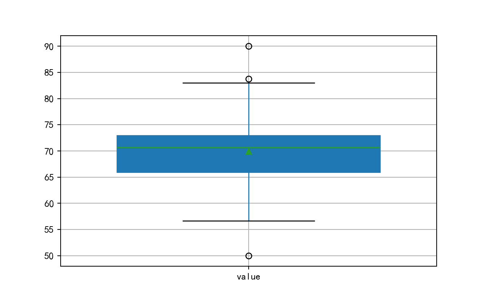
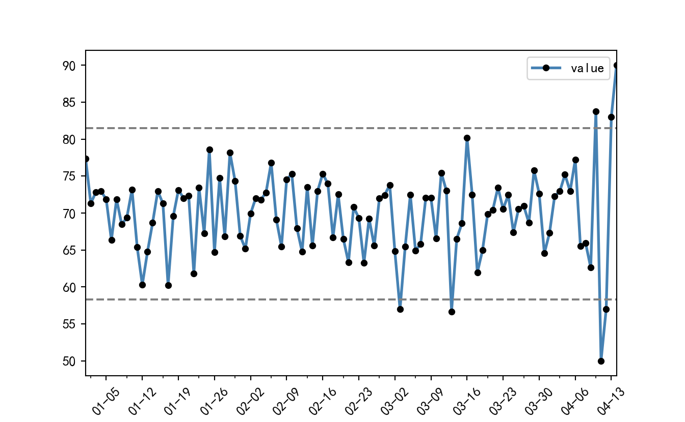

# 数据清洗

## 查看数据信息

导入数据后应该了解字段信息，字段的数据类型，哪些字段有缺失值


```python
import pandas as pd
import numpy as np
import matplotlib.pyplot as plt
plt.rcParams['font.sans-serif']=['Simhei']; #SimHei黑体 
plt.rcParams['axes.unicode_minus']=False; #正常显示图中负号
data = pd.read_csv("data/数据/学生.csv")
data.head(5).pipe(lambda df:print(df.to_markdown(tablefmt="github")))
```

|    | 姓名   | 性别   | 班级      |   数学 |   语文 |   英语 |
|----|--------|--------|-----------|--------|--------|--------|
|  0 | a1     | 男     | 高一(1)班 |     61 |     59 |     70 |
|  1 | a2     | 女     | 高一(2)班 |     62 |     77 |     74 |
|  2 | a3     | 女     | 高一(3)班 |     58 |     71 |     83 |
|  3 | a4     | 男     | 高一(4)班 |     65 |     57 |     71 |
|  4 | a5     | 男     | 高一(5)班 |     56 |     83 |     72 |

```python
pd.set_option('future.no_silent_downcasting', True)
```

### .info()

查看字段名，缺失值和字段类型


```python
data.info()
```

```scroll-200
<class 'pandas.core.frame.DataFrame'>
RangeIndex: 1800 entries, 0 to 1799
Data columns (total 6 columns):
 #   Column  Non-Null Count  Dtype 
---  ------  --------------  ----- 
 0   姓名      1800 non-null   object
 1   性别      1800 non-null   object
 2   班级      1800 non-null   object
 3   数学      1800 non-null   int64 
 4   语文      1800 non-null   int64 
 5   英语      1800 non-null   int64 
dtypes: int64(3), object(3)
memory usage: 84.5+ KB
```

### .dtypes

查看字段类型


```python
data.dtypes
```

```scroll-200
姓名    object
性别    object
班级    object
数学     int64
语文     int64
英语     int64
dtype: object
```

### .describe()

``.describe(include/exclude=[])`

默认只对数值类型进行各种字段的描述,可以设置include和exclude参数对类型进行选择


```python
data.describe().pipe(lambda df:print(df.to_markdown(tablefmt="github")))
```

|       |       数学 |       语文 |       英语 |
|-------|------------|------------|------------|
| count | 1800       | 1800       | 1800       |
| mean  |   64.3439  |   69.145   |   74.5239  |
| std   |    5.92552 |    6.96314 |    4.88335 |
| min   |   44       |   47       |   60       |
| 25%   |   60       |   65       |   71       |
| 50%   |   64       |   69       |   75       |
| 75%   |   68       |   74       |   78       |
| max   |   87       |   94       |   90       |

```python
data.describe(include=["object"]).pipe(lambda df:print(df.to_markdown(tablefmt="github")))
```

|        | 姓名   | 性别   | 班级      |
|--------|--------|--------|-----------|
| count  | 1800   | 1800   | 1800      |
| unique | 1800   | 2      | 60        |
| top    | a1     | 男     | 高一(1)班 |
| freq   | 1      | 918    | 30        |

## 缺失值


### 查看缺失值

`.isnull(axis)`,`.notnull(axis)`

数据缺失,python的None对象，numpy中的np.nan都被视为缺失,空字符串不被视为缺失。


```python
nadata = pd.DataFrame({'null':[None,np.nan,'','nan',0]*2,
                      'value':np.random.choice([None,np.nan]+list(range(10)),10,)})
nadata.head()
```

```scroll-200
   null value
0  None     7
1   NaN     7
2           4
3   nan     0
4     0  None
```

```python
nadata.isnull().head()
```

```scroll-200
    null  value
0   True  False
1   True  False
2  False  False
3  False  False
4  False   True
```

```python
nadata[nadata['null'].notnull()]# 根据某个字段的未缺失值选取行
```

```scroll-200
  null value
2          4
3  nan     0
4    0  None
7          0
8  nan     5
9    0     9
```

```python
nadata.isnull().sum()/len(nadata)#查看各个字段的缺失比例
```

```scroll-200
null     0.4
value    0.1
dtype: float64
```

```python
lack_rate = 0.3
#选取出所有缺失比例大于0.3的字段名
(nadata.isnull().sum()/len(nadata)).pipe(lambda df:df[df>lack_rate].index.values)
```

```scroll-200
array(['null'], dtype=object)
```

通常对于缺失值的处理，最常用的方法无外乎删除法、替换法和插补法。删除法是指将缺失值所在的观测行删除（前提是缺失行的比例非常低，如5%以内），或者删除缺失值所对应的变量（前提是该变量中包含的缺失值比例非常高，如70%左右）；替换法是指直接利用缺失变量的均值、中位数或众数替换该变量中的缺失值，其好处是缺失值的处理速度快，弊端是易产生有偏估计，导致缺失值替换的准确性下降；插补法则是利用有监督的机器学习方法（如回归模型、树模型、网络模型等）对缺失值作预测，其优势在于预测的准确性高，缺点是需要大量的计算，导致缺失值的处理速度大打折扣。

### 删除缺失值

`.dropna(axis,how,subset,thresh)` 


```python
nadata.dropna(how="all")
```

```scroll-200
   null value
0  None     7
1   NaN     7
2           4
3   nan     0
4     0  None
5  None     5
6   NaN     4
7           0
8   nan     5
9     0     9
```

```python
nadata.dropna(subset=["null"])
```

```scroll-200
  null value
2          4
3  nan     0
4    0  None
7          0
8  nan     5
9    0     9
```

```python
nadata.dropna(thresh=1)
```

```scroll-200
   null value
0  None     7
1   NaN     7
2           4
3   nan     0
4     0  None
5  None     5
6   NaN     4
7           0
8   nan     5
9     0     9
```

### 填补缺失值

`.fillna(value,method,**kwargs)`

通过给字段传递标量，可以进行均值，最大值，最小值，中值等填补，通过method参数可以进行前向和后向填补。


```python
nadata.fillna(0)
```

```scroll-200
  null value
0    0     7
1    0     7
2          4
3  nan     0
4    0     0
5    0     5
6    0     4
7          0
8  nan     5
9    0     9
```

```python
nadata.fillna({"null":0,"value":int(np.mean(nadata.value))})#不加int会变成浮点型
```

```scroll-200
  null value
0    0     7
1    0     7
2          4
3  nan     0
4    0     4
5    0     5
6    0     4
7          0
8  nan     5
9    0     9
```

```python
nadata.fillna(method="bfill")
```

```scroll-200
<string>:1: FutureWarning: DataFrame.fillna with 'method' is deprecated and will raise in a future version. Use obj.ffill() or obj.bfill() instead.
  null value
0          7
1          7
2          4
3  nan     0
4    0     5
5          5
6          4
7          0
8  nan     5
9    0     9
```

### 插补法

利用机器学习的方法构建模型，通过模型根据其他字段的值来对缺失值进行预测。

## 类型转换

读入的数据类型包含object(任何对象都可以用object来存储)，number(数值类型),string(字符串类型),bool(逻辑类型).

可以用`.select_dtypes(include/exclude=[])`选取对应类型的列


```python
data.select_dtypes(include=["object"])
```

```scroll-200
         姓名 性别       班级
0        a1  男   高一(1)班
1        a2  女   高一(2)班
2        a3  女   高一(3)班
3        a4  男   高一(4)班
4        a5  男   高一(5)班
...     ... ..      ...
1795  a1796  男  高三(16)班
1796  a1797  男  高三(17)班
1797  a1798  女  高三(18)班
1798  a1799  女  高三(19)班
1799  a1800  女  高三(20)班

[1800 rows x 3 columns]
```

```python
data.select_dtypes(exclude=["object"])
```

```scroll-200
      数学  语文  英语
0     61  59  70
1     62  77  74
2     58  71  83
3     65  57  71
4     56  83  72
...   ..  ..  ..
1795  65  73  71
1796  68  66  75
1797  50  65  72
1798  64  73  70
1799  60  81  65

[1800 rows x 3 columns]
```

字符串和日期在刚读入时都是object类型，需要转换为字符串类型，日期类型才能进行.str和.dt操作,各类型转换转化方法见下表.

方法|作用
-|-
df.astype()|string,object,int32,int64,datetime64,boolean等
pd.to_numeric()|转化成数值类型
pd.to_datetime()|转化成时间格式,datetime64
int,float,bool,str|只对标量操作

字符串类型的浮点数必须先转为浮点数才能转为int


```python
data.dtypes
```

```scroll-200
姓名    object
性别    object
班级    object
数学     int64
语文     int64
英语     int64
dtype: object
```

```python
ts = pd.read_csv("data/数据/year-month-day.csv",index_col=[0]).reset_index().rename(columns={"index":"day"})
ts.dtypes
```

```scroll-200
day       object
value    float64
dtype: object
```


```python
data.astype({"姓名":"string","性别":"string","班级":"string"}).dtypes
```

```scroll-200
姓名    string[python]
性别    string[python]
班级    string[python]
数学             int64
语文             int64
英语             int64
dtype: object
```

```python
ts.astype({"day":"datetime64[ns]"}).dtypes
```

```scroll-200
day      datetime64[ns]
value           float64
dtype: object
```

```python
ts["day"] = pd.to_datetime(ts.day)
ts.day.dt.year.head()
```

```scroll-200
0    2023
1    2023
2    2023
3    2023
4    2023
Name: day, dtype: int32
```
## 重复值

数据的记录是否存在重复值，重复值有无存在意义

### 查看重复值

`.duplicated(subset)`,可以设置subset参数只对某些子集判断


```python
data.duplicated().any()
```

```scroll-200
False
```

```python
data[data.duplicated()]
```

```scroll-200
Empty DataFrame
Columns: [姓名, 性别, 班级, 数学, 语文, 英语]
Index: []
```

```python
#根据index value来删除重复行
data.index.duplicated().sum()
```

```scroll-200
0
```

### 删除重复值

`.drop_duplicates(subset)`，同样可以设置subset参数


```python
data.drop_duplicates()
```

```scroll-200
         姓名 性别       班级  数学  语文  英语
0        a1  男   高一(1)班  61  59  70
1        a2  女   高一(2)班  62  77  74
2        a3  女   高一(3)班  58  71  83
3        a4  男   高一(4)班  65  57  71
4        a5  男   高一(5)班  56  83  72
...     ... ..      ...  ..  ..  ..
1795  a1796  男  高三(16)班  65  73  71
1796  a1797  男  高三(17)班  68  66  75
1797  a1798  女  高三(18)班  50  65  72
1798  a1799  女  高三(19)班  64  73  70
1799  a1800  女  高三(20)班  60  81  65

[1800 rows x 6 columns]
```

```python
data[~data.index.duplicated()]
```

```scroll-200
         姓名 性别       班级  数学  语文  英语
0        a1  男   高一(1)班  61  59  70
1        a2  女   高一(2)班  62  77  74
2        a3  女   高一(3)班  58  71  83
3        a4  男   高一(4)班  65  57  71
4        a5  男   高一(5)班  56  83  72
...     ... ..      ...  ..  ..  ..
1795  a1796  男  高三(16)班  65  73  71
1796  a1797  男  高三(17)班  68  66  75
1797  a1798  女  高三(18)班  50  65  72
1798  a1799  女  高三(19)班  64  73  70
1799  a1800  女  高三(20)班  60  81  65

[1800 rows x 6 columns]
```

## 异常值

异常值也称为离群点，就是那些远离绝大多数样本点的特殊群体，通常这样的数据点在数据集中都表现出不合理的特性。如果忽视这些异常值，在某些建模场景下就会导致结论的错误（如线性回归模型、K均值聚类等），所以在数据的探索过程中，有必要识别出这些异常值并处理好它们。

对于异常的判断和处理要根据实际情况进行相应的判断和处理.

### 查看异常值 {.tabset}

通常，异常值的识别可以借助于图形法（如箱线图、正态分布图）和建模法（如线性回归、聚类算法、K近邻算法）

#### 箱线图

箱线图技术实际上就是利用数据的分位数识别其中的异常点，该图形属于典型的统计图形，在学术界和工业界都得到广泛的应用。箱线图的形状特征如下图所示：


图中的下四分位数指的是数据的25%分位点所对应的值（Q1）；中位数即为数据的50%分位点所对应的值（Q2）；上四分位数则为数据的75%分位点所对应的值（Q3）；上须的计算公式为Q3+1.5(Q3-Q1)；下须的计算公式为Q1-1.5(Q3-Q1)。其中，Q3-Q1表示四分位差。如果采用箱线图识别异常值，其判断标准是，当变量的数据值大于箱线图的上须或者小于箱线图的下须时，就可以认为这样的数据点为异常点。

所以，基于上方的箱线图，可以定义某个数值型变量中的异常点和极端异常点，它们的判断表达式如下表所示：


```python
abdata = pd.DataFrame({'value':list(np.random.normal(70,5,100))+[50,57,83,90]})
abdata.boxplot(
  whis = 1.5, # 指定1.5倍的四分位差
  widths = 0.7, # 指定箱线图的宽度为0.8
  patch_artist = True, # 指定需要填充箱体颜色
  showmeans = True, # 指定需要显示均值
  #boxprops = {'facecolor':'steelblue'}, # 指定箱体的填充色为铁蓝色
  # 指定异常点的填充色、边框色和大小
  #flierprops = {'markerfacecolor':'red', 'markeredgecolor':'red', 'markersize':4}, # 指定均值点的标记符号（菱形）、填充色和大小
  #meanprops = {'marker':'D','markerfacecolor':'black', 'markersize':4}, 
  #medianprops = {'linestyle':'--','color':'orange'},#指定中位数的标记符号（虚线）和颜色
  #labels = [''] # 去除箱线图的x轴刻度值
  )
#显示图形
plt.show()
```



这样做只能直观呈现，要想得到异常点，可以手动计算选择


```python
q1,q3 = abdata.value.quantile(q=[0.25,0.75])
abdata[(abdata.value < q1-1.5*(q3-q1)) | (abdata.value>q3+1.5*(q3-q1))]
```

```scroll-200
         value
35   83.130250
73   54.657666
100  50.000000
101  57.000000
102  83.000000
103  90.000000
```

#### 正态分布图

如果数据满足正态分布，还可以通过3$\sigma$的准则来进行异常值的判断，根据正态分布的定义可知，数据点落在偏离均值正负1倍标准差（即sigma值）内的概率为68.2%；数据点落在偏离均值正负2倍标准差内的概率为95.4%；数据点落在偏离均值正负3倍标准差内的概率为99.6%。

所以，换个角度思考上文提到的概率值，如果数据点落在偏离均值正负2倍标准差之外的概率就不足5%，它属于小概率事件，即认为这样的数据点为异常点。同理，如果数据点落在偏离均值正负3倍标准差之外的概率将会更小，可以认为这些数据点为极端异常点。为使读者直观地理解文中提到的概率值，可以查看标准正态分布的概率密度图，如下图所示：


可以按照下表中的判断条件，识别出数值型变量的异常点和极端异常点，如下表所示：


```python
# 绘制单条折线图，并在折线图的基础上添加点图
abdata.index = pd.date_range("2023-01-01",periods=len(abdata))
abdata.plot( 
      linestyle = '-', # 设置折线类型
      linewidth = 2, # 设置线条宽度
      color = 'steelblue', # 设置折线颜色
      marker = 'o', # 往折线图中添加圆点
      markersize = 4, # 设置点的大小
      markeredgecolor='black', # 设置点的边框色
      markerfacecolor='black') # 设置点的填充色
      
# 添加上下界的水平参考线（便于判断异常点，如下判断极端异常点，只需将2改为3）
plt.axhline(y = abdata.value.mean() - 2*abdata.value.std(), linestyle = '--', color = 'gray')
plt.axhline(y = abdata.value.mean() + 2*abdata.value.std(), linestyle = '--', color = 'gray')

# 导入模块，用于日期刻度的修改（因为默认格式下的日期刻度标签并不是很友好）
import matplotlib as mpl
# 获取图的坐标信息
ax = plt.gca()
# 设置日期的显示格式  
date_format = mpl.dates.DateFormatter("%m-%d")  
ax.xaxis.set_major_formatter(date_format) 

# 设置x轴每个刻度的间隔天数
xlocator = mpl.ticker.MultipleLocator(7)
ax.xaxis.set_major_locator(xlocator)
# 为了避免x轴刻度标签的紧凑，将刻度标签旋转45度
plt.xticks(rotation=45)
```

```scroll-200
(array([19355., 19362., 19369., 19376., 19383., 19390., 19397., 19404.,
       19411., 19418., 19425., 19432., 19439., 19446., 19453., 19460.,
       19467.]), [Text(19355.0, 0, '12-29'), Text(19362.0, 0, '01-05'), Text(19369.0, 0, '01-12'), Text(19376.0, 0, '01-19'), Text(19383.0, 0, '01-26'), Text(19390.0, 0, '02-02'), Text(19397.0, 0, '02-09'), Text(19404.0, 0, '02-16'), Text(19411.0, 0, '02-23'), Text(19418.0, 0, '03-02'), Text(19425.0, 0, '03-09'), Text(19432.0, 0, '03-16'), Text(19439.0, 0, '03-23'), Text(19446.0, 0, '03-30'), Text(19453.0, 0, '04-06'), Text(19460.0, 0, '04-13'), Text(19467.0, 0, '04-20')])
```

```python
# 显示图形
plt.show()
```



### 处理异常值

检测到了异常值，我们需要对其进行一定的处理。而一般异常值的处理方法可大致分为以下几种

* 删除含有异常值的记录：直接将含有异常值的记录删除；
* 视为缺失值：将异常值视为缺失值，利用缺失值处理的方法进行处理；
* 平均值修正：可用前后两个观测值的平均值修正该异常值；
* 不处理：直接在具有异常值的数据集上进行数据挖掘；

是否要删除异常值可根据实际情况考虑。因为一些模型对异常值不很敏感，即使有异常值也不影响模型效果，但是一些模型比如逻辑回归LR对异常值很敏感，如果不进行处理，可能会出现过拟合等非常差的效果。

## 字段值的处理

### .map()

`.map(func/**kwargs)`

处理一个字段中每一类元素(如果有类未被指定会被map为np.nan)或每一个元素

序列带有`.map()`方法,数据框没有,所以可以对单个字段进行map操作，若想同时对多个字段进行map操作，可以结合agg函数。

可以传递函数或字典


```python
data.性别.map({"男":"male"}).head()
```

```scroll-200
0    male
1     NaN
2     NaN
3    male
4    male
Name: 性别, dtype: object
```
### .replace()

`.replace(to_repalce,value,method)`

对特定的几个值进行替换


```python
nadata.null.replace(np.nan,"replace")
```

```scroll-200
0    replace
1    replace
2           
3        nan
4          0
5    replace
6    replace
7           
8        nan
9          0
Name: null, dtype: object
```

可以只对某一列的某一类值进行替换，其他种类不变


```python
nadata.replace({"null":{0:"00"}})
```

```scroll-200
   null value
0  None     7
1   NaN     7
2           4
3   nan     0
4    00  None
5  None     5
6   NaN     4
7           0
8   nan     5
9    00     9
```

### .str

对string类型的字段中的元素进行string类型的操作

* 字符串列表的默认类型是object，我们如果想指定类型，可以在生成Series时声明dtype,或者之后使用.astype()方法
    * dtype = "string"/pd.StringDtype()
    * .astype("string")
    * NA 将会被转化为\< NA \>
* method
    * .str.lower(),.str.upper():小写，大写
    * .str.len()：字符串长度
    * .str.strip():清除两边空格
    * .str.split()，.str.rsplit():切分字符串
        * .str.get(1)=.str[1]，可以获得split后的每个element的id为1的元素
        * .expand =True:自动把每个切分值作为一列
        * n=1:切分一次后就不切分
    * .str.replace(pat,repl):可以使用正则表达式
        * regex:是否使用正则表达式,设置为False时，pat,repl必须是字符串
        * case:是否区分大小写
        * pat:可以是re.compile对象,比如`re.compile(r"^.a|dog", flags=re.IGNORECASE)`
        * repl:可以是函数，函数的参数是一个正则表达式对象，比如match对象
    * .str.cat(sep="",others=):concatenate，把每个元素以sep为分隔结合到一起
        * sep:默认是空
        * na_rep:默认空值是不被concatenate，可以为空值设置一个字符串用来连接
        * others: 
            * []:一个有着相同长度的列表，则对应元素concatenate,任意一边有空值，则为空值,除非na_rep被指定
            * Concatenating a Series and something array-like into a Series:row的数目相同
            * Concatenating a Series and an indexed object into a Series, with alignment:可以指定join参数
            * Concatenating a Series and many objects into a Series：Several array-like items (specifically: Series, Index, and 1-dimensional variants of np.ndarray) can be combined in a list-like container (including iterators, dict-views, etc.).
    * .str.extract():returns only the first match
        * 接受一个正则表达式:至少有一个group，然后一个group为一列，每个字符若无匹配项则为< NA >
    * .str.extractall():Extract all matches in each subject ,结果通常是一个有着MultiIndex的DataFrame,最后一层level一般是“match”,代表了subject的顺序
    * str.contains(pattern):测试字符串是否包含一个模式
    * str.match(pattern):测试字符串是否匹配一个模式，从字符串开头匹配
    * str.fullmatch(pattern):测试整个字符串是否满足模式
    * str.get_dummies():
        * Series:pd.Series(["a","a|b",np.nan,"a|c"]).str.get_dummies(sep="|"),返回DataFrame,相当于每个元素是一些特征的集合，我们找到所有的集合作为column，然后赋予0,1
        * Index:MultiIndex

<table class="colwidths-given table" id="text-summary">
<colgroup>
<col style="width: 20%">
<col style="width: 80%">
</colgroup>
<thead>
<tr class="row-odd"><th class="head"><p>Method</p></th>
<th class="head"><p>Description</p></th>
</tr>
</thead>
<tbody>
<tr class="row-even"><td><p><a class="reference internal" href="../reference/api/pandas.Series.str.cat.html#pandas.Series.str.cat" title="pandas.Series.str.cat"><code class="xref py py-meth docutils literal notranslate"><span class="pre">cat()</span></code></a></p></td>
<td><p>Concatenate strings</p></td>
</tr>
<tr class="row-odd"><td><p><a class="reference internal" href="../reference/api/pandas.Series.str.split.html#pandas.Series.str.split" title="pandas.Series.str.split"><code class="xref py py-meth docutils literal notranslate"><span class="pre">split()</span></code></a></p></td>
<td><p>Split strings on delimiter</p></td>
</tr>
<tr class="row-even"><td><p><a class="reference internal" href="../reference/api/pandas.Series.str.rsplit.html#pandas.Series.str.rsplit" title="pandas.Series.str.rsplit"><code class="xref py py-meth docutils literal notranslate"><span class="pre">rsplit()</span></code></a></p></td>
<td><p>Split strings on delimiter working from the end of the string</p></td>
</tr>
<tr class="row-odd"><td><p><a class="reference internal" href="../reference/api/pandas.Series.str.get.html#pandas.Series.str.get" title="pandas.Series.str.get"><code class="xref py py-meth docutils literal notranslate"><span class="pre">get()</span></code></a></p></td>
<td><p>Index into each element (retrieve i-th element)</p></td>
</tr>
<tr class="row-even"><td><p><a class="reference internal" href="../reference/api/pandas.Series.str.join.html#pandas.Series.str.join" title="pandas.Series.str.join"><code class="xref py py-meth docutils literal notranslate"><span class="pre">join()</span></code></a></p></td>
<td><p>Join strings in each element of the Series with passed separator</p></td>
</tr>
<tr class="row-odd"><td><p><a class="reference internal" href="../reference/api/pandas.Series.str.get_dummies.html#pandas.Series.str.get_dummies" title="pandas.Series.str.get_dummies"><code class="xref py py-meth docutils literal notranslate"><span class="pre">get_dummies()</span></code></a></p></td>
<td><p>Split strings on the delimiter returning DataFrame of dummy variables</p></td>
</tr>
<tr class="row-even"><td><p><a class="reference internal" href="../reference/api/pandas.Series.str.contains.html#pandas.Series.str.contains" title="pandas.Series.str.contains"><code class="xref py py-meth docutils literal notranslate"><span class="pre">contains()</span></code></a></p></td>
<td><p>Return boolean array if each string contains pattern/regex</p></td>
</tr>
<tr class="row-odd"><td><p><a class="reference internal" href="../reference/api/pandas.Series.str.replace.html#pandas.Series.str.replace" title="pandas.Series.str.replace"><code class="xref py py-meth docutils literal notranslate"><span class="pre">replace()</span></code></a></p></td>
<td><p>Replace occurrences of pattern/regex/string with some other string or the return value of a callable given the occurrence</p></td>
</tr>
<tr class="row-even"><td><p><a class="reference internal" href="../reference/api/pandas.Series.str.repeat.html#pandas.Series.str.repeat" title="pandas.Series.str.repeat"><code class="xref py py-meth docutils literal notranslate"><span class="pre">repeat()</span></code></a></p></td>
<td><p>Duplicate values (<code class="docutils literal notranslate"><span class="pre">s.str.repeat(3)</span></code> equivalent to <code class="docutils literal notranslate"><span class="pre">x</span> <span class="pre">*</span> <span class="pre">3</span></code>)</p></td>
</tr>
<tr class="row-odd"><td><p><a class="reference internal" href="../reference/api/pandas.Series.str.pad.html#pandas.Series.str.pad" title="pandas.Series.str.pad"><code class="xref py py-meth docutils literal notranslate"><span class="pre">pad()</span></code></a></p></td>
<td><p>Add whitespace to left, right, or both sides of strings</p></td>
</tr>
<tr class="row-even"><td><p><a class="reference internal" href="../reference/api/pandas.Series.str.center.html#pandas.Series.str.center" title="pandas.Series.str.center"><code class="xref py py-meth docutils literal notranslate"><span class="pre">center()</span></code></a></p></td>
<td><p>Equivalent to <code class="docutils literal notranslate"><span class="pre">str.center</span></code></p></td>
</tr>
<tr class="row-odd"><td><p><a class="reference internal" href="../reference/api/pandas.Series.str.ljust.html#pandas.Series.str.ljust" title="pandas.Series.str.ljust"><code class="xref py py-meth docutils literal notranslate"><span class="pre">ljust()</span></code></a></p></td>
<td><p>Equivalent to <code class="docutils literal notranslate"><span class="pre">str.ljust</span></code></p></td>
</tr>
<tr class="row-even"><td><p><a class="reference internal" href="../reference/api/pandas.Series.str.rjust.html#pandas.Series.str.rjust" title="pandas.Series.str.rjust"><code class="xref py py-meth docutils literal notranslate"><span class="pre">rjust()</span></code></a></p></td>
<td><p>Equivalent to <code class="docutils literal notranslate"><span class="pre">str.rjust</span></code></p></td>
</tr>
<tr class="row-odd"><td><p><a class="reference internal" href="../reference/api/pandas.Series.str.zfill.html#pandas.Series.str.zfill" title="pandas.Series.str.zfill"><code class="xref py py-meth docutils literal notranslate"><span class="pre">zfill()</span></code></a></p></td>
<td><p>Equivalent to <code class="docutils literal notranslate"><span class="pre">str.zfill</span></code></p></td>
</tr>
<tr class="row-even"><td><p><a class="reference internal" href="../reference/api/pandas.Series.str.wrap.html#pandas.Series.str.wrap" title="pandas.Series.str.wrap"><code class="xref py py-meth docutils literal notranslate"><span class="pre">wrap()</span></code></a></p></td>
<td><p>Split long strings into lines with length less than a given width</p></td>
</tr>
<tr class="row-odd"><td><p><a class="reference internal" href="../reference/api/pandas.Series.str.slice.html#pandas.Series.str.slice" title="pandas.Series.str.slice"><code class="xref py py-meth docutils literal notranslate"><span class="pre">slice()</span></code></a></p></td>
<td><p>Slice each string in the Series</p></td>
</tr>
<tr class="row-even"><td><p><a class="reference internal" href="../reference/api/pandas.Series.str.slice_replace.html#pandas.Series.str.slice_replace" title="pandas.Series.str.slice_replace"><code class="xref py py-meth docutils literal notranslate"><span class="pre">slice_replace()</span></code></a></p></td>
<td><p>Replace slice in each string with passed value</p></td>
</tr>
<tr class="row-odd"><td><p><a class="reference internal" href="../reference/api/pandas.Series.str.count.html#pandas.Series.str.count" title="pandas.Series.str.count"><code class="xref py py-meth docutils literal notranslate"><span class="pre">count()</span></code></a></p></td>
<td><p>Count occurrences of pattern</p></td>
</tr>
<tr class="row-even"><td><p><a class="reference internal" href="../reference/api/pandas.Series.str.startswith.html#pandas.Series.str.startswith" title="pandas.Series.str.startswith"><code class="xref py py-meth docutils literal notranslate"><span class="pre">startswith()</span></code></a></p></td>
<td><p>Equivalent to <code class="docutils literal notranslate"><span class="pre">str.startswith(pat)</span></code> for each element</p></td>
</tr>
<tr class="row-odd"><td><p><a class="reference internal" href="../reference/api/pandas.Series.str.endswith.html#pandas.Series.str.endswith" title="pandas.Series.str.endswith"><code class="xref py py-meth docutils literal notranslate"><span class="pre">endswith()</span></code></a></p></td>
<td><p>Equivalent to <code class="docutils literal notranslate"><span class="pre">str.endswith(pat)</span></code> for each element</p></td>
</tr>
<tr class="row-even"><td><p><a class="reference internal" href="../reference/api/pandas.Series.str.findall.html#pandas.Series.str.findall" title="pandas.Series.str.findall"><code class="xref py py-meth docutils literal notranslate"><span class="pre">findall()</span></code></a></p></td>
<td><p>Compute list of all occurrences of pattern/regex for each string</p></td>
</tr>
<tr class="row-odd"><td><p><a class="reference internal" href="../reference/api/pandas.Series.str.match.html#pandas.Series.str.match" title="pandas.Series.str.match"><code class="xref py py-meth docutils literal notranslate"><span class="pre">match()</span></code></a></p></td>
<td><p>Call <code class="docutils literal notranslate"><span class="pre">re.match</span></code> on each element, returning matched groups as list</p></td>
</tr>
<tr class="row-even"><td><p><a class="reference internal" href="../reference/api/pandas.Series.str.extract.html#pandas.Series.str.extract" title="pandas.Series.str.extract"><code class="xref py py-meth docutils literal notranslate"><span class="pre">extract()</span></code></a></p></td>
<td><p>Call <code class="docutils literal notranslate"><span class="pre">re.search</span></code> on each element, returning DataFrame with one row for each element and one column for each regex capture group</p></td>
</tr>
<tr class="row-odd"><td><p><a class="reference internal" href="../reference/api/pandas.Series.str.extractall.html#pandas.Series.str.extractall" title="pandas.Series.str.extractall"><code class="xref py py-meth docutils literal notranslate"><span class="pre">extractall()</span></code></a></p></td>
<td><p>Call <code class="docutils literal notranslate"><span class="pre">re.findall</span></code> on each element, returning DataFrame with one row for each match and one column for each regex capture group</p></td>
</tr>
<tr class="row-even"><td><p><a class="reference internal" href="../reference/api/pandas.Series.str.len.html#pandas.Series.str.len" title="pandas.Series.str.len"><code class="xref py py-meth docutils literal notranslate"><span class="pre">len()</span></code></a></p></td>
<td><p>Compute string lengths</p></td>
</tr>
<tr class="row-odd"><td><p><a class="reference internal" href="../reference/api/pandas.Series.str.strip.html#pandas.Series.str.strip" title="pandas.Series.str.strip"><code class="xref py py-meth docutils literal notranslate"><span class="pre">strip()</span></code></a></p></td>
<td><p>Equivalent to <code class="docutils literal notranslate"><span class="pre">str.strip</span></code></p></td>
</tr>
<tr class="row-even"><td><p><a class="reference internal" href="../reference/api/pandas.Series.str.rstrip.html#pandas.Series.str.rstrip" title="pandas.Series.str.rstrip"><code class="xref py py-meth docutils literal notranslate"><span class="pre">rstrip()</span></code></a></p></td>
<td><p>Equivalent to <code class="docutils literal notranslate"><span class="pre">str.rstrip</span></code></p></td>
</tr>
<tr class="row-odd"><td><p><a class="reference internal" href="../reference/api/pandas.Series.str.lstrip.html#pandas.Series.str.lstrip" title="pandas.Series.str.lstrip"><code class="xref py py-meth docutils literal notranslate"><span class="pre">lstrip()</span></code></a></p></td>
<td><p>Equivalent to <code class="docutils literal notranslate"><span class="pre">str.lstrip</span></code></p></td>
</tr>
<tr class="row-even"><td><p><a class="reference internal" href="../reference/api/pandas.Series.str.partition.html#pandas.Series.str.partition" title="pandas.Series.str.partition"><code class="xref py py-meth docutils literal notranslate"><span class="pre">partition()</span></code></a></p></td>
<td><p>Equivalent to <code class="docutils literal notranslate"><span class="pre">str.partition</span></code></p></td>
</tr>
<tr class="row-odd"><td><p><a class="reference internal" href="../reference/api/pandas.Series.str.rpartition.html#pandas.Series.str.rpartition" title="pandas.Series.str.rpartition"><code class="xref py py-meth docutils literal notranslate"><span class="pre">rpartition()</span></code></a></p></td>
<td><p>Equivalent to <code class="docutils literal notranslate"><span class="pre">str.rpartition</span></code></p></td>
</tr>
<tr class="row-even"><td><p><a class="reference internal" href="../reference/api/pandas.Series.str.lower.html#pandas.Series.str.lower" title="pandas.Series.str.lower"><code class="xref py py-meth docutils literal notranslate"><span class="pre">lower()</span></code></a></p></td>
<td><p>Equivalent to <code class="docutils literal notranslate"><span class="pre">str.lower</span></code></p></td>
</tr>
<tr class="row-odd"><td><p><a class="reference internal" href="../reference/api/pandas.Series.str.casefold.html#pandas.Series.str.casefold" title="pandas.Series.str.casefold"><code class="xref py py-meth docutils literal notranslate"><span class="pre">casefold()</span></code></a></p></td>
<td><p>Equivalent to <code class="docutils literal notranslate"><span class="pre">str.casefold</span></code></p></td>
</tr>
<tr class="row-even"><td><p><a class="reference internal" href="../reference/api/pandas.Series.str.upper.html#pandas.Series.str.upper" title="pandas.Series.str.upper"><code class="xref py py-meth docutils literal notranslate"><span class="pre">upper()</span></code></a></p></td>
<td><p>Equivalent to <code class="docutils literal notranslate"><span class="pre">str.upper</span></code></p></td>
</tr>
<tr class="row-odd"><td><p><a class="reference internal" href="../reference/api/pandas.Series.str.find.html#pandas.Series.str.find" title="pandas.Series.str.find"><code class="xref py py-meth docutils literal notranslate"><span class="pre">find()</span></code></a></p></td>
<td><p>Equivalent to <code class="docutils literal notranslate"><span class="pre">str.find</span></code></p></td>
</tr>
<tr class="row-even"><td><p><a class="reference internal" href="../reference/api/pandas.Series.str.rfind.html#pandas.Series.str.rfind" title="pandas.Series.str.rfind"><code class="xref py py-meth docutils literal notranslate"><span class="pre">rfind()</span></code></a></p></td>
<td><p>Equivalent to <code class="docutils literal notranslate"><span class="pre">str.rfind</span></code></p></td>
</tr>
<tr class="row-odd"><td><p><a class="reference internal" href="../reference/api/pandas.Series.str.index.html#pandas.Series.str.index" title="pandas.Series.str.index"><code class="xref py py-meth docutils literal notranslate"><span class="pre">index()</span></code></a></p></td>
<td><p>Equivalent to <code class="docutils literal notranslate"><span class="pre">str.index</span></code></p></td>
</tr>
<tr class="row-even"><td><p><a class="reference internal" href="../reference/api/pandas.Series.str.rindex.html#pandas.Series.str.rindex" title="pandas.Series.str.rindex"><code class="xref py py-meth docutils literal notranslate"><span class="pre">rindex()</span></code></a></p></td>
<td><p>Equivalent to <code class="docutils literal notranslate"><span class="pre">str.rindex</span></code></p></td>
</tr>
<tr class="row-odd"><td><p><a class="reference internal" href="../reference/api/pandas.Series.str.capitalize.html#pandas.Series.str.capitalize" title="pandas.Series.str.capitalize"><code class="xref py py-meth docutils literal notranslate"><span class="pre">capitalize()</span></code></a></p></td>
<td><p>Equivalent to <code class="docutils literal notranslate"><span class="pre">str.capitalize</span></code></p></td>
</tr>
<tr class="row-even"><td><p><a class="reference internal" href="../reference/api/pandas.Series.str.swapcase.html#pandas.Series.str.swapcase" title="pandas.Series.str.swapcase"><code class="xref py py-meth docutils literal notranslate"><span class="pre">swapcase()</span></code></a></p></td>
<td><p>Equivalent to <code class="docutils literal notranslate"><span class="pre">str.swapcase</span></code></p></td>
</tr>
<tr class="row-odd"><td><p><a class="reference internal" href="../reference/api/pandas.Series.str.normalize.html#pandas.Series.str.normalize" title="pandas.Series.str.normalize"><code class="xref py py-meth docutils literal notranslate"><span class="pre">normalize()</span></code></a></p></td>
<td><p>Return Unicode normal form. Equivalent to <code class="docutils literal notranslate"><span class="pre">unicodedata.normalize</span></code></p></td>
</tr>
<tr class="row-even"><td><p><a class="reference internal" href="../reference/api/pandas.Series.str.translate.html#pandas.Series.str.translate" title="pandas.Series.str.translate"><code class="xref py py-meth docutils literal notranslate"><span class="pre">translate()</span></code></a></p></td>
<td><p>Equivalent to <code class="docutils literal notranslate"><span class="pre">str.translate</span></code></p></td>
</tr>
<tr class="row-odd"><td><p><a class="reference internal" href="../reference/api/pandas.Series.str.isalnum.html#pandas.Series.str.isalnum" title="pandas.Series.str.isalnum"><code class="xref py py-meth docutils literal notranslate"><span class="pre">isalnum()</span></code></a></p></td>
<td><p>Equivalent to <code class="docutils literal notranslate"><span class="pre">str.isalnum</span></code></p></td>
</tr>
<tr class="row-even"><td><p><a class="reference internal" href="../reference/api/pandas.Series.str.isalpha.html#pandas.Series.str.isalpha" title="pandas.Series.str.isalpha"><code class="xref py py-meth docutils literal notranslate"><span class="pre">isalpha()</span></code></a></p></td>
<td><p>Equivalent to <code class="docutils literal notranslate"><span class="pre">str.isalpha</span></code></p></td>
</tr>
<tr class="row-odd"><td><p><a class="reference internal" href="../reference/api/pandas.Series.str.isdigit.html#pandas.Series.str.isdigit" title="pandas.Series.str.isdigit"><code class="xref py py-meth docutils literal notranslate"><span class="pre">isdigit()</span></code></a></p></td>
<td><p>Equivalent to <code class="docutils literal notranslate"><span class="pre">str.isdigit</span></code></p></td>
</tr>
<tr class="row-even"><td><p><a class="reference internal" href="../reference/api/pandas.Series.str.isspace.html#pandas.Series.str.isspace" title="pandas.Series.str.isspace"><code class="xref py py-meth docutils literal notranslate"><span class="pre">isspace()</span></code></a></p></td>
<td><p>Equivalent to <code class="docutils literal notranslate"><span class="pre">str.isspace</span></code></p></td>
</tr>
<tr class="row-odd"><td><p><a class="reference internal" href="../reference/api/pandas.Series.str.islower.html#pandas.Series.str.islower" title="pandas.Series.str.islower"><code class="xref py py-meth docutils literal notranslate"><span class="pre">islower()</span></code></a></p></td>
<td><p>Equivalent to <code class="docutils literal notranslate"><span class="pre">str.islower</span></code></p></td>
</tr>
<tr class="row-even"><td><p><a class="reference internal" href="../reference/api/pandas.Series.str.isupper.html#pandas.Series.str.isupper" title="pandas.Series.str.isupper"><code class="xref py py-meth docutils literal notranslate"><span class="pre">isupper()</span></code></a></p></td>
<td><p>Equivalent to <code class="docutils literal notranslate"><span class="pre">str.isupper</span></code></p></td>
</tr>
<tr class="row-odd"><td><p><a class="reference internal" href="../reference/api/pandas.Series.str.istitle.html#pandas.Series.str.istitle" title="pandas.Series.str.istitle"><code class="xref py py-meth docutils literal notranslate"><span class="pre">istitle()</span></code></a></p></td>
<td><p>Equivalent to <code class="docutils literal notranslate"><span class="pre">str.istitle</span></code></p></td>
</tr>
<tr class="row-even"><td><p><a class="reference internal" href="../reference/api/pandas.Series.str.isnumeric.html#pandas.Series.str.isnumeric" title="pandas.Series.str.isnumeric"><code class="xref py py-meth docutils literal notranslate"><span class="pre">isnumeric()</span></code></a></p></td>
<td><p>Equivalent to <code class="docutils literal notranslate"><span class="pre">str.isnumeric</span></code></p></td>
</tr>
<tr class="row-odd"><td><p><a class="reference internal" href="../reference/api/pandas.Series.str.isdecimal.html#pandas.Series.str.isdecimal" title="pandas.Series.str.isdecimal"><code class="xref py py-meth docutils literal notranslate"><span class="pre">isdecimal()</span></code></a></p></td>
<td><p>Equivalent to <code class="docutils literal notranslate"><span class="pre">str.isdecimal</span></code></p></td>
</tr>
</tbody>
</table>


### .dt

对日期类型的字段进行操作

## 参考网址

[大数据分析](https://zhuanlan.zhihu.com/p/93555997)

[php](https://www.php.cn/python-tutorials-489571.html)


