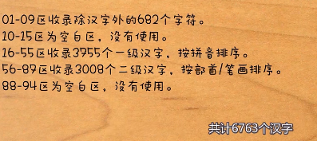
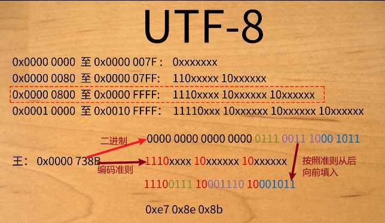

# 数据编码与格式

## 编码

即让字符跟计算机的存介绍储建立一个对应关系，首先要给字符设定字符集，确定对应字符的编码和编码规则。再根据编码规则在计算机中存储编码，这样就能根据字符串的编码读取到字符了。把字符存储为字节叫编码，把字节以字符串显示叫解码。


```python
str = "汪"
bytes = str.encode("utf-8")
decode_bytes = bytes.decode("utf-8")
print("{}的字节形式为{},字符串形式为{}".format(str,bytes,decode_bytes))
```

```{.scroll-200}
汪的字节形式为b'\xe6\xb1\xaa',字符串形式为汪
```

### 表格

编码格式|占用字节数|码位采用进制|实例
-|-|-|-
ASCII|一个字节，实际只占了七位|采用10进制表示码位|33个控制字符+125个可见字符,总共128个
gb2312|两个字节，且必须大于127，从而跟ascii区别|16进制表示码位|高位为区位，低位为行+列
gbk|2|16进制|由gb2312延伸而来，低位不再需要大于127
utf-8|可变字节长度，1-4|16进制|但根据字节长度字节高位的数值也是有规则的

ASCII码 128个字符，用0-127表示, 用一个字节即可存储，可表示2^8^=256个字符，32-126为可见字符，其他到127为控制字符，实际上一个字节只用了七位。其他国家的字符也需要加入进来，一个字节已经不够。

gb2312, 设置字符集，让编码与字符进行对应，采用分区管理方式，共设计94个区，每个区含94个位，共8836个码位。10行，10列的表示方法 区位+行位+列位 区位为高位，占一个字节，行位列位为低位，占一个字节，实际表示用16进制表示。为了与ascII码区分（gb2312向下兼容ascII码），即字节的第八位必须从1开始，即至少大于等于128（0x80），而控制字符需要占32个，外加一个空格键，已经占到了0xa0，所以真正的字符编码在字节中的表示位置都要加上0xa0，代表了在字节中的存储形式，因为之前的已经表示了其他的字符。

### 图片

<div class="figure" style="text-align: center">

<p class="caption">(\#fig:gb2312分区)gb2312分区</p>
</div>

<div class="figure" style="text-align: center">

<p class="caption">(\#fig:gb2312码位)gb2312编码</p>
</div>

<div class="figure" style="text-align: center">

<p class="caption">(\#fig:utf-8)utf-8编码</p>
</div>

### 视频

```{=html}
<iframe src="https://player.bilibili.com/player.html?aid=370211302&bvid=BV1gZ4y1x7p7&cid=177213470&page=1&high_quality=1&danmaku=0" 
scrolling="no" 
border="0" 
frameborder="no" 
framespacing="0" allowfullscreen="true"
width="100%" 
height="500">
</iframe>
```
