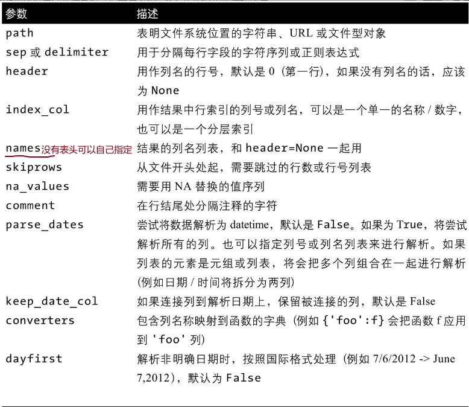

# 数据获取与存储


严格地说，所有文件都是二进制的。但是，如果文件中的字节都以纯粹的字符形式保存（例如字母、数字，或是换行、回车、制表符这样的控制字符），那么我们就可以说这个文件是文本格式的。相比之下，二进制文件包含的字节则是由大部分非人类可读的字符组成的。

[爬虫参考](https://wcl99.netlify.app/python/python%E7%88%AC%E8%99%AB/pc/)

## 文本文件

### 分隔文件 {.tabset}

#### 读取



利用pd.read_csv()方法,主要参数为是否包括表头，是否某些行不读取，缺失值如何表示，是否让某些列作为索引，对某些列传递某些函数做某些处理，编码，是否分块读取，日期处理

* 分块读入csv文件

使用`chunksize`参数,生成的对象可迭代，类似于生成器，可以通过next方法获取下一个chunksize数量的,也可以通过.get_chunk(size)方法获得任意行数的数据，再调用next方法会从当前块位置到当前块结束的位置。


```python
student = pd.read_csv("data/数据/学生.csv",chunksize=5)
student.get_chunk(7).pipe(lambda df:print(df.to_markdown(tablefmt="github")))
```

|    | 姓名   | 性别   | 班级      |   数学 |   语文 |   英语 |
|----|--------|--------|-----------|--------|--------|--------|
|  0 | a1     | 男     | 高一(1)班 |     61 |     59 |     70 |
|  1 | a2     | 女     | 高一(2)班 |     62 |     77 |     74 |
|  2 | a3     | 女     | 高一(3)班 |     58 |     71 |     83 |
|  3 | a4     | 男     | 高一(4)班 |     65 |     57 |     71 |
|  4 | a5     | 男     | 高一(5)班 |     56 |     83 |     72 |
|  5 | a6     | 男     | 高一(6)班 |     65 |     71 |     76 |
|  6 | a7     | 男     | 高一(7)班 |     71 |     71 |     84 |

```python
next(student).pipe(lambda df:print(df.to_markdown(tablefmt="github")))
```

|    | 姓名   | 性别   | 班级       |   数学 |   语文 |   英语 |
|----|--------|--------|------------|--------|--------|--------|
|  7 | a8     | 女     | 高一(8)班  |     58 |     73 |     78 |
|  8 | a9     | 男     | 高一(9)班  |     71 |     73 |     73 |
|  9 | a10    | 女     | 高一(10)班 |     54 |     71 |     75 |
| 10 | a11    | 女     | 高一(11)班 |     62 |     74 |     69 |
| 11 | a12    | 女     | 高一(12)班 |     67 |     73 |     74 |

#### 存储csv文件

参数|取值|作用
-|-|-
path|string|存储路径
index|bool,默认true|会默认存储index，如果index是有意义的，可以存，没有意义设置为False
encoding|optional|设置存储文件的编码

### json {.tabset}

#### 读取


```python
import json
with open("data/数据/information.json","r") as fp:
    jf = fp.read()
result = json.loads(jf) #将json对象转化为python对象，比如对于空值的表示是不一样的,result为python字典
json.dumps(result)#转回为json对象,为字符串
#使用pandas读取json数据为DataFrame时每个键的内容必须长度一致,默认json数据数组中的每个对象是表里的一行
```

```{.scroll-200}
'{"name": "Wes", "places_lived": ["United States", "Spain", "Germany"], "pet": null, "siblings": [{"name": "Scott", "age": 30, "pets": ["Zeus", "Zuko"]}, {"name": "Katie", "age": 38, "pets": ["Sixes", "Stache", "Cisco"]}]}'
```

```python
pd.read_json("data/数据/information.json")
```

```
Error in py_call_impl(callable, dots$args, dots$keywords): ValueError: All arrays must be of the same length
```

键名必为字符串，值可以为列表，字符串，bool等.

#### 存储

序列和数据框都有to_json方法，存储的每一个键值对存储一个字段

### html {.tabset}

#### 读取


```python
table = pd.read_html(
"""
<table>
<tr>
<th>函数</th>
<th>作用</th>
</tr> 
<tr>
<td>pd.read_html()</td>
<td>从html文件中读取表格</td>
</tr> 
</table>
"""
)
table[0].pipe(lambda df:print(df.to_markdown(tablefmt="github")))
```

|    | 函数           | 作用                 |
|----|----------------|----------------------|
|  0 | pd.read_html() | 从html文件中读取表格 |
pd.read_html()主要从table标签中读取数据,返回的df对象的list

#### 存储为html

DataFrame.to_html(buf=None, columns=None,col_space=None, header=True，   index=True,na_rep='NaN',formatters=None, float_format=None, sparsify=None, index_names=True,justify=None,bold_rows=True,classes=None, escape=True, max_rows=None, max_cols=None,show_dimensions=False,notebook=False, decimal='.', border=None)

参数|解释
-|-
buf|StringIO-like, 可选写入缓冲区。
columns|sequence，可选要转化的列的列名；默认值 None 为所有列转化。
col_space|int，可选每列的最小宽度。
header|bool，可选是否打印列标签，默认为 True。
index|布尔值，可选是否打印索引（行）标签，默认为 True。
na_rep|字符串，可选指定 NAN 的字符串表示形式，默认为 'NaN'。
formatters|多个单参数函数组成的列表或字典，可选格式化程序可按列表的所索引或字典的键名称应用于列元素，默认为 None。每个单参数函数的结果必须是一个 unicode 字符串。列表的长度必须等于列数。
float_format|单参数函数，可选用于将列元素设置为浮点数的格式化程序功能，默认为无。此单参数函数的结果必须是 unicode 字符串。
sparsify|bool，可选默认为 True。输入 False 时，对于具有层次结构索引的 DataFrame，会在每一行打印多重索引。
index_names|bool，可选打印索引名称，默认为 True。
line_width|int，可选换行符的宽度，默认为不换行。
justify|列标签对齐方式, 可选左右对齐列标签。默认为 None时，使用打印配置中的选项（由 set_option 控制），则右对齐。
bold_rows|bool, 可选对横向表格线进行加粗。
classes|CSS类(es)适用于生成的html表, 可选默认 None
escape|bool, 可选将 "<", ">", "&" 转化成 html 安全序列，默认 True。
max_rows|int, 可选显示最大行数。
max_cols|int, 可选显示最大列数。
decimal|str, 可选小数分隔符, 默认为 '.'。
border|int， 可选表格外边框宽度，默认为 1，参数为 0 时表格无边框。数值越大外边框越宽。

## 二进制

### excel {.tabset}

#### 读取


```python
pd.read_excel("data/数据/ex2.xlsx","Sheet1",index_col=[0]).head(3).pipe(lambda df:print(df.to_markdown(tablefmt="github")))
```

|    |   a |   b |   c |   d | message   |
|----|-----|-----|-----|-----|-----------|
|  0 |   1 |   2 |   3 |   4 | hello     |
|  1 |   5 |   6 |   7 |   8 | world     |
|  2 |   9 |  10 |  11 |  12 | foo       |

基本格式和读取csv文件差不多，只不过多了sheet_name参数,存储时也多了一个，可以指定sheet

#### 存储

`.to_excel()`

### HDF5


```python
# frame = pd.DataFrame({"a":np.random.randn(10)})
# store = pd.HDFStore("data/数据/mydata.h5")
# store['obj1'] = frame
# store['boj2'] = frame
# store
# store = pd.read_hdf("data/数据/mydata.h5","obj1",where=['index<5'])
store = pd.read_hdf("data/数据/mydata.h5","obj1")
store.head()
```

```{.scroll-200}
          a
0 -0.041783
1 -0.558127
2  0.589053
3 -1.141734
4  0.019748
```

HDF5是一个备受好评的文件格式，用于存储大量的科学数组数据。它以C库的形式提供，并且具有许多其他语言的接口，包括Java、Julia、MATLAB和Python。HDF5中的“HDF”代表分层数据格式。每个HDF5文件可以存储多个数据集并且支持元数据。与更简单的格式相比，HDF5支持多种压缩模式的即时压缩，使得重复模式的数据可以更高效地存储。HDF5适用于处理不适合在内存中存储的超大型数据，可以使你高效读写大型数组的一小块。尽管可以通过使用PyTables或h5py等库直接访问HDF5文件，但pandas提供了一个高阶的接口，可以简化Series和DataFrame的存储。HDFStore类像字典一样工作并处理低级别细节，包含在HDF5文件中的对象可以使用相同的字典型API进行检索。
