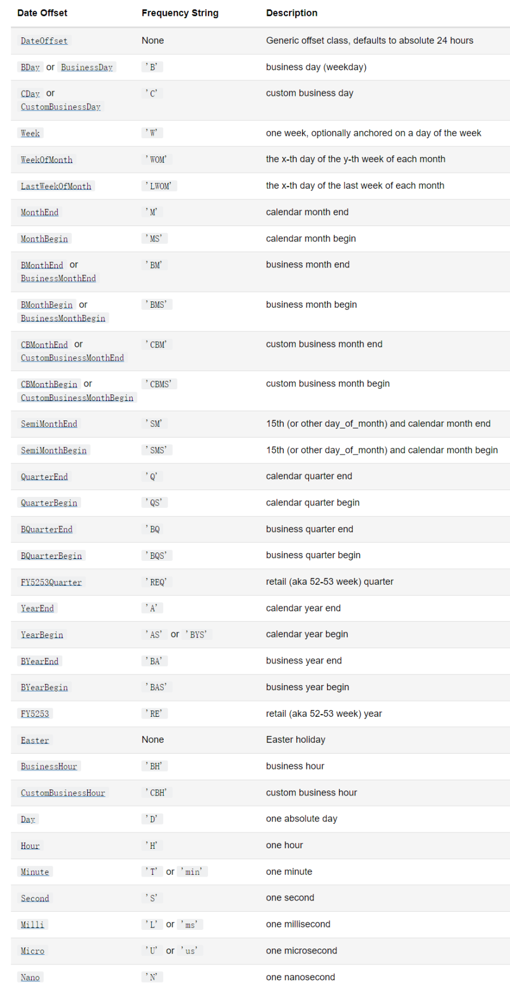
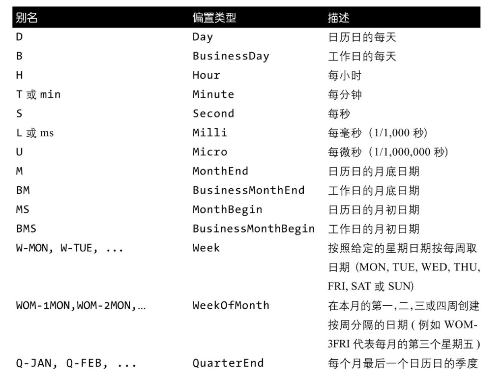
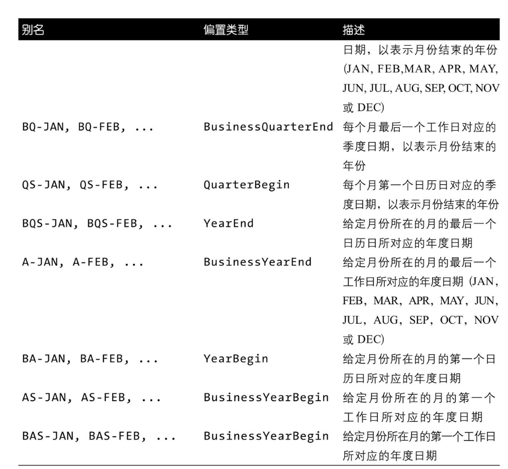
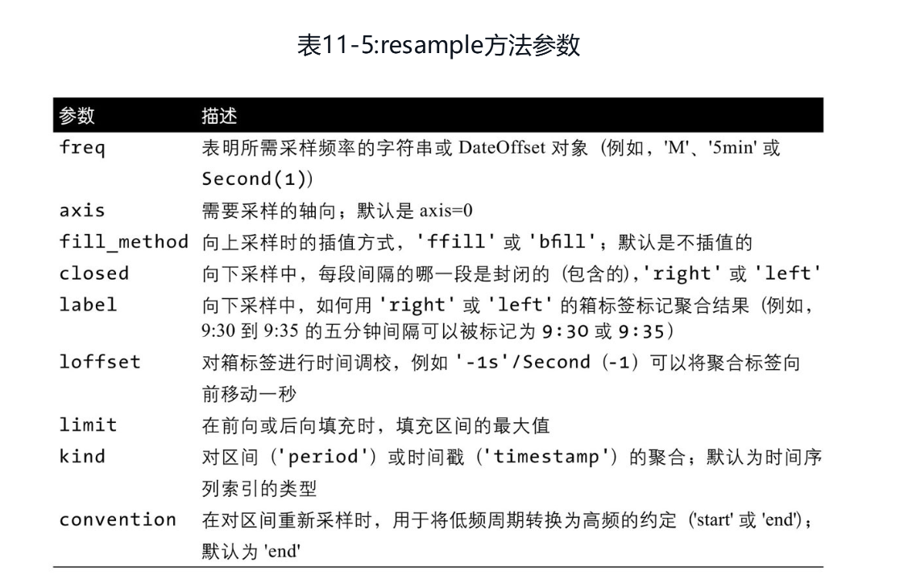
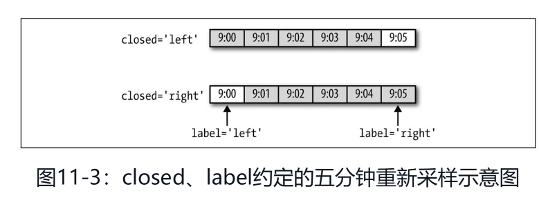

# 时间序列

时间序列数据在很多领域都是重要的结构化数据形式，例如金融、经济、生态学、神经科学和物理学。在多个时间点观测或测量的数据形成了时间序列。

许多时间序列是固定频率的，也就是说数据是根据相同的规则定期出现的，例如每15秒、每5分钟或每月1次。时间序列也可以是不规则的，没有固定的时间单位或单位间的偏移量。如何标记和引用时间序列数据取决于应用程序，并且您可能有以下其中一项：·

* 时间戳，具体的时刻。
* 固定的时间区间，例如2007的1月或整个2010年。
* 时间间隔，由开始和结束时间戳表示。时间区间可以被认为是间隔的特殊情况。
* 实验时间或消耗时间。每个时间戳是相对于特定开始时间的时间的量度（例如，自从被放置在烤箱中每秒烘烤的饼干的直径）。

python有很多和时间相关的模块,如datetime,pandas,[time](https://wcl99.netlify.app/python/python%E9%87%8D%E8%A6%81%E6%A8%A1%E5%9D%97%E6%80%BB%E7%BB%93/%E5%86%85%E7%BD%AE%E6%A8%A1%E5%9D%97/#time),[calendar](https://wcl99.netlify.app/python/python%E9%87%8D%E8%A6%81%E6%A8%A1%E5%9D%97%E6%80%BB%E7%BB%93/%E5%86%85%E7%BD%AE%E6%A8%A1%E5%9D%97/#calendar)

## datetime


```python
import datetime
from datetime import timedelta, timezone
import pandas as pd
import numpy as np
```

### 时间的类型

形式|实例
-|:-
字符串形式|'2021/11/26','16:34:20'
timestamp时间戳|在计算机中，时间实际上是用数字表示的。我们把1970年1月1日 00:00:00 UTC+00:00时区的时刻称为epoch time，记为0（1970年以前的时间timestamp为负数），当前时间就是相对于epoch time的秒数，称为timestamp。你可以认为：`timestamp = 0 = 1970-1-1 00:00:00 UTC+0:00`,对应的北京时间是：`timestamp = 0 = 1970-1-1 08:00:00 UTC+8:00`
本地时间|本地时间是指当前操作系统设定的时区。例如北京时区是东8区，则本地时间：`2015-04-19 12:20:00`,实际上就是UTC+8:00时区的时间：`2015-04-19 12:20:00 UTC+8:00`,而此刻的格林威治标准时间与北京时间差了8小时，也就是UTC+0:00时区的时间应该是：`2015-04-19 04:20:00 UTC+0:00`
utc时间|具有时区信息，同一时间点不同的时区，时间点不同,通过在时间后面加` UTC+`来表示,UTC时间指UTC+0:00时区的时间
datetime|datetime表示的时间需要时区信息才能确定一个特定的时间，否则只能视为本地时间。如果要存储datetime，最佳方法是将其转换为timestamp再存储，因为timestamp的值与时区完全无关.

### datetime主要类 {.tabset}

类名|实例对象与解释
-|-
datetime.date(year,month,day)|datetime.date(2021,11,26) 日期类，包含年月日信息
datetime.time(\[hour[, minute[, second[, microsecond[, tzinfo]]]]\])|datetime.time()，时间类，包含小时，分钟，秒，微秒，时区信息
datetime.datetime(year, month, day\[, hour[, minute[, second[, microsecond[,tzinfo]]]]\])|既包含日期，也包含时间
datetime.timedelta()|timedelta类是用来计算二个datetime对象的差值的。
datetime.tzinfo()|时区信息对象

#### .date()

    datetime.date(year,month,day)
 
属性和方法|介绍
:-|:-
.day,.month,.year|天，月，年
.isocalendar()|返回一个包含三个值的元组，三个值依次为：year年份，week number周数，weekday星期数（周一为1…周日为7)
.isoformat(...)|返回符合ISO 8601标准 (YYYY-MM-DD) 的日期字符串
.isoweekday(...)|返回符合ISO标准的指定日期所在的星期数（周一为1…周日为7)
.weekday(...)|与.isoweekday(...)相似的还有一个weekday(...)方法,返回的周一为 0, 周日为 6
.timetuple(...)|该方法为了兼容time.localtime(...)返回一个类型为time.struct_time的数组，但有关时间的部分元素值为0
.toordinal(...)|返回公元公历开始到现在的天数。公元1年1月1日为1
.replace(...)|返回一个替换指定日期字段的新date对象。参数3个可选参数，分别为year,month,day。注意替换是产生新对象，不影响原date对象。
.resolution|date对象表示日期的最小单位。这里是天。
.fromordinal(...)|将Gregorian日历时间转换为date对象；Gregorian Calendar ：一种日历表示方法，类似于我国的农历，西方国家使用比较多。
.fromtimestamp(...)|根据给定的时间戮，返回一个date对象
.today(...)|返回当前日期
.max|date类能表示的最大的年、月、日的数值
.min|date类能表示的最小的年、月、日的数值

#### .time()

    datetime.time(\[hour[, minute[, second[, microsecond[, tzinfo]]]]\])


```python
def time_atr_and_met(hour,minute,second):
    import datetime
    time1=datetime.time(hour,minute,second)
    atr=[i for i in dir(time1) if i[0]!='_']
    l=[]
    for i in atr:
        try:
            a=eval('time1.'+i+'()')
        except:
            try:
                a=eval('time1.'+i)
            except:
                a="pass"
        l.append(['.'+i,a])
    return l
pd.DataFrame(time_atr_and_met(15,42,30),columns=['方法或属性','实例']).pipe(lambda df:print(df.to_markdown(tablefmt="github")))  
```

|    | 方法或属性     | 实例                                                                     |
|----|----------------|--------------------------------------------------------------------------|
|  0 | .dst           |                                                                          |
|  1 | .fold          | 0                                                                        |
|  2 | .fromisoformat | <built-in method fromisoformat of type object at 0x00007FFB53C4D4B0>     |
|  3 | .hour          | 15                                                                       |
|  4 | .isoformat     | 15:42:30                                                                 |
|  5 | .max           | 23:59:59.999999                                                          |
|  6 | .microsecond   | 0                                                                        |
|  7 | .min           | 00:00:00                                                                 |
|  8 | .minute        | 42                                                                       |
|  9 | .replace       | 15:42:30                                                                 |
| 10 | .resolution    | 0:00:00.000001                                                           |
| 11 | .second        | 30                                                                       |
| 12 | .strftime      | <built-in method strftime of datetime.time object at 0x0000022CC82D4990> |
| 13 | .tzinfo        |                                                                          |
| 14 | .tzname        |                                                                          |
| 15 | .utcoffset     |                                                                          |

#### .datetime()

    datetime(year, month, day\[, hour[, minute[, second[, microsecond[,tzinfo]]]]\])


```python
def datetime_atr_and_met(year,month,day,hour,minute,second):
    import datetime
    datetime1=datetime.datetime(year,month,day,hour,minute,second)
    atr=[i for i in dir(datetime1) if i[0]!='_']
    l=[]
    for i in atr:
        try:
            a=eval('datetime1.'+i+'()')
        except:
            try:
                a=eval('datetime1.'+i)
            except:
                a="pass"
        l.append(['.'+i,a])
    return l
dt=datetime_atr_and_met(2021,11,26,16,0,0) 
ndt=[i+j for i,j in zip(dt[20:39],dt[:19])]+[dt[19]+['']+['']]
pd.DataFrame(ndt,columns=['方法或属性','实例','方法或属性','实例']).pipe(lambda df:print(df.to_markdown(tablefmt="github")))
```

|    | 方法或属性        | 实例                                                                                                                       | 方法或属性       | 实例                                                                   |
|----|-------------------|----------------------------------------------------------------------------------------------------------------------------|------------------|------------------------------------------------------------------------|
|  0 | .now              | 2023-03-24 20:55:03.192638                                                                                                 | .astimezone      | 2021-11-26 16:00:00+08:00                                              |
|  1 | .replace          | 2021-11-26 16:00:00                                                                                                        | .combine         | <built-in method combine of type object at 0x00007FFB53C4D650>         |
|  2 | .resolution       | 0:00:00.000001                                                                                                             | .ctime           | Fri Nov 26 16:00:00 2021                                               |
|  3 | .second           | 0                                                                                                                          | .date            | 2021-11-26                                                             |
|  4 | .strftime         | <built-in method strftime of datetime.datetime object at 0x0000022CC8666330>                                               | .day             | 26                                                                     |
|  5 | .strptime         | <built-in method strptime of type object at 0x00007FFB53C4D650>                                                            | .dst             |                                                                        |
|  6 | .time             | 16:00:00                                                                                                                   | .fold            | 0                                                                      |
|  7 | .timestamp        | 1637913600.0                                                                                                               | .fromisocalendar | <built-in method fromisocalendar of type object at 0x00007FFB53C4D650> |
|  8 | .timetuple        | time.struct_time(tm_year=2021, tm_mon=11, tm_mday=26, tm_hour=16, tm_min=0, tm_sec=0, tm_wday=4, tm_yday=330, tm_isdst=-1) | .fromisoformat   | <built-in method fromisoformat of type object at 0x00007FFB53C4D650>   |
|  9 | .timetz           | 16:00:00                                                                                                                   | .fromordinal     | <built-in method fromordinal of type object at 0x00007FFB53C4D650>     |
| 10 | .today            | 2023-03-24 20:55:03.193708                                                                                                 | .fromtimestamp   | <built-in method fromtimestamp of type object at 0x00007FFB53C4D650>   |
| 11 | .toordinal        | 738120                                                                                                                     | .hour            | 16                                                                     |
| 12 | .tzinfo           |                                                                                                                            | .isocalendar     | datetime.IsoCalendarDate(year=2021, week=47, weekday=5)                |
| 13 | .tzname           |                                                                                                                            | .isoformat       | 2021-11-26T16:00:00                                                    |
| 14 | .utcfromtimestamp | <built-in method utcfromtimestamp of type object at 0x00007FFB53C4D650>                                                    | .isoweekday      | 5                                                                      |
| 15 | .utcnow           | 2023-03-24 12:55:03.193707                                                                                                 | .max             | 9999-12-31 23:59:59.999999                                             |
| 16 | .utcoffset        |                                                                                                                            | .microsecond     | 0                                                                      |
| 17 | .utctimetuple     | time.struct_time(tm_year=2021, tm_mon=11, tm_mday=26, tm_hour=16, tm_min=0, tm_sec=0, tm_wday=4, tm_yday=330, tm_isdst=0)  | .min             | 0001-01-01 00:00:00                                                    |
| 18 | .weekday          | 4                                                                                                                          | .minute          | 0                                                                      |
| 19 | .month            | 11                                                                                                                         |                  |                                                                        |

#### .timedelta()

timedelta类是用来计算二个datetime对象的差值的。

创建对象:`datetime.timedelta(days=0, seconds=0, microseconds=0, milliseconds=0, minutes=0, hours=0, weeks=0)`

使用timedelta你可以很容易地算出前几天和后几天的时刻。


```python
def timedelta_atr_and_met(days,seconds,microseconds):
    import datetime
    timedelta=datetime.timedelta(days,seconds,microseconds)
    atr=[i for i in dir(timedelta) if i[0]!='_']
    l=[]
    for i in atr:
        try:
            a=eval('timedelta.'+i+'()')
        except:
            try:
                a=eval('timedelta.'+i)
            except:
                a="pass"
        l.append(['.'+i,a])
    return l
pd.DataFrame(timedelta_atr_and_met(2,42,300),columns=['方法或属性','实例']).pipe(lambda df:print(df.to_markdown(tablefmt="github")))
```

|    | 方法或属性     | 实例                            |
|----|----------------|---------------------------------|
|  0 | .days          | 2                               |
|  1 | .max           | 999999999 days, 23:59:59.999999 |
|  2 | .microseconds  | 300                             |
|  3 | .min           | -999999999 days, 0:00:00        |
|  4 | .resolution    | 0:00:00.000001                  |
|  5 | .seconds       | 42                              |
|  6 | .total_seconds | 172842.0003                     |


```python
t1 = datetime.date(2023,3,15)
t2 = datetime.date(2023,3,16)
td = t2-t1
t2+3*td
```

```{.scroll-200}
datetime.date(2023, 3, 19)
```

#### .timezone()

创建时区

    datetime.timezone(offset, name=None)
    offset必须是一个timedelta对象，代表了与utc时间的偏移，范围为-timedelta(hours=24) 到 timedelta(hours=24)
    name可以不给，给了话必须是datetime.tzname()生成的对象


```python
dt=datetime.datetime.now()
tz=timezone(timedelta(hours=6))
tz
```

```{.scroll-200}
datetime.timezone(datetime.timedelta(seconds=21600))
```

```python
tz.tzname(dt)
```

```{.scroll-200}
'UTC+06:00'
```

```python
tz.utc
```

```{.scroll-200}
datetime.timezone.utc
```

```python
tz.utcoffset(dt)
```

```{.scroll-200}
datetime.timedelta(seconds=21600)
```

### 时间类型的转换 {.tabset}

#### str与datetime

    * 字符串形式转化为datetime `datetime.datetime.strptime('2015-6-1 18:19:59', '%Y-%m-%d %H:%M:%S')`
        * 只有datetime对象有该方法
        * 注意转换后的datetime是没有时区信息的。
    * datetime对象转化为字符串 `datetime.datetime().strftime('%a, %b %d %H:%M')`
        * date对象和time对象也有该方法
        * 如果你想将时间对象转化为字符串对象的话，可以用到__format__(...)方法以指定格式进行时间输出：

符号|说明
:-|:-
%y|两位数的年份表示（00-99）
%Y|	四位数的年份表示（000-9999）
%m|	月份（01-12）
%d|月内中的一天（0-31）
%H|24小时制小时数（0-23）
%I|12小时制小时数（01-12）
%M|分钟数（00=59）
%S|秒（00-59）
%a|本地简化星期名称
%A|本地完整星期名称
%b|本地简化的月份名称
%B|本地完整的月份名称
%c|本地相应的日期表示和时间表示
%j|年内的一天（001-366）
%p|本地A.M.或P.M.的等价符
%U|一年中的星期数（00-53）星期天为星期的开始
%w|星期（0-6），星期天为星期的开始
%W|一年中的星期数（00-53）星期一为星期的开始
%x|本地相应的日期表示
%X|本地相应的时间表示
%Z|当前时区的名称
%%|%号本身

#### timestamp与datetime

* datetime 转化为timestamp `datetime.datetime.timestamp()`
* timestamp 转化为 datetime
    * 本地时间的datetime: `datetime.datetime.fromtimestamp(t)`
    * UTC时间的datetime: `datetime.datetime.utcfromtimestamp(t)`

#### 本地时间与utc时间

* 本地时间转换为utc时间:一个datetime类型有一个时区属性tzinfo，但是默认为None，所以无法区分这个datetime到底是哪个时区，除非强行给datetime设置一个时区.需要自己创建时区对象，然后赋值给datetime对象


```python
tz_utc_8 = timezone(timedelta(hours=8)) # 创建时区UTC+8:00
now = datetime.datetime.now()
now
```

```{.scroll-200}
datetime.datetime(2023, 3, 24, 20, 55, 6, 529891)
```

```python
dt = now.replace(tzinfo=tz_utc_8) # 强制设置为UTC+8:00
dt
#datetime.datetime(2015, 5, 18, 17, 2, 10, 871012, tzinfo=datetime.timezone(datetime.timedelta(0, 28800)))
#如果系统时区恰好是UTC+8:00，那么上述代码就是正确的，否则，不能强制设置为UTC+8:00时区。
```

```{.scroll-200}
datetime.datetime(2023, 3, 24, 20, 55, 6, 529891, tzinfo=datetime.timezone(datetime.timedelta(seconds=28800)))
```

### 比较


```python
##加减
a=datetime.datetime.now()
b=datetime.datetime(2021,12,3,15,43,20)
a-b
##比较大小
```

```{.scroll-200}
datetime.timedelta(days=476, seconds=18707, microseconds=457315)
```

```python
a > b
```

```{.scroll-200}
True
```

```python
a < b
```

```{.scroll-200}
False
```

##  dateutil

datetime.strptime是在已知格式的情况下转换日期的好方式。然而，每次都必须编写一个格式代码可能有点烦人，特别是对于通用日期格式。在这种情况下，你可以使用第三方dateutil包的parser.parse方法（这个包在安装pandas时已经自动安装）：

dateutil.parser是一个有用但并不完美的工具。值得注意的是，它会将一些字符串识别为
你并不想要的日期——例如，'42’将被解析为2042年的当前日期。


```python
from dateutil.parser import parse
parse('2011-01-03')
```

```{.scroll-200}
datetime.datetime(2011, 1, 3, 0, 0)
```

## pandas时间日期操作

`pd.to_datetime()`可以将缺失值转为NaT

### pandas时间类 {.tabset}

Concept	|Scalar Class|	Array Class|	pandas Data Type	|Primary Creation Method
-|-|-|-|-
Datetimes	|Timestamp|	DatetimeIndex	|datetime64[ns] or datetime64[ns,tz]|	to_datetime or date_range
Timedeltas	|Timedelta	|TimedeltaIndex	|timedelta64[ns]|	to_timedelta or timedelta_range
Timespans	|Period|	PeriodIndex|	period[freq]|	Period or period_range
Dateoffsets|	DateOffset|	None|	None|	DateOffset

#### datetime

    pd.to_datetime(format=)
    pd.date_range(start_time,ends_time,periods=)
    pd.date_range(start_time,ends_time,freq=)
    pd.date_range(start_time,periods=,freq=)

属性方法

<table class="colwidths-given table">
<colgroup>
<col style="width: 19%">
<col style="width: 81%">
</colgroup>
<thead>
<tr class="row-odd"><th class="head"><p>Property</p></th>
<th class="head"><p>Description</p></th>
</tr>
</thead>
<tbody>
<tr class="row-even"><td><p>year</p></td>
<td><p>The year of the datetime</p></td>
</tr>
<tr class="row-odd"><td><p>month</p></td>
<td><p>The month of the datetime</p></td>
</tr>
<tr class="row-even"><td><p>day</p></td>
<td><p>The days of the datetime</p></td>
</tr>
<tr class="row-odd"><td><p>hour</p></td>
<td><p>The hour of the datetime</p></td>
</tr>
<tr class="row-even"><td><p>minute</p></td>
<td><p>The minutes of the datetime</p></td>
</tr>
<tr class="row-odd"><td><p>second</p></td>
<td><p>The seconds of the datetime</p></td>
</tr>
<tr class="row-even"><td><p>microsecond</p></td>
<td><p>The microseconds of the datetime</p></td>
</tr>
<tr class="row-odd"><td><p>nanosecond</p></td>
<td><p>The nanoseconds of the datetime</p></td>
</tr>
<tr class="row-even"><td><p>date</p></td>
<td><p>Returns datetime.date (does not contain timezone information)</p></td>
</tr>
<tr class="row-odd"><td><p>time</p></td>
<td><p>Returns datetime.time (does not contain timezone information)</p></td>
</tr>
<tr class="row-even"><td><p>timetz</p></td>
<td><p>Returns datetime.time as local time with timezone information</p></td>
</tr>
<tr class="row-odd"><td><p>dayofyear</p></td>
<td><p>The ordinal day of year</p></td>
</tr>
<tr class="row-even"><td><p>day_of_year</p></td>
<td><p>The ordinal day of year</p></td>
</tr>
<tr class="row-odd"><td><p>weekofyear</p></td>
<td><p>The week ordinal of the year</p></td>
</tr>
<tr class="row-even"><td><p>week</p></td>
<td><p>The week ordinal of the year</p></td>
</tr>
<tr class="row-odd"><td><p>dayofweek</p></td>
<td><p>The number of the day of the week with Monday=0, Sunday=6</p></td>
</tr>
<tr class="row-even"><td><p>day_of_week</p></td>
<td><p>The number of the day of the week with Monday=0, Sunday=6</p></td>
</tr>
<tr class="row-odd"><td><p>weekday</p></td>
<td><p>The number of the day of the week with Monday=0, Sunday=6</p></td>
</tr>
<tr class="row-even"><td><p>quarter</p></td>
<td><p>Quarter of the date: Jan-Mar = 1, Apr-Jun = 2, etc.</p></td>
</tr>
<tr class="row-odd"><td><p>days_in_month</p></td>
<td><p>The number of days in the month of the datetime</p></td>
</tr>
<tr class="row-even"><td><p>is_month_start</p></td>
<td><p>Logical indicating if first day of month (defined by frequency)</p></td>
</tr>
<tr class="row-odd"><td><p>is_month_end</p></td>
<td><p>Logical indicating if last day of month (defined by frequency)</p></td>
</tr>
<tr class="row-even"><td><p>is_quarter_start</p></td>
<td><p>Logical indicating if first day of quarter (defined by frequency)</p></td>
</tr>
<tr class="row-odd"><td><p>is_quarter_end</p></td>
<td><p>Logical indicating if last day of quarter (defined by frequency)</p></td>
</tr>
<tr class="row-even"><td><p>is_year_start</p></td>
<td><p>Logical indicating if first day of year (defined by frequency)</p></td>
</tr>
<tr class="row-odd"><td><p>is_year_end</p></td>
<td><p>Logical indicating if last day of year (defined by frequency)</p></td>
</tr>
<tr class="row-even"><td><p>is_leap_year</p></td>
<td><p>Logical indicating if the date belongs to a leap year</p></td>
</tr>
</tbody>
</table>

#### timedelta

    pd.to_timedelta()
    pd.timedelta_range()

#### timespans

    pd.period_range()
    pd.period_range(start_time,end_time,freq)
    生成一个periodIndex对象
    每一个索引值是一个Period对象

#### dateoffsets

`from pandas.tseries.offset import BMonthEnd`

DateOffset代表规则的频率增量。 在具有DateOffset各种子类的 Pandas 中，可以表示特定的日期偏移逻辑，例如“月”，“工作日”或“小时”

可以将它们相加或相减以获得转换后的日期 可以将它们乘以整数（正数或负数），以便多次应用增量 它们具有rollforward和rollback方法，可以将日期向前或向后移动到下一个或上一个“偏移日期”

可以通过向datetime对象传递代表固定时间段的datetime对象或使用多个关键字参数来创建DateOffset对象。 关键字参数分为两大类。 第一类是代表绝对日期的关键字：年，月，日，小时，分钟，秒和微秒。 第二类代表相对持续时间，可以是负值：年，月，周，日，小时，分钟，秒和微秒。

特定DateOffset的多个单位可以通过乘法表示，时间加上偏移量可以实现时间的改变，或者使用这些对象的实例方法rollforward等实现时间的改变


```python
t = datetime.datetime.now()
t + pd.offsets.BMonthEnd()
```

```{.scroll-200}
Timestamp('2023-03-31 20:55:09.717977')
```

```python
t - pd.offsets.BMonthEnd(2)
```

```{.scroll-200}
Timestamp('2023-01-31 20:55:09.717977')
```

### indexing


```python
import numpy as np
rng = pd.date_range('2011/1/31', '2011/12/31', freq="BM")
ts = pd.Series(np.random.randn(len(rng)), index=rng)
ts["1/31/2011"]
```

```{.scroll-200}
0.5408863586713725
```

```python
ts["10/31/2011":"12/31/2011"]
```

```{.scroll-200}
2011-10-31    1.176302
2011-11-30    1.169551
2011-12-30    0.527191
Freq: BM, dtype: float64
```

```python
ts["2011-6"]
```

```{.scroll-200}
2011-06-30    0.237431
Freq: BM, dtype: float64
```

```python
ts.loc["2011"]
```

```{.scroll-200}
2011-01-31    0.540886
2011-02-28    0.015987
2011-03-31    2.321494
2011-04-29   -0.136594
2011-05-31    0.164962
2011-06-30    0.237431
2011-07-29   -0.794895
2011-08-31    0.752093
2011-09-30    0.688829
2011-10-31    1.176302
2011-11-30    1.169551
2011-12-30    0.527191
Freq: BM, dtype: float64
```

### 时区处理

    `.tz` 获取时区
    `rng = pd.date_range('3/9/2012 9:30', periods=6, freq='D',tz="utc")` 设置utc时区
    `.tz_localize()` 方法将utc时区转为本地utc时区,单纯改了时区，没有换时间，所以可能时间不对
    `.tz.convert()` 一旦时间序列被本地化为某个特定的时区，则可以通过tz_convert将其转换为另一个时区：


```python
rng = pd.date_range('3/9/2012 9:30', periods=6, freq='D',tz="utc")
ts = pd.Series(np.random.randn(len(rng)), index=rng)
print(ts.index.tz)
```

```{.scroll-200}
UTC
```

```python
ts.tz_convert('America/New_York')
```

```{.scroll-200}
2012-03-09 04:30:00-05:00   -1.552204
2012-03-10 04:30:00-05:00    1.609156
2012-03-11 05:30:00-04:00    2.791527
2012-03-12 05:30:00-04:00   -2.561834
2012-03-13 05:30:00-04:00   -2.041990
2012-03-14 05:30:00-04:00    1.541449
Freq: D, dtype: float64
```

### 类型转换

period.to_timestamp(how="start")
timestamp.to_period(freq)

### 频率和频率转换







p.asfreq(freq,how="start")

从小间隔转到大间隔默认保留第一个值

从大间隔到小间隔可能会有缺失值，默认NAN，可以使用.asfreq()方法的method参数更改此默认行为。 该值可用于正向填充，反向填充或填充NaN值

ffill方法将向前填充最后一个已知值（pad也这样做）

bfill方法将从下一个已知值回填值：

### resample {.tabset}

一天"1D"的级别比"1W"的级别要高

pandas对象都配有resample方法，该方法是所有频率转换的工具函数。resample拥有类似于groupby的API；你调用resample对数据分组，之后再调用聚合函数：




```python
rng = pd.date_range('2000-01-01', periods=100, freq='D')
ts = pd.Series(np.random.randn(len(rng)), index=rng)
ts.resample('M').mean()
```

```{.scroll-200}
2000-01-31    0.069878
2000-02-29    0.088926
2000-03-31   -0.108065
2000-04-30    0.058737
Freq: M, dtype: float64
```

```python
ts.resample('M', kind='period').mean()
```

```{.scroll-200}
2000-01    0.069878
2000-02    0.088926
2000-03   -0.108065
2000-04    0.058737
Freq: M, dtype: float64
```

#### 向下采样

将数据聚合到一个规则的低频率上是一个常见的时间序列任务。你要聚合的数据不必是固定频率的。期望的频率定义了用于对时间序列切片以聚合的箱体边界。例如，要将时间转换为每月，'M’或’BM'，你需要将数据分成一个月的时间间隔。每个间隔是半闭合的，一个数据点只能属于一个时间间隔，时间间隔的并集必须是整个时间帧。在使用resample进行向下采样数据时有些事情需要考虑：

* 每段间隔的哪一边是闭合的
* 如何在间隔的起始或结束位置标记每个已聚合的箱体



#### 向上采样

会多出时间，会出现空值，可以采用.ffill()或.reindex()方法填补空值

`ts.resample("D").ffill(limit=2)`

### 窗口函数 {.tabset}

统计和其他通过移动窗口或指数衰减而运行的函数是用于时间序列操作的数组变换的一个重要类别。这对平滑噪声或粗糙的数据非常有用。我称这些函数为移动窗口函数，尽管它也包含了一些没有固定长度窗口的函数，比如指数加权移动平均。与其他的统计函数类似，这些函数会自动排除缺失数据。

#### .rolling()

确定窗口大小,对窗口内所有值进行操作

`.rolling()

`data.rolling("20D").mean(window,min_periods,closed)`

center : bool, default False

    If False, set the window labels as the right edge of the window index.
 
    If True, set the window labels as the center of the window index


```python
tind = pd.date_range("2023-01-01","2023-03-31")
ts = pd.Series(np.random.randint(1,101,len(tind)),index=tind)
ts.rolling("10D",min_periods=5).mean()
```

```{.scroll-200}
2023-01-01     NaN
2023-01-02     NaN
2023-01-03     NaN
2023-01-04     NaN
2023-01-05    59.0
              ... 
2023-03-27    43.7
2023-03-28    42.8
2023-03-29    47.6
2023-03-30    54.3
2023-03-31    57.9
Freq: D, Length: 90, dtype: float64
```

```python
ts.rolling("10D",min_periods=3).mean()
```

```{.scroll-200}
2023-01-01          NaN
2023-01-02          NaN
2023-01-03    66.333333
2023-01-04    69.250000
2023-01-05    59.000000
                ...    
2023-03-27    43.700000
2023-03-28    42.800000
2023-03-29    47.600000
2023-03-30    54.300000
2023-03-31    57.900000
Freq: D, Length: 90, dtype: float64
```

```python
ts.rolling("10D",min_periods=5,center=True).mean()
```

```{.scroll-200}
2023-01-01    63.833333
2023-01-02    68.571429
2023-01-03    68.375000
2023-01-04    65.777778
2023-01-05    61.800000
                ...    
2023-03-27    60.000000
2023-03-28    60.125000
2023-03-29    55.000000
2023-03-30    54.500000
2023-03-31    62.200000
Freq: D, Length: 90, dtype: float64
```

#### .shift()

`.shift(n,periods,freq,fill_value)`滞后n期，并不会改变原索引


```python
ts.shift(1)
```

```{.scroll-200}
2023-01-01     NaN
2023-01-02    76.0
2023-01-03    74.0
2023-01-04    49.0
2023-01-05    78.0
              ... 
2023-03-27    16.0
2023-03-28    35.0
2023-03-29    82.0
2023-03-30    62.0
2023-03-31    71.0
Freq: D, Length: 90, dtype: float64
```

```python
ts.shift(1).ffill()
```

```{.scroll-200}
2023-01-01     NaN
2023-01-02    76.0
2023-01-03    74.0
2023-01-04    49.0
2023-01-05    78.0
              ... 
2023-03-27    16.0
2023-03-28    35.0
2023-03-29    82.0
2023-03-30    62.0
2023-03-31    71.0
Freq: D, Length: 90, dtype: float64
```

```python
ts.shift(1).bfill()
```

```{.scroll-200}
2023-01-01    76.0
2023-01-02    76.0
2023-01-03    74.0
2023-01-04    49.0
2023-01-05    78.0
              ... 
2023-03-27    16.0
2023-03-28    35.0
2023-03-29    82.0
2023-03-30    62.0
2023-03-31    71.0
Freq: D, Length: 90, dtype: float64
```

#### .diff()


```python
ts.diff()
```

```{.scroll-200}
2023-01-01     NaN
2023-01-02    -2.0
2023-01-03   -25.0
2023-01-04    29.0
2023-01-05   -60.0
              ... 
2023-03-27    19.0
2023-03-28    47.0
2023-03-29   -20.0
2023-03-30     9.0
2023-03-31   -10.0
Freq: D, Length: 90, dtype: float64
```

#### .first()

返回时间的索引值之间的极差是offset

offset:str,dateoffset


```python
ts.first('10D')#1-1到1-10
```

```{.scroll-200}
2023-01-01    76
2023-01-02    74
2023-01-03    49
2023-01-04    78
2023-01-05    18
2023-01-06    88
2023-01-07    97
2023-01-08    67
2023-01-09    45
2023-01-10    26
Freq: D, dtype: int32
```

#### .last()


```python
ts.last("20D")
```

```{.scroll-200}
2023-03-12    98
2023-03-13    35
2023-03-14    68
2023-03-15    99
2023-03-16    43
2023-03-17    41
2023-03-18    91
2023-03-19    14
2023-03-20     4
2023-03-21    25
2023-03-22    39
2023-03-23    59
2023-03-24    96
2023-03-25    58
2023-03-26    16
2023-03-27    35
2023-03-28    82
2023-03-29    62
2023-03-30    71
2023-03-31    61
Freq: D, dtype: int32
```

#### .expandind()


```python
ts.expanding(3).sum()
```

```{.scroll-200}
2023-01-01       NaN
2023-01-02       NaN
2023-01-03     199.0
2023-01-04     277.0
2023-01-05     295.0
               ...  
2023-03-27    4862.0
2023-03-28    4944.0
2023-03-29    5006.0
2023-03-30    5077.0
2023-03-31    5138.0
Freq: D, Length: 90, dtype: float64
```


