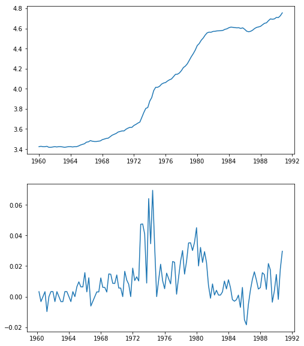

# 时间序列模型

## 理论知识

平稳时间序列分析: 平稳的，非随机序列(非白噪声序列)

### 差分

一阶差分: $\triangledown{x_t}=x_{t}-x_{t-1}$

二阶差分: $\triangledown^2{x_t}=\triangledown{x_t}-\triangledown{x_{t-1}}$ 一阶差分的差分

三阶差分: $\triangledown^p{x_t}=\triangledown^{p-1}{x_t}-\triangledown^{p-1}{x_{t-1}}$必须先计算前一阶的差分

**k步差分**：$\triangledown_k{x_t}=x_t-x_{t-k}$ 直接相隔k步计算差

### 延迟算子

当前序列值乘上一个延迟算子，相当于把当前序列值的序列时间向过去拨了一个时刻

记B为延迟算子

$$x_{t-1}=Bx_t$$

$$x_{t-2}=Bx_{t-2}$$

* 用延迟算子表示差分运算

$$\triangledown^p{x_t}=(1-B)^px_t=\sum^p_{i=0}(-1)^pC^i_px_{t-i}$$

$$\triangledown_kx_t=x_t-x_{t-k}=(1-B^k)x_t$$

### 平稳时间序列 {.tabset}

h(t)=

AR(p):p阶自回归模型

$x_t=\phi_0+\phi_1x_{t-1}+\phi_2x_{t-2}+\dots+\phi_px_{t-p}+\epsilon_t$

$\phi_p\neq0$

* 严宽平稳的联系和区别：

  * 严平稳：时间序列的任意n个时刻的联合分布保持不变，即序列的所有统计性质都不会因为时间的推移而发生变化
  * 宽平稳：时间序列任意时刻的均值保持不变，二阶矩存在且二阶矩只与时间有关
  * 严平稳和宽平稳的关系：
    * 如果二阶矩存在，严平稳一定是宽平稳   
    * 如果是正态分布，则宽平稳代表严平稳

* 平稳性的意义

如果序列不平稳，那么序列就会有很多个随机变量，并且每个变量都只有一个样本，通常是没有办法进行分析的。
但是如果序列平稳，那么均值为常数，这样意味着含有可列多个随机变量的均值序列变成了一个常数序列，这样样本数也就变成了时间序列的个数，
这样减少了随机变量数，增加了待估参数的样本容量，降低了时序分析的难度，提高了对均值函数的估计精度

* 平稳时间序列的统计性质

  * 常数均值:$E(X_t)=\mu$
  * 自协方差函数：$\gamma(t-s)=\gamma(t,s)=E[(X_t-\mu_t)(X_s-\mu_s)]$
  * 自相关函数:$\rho(t,s)=\frac{\gamma(t,s)}{\sqrt{D(X_t)}\sqrt{D(X_s)}}$
  * 延迟k自协方差函数：$\gamma(k)=\gamma(t,t+k)$
  * 方差：$D(X_t)=\gamma(0)$为常数
  * 延迟k自相关系数：$\rho(k)=\frac{\gamma(t,t+k)}{\sqrt{\gamma(0)}\sqrt{\gamma(0)}}\space=\space\frac{\gamma(k)}{\gamma(0)}$

#### Wold分解定理

* Wold分解定理

    对于任意一个离散平稳时间序列，都可以分解成两个不相关的平稳序列之和，其中一个为确定性的，另一个为随机性的
    
$x_t=V_t+\xi_t$

$V_t=\sum_{j=1}^{\infty}\phi_jx_{t-j}$,等价表达为历史序列值的线性函数

$\xi_t=\sum_{j=0}^{\infty}\theta_j\epsilon_{t-j}$,代表了不能有历史信息表达的部分，其中$\theta_0=1,\sum_{j=0}^{\infty}\theta_j^2 \leq \infty,\epsilon独立，通常假定0均值正态分布$

对任意平稳时间序列而言，做线性回归$y_t=a_0+a_1y_{t-1}+a_2y_{t-2}+\dots+a_py_{t-p}+v_t$

前面的是确定性部分，后面的$v_t$是非确定性部分，它的方差决定了p期历史信息对未来的预测精度

如果方差极限趋向0，则$y_t$为确定性序列
如果方差极限趋向$var(y_t)$,则$y_t$为纯随机性序列

绝大多数序列结语确定性序列和纯随机性序列中间，即$0和var(y_t)$之间，序列中既包含部分确定性信息，又包含部分随机信息，这是我们把序列简称为随机序列

#### 平稳序列的特征根

p阶线性差分方程：$x_t+a_1x_{t-1}+\dots+a_px_{t-p}=h_t$

一阶：
$$x_t-0.8x_{t-1}=0$$
$$\lambda^1-0.8\times \lambda^0=0,得\lambda=0.8$$
$$1-0.8B=0,得B=1/0.8$$方程的根是特征根的倒数

二阶:
$$x_t-0.6x_{t-1}+0.05x_{t-2}=0$$
$$\lambda^2-0.6\lambda+0.05=0,得\lambda_1=0.5,\lambda_2=0.1$$
$$1-0.6B+0.05B^2=0 得B_1=2,B_2=10$$

#### 平稳序列特征根的性质

平稳序列必须满足特征根的绝对值都**小于**1

*平稳性检验

* 图检验
* DF检验：当$\tau$值小于$\tau_\alpha时$，拒绝原假设，序列平稳，即序列无单位根，即p值较小时。只能检验最高延迟一阶信息
    * 无漂移项自回归结构：$x_t=\phi_1x_{t-1}+\xi_t$
    * 有漂移项自回归结构：$x_t=\phi_0+\phi_1x_{t-1}+\xi_t$
    * 带趋势回归结构：$x_t=\alpha+\beta t+\phi_1x_{t-1}+\xi_t$
* ADF检验：可以检验更高的延迟阶数
    * 只要有一个单位根，则不平稳

* 纯随机性检验

如果序列值彼此之间没有任何相关性，那就意味着该序列是一个没有记忆的序列，过去的行为对将来的发展没有任何影响，这种序列称为纯随机序列，从统计分析的角度，纯随机序列是没有任何分析价值。

* 纯随机序列(白噪声序列)定义：简记为$X_t\sim WN(\mu,\sigma^2)$
    1. 任取$t\in T,有EX_t=\mu$
    2. 任取$t，s\in T$，有
 $$\gamma(t,s)=\begin{cases}\sigma^2 & t=s\\0 & t\neq s\end{cases}$$
 
* 纯随机序列性质
    1. 纯随机性
    2. 方差齐性：序列中每个随机变量的方差相等，如果不满足，则是异方差

* 纯随机性检验
    * 如果一个时间序列是纯随机的，得到一个观察期数为n的观察序列，那么该序列的延迟非零期的样本自相关系数将近似服从均值为零，方差为序列观察期数倒数的正态分布，即:
$$    \hat{\rho_k} \sim N(0,\frac{1}{n}),\forall k \neq0$$
    * 原假设：延迟期数小于或等于m期的序列值之间相互独立
    * 备则假设：延迟期数小于或等于m期的序列值之间有相关性
    * Q统计量
         $$Q_{BP}=n\sum_{k=1}^m\hat{\rho_k}^2$$
         $$Q_{LB}=n(n+2)\sum_{k=1}^{m}(\frac{\hat{\rho_k}^2}{n-k})$$
         n为观察期数，m为延迟阶数
         这两种Q统计量都服从$Q\sim \chi^2(m)$
    * 平稳序列的短期相关性，所以一般只需要检验前几期。另一方面，如果一个平稳序列显示出显著的短期相关性，那么该序列就一定不是白噪声序列

### AR模型

* 函数形式
$$X_t=\phi_1X_{t-1}+\phi_2X_{t-2}+\dots+\phi_pX_{t-p}+\epsilon_t,或\Phi(B)X_t=\epsilon_t$$
* 统计性质
    * 均值$E(X_t)=\mu$
    * 方差：
        * AR(1）：$G_0=1,G_1=\phi_1G_0,G_2=\phi_1G_1,方差\gamma_0=\frac{\sigma_\epsilon^2}{1-\phi_1^2}$
        * AR(2) : $G_0=1.G_1=\phi_1G_0,G_2=\Phi_1G_1+\phi_2G_0,方差\gamma_0=\frac{1-\phi_2}{(1+\phi_2)(1+\phi_1-\phi_2)(1-\phi_1-\phi_2)}\sigma_\epsilon^2$
        $$D(X_t)=\sum_0^\infty G_i^2\sigma_\epsilon^2$$
    * 自协方差
        * 公式:$\gamma_k=\phi_1\gamma_{k-1}+\phi_2\gamma_{k-2}$
        * AR(1):$\gamma_0=D(X),\gamma_1=\phi_1\gamma_0,\gamma_2=\phi_1\gamma_1$
        * AR(2):$\gamma_0=D(X),\gamma_1=\phi_1\gamma_0+\phi_2\gamma_1得\gamma_1=\frac{\phi_1}{1-\phi_2}\gamma_0$
    * 自相关
        * 自协方差函数除以$\gamma_0$
    * 偏自相关
        * yule-Walker方程:写自相关函数的方程
        * AR(1):$\phi_{11}=\phi_1,其他为0$
        * AR(2):$\phi_{11}=\rho_1=\frac{\phi_1}{1-\phi_2},\phi_{22}=\phi_2,其他为0$ 

### MA模型

* 均值：$E(X_t)=\mu$
* 方差: $D(X_t)=(1+\theta_0+\dots+\theta_q)\sigma_\epsilon^2$
* 协方差
    * MA(1)$\begin{cases}(1+\theta_1^2+\dots+\theta_q^2)\sigma_\epsilon^2& q = 0\\-\theta_1\sigma_\epsilon^2 & q = 1\end{cases}$
    * MA(2)$\begin{cases}(1+\theta_1^2+\dots+\theta_q^2)\sigma_\epsilon^2& q = 0\\(-\theta_1+\theta_1\theta_2)\sigma_\epsilon^2 & q = 1\\ -\theta_2\sigma_\epsilon^2&q=2\end{cases}$
* 自相关
    * 除以方差
* 偏自相关
    * yule-walker方程
    * MA(1)$\begin{cases}\phi_{11}=\rho_1=\frac{-\theta_1}{1+\theta_1^2}& k = 1\\ \phi_{22}=\frac{\theta_1^2}{1+\theta_1^2+\theta_1^4} & k= 2\\ \phi_{33}=\frac{-\theta_1^3}{1+\theta_1^2+\theta_1^4+\theta_1^6}&k=3\end{cases}$
    
    $\phi_{kk}=\frac{-\theta_1^k}{\sum_0^\infty\theta_1^{2j}}$

### ARMA模型

* 均值
* 方差：
    * 格林公式：$\begin{cases}G_0=1 & j = 0\\G_k=\sum_{j=1}^k\phi_j^\prime G_{k-j}-\theta_k^\prime & j > 0\end{cases}$
    * ARMA(2,2):$G_0=1,G_1=\phi_1G_0-\theta_1,G_2=\phi_1G_1+\phi_2G_0-\theta_2,G_3=\phi_1G_2+\phi_2G_1$
* 自协方差
    * $y_k=\sigma_\epsilon^2\sum_{i=0}^\infty G_iG_{i+k}$
* 自相关
    * $\rho_k=\frac{\gamma_k}{\gamma_0}=\frac{\sum_{j=0}^\infty G_jG_{j+k}}{\sum_{j=0}^{\infty}G_j^2}$
* ARMA(1,1) 
    $$G_0=1,G_k=(\phi_1-\theta_1)\phi_1^{k-1}$$
    $$\gamma_0=\frac{1+\theta_1^2-2\theta_1\phi_1}{1-\phi_1^2}\sigma_\epsilon^2$$
    $$\gamma_1=\frac{(\phi_1-\theta)(1-\theta_1\phi_1)}{1-\phi_1^2}\sigma_\epsilon^2$$
    $$\gamma_2=\phi_1\gamma_1$$
    $$\rho_1=\frac{(\phi_1-\theta_1)(1-\theta_1\phi_1)}{1+\theta_1^2-2*\theta_1\phi_1}$$
    $$\rho_2=\phi_1\rho_1$$    

* 偏自相关
    * yule-walker方程

### Crammer分解定理

任何一个时间序列${x_t}$都可以视为两部分的叠加，其中，一部分是由时间t的多项式决定的确定性成分，另一部分是由白噪声序列决定的随机性成分，即
$x_t=\mu_t+\epsilon_t=\sum_{j=0}^d\beta_jt^j+\Psi(B)a_t$

Crammer分解定理说明任何一个序列的波动都可以视为同时受到确定性影响和随机性影响的作用，平稳序列要求这两方面的影响都是稳定的，而非平稳的产生的激励就在于它所受到的这两方面的影响至少有一方面是不稳定的

### ARIMA模型

$\Phi(B)\triangledown^dx_t=\Theta(B)\epsilon_t$

广义自回归多项式:$\phi(B)=\Phi(B)\triangledown^d$

ARIMA(p,d,q)模型不平稳，并且序列方差不满足方差齐性

$x_t=\epsilon_t+\Psi_1\epsilon_{t-1}+\Psi_2\epsilon_{t-2}-\dots$

广义自相关函数$\Phi^*(B)=\Phi(B)(1-B)^d=1-\tilde{\phi_1}B-\tilde{\phi_2}B^2-\dots$

$\Psi_1=\tilde{\phi_1}-\theta_1$

$\Psi_2=\tilde{\phi_1}\Psi_1+\tilde{\phi_2}-\theta_2$

疏系数模型: $ARIMA((p_1,p_2),d,q)$

## 实践操作

```python
import pandas as pd
import numpy as np
import statsmodels.api as sm
import statsmodels.tsa.api as tsa
import statsmodels.formula.api as smf
import matplotlib.pyplot as plt
import statsmodels
from statsmodels.graphics.tsaplots import plot_acf, plot_pacf
from statsmodels.graphics.api import qqplot
from scipy import stats
```

```python
import warnings
warnings.filterwarnings("ignore")
from IPython.core.interactiveshell import InteractiveShell
InteractiveShell.ast_node_interactivity = 'all'
```

```python
# 导入数据
data=pd.read_excel('../习题与案例数据/案例数据/A1_7.xlsx',index_col='year')
data.index=pd.date_range('1900','1999',freq='a')#不要以年份做索引，可能会有问题
data
```

### 绘制时序图

```python
plt.plot(data)
```

    [<matplotlib.lines.Line2D at 0x168d9804d88>]


### 模型识别 {.tabset}

#### 序列的描述性统计

* 序列的平稳性检验结果

adf检验

```python
tsa.adfuller(data['number'])#array_like, 1d data series
#help(tsa.adfuller)
```

    (-3.183192251191782,
     0.02097842525600371,
     2,
     96,
     {'1%': -3.5003788874873405,
      '5%': -2.8921519665075235,
      '10%': -2.5830997960069446},
     549.0681467660734)

    maxlag：最大滞后阶数，也就是自回归阶数
    regression：自回归项是一定被包括的，maxlag设定了阶数
    'c':只有常数项（漂移项）
    'ct':漂移项和趋势项
    'nc':只有自回归项
    'ctt':constant, and linear and quadratic trend
    autolag：自动选择lag，基于bic，aic等准则，只有设置为None，自己设置的maxlag才会被使用，否则模型会自动选择最好的lag
    其他的见上面
    
 **返回adf,p值，回归阶数，样本数，0.01,0.05,0.1分位点的值，aic等信息准则的值，等。**

```python
tsa.adfuller(data.number,autolag=None,maxlag=1)#自己设置模型的lag为1,maxlag代表差分阶数
```

    (-3.9178563779331284,
     0.001907294129421782,
     1,
     97,
     {'1%': -3.4996365338407074,
      '5%': -2.8918307730370025,
      '10%': -2.5829283377617176})

```python
reg=['nc','c','ct']
lag=[0,1,2]
model=['自回归','漂移项+自回归','漂移项+趋势项+自回归']
results=[]
for i in reg:
    for j in lag:
        types=model[reg.index(i)]
        stat,p=tsa.adfuller(data.number,autolag=None,maxlag=j,regression=i)[:2]
        results.append([types,j,stat,p])
pd.DataFrame(results,columns=['type','lag','统计量值','p值'])
```

<div>
<style scoped>
    .dataframe tbody tr th:only-of-type {
        vertical-align: middle;
    }

    .dataframe tbody tr th {
        vertical-align: top;
    }

    .dataframe thead th {
        text-align: right;
    }
</style>
<table border="1" class="dataframe">
  <thead>
    <tr style="text-align: right;">
      <th></th>
      <th>type</th>
      <th>lag</th>
      <th>统计量值</th>
      <th>p值</th>
    </tr>
  </thead>
  <tbody>
    <tr>
      <td>0</td>
      <td>自回归</td>
      <td>0</td>
      <td>-1.584539</td>
      <td>0.106501</td>
    </tr>
    <tr>
      <td>1</td>
      <td>自回归</td>
      <td>1</td>
      <td>-1.045064</td>
      <td>0.266416</td>
    </tr>
    <tr>
      <td>2</td>
      <td>自回归</td>
      <td>2</td>
      <td>-0.652610</td>
      <td>0.432560</td>
    </tr>
    <tr>
      <td>3</td>
      <td>漂移项+自回归</td>
      <td>0</td>
      <td>-5.353999</td>
      <td>0.000004</td>
    </tr>
    <tr>
      <td>4</td>
      <td>漂移项+自回归</td>
      <td>1</td>
      <td>-3.917856</td>
      <td>0.001907</td>
    </tr>
    <tr>
      <td>5</td>
      <td>漂移项+自回归</td>
      <td>2</td>
      <td>-3.183192</td>
      <td>0.020978</td>
    </tr>
    <tr>
      <td>6</td>
      <td>漂移项+趋势项+自回归</td>
      <td>0</td>
      <td>-5.551394</td>
      <td>0.000018</td>
    </tr>
    <tr>
      <td>7</td>
      <td>漂移项+趋势项+自回归</td>
      <td>1</td>
      <td>-4.141835</td>
      <td>0.005471</td>
    </tr>
    <tr>
      <td>8</td>
      <td>漂移项+趋势项+自回归</td>
      <td>2</td>
      <td>-3.509947</td>
      <td>0.038338</td>
    </tr>
  </tbody>
</table>
</div>

```python
dir(tsa.adfuller(data.number,regresults=True)[-1])[:2]+dir(tsa.adfuller(data.number,regresults=True)[-1])[-8:]
tsa.adfuller(data.number,regresults=True)[-1].adfstat#返回adf值
```

    ['H0',
     'HA',
     'adfstat',
     'autolag_results',
     'critvalues',
     'icbest',
     'maxlag',
     'nobs',
     'resols',
     'usedlag']

    -3.183192251191782

从漂移项加自回归，或者漂移项+趋势项+自回归都可以看出，模型是平稳的

#### 序列的纯随机性检验结果

纯随机性检验也就是LB检验，利用Q统计量

因为LB统计量（Q统计量的修正）是利用k阶延迟自相关系数来计算的，所以必须获得前k阶的自相关系数。k一般取6或12

```python
# 计算k阶延迟自相关
tsa.acf(data.number,nlags=12)#从0步到12步,但是实际计算q统计量是从1步开始算的。所以实际计算时应该去掉0步
```

    array([ 1.        ,  0.54173285,  0.41888438,  0.39795532,  0.32404731,
            0.23716419,  0.17179424,  0.19022816,  0.06120181, -0.04850548,
           -0.10673042, -0.04327143, -0.07230482])

```python
#计算k阶延迟偏自相关
tsa.pacf(data.number,nlags=12)
```

    array([ 1.        ,  0.54726074,  0.18276348,  0.17599425,  0.04046234,
           -0.02925253, -0.04206131,  0.0784646 , -0.14778847, -0.15651177,
           -0.1296911 ,  0.113972  ,  0.01187113])

```python
#计算Q统计量

q_acf=tsa.q_stat(tsa.acf(data.number,nlags=12)[1:],nobs=len(data.number))#用自相关系数计算Q统计量,nobs为总的样本量，而不是自相关的延迟阶数
#q_pacf=tsa.q_stat(tsa.pacf(data.number,nlags=12)[1:],nobs=len(data.number))
q_acf
#q_pacf
```

    (array([29.94338136, 48.03065781, 64.52572016, 75.57794735, 81.56105668,
            84.73420816, 88.66715745, 89.07872742, 89.34012141, 90.61992405,
            90.83267742, 91.43353531]),
     array([4.44847764e-08, 3.71770714e-11, 6.33585229e-14, 1.50371504e-15,
            3.95511245e-16, 3.74733217e-16, 2.32297279e-16, 7.15231635e-16,
            2.20818568e-15, 4.03523693e-15, 1.14482818e-14, 2.60445654e-14]))

```python
help(tsa.q_stat)
```

    Help on function q_stat in module statsmodels.tsa.stattools:
    
    q_stat(x, nobs, type='ljungbox')
        Return's Ljung-Box Q Statistic
        
        x : array-like
            Array of autocorrelation coefficients.  Can be obtained from acf.
        nobs : int
            Number of observations in the entire sample (ie., not just the length
            of the autocorrelation function results.
        
        Returns
        -------
        q-stat : array
            Ljung-Box Q-statistic for autocorrelation parameters
        p-value : array
            P-value of the Q statistic
        
        Notes
        -----
        Written to be used with acf.

```python
#acf,pacf都代表
def suiji(data,nobs,lag=12):
    suiji=pd.DataFrame()
    suiji['acf']=tsa.acf(data,nlags=lag)[1:]
    suiji['pacf']=tsa.pacf(data,nlags=lag)[1:]
    suiji['Q']=tsa.q_stat(tsa.acf(data,nlags=lag)[1:],nobs=nobs)[0]
    suiji['P']=tsa.q_stat(tsa.acf(data,nlags=lag)[1:],nobs=nobs)[1]
    return suiji
```

```python
suiji(data.number,lag=12,nobs=len(data.number))
```

<div>
<style scoped>
    .dataframe tbody tr th:only-of-type {
        vertical-align: middle;
    }

    .dataframe tbody tr th {
        vertical-align: top;
    }

    .dataframe thead th {
        text-align: right;
    }
</style>
<table border="1" class="dataframe">
  <thead>
    <tr style="text-align: right;">
      <th></th>
      <th>acf</th>
      <th>pacf</th>
      <th>Q</th>
      <th>P</th>
    </tr>
  </thead>
  <tbody>
    <tr>
      <th>0</th>
      <td>0.541733</td>
      <td>0.547261</td>
      <td>29.943381</td>
      <td>4.448478e-08</td>
    </tr>
    <tr>
      <th>1</th>
      <td>0.418884</td>
      <td>0.182763</td>
      <td>48.030658</td>
      <td>3.717707e-11</td>
    </tr>
    <tr>
      <th>2</th>
      <td>0.397955</td>
      <td>0.175994</td>
      <td>64.525720</td>
      <td>6.335852e-14</td>
    </tr>
    <tr>
      <th>3</th>
      <td>0.324047</td>
      <td>0.040462</td>
      <td>75.577947</td>
      <td>1.503715e-15</td>
    </tr>
    <tr>
      <th>4</th>
      <td>0.237164</td>
      <td>-0.029253</td>
      <td>81.561057</td>
      <td>3.955112e-16</td>
    </tr>
    <tr>
      <th>5</th>
      <td>0.171794</td>
      <td>-0.042061</td>
      <td>84.734208</td>
      <td>3.747332e-16</td>
    </tr>
    <tr>
      <th>6</th>
      <td>0.190228</td>
      <td>0.078465</td>
      <td>88.667157</td>
      <td>2.322973e-16</td>
    </tr>
    <tr>
      <th>7</th>
      <td>0.061202</td>
      <td>-0.147788</td>
      <td>89.078727</td>
      <td>7.152316e-16</td>
    </tr>
    <tr>
      <th>8</th>
      <td>-0.048505</td>
      <td>-0.156512</td>
      <td>89.340121</td>
      <td>2.208186e-15</td>
    </tr>
    <tr>
      <th>9</th>
      <td>-0.106730</td>
      <td>-0.129691</td>
      <td>90.619924</td>
      <td>4.035237e-15</td>
    </tr>
    <tr>
      <th>10</th>
      <td>-0.043271</td>
      <td>0.113972</td>
      <td>90.832677</td>
      <td>1.144828e-14</td>
    </tr>
    <tr>
      <th>11</th>
      <td>-0.072305</td>
      <td>0.011871</td>
      <td>91.433535</td>
      <td>2.604457e-14</td>
    </tr>
  </tbody>
</table>
</div>

#### 序列的各种自相关图

绘制时间序列图形的包在statsmodels中 `from statsmodels.graphics.tsaplots import plot_acf, plot_pacf`

```python
from statsmodels.graphics.tsaplots import plot_acf, plot_pacf
```

```python
plot_acf(data.number).show()
plot_pacf(data.number).show()
```


从相关图形和q统计量都可以看出，在短期内是存在相关性的，所以这是一个非纯随机时间序列，非白噪声序列。可以进行进一步的分析，也就是建模分析，预测。

### 模型构建 {.tabset}

从自相关图可以看出是拖尾的，从偏相关图可以看出是截尾的。阶数为2.所以应该应用AR(2)模型

```python
#导入ar和arma模型的一种方式
from statsmodels.tsa import ar_model
from statsmodels.tsa import arima_model
ar_model.AR
arima_model.ARMA
```

    statsmodels.tsa.ar_model.AR

    statsmodels.tsa.arima_model.ARMA

```python
#导入statsmodels.api后，在tsa下可以直接运用模型
sm.tsa.AR
sm.tsa.ARMA
```

    statsmodels.tsa.ar_model.AR

    statsmodels.tsa.arima_model.ARMA

我们下面只看ARMA的实现，因为AR模型就相当于与ARMA（p，0）

#### 模型定阶

```python
#构建arma模型，首先是创建arma模型实例，给与一个时间序列数据
arma_mod20=sm.tsa.ARMA(data,(2,0))#数据是序列或数据框，索引是时间序列数据,并且设置阶数
arma_mod20fit=arma_mod20.fit(disp=-1,trend='c')#这里面可以选择方法和是否添加常数项等。默认有常数项
arma_mod20fit.summary()
```

模型的显著性检验先不看,可以看到参数的检验都是通过的，而通过根的大小（都大于1）我们可以判断出这个AR模型是平稳的。

其实python中还允许利用函数来判断一个arma模型的平稳性和可逆性，`from statsmodels.tsa.arima_process import ArmaProcess`

但是需要事先构建模型获得系数参数

```python
from statsmodels.tsa.arima_process import ArmaProcess
np.random.seed(1234)
# include zero-th lag
#arma（4,1）
arparams = np.array([1, .75, -.65, -.55, .9])#4阶ar，注意需要包含0阶，这实际上就是自回归系数多项式
maparams = np.array([1, .65])#1阶ma，注意需要包含0阶，这实际上就是系数多项式
arma_t = ArmaProcess(arparams, maparams)#传递ar和ma的系数参数
arma_t.isinvertible#判断可逆性
arma_t.isstationary#判断平稳性
```

    True

    False

```python
fig = plt.figure(figsize=(12,8))
ax = fig.add_subplot(111)
ax.plot(arma_t.generate_sample(nsample=50));
```


<a href='#模型定阶的简便方法'>见模型定阶的简便方法<a/>

另外需要注意的是python中的arma模型不允许构建不平稳的模型，否则会报错。所以我们先在利用bic准则，查看5阶内所有的模型的bic量，对于报错的我们把它的bic定为无穷

```python
p=range(6)
q=range(6)
rank=[]
for i in p:
    con=[]
    for j in q:
        try:
            con.append(arima_model.ARMA(data.number,(i,j)).fit(disp=-1).bic)
        except:
            con.append(np.Inf)
    rank.append(con)
rank=pd.DataFrame(rank,index=['AR'+str(i) for i in p],columns=['MA'+str(j) for j in q])
rank
```

<div>
<style scoped>
    .dataframe tbody tr th:only-of-type {
        vertical-align: middle;
    }

    .dataframe tbody tr th {
        vertical-align: top;
    }

    .dataframe thead th {
        text-align: right;
    }
</style>
<table border="1" class="dataframe">
  <thead>
    <tr style="text-align: right;">
      <th></th>
      <th>MA0</th>
      <th>MA1</th>
      <th>MA2</th>
      <th>MA3</th>
      <th>MA4</th>
      <th>MA5</th>
    </tr>
  </thead>
  <tbody>
    <tr>
      <td>AR0</td>
      <td>681.734599</td>
      <td>662.632218</td>
      <td>662.113706</td>
      <td>660.906160</td>
      <td>662.699747</td>
      <td>666.007394</td>
    </tr>
    <tr>
      <td>AR1</td>
      <td>651.753037</td>
      <td>650.836763</td>
      <td>655.356467</td>
      <td>658.633388</td>
      <td>662.940464</td>
      <td>667.036829</td>
    </tr>
    <tr>
      <td>AR2</td>
      <td>653.114333</td>
      <td>inf</td>
      <td>658.039309</td>
      <td>inf</td>
      <td>inf</td>
      <td>inf</td>
    </tr>
    <tr>
      <td>AR3</td>
      <td>654.472268</td>
      <td>658.915996</td>
      <td>663.356277</td>
      <td>665.307412</td>
      <td>inf</td>
      <td>inf</td>
    </tr>
    <tr>
      <td>AR4</td>
      <td>658.853051</td>
      <td>663.431867</td>
      <td>665.500353</td>
      <td>670.043316</td>
      <td>inf</td>
      <td>inf</td>
    </tr>
    <tr>
      <td>AR5</td>
      <td>663.385982</td>
      <td>665.232821</td>
      <td>672.597914</td>
      <td>679.265916</td>
      <td>671.782722</td>
      <td>inf</td>
    </tr>
  </tbody>
</table>
</div>

```python
rank.min()
```

    MA0    651.753037
    MA1    650.836763
    MA2    655.356467
    MA3    658.633388
    MA4    662.699747
    MA5    666.007394
    dtype: float64

可以看到AR(1,1)模型bic最小，并且模型平稳，我们最终模型定阶为（1，1）

#### 检验

包括模型的显著性，也即残差是否是一个白噪声序列

残差的相关性检验，DW检验

对于arma模型，我们假定残差服从正态分布，所以需要检验残差的正态性

#### 相关性检验

```python
sm.stats.durbin_watson(arma_mod11fit.resid.values)
```

    1.959664111340092

```python
fig = plt.figure(figsize=(12,8))
ax1 = fig.add_subplot(111)
ax1.plot(arma_mod11fit.resid)
```

    [<matplotlib.lines.Line2D at 0x168dc340f88>]


#### 正态性检验

```python
from scipy import stats
#正态检验
resid = arma_mod11fit.resid
stats.normaltest(resid)#利用stats包中的正态测试
#利用qq图
from statsmodels.graphics.api import qqplot
fig = plt.figure(figsize=(12,8))
ax = fig.add_subplot(111)
fig = qqplot(resid, line='q', ax=ax, fit=True)
```

    NormaltestResult(statistic=5.939742977265384, pvalue=0.051309903814136935)


#### 随机性检验

即检验模型的显著性

```python
#残差的随机性检验
r,q,p = sm.tsa.acf(resid.values.squeeze(), fft=True, qstat=True)
data1 = np.c_[range(1,41), r[1:], q, p]#默认是40期
table = pd.DataFrame(data1, columns=['lag', "AC", "Q", "Prob(>Q)"])
print(table.set_index('lag'))
#当残差的随机性检验不通过的时候，可以通过残差的相关图看看还有哪些相关关系未提取干净
fig = plt.figure(figsize=(12,8))
ax1 = fig.add_subplot(211)
fig = sm.graphics.tsa.plot_acf(resid.values.squeeze(), lags=40, ax=ax1)
ax2 = fig.add_subplot(212)
fig = sm.graphics.tsa.plot_pacf(resid, lags=40, ax=ax2)
```

                AC          Q  Prob(>Q)
    lag                                
    1.0   0.010300   0.010825  0.917133
    2.0  -0.063396   0.425117  0.808513
    3.0   0.065777   0.875755  0.831274
    4.0   0.047298   1.111215  0.892489
    5.0  -0.004223   1.113112  0.952937
    6.0  -0.028136   1.198227  0.976972
    7.0   0.144325   3.462101  0.839223
    8.0  -0.002454   3.462763  0.902060
    9.0  -0.113296   4.888849  0.843888
    10.0 -0.157036   7.659406  0.662066
    11.0  0.045036   7.889868  0.723134
    12.0  0.018466   7.929059  0.790649
    13.0 -0.056399   8.298885  0.823598
    14.0 -0.067152   8.829343  0.841825
    15.0 -0.011891   8.846175  0.885422
    16.0 -0.171222  12.377992  0.717576
    17.0 -0.011226  12.393360  0.775755
    18.0 -0.019499  12.440294  0.823693
    19.0  0.147969  15.176856  0.711292
    20.0 -0.014903  15.204967  0.764562
    21.0 -0.023304  15.274586  0.808926
    22.0  0.098692  16.539408  0.788244
    23.0 -0.148043  19.422915  0.676424
    24.0 -0.092072  20.553106  0.664927
    25.0  0.050855  20.902567  0.698030
    26.0  0.171934  24.951672  0.521712
    27.0 -0.003867  24.953749  0.577054
    28.0  0.003667  24.955643  0.630249
    29.0 -0.088285  26.068993  0.621801
    30.0  0.042425  26.329814  0.658196
    31.0 -0.039924  26.564193  0.693876
    32.0  0.075991  27.425989  0.697433
    33.0  0.091602  28.697210  0.681352
    34.0  0.053442  29.136551  0.704902
    35.0 -0.034872  29.326542  0.738179
    36.0 -0.068495  30.071156  0.745837
    37.0  0.060894  30.669183  0.759259
    38.0 -0.057669  31.214327  0.774112
    39.0  0.030721  31.371606  0.802514
    40.0  0.020507  31.442874  0.831202


从检验看出残差之间相关性很弱，满足假设

#### 预测

利用模型的predict函数和predict_plot函数，可以预测值，以及绘制预测值的图

```python
arma_mod11fit.predict('1980','2005')
```

    1980-12-31    17.465377
    1981-12-31    18.049009
    1982-12-31    16.729012
    1983-12-31    14.577349
    1984-12-31    15.606044
    1985-12-31    13.299255
    1986-12-31    15.047666
    1987-12-31    12.267820
    1988-12-31    13.022072
    1989-12-31    12.170360
    1990-12-31    11.404516
    1991-12-31    13.432397
    1992-12-31    13.137112
    1993-12-31    18.126782
    1994-12-31    17.550478
    1995-12-31    16.904956
    1996-12-31    20.560380
    1997-12-31    20.976142
    1998-12-31    20.370293
    1999-12-31    18.530631
    2000-12-31    18.723334
    2001-12-31    18.883399
    2002-12-31    19.016353
    2003-12-31    19.126788
    2004-12-31    19.218519
    2005-12-31    19.294713
    Freq: A-DEC, dtype: float64

```python
fig, ax = plt.subplots(figsize=(12, 4))
ax.plot(data)
#arma_mod11fit.plot_predict('2000', '2006',)有问题
ax.plot(arma_mod11fit.predict())
```

    [<matplotlib.lines.Line2D at 0x168dd0b0fc8>]

    [<matplotlib.lines.Line2D at 0x168dd0b9b88>]


```python
arma_mod11fit.fittedvalues
```

    1900-12-31    19.668380
    1901-12-31    16.071618
    1902-12-31    15.810983
    1903-12-31    13.350267
    1904-12-31    13.098084
                    ...    
    1994-12-31    17.550478
    1995-12-31    16.904956
    1996-12-31    20.560380
    1997-12-31    20.976142
    1998-12-31    20.370293
    Freq: A-DEC, Length: 99, dtype: float64

```python
arma_mod11fit.forecast(5)
```

    (array([18.5306311 , 18.72333411, 18.8833986 , 19.01635263, 19.12678795]),
     array([5.88763837, 6.32759403, 6.61409924, 6.80474257, 6.93322013]),
     array([[ 6.99107194, 30.07019026],
            [ 6.32147771, 31.12519051],
            [ 5.92000229, 31.84679491],
            [ 5.67930228, 32.35340298],
            [ 5.5379262 , 32.7156497 ]]))

```python
arma_mod11fit.predict('1999','2005')
```

    1999-12-31    18.530631
    2000-12-31    18.723334
    2001-12-31    18.883399
    2002-12-31    19.016353
    2003-12-31    19.126788
    2004-12-31    19.218519
    2005-12-31    19.294713
    Freq: A-DEC, dtype: float64

```python
fig,ax=plt.subplots(figsize=(12,8))
ax.plot(data,color='black')
ax.plot(arma_mod11fit.predict(),ls='--',color='green',label='in-sample')
ax.plot(arma_mod11fit.predict('1999','2019'),ls='-.',color='red',label='out-sample')
l,r=arma_mod11fit.forecast(20,alpha=0.8)[2][:,0],arma_mod11fit.forecast(20,alpha=0.8)[2][:,1]
ax.fill_between(pd.date_range('1999','2019',freq='a'),l,r)
ax.legend()
```

    [<matplotlib.lines.Line2D at 0x168dcd2dac8>]

    [<matplotlib.lines.Line2D at 0x168dcd4c1c8>]

    [<matplotlib.lines.Line2D at 0x168dcd4cb48>]

    <matplotlib.collections.PolyCollection at 0x168dcd51ec8>

    <matplotlib.legend.Legend at 0x168dcd51f88>


```python
help(arma_mod11fit.forecast)
```

    Help on method forecast in module statsmodels.tsa.arima_model:
    
    forecast(steps=1, exog=None, alpha=0.05) method of statsmodels.tsa.arima_model.ARMAResults instance
        Out-of-sample forecasts
        
        Parameters
        ----------
        steps : int
            The number of out of sample forecasts from the end of the
            sample.
        exog : array
            If the model is an ARMAX, you must provide out of sample
            values for the exogenous variables. This should not include
            the constant.
        alpha : float
            The confidence intervals for the forecasts are (1 - alpha) %
        
        Returns
        -------
        forecast : array
            Array of out of sample forecasts
        stderr : array
            Array of the standard error of the forecasts.
        conf_int : array
            2d array of the confidence interval for the forecast

```python
help(arma_mod11fit.predict)
```

    Help on method predict in module statsmodels.tsa.arima_model:
    
    predict(start=None, end=None, exog=None, dynamic=False) method of statsmodels.tsa.arima_model.ARMAResultsWrapper instance
        predict(self, start=None, end=None, exog=None, dynamic=False)
        
        ARMA model in-sample and out-of-sample prediction
        
        Parameters
        ----------
        
        start : int, str, or datetime
            Zero-indexed observation number at which to start forecasting, ie.,
            the first forecast is start. Can also be a date string to
            parse or a datetime type.
        end : int, str, or datetime
            Zero-indexed observation number at which to end forecasting, ie.,
            the first forecast is start. Can also be a date string to
            parse or a datetime type. However, if the dates index does not
            have a fixed frequency, end must be an integer index if you
            want out of sample prediction.
        exog : array-like, optional
            If the model is an ARMAX and out-of-sample forecasting is
            requested, exog must be given. Note that you'll need to pass
            `k_ar` additional lags for any exogenous variables. E.g., if you
            fit an ARMAX(2, q) model and want to predict 5 steps, you need 7
            observations to do this.
        dynamic : bool, optional
            The `dynamic` keyword affects in-sample prediction. If dynamic
            is False, then the in-sample lagged values are used for
            prediction. If `dynamic` is True, then in-sample forecasts are
            used in place of lagged dependent variables. The first forecasted
            value is `start`.

        Returns
        -------
        predict : array
            The predicted values.

        Notes
        -----
        It is recommended to use dates with the time-series models, as the
        below will probably make clear. However, if ARIMA is used without
        dates and/or `start` and `end` are given as indices, then these
        indices are in terms of the *original*, undifferenced series. Ie.,
        given some undifferenced observations::
        
         1970Q1, 1
         1970Q2, 1.5
         1970Q3, 1.25
         1970Q4, 2.25
         1971Q1, 1.2
         1971Q2, 4.1
        
        1970Q1 is observation 0 in the original series. However, if we fit an
        ARIMA(p,1,q) model then we lose this first observation through
        differencing. Therefore, the first observation we can forecast (if
        using exact MLE) is index 1. In the differenced series this is index
        0, but we refer to it as 1 from the original series.

#### 生成相应系数的arma模型以及样本

```python
## 利用from statsmodels.tsa.arima_process import ArmaProcess

arpar=np.r_[1,-arma_mod11fit.arparams]#注意负号
maapr=np.r_[1,arma_mod11fit.maparams]
arma_t=ArmaProcess(arpar,maapr)
arma_t.generate_sample(50)#生成样本数
```

    array([ 0.84100879, -1.11466772, -1.69619658, -0.89732715, -1.24949787,
           -0.9429691 , -0.36605419, -0.49423353,  0.17072922,  1.44030944,
           -0.45314823, -0.0211145 ,  0.32116309, -0.07627831,  1.06153154,
           -1.97036659,  1.44268116, -0.83143763,  0.02046505,  0.62915108,
           -0.57072571,  0.33114286,  0.77741837,  0.86158753, -0.43930777,
            2.04760704,  1.05056826, -0.37918406,  0.82059652,  0.44502154,
            0.81677717, -3.08796419,  0.31299866, -0.16455348, -0.03883496,
           -0.53423336,  0.5115214 ,  1.07455292,  0.73309407,  1.88259081,
            1.0354387 ,  0.42521786, -0.49991477, -0.55091025,  0.61444634,
            0.07167267, -0.24943137,  0.47172613, -0.90796036, -0.79903477])

```python
dir(arma_t)
```

    ['__class__',
     '__delattr__',
     '__dict__',
     '__dir__',
     '__doc__',
     '__eq__',
     '__format__',
     '__ge__',
     '__getattribute__',
     '__gt__',
     '__hash__',
     '__init__',
     '__init_subclass__',
     '__le__',
     '__lt__',
     '__module__',
     '__mul__',
     '__ne__',
     '__new__',
     '__reduce__',
     '__reduce_ex__',
     '__repr__',
     '__setattr__',
     '__sizeof__',
     '__str__',
     '__subclasshook__',
     '__weakref__',
     'acf',
     'acovf',
     'ar',
     'arcoefs',
     'arma2ar',
     'arma2ma',
     'arpoly',
     'arroots',
     'from_coeffs',
     'from_estimation',
     'generate_sample',
     'impulse_response',
     'invertroots',
     'isinvertible',
     'isstationary',
     'ma',
     'macoefs',
     'mapoly',
     'maroots',
     'nobs',
     'pacf',
     'periodogram']

生成相应模型后，可以计算模型的自相关，偏自相关，自协方差函数等

```python
arma_t.acf(12)
arma_t.pacf(12)
arma_t.acovf(12)
```

    array([1.        , 0.53937576, 0.44802054, 0.37213835, 0.30910848,
           0.25675412, 0.21326713, 0.17714562, 0.14714209, 0.12222032,
           0.1015196 , 0.08432501])

    array([1.00000000e+00, 5.39375760e-01, 2.21548631e-01, 9.56983544e-02,
           4.17191583e-02, 1.82189418e-02, 7.95893463e-03, 3.47707644e-03,
           1.51907351e-03, 6.63658016e-04, 2.89941305e-04, 1.26670613e-04])

    array([1.50001883, 0.8090738 , 0.67203925, 0.55821453, 0.46366854,
           0.38513601, 0.31990471, 0.26572176, 0.2207159 , 0.18333278,
           0.15228132, 0.12648911])

```python
## 利用arma_generate_sample()

sm.tsa.arma_generate_sample(arpar,maapr,50)
```

    array([ 0.29120536,  0.68119412,  0.82190127,  0.74797878,  0.98093912,
            1.96669932,  0.25680721,  0.08654568,  1.50093088, -0.56938977,
            0.96221975, -1.29394972, -0.77817225,  0.29972415, -0.28227105,
           -0.32754268,  0.48817939, -1.71037106, -0.57913776, -0.10676858,
           -0.509618  , -0.93247366, -1.18755667, -0.25181921, -2.10277464,
           -0.60889419, -1.15709421, -1.05072217, -0.0480205 ,  0.33550013,
            0.22174955,  0.23075989,  0.94173438,  2.31921265,  1.73878118,
            0.20280618, -1.49651451,  1.59821857, -1.25111724,  0.9293164 ,
            1.04055467,  0.13611643,  0.98155745, -0.34197525,  1.26426066,
            0.01166392,  0.93966998,  1.45848901,  0.65975754,  2.96696278])

```python
#验证一下确实是模型的自相关，偏自相关
# 生成一个平稳arma(1,0)模型
ar1=np.array([1,0.8])
ma1=np.array([1])
arma20=ArmaProcess(ar1,ma1)
arma20.acf(12)#ar（1）模型的k阶自相关应该是系数的k次方
arma20.pacf(12)#除了1阶为系数，其他皆为0
np.array([0.8**i for i in range(12)])
#验证是通过的
```

    array([ 1.        , -0.8       ,  0.64      , -0.512     ,  0.4096    ,
           -0.32768   ,  0.262144  , -0.2097152 ,  0.16777216, -0.13421773,
            0.10737418, -0.08589935])

    array([ 1.00000000e+00, -8.00000000e-01, -3.45402719e-16, -6.16790569e-17,
            4.31753398e-17, -3.25171988e-17, -1.04854397e-16,  7.70988212e-17,
            1.23358114e-17, -4.62592927e-17, -1.38777878e-17,  1.07938350e-17])

    array([1.        , 0.8       , 0.64      , 0.512     , 0.4096    ,
           0.32768   , 0.262144  , 0.2097152 , 0.16777216, 0.13421773,
           0.10737418, 0.08589935])

#### 模型定阶的简便方法

设置最大和最小AR、MA阶数，给与data和信息准则，信息准则可以是一个字符串或一个列表，同时可以选择是否中心化。检测后，可以利用.aic_min_order或.bic_min_order等你选择的最小准则选择最佳的模型，并且模型一定是平稳和可逆的。不满足的无值

```python
help(sm.tsa.arma_order_select_ic)
```

    Help on function arma_order_select_ic in module statsmodels.tsa.stattools:
    
    arma_order_select_ic(y, max_ar=4, max_ma=2, ic='bic', trend='c', model_kw=None, fit_kw=None)
        Returns information criteria for many ARMA models
        
        Parameters
        ----------
        y : array-like
            Time-series data
        max_ar : int
            Maximum number of AR lags to use. Default 4.
        max_ma : int
            Maximum number of MA lags to use. Default 2.
        ic : str, list
            Information criteria to report. Either a single string or a list
            of different criteria is possible.
        trend : str
            The trend to use when fitting the ARMA models.
        model_kw : dict
            Keyword arguments to be passed to the ``ARMA`` model
        fit_kw : dict
            Keyword arguments to be passed to ``ARMA.fit``.
        
        Returns
        -------
        obj : Results object
            Each ic is an attribute with a DataFrame for the results. The AR order
            used is the row index. The ma order used is the column index. The
            minimum orders are available as ``ic_min_order``.
        
        Examples
        --------
        
        >>> from statsmodels.tsa.arima_process import arma_generate_sample
        >>> import statsmodels.api as sm
        >>> import numpy as np
        
        >>> arparams = np.array([.75, -.25])
        >>> maparams = np.array([.65, .35])
        >>> arparams = np.r_[1, -arparams]
        >>> maparam = np.r_[1, maparams]
        >>> nobs = 250
        >>> np.random.seed(2014)
        >>> y = arma_generate_sample(arparams, maparams, nobs)
        >>> res = sm.tsa.arma_order_select_ic(y, ic=['aic', 'bic'], trend='nc')
        >>> res.aic_min_order
        >>> res.bic_min_order
        
        Notes
        -----
        This method can be used to tentatively identify the order of an ARMA
        process, provided that the time series is stationary and invertible. This
        function computes the full exact MLE estimate of each model and can be,
        therefore a little slow. An implementation using approximate estimates
        will be provided in the future. In the meantime, consider passing
        {method : 'css'} to fit_kw.

```python
mod_ch=sm.tsa.arma_order_select_ic(data,4,4,['aic','bic'],trend='nc')
mod_ch
```

    {'aic':             0           1           2           3           4
     0         NaN  799.674173  761.067479  738.361676  715.759799
     1  666.645525  647.132300  648.738566  649.986452  651.941850
     2  656.028374  648.842840  648.850644  650.846599  652.699837
     3  649.748166  650.009945  652.004944         NaN  654.552222
     4  650.228277  652.004611         NaN  651.799867  654.256041,
     'bic':             0           1           2           3           4
     0         NaN  804.864412  768.852838  748.742155  728.735398
     1  671.835765  654.917660  659.119046  662.962051  667.512569
     2  663.813734  659.223319  661.826244  666.417318  670.865676
     3  660.128646  662.985544  667.575663         NaN  675.313181
     4  663.203877  667.575330         NaN  672.560826  677.612119,
     'aic_min_order': (1, 1),
     'bic_min_order': (1, 1)}

```python
dir(mod_ch)
```

    ['__class__',
     '__contains__',
     '__delattr__',
     '__delitem__',
     '__dict__',
     '__dir__',
     '__doc__',
     '__eq__',
     '__format__',
     '__ge__',
     '__getattribute__',
     '__getitem__',
     '__gt__',
     '__hash__',
     '__init__',
     '__init_subclass__',
     '__iter__',
     '__le__',
     '__len__',
     '__lt__',
     '__module__',
     '__ne__',
     '__new__',
     '__reduce__',
     '__reduce_ex__',
     '__repr__',
     '__setattr__',
     '__setitem__',
     '__sizeof__',
     '__str__',
     '__subclasshook__',
     '__weakref__',
     'aic',
     'aic_min_order',
     'bic',
     'bic_min_order',
     'clear',
     'copy',
     'fromkeys',
     'get',
     'items',
     'keys',
     'pop',
     'popitem',
     'setdefault',
     'update',
     'values']

```python
mod_ch.keys()
```

    dict_keys(['aic', 'bic', 'aic_min_order', 'bic_min_order'])

### 模型总结

sm.tsa=tsa

步骤|方法|解释
-|:-|:-
模型定阶|`sm.tsa.arma_order_select_ic(data,max_ar,max_ma,ic,trend,model_kw,fit_kw)`|data:数据<br/>max_ar,max_ma:最大的阶数<br/>ic:字符串或者列表,指定信息准则<br/>trend:'c'or‘nc’,是否中心化<br/>model_kw,fit_kw:arma以及arma.fit的参数
模型构建|按照数据和阶数构建：<br/>`arma_mod=sm.tsa.ARMA(data)`<br/>`arma_modfit=arma_mod.fit(disp=-1,trend='c')`|arma_mod的参数一般只需要输入data，序列或数据框，索引为时间类型。<br/>fit的时候可以选择计算方法，是否包含常数项等.<br/>通过summary方法可以看到模型的信息量，参数的检验结果，系数，系数多项式的根。<br/>还有其他属性可以获得参数值，ar或ma参数，ar或ma的根，信息量，残差等。<br/>但是无法计算模型的协方差等信息
-|按照ar和ma的系数构建，注意即延迟算子形式的系数<br/>`from sm.tsa.arima_process import ArmaProcess`<br/>`ArmaProcess(ar,ma)`|ar:ar的所有系数<br/>ma:ma的所有系数<br/>此模型也可以获得ar，ma等系数，根<br/>同时还可以获取**模型的自协方差，自相关系数等**<br/>同时还可以检验模型的可逆性和稳定性<br/>同时还可以获得模型的逆转形式的系数多项式的根
生成相应模型样本（非必要步骤）|`sm.tsa.arma.generate_sample(ar,ma,nobs)`或<br/>`AramaProcess(ar,ma).generate_sample(nsample)`|可以直接调用函数，也可以通过先生成模型再进行生成样本
检验模型|模型的显著性检验:`r,q,p = sm.tsa.acf(resid, fft=True, qstat=True)`默认nlags40<br/>残差的相关性检验：`sm.stats.durbin_watson(arma_mod11fit.resid.values)`<br/>残差的正态性检验:`scipy.stats.normaltest(resid)`<br/>模型的参数检验：在生成模型的时候就已经可以判断，如果有参数被舍弃，则应重新建模|r,q,p代表自相关值，q统计量值，p值，判断残差随机性<br/>dw检验也检验残差的相关性<br/>正态检验还可以通过`statsmodels.graphics.api.qqplot(resid, line='q', ax=ax, fit=True)`判断拟合效果
模型预测|`.predict(开始时间,结束时间)`|注意不要设置dynamic=True，否则预测值会近似一条直线<br/>可以将预测值和样本值放在一起比较结果

### 非平稳时间序列

cramer分解定理证明任何一个序列都可以视为同时受到确定性影响和随机性影响的作用，对于非平稳时间序列，这两方面至少有一个方面是不平稳的。

### ARIMA 非平稳无季节效应时间序列 {.tabset}

当时间序列非平稳但是不存在其他诸如季节效应的随机影响时，一般只需要做差分就可以获得平稳序列。可能是一阶，二阶，并且可以证明d阶差分后一定是平稳的，但是差分阶数越高，方差越大，所以我们要选择合适的差分阶数。避免出现过差分现象

其实差分就是自回归，一个差分可以写成自回归的形式，就是用自回归来提取序列中蕴含的确定性信息

**对蕴含固定周期的序列进行步长为周期长度的差分运算，(k步差分)通常可以可以很好的提取周期信息**，这和有季节因素的非平稳序列比较有关系

ARIMA（p，d，q）p，q和ARMA模型一致，d代表做几阶差分。当p=q=0，d=0时，$x_t=x_{t-1}+\epsilon$,称为随机游走模型或醉汉模型

    arima_mod=tsa.SARIMAX(data,order=(p,d,q))
    arima_modpdq=arima_modpdq.fit(disp=-1)


#### 数据是否平稳

```python
import requests
from io import BytesIO
wpi1 = requests.get('https://www.stata-press.com/data/r12/wpi1.dta').content
data = pd.read_stata(BytesIO(wpi1))
data.index = data.t
```

```python
data
```

<div>
<style scoped>
    .dataframe tbody tr th:only-of-type {
        vertical-align: middle;
    }

    .dataframe tbody tr th {
        vertical-align: top;
    }

    .dataframe thead th {
        text-align: right;
    }
</style>
<table border="1" class="dataframe">
  <thead>
    <tr style="text-align: right;">
      <th></th>
      <th>wpi</th>
      <th>t</th>
      <th>ln_wpi</th>
    </tr>
    <tr>
      <th>t</th>
      <th></th>
      <th></th>
      <th></th>
    </tr>
  </thead>
  <tbody>
    <tr>
      <td>1960-01-01</td>
      <td>30.700001</td>
      <td>1960-01-01</td>
      <td>3.424263</td>
    </tr>
    <tr>
      <td>1960-04-01</td>
      <td>30.799999</td>
      <td>1960-04-01</td>
      <td>3.427515</td>
    </tr>
    <tr>
      <td>1960-07-01</td>
      <td>30.700001</td>
      <td>1960-07-01</td>
      <td>3.424263</td>
    </tr>
    <tr>
      <td>1960-10-01</td>
      <td>30.700001</td>
      <td>1960-10-01</td>
      <td>3.424263</td>
    </tr>
    <tr>
      <td>1961-01-01</td>
      <td>30.799999</td>
      <td>1961-01-01</td>
      <td>3.427515</td>
    </tr>
    <tr>
      <td>...</td>
      <td>...</td>
      <td>...</td>
      <td>...</td>
    </tr>
    <tr>
      <td>1989-10-01</td>
      <td>109.400002</td>
      <td>1989-10-01</td>
      <td>4.695011</td>
    </tr>
    <tr>
      <td>1990-01-01</td>
      <td>111.000000</td>
      <td>1990-01-01</td>
      <td>4.709530</td>
    </tr>
    <tr>
      <td>1990-04-01</td>
      <td>110.800003</td>
      <td>1990-04-01</td>
      <td>4.707727</td>
    </tr>
    <tr>
      <td>1990-07-01</td>
      <td>112.800003</td>
      <td>1990-07-01</td>
      <td>4.725616</td>
    </tr>
    <tr>
      <td>1990-10-01</td>
      <td>116.199997</td>
      <td>1990-10-01</td>
      <td>4.755313</td>
    </tr>
  </tbody>
</table>
<p>124 rows × 3 columns</p>
</div>

```python
plt.plot(data.wpi)
```

    [<matplotlib.lines.Line2D at 0x168dd8d7848>]


可以判断大致应该是做一阶差分

#### 差分并做单位根检验

```python
def select_arima_orderd_adf(data,maxlag):
    results=[tsa.adfuller(data.diff(i).dropna())[1] for i in range(1,maxlag+1)]
    results=pd.DataFrame(results,index=range(1,maxlag+1),columns=['p值'])
    results._set_axis_name('差分阶数',inplace=True)
    return results
```

```python
select_arima_orderd_adf(data.wpi,5)
```

<div>
<style scoped>
    .dataframe tbody tr th:only-of-type {
        vertical-align: middle;
    }

    .dataframe tbody tr th {
        vertical-align: top;
    }

    .dataframe thead th {
        text-align: right;
    }
</style>
<table border="1" class="dataframe">
  <thead>
    <tr style="text-align: right;">
      <th></th>
      <th>p值</th>
    </tr>
    <tr>
      <th>差分阶数</th>
      <th></th>
    </tr>
  </thead>
  <tbody>
    <tr>
      <td>1</td>
      <td>0.098945</td>
    </tr>
    <tr>
      <td>2</td>
      <td>0.121322</td>
    </tr>
    <tr>
      <td>3</td>
      <td>0.069117</td>
    </tr>
    <tr>
      <td>4</td>
      <td>0.359309</td>
    </tr>
    <tr>
      <td>5</td>
      <td>0.122730</td>
    </tr>
  </tbody>
</table>
</div>

这里其实全部都没有通过0.05的检验，那我们就取0.1为标准，所以一阶差分就可

#### 构建ARIMA模型

```python
#首先获取差分数据
data['d1wpi']=data['wpi'].diff()
#绘制相关图。判断p，q
fig=plt.figure(figsize=(10,8))
ax1=plt.subplot(211);plot_acf(data.d1wpi.dropna(),ax=ax1).show()
ax2=plt.subplot(212);plot_pacf(data.d1wpi.dropna(),ax=ax2).show()
```


根据自相关图和偏相关图，我们也可以判断是否适合用疏系数模型

```python
#使用模型定阶的函数
tsa.arma_order_select_ic(data.d1wpi.dropna(),4,4,['aic','bic'],trend='c')
```

    {'aic':             0           1           2           3           4
     0  347.072562  307.552197  299.357225  293.948300  285.064261
     1  283.806987  278.702628  280.105905  280.726991  281.041604
     2  281.855956  280.368858  281.696667  279.304674  280.894012
     3  278.371786  280.281285         NaN  304.722568  279.878126
     4  280.205568  279.706951  279.272632  280.581639  281.139270,
     'bic':             0           1           2           3           4
     0  352.696930  315.988750  310.605962  308.009222  301.937367
     1  292.243540  289.951365  294.166827  297.600097  300.726894
     2  293.104694  294.429780  298.569774  298.989965  303.391487
     3  292.432708  297.154391         NaN  327.220043  305.187785
     4  297.078674  299.392241  301.770106  305.891298  309.261113,
     'aic_min_order': (3, 0),
     'bic_min_order': (1, 1)}

使用bic准则我们p=1，q=1

```python
#构建模型
arima_mod111=tsa.SARIMAX(data['wpi'],order=(1,1,1),trend='c')
arima_mod111fit=arima_mod111.fit(disp=-1)
arima_mod111fit.summary()
```

#### 检验

#### 预测

```python
arima_mod111fit.predict('1960-01-01','1991-01-01')
```

    1960-01-01      0.749786
    1960-04-01     31.449807
    1960-07-01     31.122188
    1960-10-01     30.867851
    1961-01-01     30.862600
                     ...    
    1990-01-01    109.912121
    1990-04-01    112.044809
    1990-07-01    111.232380
    1990-10-01    113.996828
    1991-01-01    118.358861
    Freq: QS-OCT, Length: 125, dtype: float64

```python
arima_mod111fit.get_prediction()
arima_mod111fit.get_prediction().conf_int()
```

    <statsmodels.tsa.statespace.mlemodel.PredictionResultsWrapper at 0x168debe0c48>

<div>
<style scoped>
    .dataframe tbody tr th:only-of-type {
        vertical-align: middle;
    }

    .dataframe tbody tr th {
        vertical-align: top;
    }

    .dataframe thead th {
        text-align: right;
    }
</style>
<table border="1" class="dataframe">
  <thead>
    <tr style="text-align: right;">
      <th></th>
      <th>lower wpi</th>
      <th>upper wpi</th>
    </tr>
  </thead>
  <tbody>
    <tr>
      <td>1960-01-01</td>
      <td>-1959.215181</td>
      <td>1960.714753</td>
    </tr>
    <tr>
      <td>1960-04-01</td>
      <td>29.487836</td>
      <td>33.411777</td>
    </tr>
    <tr>
      <td>1960-07-01</td>
      <td>29.644898</td>
      <td>32.599478</td>
    </tr>
    <tr>
      <td>1960-10-01</td>
      <td>29.437815</td>
      <td>32.297886</td>
    </tr>
    <tr>
      <td>1961-01-01</td>
      <td>29.440036</td>
      <td>32.285163</td>
    </tr>
    <tr>
      <td>...</td>
      <td>...</td>
      <td>...</td>
    </tr>
    <tr>
      <td>1989-10-01</td>
      <td>108.144279</td>
      <td>110.986387</td>
    </tr>
    <tr>
      <td>1990-01-01</td>
      <td>108.491066</td>
      <td>111.333175</td>
    </tr>
    <tr>
      <td>1990-04-01</td>
      <td>110.623755</td>
      <td>113.465863</td>
    </tr>
    <tr>
      <td>1990-07-01</td>
      <td>109.811325</td>
      <td>112.653434</td>
    </tr>
    <tr>
      <td>1990-10-01</td>
      <td>112.575774</td>
      <td>115.417882</td>
    </tr>
  </tbody>
</table>
<p>124 rows × 2 columns</p>
</div>

```python
fig,ax=plt.subplots(figsize=(12,8))
ax.plot(data.wpi,'k',label='raw')
ax.plot(arima_mod111fit.predict(),'r--',label='predict')
ci=arima_mod111fit.get_prediction().conf_int().iloc[1:,]
l,r=ci.iloc[:,0],ci.iloc[:,1]
ax.fill_between(ci.index,l,r,alpha=0.1)
ax.legend()
plt.show()
```

    [<matplotlib.lines.Line2D at 0x168de9d5c88>]

    [<matplotlib.lines.Line2D at 0x168de9f0508>]

    <matplotlib.collections.PolyCollection at 0x168debee508>

    <matplotlib.legend.Legend at 0x168de9f59c8>


### 有季节效应的非平稳模型 {.tabset}

1. 直接差分，先消掉趋势。再按照周期来构建**疏系数模型**，季度数据，月度数据周期是一年
2. arima加法和乘法模型
3. x11季节调节模型
4. 指数平滑模型

```python
# Dataset
data = pd.read_stata(BytesIO(wpi1))
data.index = data.t
data['ln_wpi'] = np.log(data['wpi'])
data['D.ln_wpi'] = data['ln_wpi'].diff()#注意这里的时间之间差值是三个月，也就是季度数据，那我们在构建时只需构建滞后四期
```

```python
fig=plt.figure(figsize=(8,10))
ax1=plt.subplot(211);ax1.plot(data.ln_wpi)
ax2=plt.subplot(212);ax2.plot(data['D.ln_wpi'])
```

    [<matplotlib.lines.Line2D at 0x168dee1dc88>]

    [<matplotlib.lines.Line2D at 0x168dee32c88>]



#### 第一种模型构建

```python
ar = 1          # this is the maximum degree specification
ma = (1,0,0,1)  # this is the lag polynomial specification
mod = tsa.SARIMAX(data['wpi'], trend='c', order=(ar,1,ma))#这里把关于时间t的函数就设置为常数c
modfit=mod.fit(disp=-1)
modfit.summary()#应为该序列并没有季节效应，四阶滞后参数检验不通过
```

```python
data=pd.read_excel('./习题与案例数据/案例数据/A1_21.xlsx',index_col='time')
data
```

<div>
<style scoped>
    .dataframe tbody tr th:only-of-type {
        vertical-align: middle;
    }

    .dataframe tbody tr th {
        vertical-align: top;
    }

    .dataframe thead th {
        text-align: right;
    }
</style>
<table border="1" class="dataframe">
  <thead>
    <tr style="text-align: right;">
      <th></th>
      <th>x</th>
    </tr>
    <tr>
      <th>time</th>
      <th></th>
    </tr>
  </thead>
  <tbody>
    <tr>
      <td>1948-01-01</td>
      <td>446</td>
    </tr>
    <tr>
      <td>1948-02-01</td>
      <td>650</td>
    </tr>
    <tr>
      <td>1948-03-01</td>
      <td>592</td>
    </tr>
    <tr>
      <td>1948-04-01</td>
      <td>561</td>
    </tr>
    <tr>
      <td>1948-05-01</td>
      <td>491</td>
    </tr>
    <tr>
      <td>...</td>
      <td>...</td>
    </tr>
    <tr>
      <td>1981-08-01</td>
      <td>2975</td>
    </tr>
    <tr>
      <td>1981-09-01</td>
      <td>3064</td>
    </tr>
    <tr>
      <td>1981-10-01</td>
      <td>3092</td>
    </tr>
    <tr>
      <td>1981-11-01</td>
      <td>3063</td>
    </tr>
    <tr>
      <td>1981-12-01</td>
      <td>2991</td>
    </tr>
  </tbody>
</table>
<p>408 rows × 1 columns</p>
</div>

```python
plt.plot(data)
```

    [<matplotlib.lines.Line2D at 0x168deaa9448>]


```python
select_arima_orderd_adf(data.x,3)
```

<div>
<style scoped>
    .dataframe tbody tr th:only-of-type {
        vertical-align: middle;
    }

    .dataframe tbody tr th {
        vertical-align: top;
    }

    .dataframe thead th {
        text-align: right;
    }
</style>
<table border="1" class="dataframe">
  <thead>
    <tr style="text-align: right;">
      <th></th>
      <th>p值</th>
    </tr>
    <tr>
      <th>差分阶数</th>
      <th></th>
    </tr>
  </thead>
  <tbody>
    <tr>
      <td>1</td>
      <td>5.224534e-06</td>
    </tr>
    <tr>
      <td>2</td>
      <td>1.957925e-07</td>
    </tr>
    <tr>
      <td>3</td>
      <td>5.315701e-07</td>
    </tr>
  </tbody>
</table>
</div>

```python
ar=1#就设置为1
ma=[0]*12
ma[0]=1
ma[11]=1
mod=tsa.SARIMAX(data,order=(ar,1,ma))
modfit=mod.fit(disp=-1)
modfit.summary()
```

#### ARIMA加法模型

加法模型其实就是先获得平稳的模型，将不稳定因素减去，对剩下的因素构建适当的ARMA模型

```python
#导入数据
data=pd.read_excel('./习题与案例数据/案例数据/A1_20.xlsx',index_col='time')
data
```

<div>
<style scoped>
    .dataframe tbody tr th:only-of-type {
        vertical-align: middle;
    }

    .dataframe tbody tr th {
        vertical-align: top;
    }

    .dataframe thead th {
        text-align: right;
    }
</style>
<table border="1" class="dataframe">
  <thead>
    <tr style="text-align: right;">
      <th></th>
      <th>x</th>
    </tr>
    <tr>
      <th>time</th>
      <th></th>
    </tr>
  </thead>
  <tbody>
    <tr>
      <td>1962-01-01</td>
      <td>1.1</td>
    </tr>
    <tr>
      <td>1962-04-01</td>
      <td>0.5</td>
    </tr>
    <tr>
      <td>1962-07-01</td>
      <td>0.4</td>
    </tr>
    <tr>
      <td>1962-10-01</td>
      <td>0.7</td>
    </tr>
    <tr>
      <td>1963-01-01</td>
      <td>1.6</td>
    </tr>
    <tr>
      <td>...</td>
      <td>...</td>
    </tr>
    <tr>
      <td>1990-10-01</td>
      <td>6.6</td>
    </tr>
    <tr>
      <td>1991-01-01</td>
      <td>6.8</td>
    </tr>
    <tr>
      <td>1991-04-01</td>
      <td>6.0</td>
    </tr>
    <tr>
      <td>1991-07-01</td>
      <td>6.2</td>
    </tr>
    <tr>
      <td>1991-10-01</td>
      <td>6.2</td>
    </tr>
  </tbody>
</table>
<p>120 rows × 1 columns</p>
</div>

```python
plt.plot(data)
```

    [<matplotlib.lines.Line2D at 0x168de935808>]


```python
#做一阶差分和4步差分，得到数据,因为这是季度数据
dx=data['x'].diff().dropna()
dx12=pd.Series([n-dx[::-1][i+4] for i,n in enumerate(dx[::-1]) if i+4<len(dx)])
```

```python
#检验平稳性和随机性
tsa.adfuller(dx12)
r,q,p=tsa.acf(dx12,fft=True,qstat=True)
np.c_[r[1:],q,p]
```

    (-6.15621309726213,
     7.357953744299023e-08,
     3,
     111,
     {'1%': -3.490683082754047,
      '5%': -2.8879516565798817,
      '10%': -2.5808574442009578},
     57.66176611874175)

    array([[ 4.22066251e-01,  2.10251984e+01,  4.53282432e-06],
           [ 1.88976812e-01,  2.52774828e+01,  3.24387684e-06],
           [ 7.24845218e-02,  2.59086671e+01,  9.96671089e-06],
           [-2.38843592e-01,  3.28235991e+01,  1.29804479e-06],
           [-2.38793298e-01,  3.97984557e+01,  1.63984012e-07],
           [-1.80874879e-01,  4.38368964e+01,  7.96352503e-08],
           [-1.94932404e-01,  4.85708939e+01,  2.75329616e-08],
           [-8.88521849e-02,  4.95636354e+01,  4.95665651e-08],
           [-5.97374814e-02,  5.00166077e+01,  1.06952006e-07],
           [ 2.17768244e-02,  5.00773769e+01,  2.58303768e-07],
           [ 2.17725542e-02,  5.01387063e+01,  5.91003399e-07],
           [-1.09621764e-01,  5.17084909e+01,  6.98214396e-07],
           [-2.03836243e-02,  5.17632992e+01,  1.48118422e-06],
           [-2.72508298e-02,  5.18622277e+01,  2.96709626e-06],
           [-1.20310925e-01,  5.38098011e+01,  2.82621187e-06],
           [ 1.71314533e-02,  5.38496887e+01,  5.48699630e-06],
           [ 5.63344292e-02,  5.42854066e+01,  8.91900867e-06],
           [-3.70409246e-02,  5.44757227e+01,  1.54678157e-05],
           [ 3.34272080e-02,  5.46323302e+01,  2.64565501e-05],
           [-5.67773727e-02,  5.50889037e+01,  3.98239366e-05],
           [-4.87304255e-02,  5.54288077e+01,  6.12018160e-05],
           [-7.49039463e-03,  5.54369250e+01,  1.02921942e-04],
           [-1.15397953e-01,  5.73844905e+01,  9.04122266e-05],
           [-1.17972793e-01,  5.94423041e+01,  7.65404775e-05],
           [-4.28970359e-02,  5.97174074e+01,  1.14349898e-04],
           [-6.39266238e-02,  6.03352207e+01,  1.51143632e-04],
           [ 5.67403641e-02,  6.08274702e+01,  2.05279762e-04],
           [ 1.22109796e-01,  6.31335029e+01,  1.59611818e-04],
           [ 8.42926928e-02,  6.42451453e+01,  1.77948161e-04],
           [ 1.39901237e-01,  6.73433341e+01,  1.09119067e-04],
           [ 2.38312186e-01,  7.64403073e+01,  1.03975215e-05],
           [ 2.14123950e-01,  8.38728276e+01,  1.56253569e-06],
           [ 1.36469084e-01,  8.69287224e+01,  9.62407575e-07],
           [ 7.75446317e-03,  8.69387110e+01,  1.59550939e-06],
           [-1.75615070e-01,  9.21257233e+01,  4.93164324e-07],
           [-1.93746705e-01,  9.85190259e+01,  1.01272609e-07],
           [-2.27914085e-01,  1.07479509e+02,  8.53842148e-09],
           [-9.94686998e-02,  1.09208393e+02,  8.27441070e-09],
           [ 1.02066788e-02,  1.09226836e+02,  1.42176837e-08],
           [-1.57033533e-02,  1.09271076e+02,  2.39135167e-08]])

```python
#检验通过，在绘制自相关图加上order选择，判断最终定阶
plot_acf(dx12).show()
plot_pacf(dx12).show()
tsa.arma_order_select_ic(dx12,3,3,ic='bic')
```

    {'bic':            0          1          2          3
     0  96.453316  80.919882  84.974043  80.342909
     1  78.398369  83.123195  87.789872  84.874616
     2  83.121046  87.865584  80.724535  83.286027
     3  87.847277  81.027281  85.840942  92.948794, 'bic_min_order': (1, 0)}


结合自相关图和偏自相关图，可以看到除了一阶和四阶，其他的都在两倍标准差内。所以可以尝试拟合疏系数模型，并且根据拖尾和截尾性质，使用ar模型.加法模型

$ARIMA((1,4),(1,4),0)$=$ARIMA(1,1,0)\times(0,1,0)_4$

```python
ar=[1,0,0,1]
mod=tsa.SARIMAX(data,order=(ar,1,0),seasonal_order=(0,1,0,4))
modfit=mod.fit(disp=-1)
modfit.summary()
```

```python
modfit.predict(0,120)
```

    1962-01-01    0.000000
    1962-04-01    1.100000
    1962-07-01    0.500000
    1962-10-01    0.400000
    1963-01-01    1.250000
                    ...   
    1991-01-01    6.949265
    1991-04-01    5.612139
    1991-07-01    5.916173
    1991-10-01    6.186753
    1992-01-01    6.615064
    Freq: QS-OCT, Length: 121, dtype: float64

```python
ax=plt.subplot(111)
ax.plot(data['x'])
ax.plot(modfit.predict(0,120))
```

    [<matplotlib.lines.Line2D at 0x168dc191608>]

    [<matplotlib.lines.Line2D at 0x168de924208>]


季节的加法模型和上面一个模型相比就是多了一个季节参数，也就是一个季节的k步差分

模型检验

都是通过的

略

#### ARIMA乘法模型

```python
data=pd.read_excel('./习题与案例数据/案例数据/A1_21.xlsx',index_col='time')
plt.plot(data)
data
```

    [<matplotlib.lines.Line2D at 0x168dba2ca88>]

<div>
<style scoped>
    .dataframe tbody tr th:only-of-type {
        vertical-align: middle;
    }

    .dataframe tbody tr th {
        vertical-align: top;
    }

    .dataframe thead th {
        text-align: right;
    }
</style>
<table border="1" class="dataframe">
  <thead>
    <tr style="text-align: right;">
      <th></th>
      <th>x</th>
    </tr>
    <tr>
      <th>time</th>
      <th></th>
    </tr>
  </thead>
  <tbody>
    <tr>
      <td>1948-01-01</td>
      <td>446</td>
    </tr>
    <tr>
      <td>1948-02-01</td>
      <td>650</td>
    </tr>
    <tr>
      <td>1948-03-01</td>
      <td>592</td>
    </tr>
    <tr>
      <td>1948-04-01</td>
      <td>561</td>
    </tr>
    <tr>
      <td>1948-05-01</td>
      <td>491</td>
    </tr>
    <tr>
      <td>...</td>
      <td>...</td>
    </tr>
    <tr>
      <td>1981-08-01</td>
      <td>2975</td>
    </tr>
    <tr>
      <td>1981-09-01</td>
      <td>3064</td>
    </tr>
    <tr>
      <td>1981-10-01</td>
      <td>3092</td>
    </tr>
    <tr>
      <td>1981-11-01</td>
      <td>3063</td>
    </tr>
    <tr>
      <td>1981-12-01</td>
      <td>2991</td>
    </tr>
  </tbody>
</table>
<p>408 rows × 1 columns</p>
</div>


```python
#先将趋势项和季节效应提取，检验序列是否是平稳非白噪声序列
#刚刚做一阶差分后已经提取了趋势效应
#再做12步差分，提取季节效应
dx=data['x'].diff().dropna()
dx12=pd.Series([n-dx[::-1][i+12] for i,n in enumerate(dx[::-1]) if i+12<len(dx)])
```

```python
#然后再确定是否是白噪声序列
r,q,p=tsa.acf(data['x'].diff().dropna(),fft=True,qstat=True,nlags=12)
np.c_[r[1:],q,p]
```

    array([[-1.85749784e-01,  1.41464777e+01,  1.69113428e-04],
           [ 2.98935223e-03,  1.41501507e+01,  8.45928814e-04],
           [-2.60302718e-01,  4.20687586e+01,  3.87956739e-09],
           [-7.06041807e-02,  4.41278399e+01,  6.03523844e-09],
           [ 2.35100467e-01,  6.70153553e+01,  4.27733608e-13],
           [-1.54958260e-02,  6.71150341e+01,  1.59431485e-12],
           [ 2.03394043e-01,  8.43311106e+01,  1.79654981e-15],
           [-8.43815734e-02,  8.73016825e+01,  1.63938501e-15],
           [-2.42222914e-01,  1.11841148e+02,  6.20008961e-20],
           [-7.56589124e-02,  1.14241348e+02,  7.42517345e-20],
           [-1.13345720e-01,  1.19641833e+02,  2.14011551e-20],
           [ 6.13800469e-01,  2.78414249e+02,  1.57763769e-52]])

```python
#可以判断不是白噪声，为模型定阶

tsa.arma_order_select_ic(dx12,3,3,'bic')
plot_acf(dx12).show()
plot_pacf(dx12).show()
```

    {'bic':              0            1            2            3
     0  4860.959171  4861.392903  4852.740094  4858.431293
     1  4859.319573  4859.251978  4857.639464  4863.045988
     2  4853.259759  4856.594373  4862.554521  4868.222488
     3  4857.194729  4862.560040  4856.715196  4860.269284,
     'bic_min_order': (0, 2)}


```python
# 模型尝试
ar=[0]*12
ar[0]=1
ar[-1]=1
ma=[0]*12
ma[0]=1
ma[1]=1
ma[-1]=1
## AR(1,12)
r,q,p=tsa.acf(tsa.SARIMAX(data,order=(ar,1,0),seasonal_order=(0,1,0,12)).fit(disp=-1).resid,fft=True,qstat=True,nlags=12)
np.c_[r[1:],q,p]
##MA(1,2,12)
r,q,p=tsa.acf(tsa.SARIMAX(data,order=(0,1,ma),seasonal_order=(0,1,0,12)).fit(disp=-1).resid,fft=True,qstat=True,nlags=12)
np.c_[r[1:],q,p]
##ARMA((1,12),(1,12))
r,q,p=tsa.acf(tsa.SARIMAX(data,order=(ar,1,ar),seasonal_order=(0,1,0,12)).fit(disp=-1).resid,fft=True,qstat=True,nlags=12)
np.c_[r[1:],q,p]
```

    array([[ 2.62090931e-04,  2.82327771e-05,  9.95760498e-01],
           [ 1.59764475e-01,  1.05167024e+01,  5.20387781e-03],
           [ 6.39902758e-04,  1.05168715e+01,  1.46468835e-02],
           [ 6.61403669e-02,  1.23281943e+01,  1.50705147e-02],
           [ 2.91205772e-02,  1.26801913e+01,  2.65673310e-02],
           [ 5.60074868e-02,  1.39854907e+01,  2.97986615e-02],
           [-7.44858289e-02,  1.62999362e+01,  2.25130010e-02],
           [ 4.75763942e-02,  1.72465374e+01,  2.76418710e-02],
           [ 1.67598772e-03,  1.72477151e+01,  4.49751787e-02],
           [-8.53212637e-02,  2.03073916e+01,  2.64757342e-02],
           [ 4.68050874e-02,  2.12304722e+01,  3.10604125e-02],
           [-1.90425816e-01,  3.65484165e+01,  2.64346585e-04]])

    array([[-4.38793784e-03,  7.91353530e-03,  9.29115246e-01],
           [ 1.08908145e-01,  4.89487265e+00,  8.65150990e-02],
           [-5.37913540e-02,  6.08999935e+00,  1.07312723e-01],
           [ 4.17548207e-02,  6.81189745e+00,  1.46168807e-01],
           [ 4.29923830e-02,  7.57912115e+00,  1.81007414e-01],
           [ 6.39358198e-02,  9.28012949e+00,  1.58425867e-01],
           [-6.26090674e-02,  1.09153417e+01,  1.42354643e-01],
           [ 2.17990649e-02,  1.11140700e+01,  1.95319236e-01],
           [-4.07478530e-02,  1.18101844e+01,  2.24222982e-01],
           [-5.96051715e-02,  1.33034217e+01,  2.07198464e-01],
           [ 1.16491739e-02,  1.33606016e+01,  2.70411346e-01],
           [-5.09339524e-02,  1.44564831e+01,  2.72512353e-01]])

    array([[ 3.15982571e-01,  4.10370250e+01,  1.49372521e-10],
           [-5.88083875e-02,  4.24619648e+01,  6.01868337e-10],
           [-1.74572953e-01,  5.50495642e+01,  6.70101585e-12],
           [-8.21849192e-02,  5.78462709e+01,  8.21956756e-12],
           [ 1.09130349e-01,  6.27897199e+01,  3.21823058e-12],
           [ 1.49917833e-01,  7.21421520e+01,  1.48554920e-13],
           [ 1.77317263e-02,  7.22733120e+01,  5.12360612e-13],
           [-9.50309310e-02,  7.60500252e+01,  3.03874327e-13],
           [-1.88881390e-01,  9.10071964e+01,  1.02210118e-15],
           [-1.51868051e-01,  1.00700990e+02,  3.94492110e-17],
           [ 3.62650860e-01,  1.56116450e+02,  8.36001979e-28],
           [ 3.64378402e-01,  2.12202401e+02,  9.79513166e-39]])

可以看到残差序列都是相关的，单纯的加法模型并不适合。

再次回到之前的自相关图，因为均不截尾，所以构建ARMA(1,1)模型

在考虑季节自相关特征，考虑季节效应周期（这里是一年，12阶延迟）倍数的相关系数，也就是12,24等

```python
plot_acf(dx12,lags=[i for i in range(12,48,12)]).show()
plot_pacf(dx12,lags=[i for i in range(12,48,12)]).show()
```


可以看到自相关系数延迟12阶显著非0，但是延迟24阶落入两倍标准差内。而偏相关系数延迟12阶和24阶都显著非0，认为自相关1阶截尾，偏自相关拖尾，所以是$ARIMA(1,1,1)\times(0,1,1)_{12}$

```python
#模型构建
mod=tsa.SARIMAX(data,order=(1,1,1),seasonal_order=(0,1,1,12)).fit(disp=-1)
mod.summary()
```

```python
# 模型显著性检验
r,q,p=tsa.acf(mod.resid,fft=True,qstat=True,nlags=12)
np.c_[r[1:],q,p]
```

    array([[ 4.21220154e-02,  7.29235657e-01,  3.93131054e-01],
           [ 3.45447505e-02,  1.22091516e+00,  5.43102298e-01],
           [ 5.26569785e-03,  1.23236768e+00,  7.45252129e-01],
           [-5.54856194e-03,  1.24511513e+00,  8.70616308e-01],
           [ 8.40985550e-02,  4.18084466e+00,  5.23683554e-01],
           [ 4.87304329e-02,  5.16898472e+00,  5.22329615e-01],
           [-4.78427525e-02,  6.12382771e+00,  5.25367445e-01],
           [ 1.45962355e-02,  6.21292525e+00,  6.23394560e-01],
           [-3.75830490e-02,  6.80510717e+00,  6.57402303e-01],
           [-6.54153133e-02,  8.60364592e+00,  5.70085780e-01],
           [ 2.80827570e-02,  8.93594796e+00,  6.27804691e-01],
           [-4.38198976e-02,  9.74707998e+00,  6.38138285e-01]])

显著性检验通过，系数检验也通过

```python
fig,axes=plt.subplots(figsize=(12,4))
axes.plot(data,label='raw')
axes.plot(mod.predict(0,480),label='predict')
plt.legend()
```

    [<matplotlib.lines.Line2D at 0x168deed5f08>]

    [<matplotlib.lines.Line2D at 0x168deeb15c8>]

    <matplotlib.legend.Legend at 0x168db920f88>


#### 季节调整模型

```python
data=pd.read_excel('./习题与案例数据/案例数据/A1_17.xlsx',index_col='time')
#tsa.x13_arima_select_order(data,maxorder=(2,2),maxdiff=(2,1))# x12a and x13as not found on path. Give the path, put them on PATH, or set the X12PATH or X13PATH environmental variable.
```

#### 指数平滑模型

1. Holt线性趋势模型

Holt 在1957年把简单的指数平滑模型进行了延伸，能够预测包含趋势的数据，该方法包含一个预测方程和两个平滑方程（一个用于水平，另一个用于趋势）

\begin{align*} 
\text{Forecast equation}&& \hat{y}_{t+h|t} &= \ell_{t} + hb_{t} \\
\text{Level equation}&& \ell_{t} &= \alpha y_{t} + (1 - \alpha)(\ell_{t-1} + b_{t-1})\\
\text{Trend equation}&& b_{t} &= \beta^*(\ell_{t} - \ell_{t-1}) + (1 -\beta^*)b_{t-1} 
\end{align*}

其中 ltlt代表时刻t的预估水平， btbt代表时刻t的预测趋势（或坡度）， αα是水平的平滑参数， β∗β∗是趋势的平滑参数。
这时候，预测函数不再是平的，而是具有趋势的。

2. 指数趋势模型

另外一种Holt 线性模型的变体是指数趋势模型，这时水平和趋势不是相加的，而是相乘

\begin{align*}
\hat {y}_{t+h|t} &= \ell_{t} b_{t}^h\\ \ell_{t} &= \alpha
y_{t} + (1 - \alpha)(\ell_{t-1} b_{t-1})\\ b_{t} &=
\beta^*\frac{\ell_{t}}{ \ell_{t-1}} + (1 -\beta^*)b_{t-1}
\end{align*}

其中 btbt代表预估的增长率（以相对的形式而不是绝对的形式）。这时候的趋势不是线性的，而是指数的。

3. 阻尼趋势模型

经验表明，Holt的线性模型和指数模型倾向于对未来预测值过高，特别是对于长期预测。Gardner 和 McKenzie (1985)引入了一种阻尼效应，倾向于在未来保持一个水平的线。包含阻尼的趋势被证明是一种非常有效的预测方法。

除了Holt的方法中的α和$\beta^*$，该方法还包含阻尼参数0<ϕ<1:

\begin{align*} 
\hat {y}_{t+h|t} &= \ell_{t} + (\phi+\phi^2 + \dots + \phi^{h}) b_{t} \\ 
\ell_{t} &= \alpha y_{t} + (1 - \alpha)(\ell_{t-1} + \phi b_{t-1})\\ 
b_{t}  &= \beta^*(\ell_{t} - \ell_{t-1}) + (1 -\beta^*)\phi b_{t-1}.
\end{align*}

如果 ϕ=1，这种方法与Holt的线性模型相同。对于在0到1的值， ϕ对趋势产生阻尼效应。实际上， 当 h→∞时对于任何的 0<ϕ<1预测值收敛于 lT+ϕbT/(1−ϕ)。
误差校正形式是：

\begin{align*} 
\ell_{t} &= \ell_{t-1} + \phi b_{t-1} + \alpha e_{t} \\ 
b_{t} &= \phi b_{t-1}+ \alpha \beta^*e_{t}.
\end{align*}

4. 乘法阻尼趋势

Taylor(2003)引入了一种阻尼参数，建立了乘法阻尼趋势模型：

\begin{align*} \hat {y}_{t+h|t} &=
\ell_{t}b_{t}^{(\phi+\phi^2 + \dots + \phi^{h})} \\
\ell_{t} &= \alpha y_{t} + (1 - \alpha)\ell_{t-1}
b^\phi_{t-1}\\ b_{t} &= \beta^*\frac{\ell_{t}}{
\ell_{t-1}} + (1 -\beta^*)b_{t-1}^{\phi}. 
\end{align*}

这种方法的预测结果不像加法阻尼那么保守，误差校正形式是：

\begin{align*}
\ell_{t} &= \ell_{t-1} b^\phi_{t-1}+\alpha e_{t}\\ b_{t} &=
b^\phi_{t-1}+ \alpha \beta^*\frac{e_{t}}{\ell_{t-1}}.
\end{align*}

5. holt三参数模型

三次指数平滑在二次指数平滑的基础上保留了季节性的信息，使得其可以预测带有季节性的时间序列。三次指数平滑添加了一个新的参数p来表示平滑后的趋势。

三次指数平滑有累加和累乘两种方法。

**季节加法模型**：

$a_0截距，b为斜率,\epsilon_t随机波动,服从N(0,\sigma^2)分布,c_t为t时刻有时间效应造成的序列偏差$

$$x_t=a_0+bt+c_t+\epsilon_t$$

假设每个季节的周期长度为m期，每一期的季节指数为$S_1,S_2,\dots,S_m$,不放假设t时刻为季节周期的第j期,则$c_t$可以表示为:$c_t=S_j+e_t e_t \sim N(0,\sigma^2_e)$,则模型可以写成如下递推公式:

$$x_t=a_0+b(t-1)+b+c_t+\epsilon_t=(x_{t-1}-c_{t-1}-\epsilon_{t-1})+b+\epsilon_t+(S_j+e_t)$$

不妨记：

$a(t-1)=x_{t-1}-c_{t-1}-\epsilon_{t-1}$

$b(t)=b+\epsilon_t$

$c(t)=S_j+e_t$

显然，$a(t-1)$是t-1时刻消除季节效应的序列截距项的无偏估计值，$b(t)$是t时刻斜率b的无偏估计值,c(t)是t时刻季节指数S_j的无偏估计值.

则：$x_t=a(t-1)+b(t)+c(t)$

Holt-Winters三参数指数模型就是分别使用指数平滑的方法，迭代递推参数$\hat{a}(t),\hat{b}(t)和\hat{c}_t$的值，递推公式如下:

$\hat{a}(t)=\alpha[x_t-c(t-m)]+(1-\alpha)[\hat(a)(t-1)+\hat(b)(t-1)]$

$\hat{b}(t)=\beta[\hat{a}(t)-\hat{a}(t-1)]+(1-\beta)\hat{b}(t-1)$

$\hat{c}(t)=\gamma[x_t-\hat{a}(t)]+(1-\gamma)c(t-m)$

式中，$x_t$为序列在t时刻得到的最新观察值；m是季节效应的周期长度；$\alpha,\beta,\gamma$均为平滑系数,满足$0<\alpha,\beta,\gamma<1$

使用holt-Winters三参数指数平滑加法公式，向前k期的预测值为:

$\hat{x}_{t+k}=\hat{a}(t)+\hat{b}(t)k+\hat{c}(t+k),\forall k \geq 1$

假设t+k期为季节周期的第j期,则$\hat{c}(t+k)=\hat{S}_k(j=1,2,3,\dots,m)$

**季节乘法模型**

对于乘法模型，序列通常可以表达为如下模型结构:

$x_t=(a_0+bt+\epsilon_t)c_t$

式中，$a_0$为截距；b为斜率.$\epsilon_t$为随机波动且$\epsilon_t\sim N(0,sigma^2)$;c_t为t时刻的季节效应；

假设每个季节的周期长度为m期，每一期的季节指数为$S_1,S_2,\dots,S_m$,不放假设t时刻为季节周期的第j期,则$c_t$可以表示为:$c_t=S_j+e_t e_t \sim N(0,\sigma^2_e)$,则模型可以写成如下递推公式:

$$x_t=[a_0+b(t-1)+b+\epsilon_t]c_t=[(x_{t-1}/c_{t-1}-\epsilon_{t-1})+b+\epsilon_t](S_j+e_t)$$

不妨记：

$a(t-1)=x_{t-1}/c_{t-1}-\epsilon_{t-1}$

$b(t)=b+\epsilon_t$

$c(t)=S_j+e_t$

显然，a(t-1)是t-1时刻消除季节效应的序列截距的无偏估计值，b(t)是t时刻序列斜率b的无偏估计值，c（t）是t时刻序列季节指数$S_j$的无偏估计值

则模型可以表示为：

$$x_t=[a(t-1)+b(t)]c(t)$$

式中三个参数的地推公式是:

$\hat{a}(t)=\alpha[x_t/c(t-m)]+(1-\alpha)[\hat(a)(t-1)+\hat(b)(t-1)]$

$\hat{b}(t)=\beta[\hat{a}(t)-\hat{a}(t-1)]+(1-\beta)\hat{b}(t-1)$

$\hat{c}(t)=\gamma[x_t/\hat{a}(t)]+(1-\gamma)c(t-m)$

式中，$x_t$为序列在t时刻得到的最新观察值；m是季节效应的周期长度；$\alpha,\beta,\gamma$均为平滑系数,满足$0<\alpha,\beta,\gamma<1$

使用holt-Winters三参数指数平滑加法公式，向前k期的预测值为:

$\hat{x}_{t+k}=[\hat{a}(t)+\hat{b}(t)k]\hat{c}(t+k),\forall k \geq 1$

假设t+k期为季节周期的第j期,则$\hat{c}(t+k)=\hat{S}_k(j=1,2,3,\dots,m)$

#### 简单指数平滑模型

模型没有长期趋势和季节效应

```python
#Here we run three variants of simple exponential smoothing:

#In fit1 we do not use the auto optimization but instead choose to explicitly provide the model with the  α=0.2  parameter
#In fit2 as above we choose an  α=0.6 
#In fit3 we allow statsmodels to automatically find an optimized  α  value for us. This is the recommended approach.

data=pd.read_excel('./习题与案例数据/案例数据/A1_18.xlsx')
data.index=pd.date_range('1949','1999',freq='a')
data.index
del data['year']
data
```

    DatetimeIndex(['1949-12-31', '1950-12-31', '1951-12-31', '1952-12-31',
                   '1953-12-31', '1954-12-31', '1955-12-31', '1956-12-31',
                   '1957-12-31', '1958-12-31', '1959-12-31', '1960-12-31',
                   '1961-12-31', '1962-12-31', '1963-12-31', '1964-12-31',
                   '1965-12-31', '1966-12-31', '1967-12-31', '1968-12-31',
                   '1969-12-31', '1970-12-31', '1971-12-31', '1972-12-31',
                   '1973-12-31', '1974-12-31', '1975-12-31', '1976-12-31',
                   '1977-12-31', '1978-12-31', '1979-12-31', '1980-12-31',
                   '1981-12-31', '1982-12-31', '1983-12-31', '1984-12-31',
                   '1985-12-31', '1986-12-31', '1987-12-31', '1988-12-31',
                   '1989-12-31', '1990-12-31', '1991-12-31', '1992-12-31',
                   '1993-12-31', '1994-12-31', '1995-12-31', '1996-12-31',
                   '1997-12-31', '1998-12-31'],
                  dtype='datetime64[ns]', freq='A-DEC')

<div>
<style scoped>
    .dataframe tbody tr th:only-of-type {
        vertical-align: middle;
    }

    .dataframe tbody tr th {
        vertical-align: top;
    }

    .dataframe thead th {
        text-align: right;
    }
</style>
<table border="1" class="dataframe">
  <thead>
    <tr style="text-align: right;">
      <th></th>
      <th>temp</th>
    </tr>
  </thead>
  <tbody>
    <tr>
      <td>1949-12-31</td>
      <td>38.8</td>
    </tr>
    <tr>
      <td>1950-12-31</td>
      <td>35.6</td>
    </tr>
    <tr>
      <td>1951-12-31</td>
      <td>38.3</td>
    </tr>
    <tr>
      <td>1952-12-31</td>
      <td>39.6</td>
    </tr>
    <tr>
      <td>1953-12-31</td>
      <td>37.0</td>
    </tr>
    <tr>
      <td>1954-12-31</td>
      <td>33.4</td>
    </tr>
    <tr>
      <td>1955-12-31</td>
      <td>39.6</td>
    </tr>
    <tr>
      <td>1956-12-31</td>
      <td>34.6</td>
    </tr>
    <tr>
      <td>1957-12-31</td>
      <td>36.2</td>
    </tr>
    <tr>
      <td>1958-12-31</td>
      <td>37.6</td>
    </tr>
    <tr>
      <td>1959-12-31</td>
      <td>36.8</td>
    </tr>
    <tr>
      <td>1960-12-31</td>
      <td>38.1</td>
    </tr>
    <tr>
      <td>1961-12-31</td>
      <td>40.6</td>
    </tr>
    <tr>
      <td>1962-12-31</td>
      <td>37.1</td>
    </tr>
    <tr>
      <td>1963-12-31</td>
      <td>39.0</td>
    </tr>
    <tr>
      <td>1964-12-31</td>
      <td>37.5</td>
    </tr>
    <tr>
      <td>1965-12-31</td>
      <td>38.5</td>
    </tr>
    <tr>
      <td>1966-12-31</td>
      <td>37.5</td>
    </tr>
    <tr>
      <td>1967-12-31</td>
      <td>35.8</td>
    </tr>
    <tr>
      <td>1968-12-31</td>
      <td>40.1</td>
    </tr>
    <tr>
      <td>1969-12-31</td>
      <td>35.9</td>
    </tr>
    <tr>
      <td>1970-12-31</td>
      <td>35.3</td>
    </tr>
    <tr>
      <td>1971-12-31</td>
      <td>35.2</td>
    </tr>
    <tr>
      <td>1972-12-31</td>
      <td>39.5</td>
    </tr>
    <tr>
      <td>1973-12-31</td>
      <td>37.5</td>
    </tr>
    <tr>
      <td>1974-12-31</td>
      <td>35.8</td>
    </tr>
    <tr>
      <td>1975-12-31</td>
      <td>38.4</td>
    </tr>
    <tr>
      <td>1976-12-31</td>
      <td>35.0</td>
    </tr>
    <tr>
      <td>1977-12-31</td>
      <td>34.1</td>
    </tr>
    <tr>
      <td>1978-12-31</td>
      <td>37.5</td>
    </tr>
    <tr>
      <td>1979-12-31</td>
      <td>35.9</td>
    </tr>
    <tr>
      <td>1980-12-31</td>
      <td>35.1</td>
    </tr>
    <tr>
      <td>1981-12-31</td>
      <td>38.1</td>
    </tr>
    <tr>
      <td>1982-12-31</td>
      <td>37.3</td>
    </tr>
    <tr>
      <td>1983-12-31</td>
      <td>37.2</td>
    </tr>
    <tr>
      <td>1984-12-31</td>
      <td>36.1</td>
    </tr>
    <tr>
      <td>1985-12-31</td>
      <td>35.1</td>
    </tr>
    <tr>
      <td>1986-12-31</td>
      <td>38.5</td>
    </tr>
    <tr>
      <td>1987-12-31</td>
      <td>36.1</td>
    </tr>
    <tr>
      <td>1988-12-31</td>
      <td>38.1</td>
    </tr>
    <tr>
      <td>1989-12-31</td>
      <td>35.8</td>
    </tr>
    <tr>
      <td>1990-12-31</td>
      <td>37.5</td>
    </tr>
    <tr>
      <td>1991-12-31</td>
      <td>35.7</td>
    </tr>
    <tr>
      <td>1992-12-31</td>
      <td>37.5</td>
    </tr>
    <tr>
      <td>1993-12-31</td>
      <td>35.8</td>
    </tr>
    <tr>
      <td>1994-12-31</td>
      <td>37.2</td>
    </tr>
    <tr>
      <td>1995-12-31</td>
      <td>35.0</td>
    </tr>
    <tr>
      <td>1996-12-31</td>
      <td>36.0</td>
    </tr>
    <tr>
      <td>1997-12-31</td>
      <td>38.2</td>
    </tr>
    <tr>
      <td>1998-12-31</td>
      <td>37.2</td>
    </tr>
  </tbody>
</table>
</div>

```python
fit1 = tsa.SimpleExpSmoothing(data).fit(smoothing_level=0.2,optimized=False)
fcast1 = fit1.predict(0,50)
fit2 = tsa.SimpleExpSmoothing(data).fit(smoothing_level=0.6,optimized=False)
fcast2 = fit2.predict(0,50)
fit3 = tsa.SimpleExpSmoothing(data).fit()
fcast3 = fit3.predict(0,50)

fig,ax=plt.subplots(figsize=(12,8))
ax.plot(data,marker='o', color='black')
ax.plot(fcast1,marker='o',  color='blue', label=r'$\alpha=0.2$')
ax.plot(fcast2,marker='o',  color='red', label=r'$\alpha=0.6$')
ax.plot(fcast3,marker='o',  color='green', label=r'$\alpha=%s$'%fit3.model.params['smoothing_level'])
ax.legend()
plt.show()
```

    [<matplotlib.lines.Line2D at 0x168dbff8308>]

    [<matplotlib.lines.Line2D at 0x168dbfdf188>]

    [<matplotlib.lines.Line2D at 0x168dbfce788>]

    [<matplotlib.lines.Line2D at 0x168dbfdf488>]

    <matplotlib.legend.Legend at 0x168dbfce808>


#### 指数平滑-holt两参数

对于含有线性趋势的序列进行预测

```python
data=pd.read_excel('./习题与案例数据/案例数据/A1_19.xlsx')
data.index=pd.date_range('1898','1969',freq='a')
del data['year']
data
```

<div>
<style scoped>
    .dataframe tbody tr th:only-of-type {
        vertical-align: middle;
    }

    .dataframe tbody tr th {
        vertical-align: top;
    }

    .dataframe thead th {
        text-align: right;
    }
</style>
<table border="1" class="dataframe">
  <thead>
    <tr style="text-align: right;">
      <th></th>
      <th>water</th>
    </tr>
  </thead>
  <tbody>
    <tr>
      <td>1898-12-31</td>
      <td>402.8</td>
    </tr>
    <tr>
      <td>1899-12-31</td>
      <td>421.3</td>
    </tr>
    <tr>
      <td>1900-12-31</td>
      <td>431.2</td>
    </tr>
    <tr>
      <td>1901-12-31</td>
      <td>426.2</td>
    </tr>
    <tr>
      <td>1902-12-31</td>
      <td>425.5</td>
    </tr>
    <tr>
      <td>...</td>
      <td>...</td>
    </tr>
    <tr>
      <td>1964-12-31</td>
      <td>567.1</td>
    </tr>
    <tr>
      <td>1965-12-31</td>
      <td>499.3</td>
    </tr>
    <tr>
      <td>1966-12-31</td>
      <td>493.6</td>
    </tr>
    <tr>
      <td>1967-12-31</td>
      <td>533.7</td>
    </tr>
    <tr>
      <td>1968-12-31</td>
      <td>581.1</td>
    </tr>
  </tbody>
</table>
<p>71 rows × 1 columns</p>
</div>

```python
plt.plot(data)
```

    [<matplotlib.lines.Line2D at 0x168dcfc6d08>]


    Holt's Method
    Lets take a look at another example. This time we use air pollution data and the Holt's Method. We will fit three examples again.

    In fit1 we again choose not to use the optimizer and provide explicit values for  α=0.8  and  β=0.2 
    In fit2 we do the same as in fit1 but choose to use an exponential model rather than a Holt's additive model.
    In fit3 we used a damped versions of the Holt's additive model but allow the dampening parameter  ϕ  to be optimized while fixing the values for  α=0.8  and  β=0.2

```python
fit1 = tsa.Holt(data).fit(smoothing_level=0.8, smoothing_slope=0.2, optimized=False)
fcast1 = fit1.forecast(5)
fit2 = tsa.Holt(data, exponential=True).fit(smoothing_level=0.8, smoothing_slope=0.2, optimized=False)
fcast2 = fit2.forecast(5)
fit3 = tsa.Holt(data, damped=True).fit(smoothing_level=0.8, smoothing_slope=0.2)
fcast3 = fit3.forecast(5)

fig,ax=plt.subplots(figsize=(12,8))
ax.plot(data,color="black", marker="o")
ax.plot(fit1.fittedvalues, color='blue')
ax.plot(fcast1, color='blue', marker="o")
ax.plot(fit2.fittedvalues,color='red')
ax.plot(fcast2, color='red', marker="o")
ax.plot(fit3.fittedvalues, color='green')
ax.plot(fcast3, color='green', marker="o")
plt.show()
```

    [<matplotlib.lines.Line2D at 0x168dc001d48>]

    [<matplotlib.lines.Line2D at 0x168dd00a088>]

    [<matplotlib.lines.Line2D at 0x168dd00a288>]

    [<matplotlib.lines.Line2D at 0x168dd011088>]

    [<matplotlib.lines.Line2D at 0x168dd00aa48>]

    [<matplotlib.lines.Line2D at 0x168dd011b48>]

    [<matplotlib.lines.Line2D at 0x168dd011d88>]


Seasonally adjusted data

Lets look at some seasonally adjusted livestock data. We fit five Holt's models. The below table allows us to compare results when we use exponential versus additive and damped versus non-damped.

Note: fit4 does not allow the parameter  ϕ  to be optimized by providing a fixed value of  ϕ=0.98

```python
data = [263.9177,  268.3072,  260.6626,  266.6394,  277.5158,  283.834 , 290.309 ,  292.4742,  300.8307,  309.2867,  318.3311,  329.3724, 338.884 ,  339.2441,  328.6006,  314.2554,  314.4597,  321.4138, 329.7893,  346.3852,  352.2979,  348.3705,  417.5629,  417.1236, 417.7495,  412.2339,  411.9468,  394.6971,  401.4993,  408.2705, 414.2428]
index= pd.date_range(start='1970', end='2001', freq='A')
livestock2 = pd.Series(data, index)
data = [407.9979 ,  403.4608,  413.8249,  428.105 ,  445.3387,  452.9942, 455.7402]
index= pd.date_range(start='2001', end='2008', freq='A')
livestock3 = pd.Series(data, index)
fit1 = tsa.SimpleExpSmoothing(livestock2).fit()
fit2 = tsa.Holt(livestock2).fit()
fit3 = tsa.Holt(livestock2,exponential=True).fit()
fit4 = tsa.Holt(livestock2,damped=True).fit(damping_slope=0.98)
fit5 = tsa.Holt(livestock2,exponential=True,damped=True).fit()
params = ['smoothing_level', 'smoothing_slope', 'damping_slope', 'initial_level', 'initial_slope']
results=pd.DataFrame(np.zeros((6,5)),index=[r"$\alpha$",r"$\beta$",r"$\phi$",r"$l_0$","$b_0$","SSE"] ,columns=['SES', "Holt's","Exponential", "Additive", "Multiplicative"])
results["SES"] =            [fit1.params[p] for p in params] + [fit1.sse]
results["Holt's"] =         [fit2.params[p] for p in params] + [fit2.sse]
results["Exponential"] =    [fit3.params[p] for p in params] + [fit3.sse]
results["Additive"] =       [fit4.params[p] for p in params] + [fit4.sse]
results["Multiplicative"] = [fit5.params[p] for p in params] + [fit5.sse]
results
```

<div>
<style scoped>
    .dataframe tbody tr th:only-of-type {
        vertical-align: middle;
    }

    .dataframe tbody tr th {
        vertical-align: top;
    }

    .dataframe thead th {
        text-align: right;
    }
</style>
<table border="1" class="dataframe">
  <thead>
    <tr style="text-align: right;">
      <th></th>
      <th>SES</th>
      <th>Holt's</th>
      <th>Exponential</th>
      <th>Additive</th>
      <th>Multiplicative</th>
    </tr>
  </thead>
  <tbody>
    <tr>
      <td>$\alpha$</td>
      <td>1.000000</td>
      <td>0.974306</td>
      <td>0.977633</td>
      <td>0.978847</td>
      <td>0.974911</td>
    </tr>
    <tr>
      <td>$\beta$</td>
      <td>NaN</td>
      <td>0.000000</td>
      <td>0.000000</td>
      <td>0.000000</td>
      <td>0.000000</td>
    </tr>
    <tr>
      <td>$\phi$</td>
      <td>NaN</td>
      <td>NaN</td>
      <td>NaN</td>
      <td>0.980000</td>
      <td>0.981646</td>
    </tr>
    <tr>
      <td>$l_0$</td>
      <td>263.917700</td>
      <td>258.882647</td>
      <td>260.341560</td>
      <td>257.357648</td>
      <td>258.951730</td>
    </tr>
    <tr>
      <td>$b_0$</td>
      <td>NaN</td>
      <td>5.010775</td>
      <td>1.013780</td>
      <td>6.644538</td>
      <td>1.038145</td>
    </tr>
    <tr>
      <td>SSE</td>
      <td>6761.350218</td>
      <td>6004.138200</td>
      <td>6104.194746</td>
      <td>6036.555004</td>
      <td>6081.995045</td>
    </tr>
  </tbody>
</table>
</div>

Plots of Seasonally Adjusted Data
The following plots allow us to evaluate the level and slope/trend components of the above table's fits.

```python
for fit in [fit2,fit4]:
    plt.plot(pd.DataFrame(np.c_[fit.level,fit.slope]).rename(columns={0:'level',1:'slope'}))
    plt.show()
print('Figure 7.4: Level and slope components for Holt’s linear trend method and the additive damped trend method.')
```

    [<matplotlib.lines.Line2D at 0x168dec4d308>,
     <matplotlib.lines.Line2D at 0x168dec4d4c8>]


    [<matplotlib.lines.Line2D at 0x168deca9908>,
     <matplotlib.lines.Line2D at 0x168deca9ac8>]


    Figure 7.4: Level and slope components for Holt’s linear trend method and the additive damped trend method.

Comparison¶

Here we plot a comparison Simple Exponential Smoothing and Holt's Methods for various additive, exponential and damped combinations. All of the models parameters will be optimized by statsmodels.

```python
fit1 = tsa.SimpleExpSmoothing(livestock2).fit()
fcast1 = fit1.forecast(9)
fit2 = tsa.Holt(livestock2).fit()
fcast2 = fit2.forecast(9)
fit3 = tsa.Holt(livestock2, exponential=True).fit()
fcast3 = fit3.forecast(9)
fit4 = tsa.Holt(livestock2, damped=True).fit(damping_slope=0.98)
fcast4 = fit4.forecast(9)
fit5 = tsa.Holt(livestock2, exponential=True, damped=True).fit()
fcast5 = fit5.forecast(9)
fig,ax=plt.subplots(figsize=(12,8))
ax .plot(livestock2,color="black", marker="o")
ax.plot(livestock3 ,color="black", marker="o")
ax.plot(fcast1, color='red',label='SES')
ax.plot(fcast2, color='green',label="holt's")
ax.plot( fcast3,color='blue',label="Exponential")
ax.plot( fcast4,color='cyan',label="Additive Damped")
ax.plot( fcast5,color='magenta',label='Multiplicated Damped')
ax.set_ylabel('Livestock, sheep in Asia (millions)')
plt.legend()
plt.show()
print('Figure 7.5: Forecasting livestock, sheep in Asia: comparing forecasting performance of non-seasonal methods.')
```

    [<matplotlib.lines.Line2D at 0x168e1383948>]

    [<matplotlib.lines.Line2D at 0x168e13a88c8>]

    [<matplotlib.lines.Line2D at 0x168e13afc08>]

    [<matplotlib.lines.Line2D at 0x168e13afbc8>]

    [<matplotlib.lines.Line2D at 0x168e13b2408>]

    [<matplotlib.lines.Line2D at 0x168e13b2b48>]

    [<matplotlib.lines.Line2D at 0x168e13b2308>]

    Text(0, 0.5, 'Livestock, sheep in Asia (millions)')

    <matplotlib.legend.Legend at 0x168e13b77c8>


    Figure 7.5: Forecasting livestock, sheep in Asia: comparing forecasting performance of non-seasonal methods.

#### holt-winters三参数季节加法和乘法模型

`tsa.ExponentialSmoothing(data,seasonal_periods,trend='add'或'mul',seasonal='add'或'mut')`#seasonal选项决定了加法还是乘法模型

```python
data = [41.7275,  24.0418,  32.3281,  37.3287,  46.2132,  29.3463, 36.4829,  42.9777,  48.9015,  31.1802,  37.7179,  40.4202, 51.2069,  31.8872,  40.9783,  43.7725,  55.5586,  33.8509, 42.0764,  45.6423,  59.7668,  35.1919,  44.3197,  47.9137]
index= pd.date_range(start='2005', end='2010-Q4', freq='QS-OCT')
aust = pd.Series(data, index)
```

```python
fit1 = tsa.ExponentialSmoothing(aust, seasonal_periods=4, trend='add', seasonal='add').fit(use_boxcox=True)
fit2 = tsa.ExponentialSmoothing(aust, seasonal_periods=4, trend='add', seasonal='mul').fit(use_boxcox=True)
fit3 = tsa.ExponentialSmoothing(aust, seasonal_periods=4, trend='add', seasonal='add', damped=True).fit(use_boxcox=True)
fit4 = tsa.ExponentialSmoothing(aust, seasonal_periods=4, trend='add', seasonal='mul', damped=True).fit(use_boxcox=True)
results=pd.DataFrame(np.zeros((7,4)),index=[r"$\alpha$",r"$\beta$",r"$\phi$",r"$\gamma$",r"$l_0$","$b_0$","SSE"],columns=["Additive","Multiplicative","Additive Dam","Multiplica Dam"])
params = ['smoothing_level', 'smoothing_slope', 'damping_slope', 'smoothing_seasonal', 'initial_level', 'initial_slope']
results["Additive"]       = [fit1.params[p] for p in params] + [fit1.sse]
results["Multiplicative"] = [fit2.params[p] for p in params] + [fit2.sse]
results["Additive Dam"]   = [fit3.params[p] for p in params] + [fit3.sse]
results["Multiplica Dam"] = [fit4.params[p] for p in params] + [fit4.sse]

fig,ax=plt.subplots(figsize=(10,6))
ax .plot(aust,marker='o', color='black' )
ax.set_ylabel("International visitor night in Australia (millions)")
ax.set_xlabel("Year")
ax.set_title("Forecasts from Holt-Winters' multiplicative method")
ax.plot(fit1.fittedvalues, ls='--', color='red')
ax.plot(fit2.fittedvalues, ls='--', color='green')
ax.plot(fit1.forecast(8), ls='--', marker='o', color='red', label='Holt-Winters (add-add-seasonal)')
ax.plot(fit2.forecast(8), ls='--', marker='o', color='green',label='Holt-Winters (add-mul-seasonal)')
plt.legend()
plt.show()
print("Figure 7.6: Forecasting international visitor nights in Australia using Holt-Winters method with both additive and multiplicative seasonality.")

results
```

    [<matplotlib.lines.Line2D at 0x168dd087b08>]

    Text(0, 0.5, 'International visitor night in Australia (millions)')

    Text(0.5, 0, 'Year')

    Text(0.5, 1.0, "Forecasts from Holt-Winters' multiplicative method")

    [<matplotlib.lines.Line2D at 0x168dec3f988>]

    [<matplotlib.lines.Line2D at 0x168dec5c348>]

    [<matplotlib.lines.Line2D at 0x168dc093a88>]

    [<matplotlib.lines.Line2D at 0x168dececa88>]

    <matplotlib.legend.Legend at 0x168dec08588>


    Figure 7.6: Forecasting international visitor nights in Australia using Holt-Winters method with both additive and multiplicative seasonality.

<div>
<style scoped>
    .dataframe tbody tr th:only-of-type {
        vertical-align: middle;
    }

    .dataframe tbody tr th {
        vertical-align: top;
    }

    .dataframe thead th {
        text-align: right;
    }
</style>
<table border="1" class="dataframe">
  <thead>
    <tr style="text-align: right;">
      <th></th>
      <th>Additive</th>
      <th>Multiplicative</th>
      <th>Additive Dam</th>
      <th>Multiplica Dam</th>
    </tr>
  </thead>
  <tbody>
    <tr>
      <td>$\alpha$</td>
      <td>4.546258e-01</td>
      <td>3.659123e-01</td>
      <td>3.231104e-08</td>
      <td>0.000182</td>
    </tr>
    <tr>
      <td>$\beta$</td>
      <td>1.634586e-08</td>
      <td>6.701126e-18</td>
      <td>3.081400e-08</td>
      <td>0.000182</td>
    </tr>
    <tr>
      <td>$\phi$</td>
      <td>NaN</td>
      <td>NaN</td>
      <td>9.453152e-01</td>
      <td>0.913648</td>
    </tr>
    <tr>
      <td>$\gamma$</td>
      <td>5.244178e-01</td>
      <td>9.705372e-12</td>
      <td>7.167742e-06</td>
      <td>0.000000</td>
    </tr>
    <tr>
      <td>$l_0$</td>
      <td>1.421751e+01</td>
      <td>1.454863e+01</td>
      <td>1.418138e+01</td>
      <td>14.534854</td>
    </tr>
    <tr>
      <td>$b_0$</td>
      <td>1.307802e-01</td>
      <td>1.661316e-01</td>
      <td>2.380511e-01</td>
      <td>0.484783</td>
    </tr>
    <tr>
      <td>SSE</td>
      <td>5.001656e+01</td>
      <td>4.307003e+01</td>
      <td>3.531783e+01</td>
      <td>39.710958</td>
    </tr>
  </tbody>
</table>
</div>

The Internals
It is possible to get at the internals of the Exponential Smoothing models.

Here we show some tables that allow you to view side by side the original values  $y_t$ , the level  $l_t$ , the trend  $b_t$ , the season  $s_t$  and the fitted values $\hat{y}_t$ .

```python
df = pd.DataFrame(np.c_[aust, fit1.level, fit1.slope, fit1.season, fit1.fittedvalues],
                  columns=[r'$y_t$',r'$l_t$',r'$b_t$',r'$s_t$',r'$\hat{y}_t$'],index=aust.index)
df.append(fit1.forecast(8).rename(r'$\hat{y}_t$').to_frame(), sort=True)
```

<div>
<style scoped>
    .dataframe tbody tr th:only-of-type {
        vertical-align: middle;
    }

    .dataframe tbody tr th {
        vertical-align: top;
    }

    .dataframe thead th {
        text-align: right;
    }
</style>
<table border="1" class="dataframe">
  <thead>
    <tr style="text-align: right;">
      <th></th>
      <th>$\hat{y}_t$</th>
      <th>$b_t$</th>
      <th>$l_t$</th>
      <th>$s_t$</th>
      <th>$y_t$</th>
    </tr>
  </thead>
  <tbody>
    <tr>
      <td>2005-01-01</td>
      <td>41.721215</td>
      <td>-34.969355</td>
      <td>49.317641</td>
      <td>-7.593355</td>
      <td>41.7275</td>
    </tr>
    <tr>
      <td>2005-04-01</td>
      <td>24.190230</td>
      <td>-35.452819</td>
      <td>49.932455</td>
      <td>-25.834685</td>
      <td>24.0418</td>
    </tr>
    <tr>
      <td>2005-07-01</td>
      <td>31.460507</td>
      <td>-36.532825</td>
      <td>51.126190</td>
      <td>-19.183004</td>
      <td>32.3281</td>
    </tr>
    <tr>
      <td>2005-10-01</td>
      <td>36.634747</td>
      <td>-37.397689</td>
      <td>52.210159</td>
      <td>-15.209769</td>
      <td>37.3287</td>
    </tr>
    <tr>
      <td>2006-01-01</td>
      <td>45.097771</td>
      <td>-38.467268</td>
      <td>53.476787</td>
      <td>-7.837229</td>
      <td>46.2132</td>
    </tr>
    <tr>
      <td>2006-04-01</td>
      <td>27.191784</td>
      <td>-40.276317</td>
      <td>55.513864</td>
      <td>-27.017364</td>
      <td>29.3463</td>
    </tr>
    <tr>
      <td>2006-07-01</td>
      <td>36.544233</td>
      <td>-40.625063</td>
      <td>56.224501</td>
      <td>-19.713874</td>
      <td>36.4829</td>
    </tr>
    <tr>
      <td>2006-10-01</td>
      <td>41.449470</td>
      <td>-42.041800</td>
      <td>57.766129</td>
      <td>-15.523362</td>
      <td>42.9777</td>
    </tr>
    <tr>
      <td>2007-01-01</td>
      <td>50.934532</td>
      <td>-41.543834</td>
      <td>57.536773</td>
      <td>-7.588696</td>
      <td>48.9015</td>
    </tr>
    <tr>
      <td>2007-04-01</td>
      <td>31.418265</td>
      <td>-42.197870</td>
      <td>58.151045</td>
      <td>-26.874311</td>
      <td>31.1802</td>
    </tr>
    <tr>
      <td>2007-07-01</td>
      <td>38.718351</td>
      <td>-42.303520</td>
      <td>58.363042</td>
      <td>-20.191961</td>
      <td>37.7179</td>
    </tr>
    <tr>
      <td>2007-10-01</td>
      <td>44.140653</td>
      <td>-41.085817</td>
      <td>57.181928</td>
      <td>-14.982846</td>
      <td>40.4202</td>
    </tr>
    <tr>
      <td>2008-01-01</td>
      <td>49.315801</td>
      <td>-42.961548</td>
      <td>58.853067</td>
      <td>-8.619920</td>
      <td>51.2069</td>
    </tr>
    <tr>
      <td>2008-04-01</td>
      <td>32.307035</td>
      <td>-43.186594</td>
      <td>59.367061</td>
      <td>-27.309231</td>
      <td>31.8872</td>
    </tr>
    <tr>
      <td>2008-07-01</td>
      <td>39.207484</td>
      <td>-44.827063</td>
      <td>61.095687</td>
      <td>-20.925640</td>
      <td>40.9783</td>
    </tr>
    <tr>
      <td>2008-10-01</td>
      <td>44.551298</td>
      <td>-44.899537</td>
      <td>61.462251</td>
      <td>-17.319979</td>
      <td>43.7725</td>
    </tr>
    <tr>
      <td>2009-01-01</td>
      <td>54.358133</td>
      <td>-46.192301</td>
      <td>62.816914</td>
      <td>-7.881709</td>
      <td>55.5586</td>
    </tr>
    <tr>
      <td>2009-04-01</td>
      <td>35.153884</td>
      <td>-45.980242</td>
      <td>62.832235</td>
      <td>-28.447956</td>
      <td>33.8509</td>
    </tr>
    <tr>
      <td>2009-07-01</td>
      <td>43.066515</td>
      <td>-46.228183</td>
      <td>63.082736</td>
      <td>-20.550728</td>
      <td>42.0764</td>
    </tr>
    <tr>
      <td>2009-10-01</td>
      <td>45.871197</td>
      <td>-46.852581</td>
      <td>63.748943</td>
      <td>-17.997893</td>
      <td>45.6423</td>
    </tr>
    <tr>
      <td>2010-01-01</td>
      <td>57.166649</td>
      <td>-48.770485</td>
      <td>65.777689</td>
      <td>-7.372215</td>
      <td>59.7668</td>
    </tr>
    <tr>
      <td>2010-04-01</td>
      <td>36.761415</td>
      <td>-48.308407</td>
      <td>65.650109</td>
      <td>-29.816926</td>
      <td>35.1919</td>
    </tr>
    <tr>
      <td>2010-07-01</td>
      <td>44.932523</td>
      <td>-48.798730</td>
      <td>66.119529</td>
      <td>-21.517568</td>
      <td>44.3197</td>
    </tr>
    <tr>
      <td>2010-10-01</td>
      <td>48.399603</td>
      <td>-49.269891</td>
      <td>66.667513</td>
      <td>-18.522367</td>
      <td>47.9137</td>
    </tr>
    <tr>
      <td>2011-01-01</td>
      <td>61.338004</td>
      <td>NaN</td>
      <td>NaN</td>
      <td>NaN</td>
      <td>NaN</td>
    </tr>
    <tr>
      <td>2011-04-01</td>
      <td>37.242913</td>
      <td>NaN</td>
      <td>NaN</td>
      <td>NaN</td>
      <td>NaN</td>
    </tr>
    <tr>
      <td>2011-07-01</td>
      <td>46.842710</td>
      <td>NaN</td>
      <td>NaN</td>
      <td>NaN</td>
      <td>NaN</td>
    </tr>
    <tr>
      <td>2011-10-01</td>
      <td>51.005356</td>
      <td>NaN</td>
      <td>NaN</td>
      <td>NaN</td>
      <td>NaN</td>
    </tr>
    <tr>
      <td>2012-01-01</td>
      <td>64.470967</td>
      <td>NaN</td>
      <td>NaN</td>
      <td>NaN</td>
      <td>NaN</td>
    </tr>
    <tr>
      <td>2012-04-01</td>
      <td>39.777051</td>
      <td>NaN</td>
      <td>NaN</td>
      <td>NaN</td>
      <td>NaN</td>
    </tr>
    <tr>
      <td>2012-07-01</td>
      <td>49.636039</td>
      <td>NaN</td>
      <td>NaN</td>
      <td>NaN</td>
      <td>NaN</td>
    </tr>
    <tr>
      <td>2012-10-01</td>
      <td>53.901669</td>
      <td>NaN</td>
      <td>NaN</td>
      <td>NaN</td>
      <td>NaN</td>
    </tr>
  </tbody>
</table>
</div>

```python
df = pd.DataFrame(np.c_[aust, fit2.level, fit2.slope, fit2.season, fit2.fittedvalues], 
                  columns=[r'$y_t$',r'$l_t$',r'$b_t$',r'$s_t$',r'$\hat{y}_t$'],index=aust.index)
df.append(fit2.forecast(8).rename(r'$\hat{y}_t$').to_frame(), sort=True)
```

<div>
<style scoped>
    .dataframe tbody tr th:only-of-type {
        vertical-align: middle;
    }

    .dataframe tbody tr th {
        vertical-align: top;
    }

    .dataframe thead th {
        text-align: right;
    }
</style>
<table border="1" class="dataframe">
  <thead>
    <tr style="text-align: right;">
      <th></th>
      <th>$\hat{y}_t$</th>
      <th>$b_t$</th>
      <th>$l_t$</th>
      <th>$s_t$</th>
      <th>$y_t$</th>
    </tr>
  </thead>
  <tbody>
    <tr>
      <td>2005-01-01</td>
      <td>41.860256</td>
      <td>-36.532222</td>
      <td>51.246984</td>
      <td>0.815871</td>
      <td>41.7275</td>
    </tr>
    <tr>
      <td>2005-04-01</td>
      <td>25.838610</td>
      <td>-35.868807</td>
      <td>50.738675</td>
      <td>0.495361</td>
      <td>24.0418</td>
    </tr>
    <tr>
      <td>2005-07-01</td>
      <td>31.659323</td>
      <td>-37.285903</td>
      <td>52.062842</td>
      <td>0.612972</td>
      <td>32.3281</td>
    </tr>
    <tr>
      <td>2005-10-01</td>
      <td>35.189636</td>
      <td>-39.171170</td>
      <td>54.189365</td>
      <td>0.664165</td>
      <td>37.3287</td>
    </tr>
    <tr>
      <td>2006-01-01</td>
      <td>44.929137</td>
      <td>-40.308071</td>
      <td>55.708228</td>
      <td>0.815030</td>
      <td>46.2132</td>
    </tr>
    <tr>
      <td>2006-04-01</td>
      <td>27.933669</td>
      <td>-42.089577</td>
      <td>57.758593</td>
      <td>0.493042</td>
      <td>29.3463</td>
    </tr>
    <tr>
      <td>2006-07-01</td>
      <td>35.824394</td>
      <td>-43.102570</td>
      <td>59.129556</td>
      <td>0.610078</td>
      <td>36.4829</td>
    </tr>
    <tr>
      <td>2006-10-01</td>
      <td>39.768659</td>
      <td>-45.646232</td>
      <td>61.909513</td>
      <td>0.661689</td>
      <td>42.9777</td>
    </tr>
    <tr>
      <td>2007-01-01</td>
      <td>51.174545</td>
      <td>-45.123562</td>
      <td>61.858836</td>
      <td>0.813571</td>
      <td>48.9015</td>
    </tr>
    <tr>
      <td>2007-04-01</td>
      <td>30.814509</td>
      <td>-46.410933</td>
      <td>63.137686</td>
      <td>0.490286</td>
      <td>31.1802</td>
    </tr>
    <tr>
      <td>2007-07-01</td>
      <td>39.009207</td>
      <td>-46.389041</td>
      <td>63.329916</td>
      <td>0.608210</td>
      <td>37.7179</td>
    </tr>
    <tr>
      <td>2007-10-01</td>
      <td>42.486041</td>
      <td>-46.173405</td>
      <td>63.146302</td>
      <td>0.660426</td>
      <td>40.4202</td>
    </tr>
    <tr>
      <td>2008-01-01</td>
      <td>52.174350</td>
      <td>-46.762004</td>
      <td>63.704315</td>
      <td>0.813364</td>
      <td>51.2069</td>
    </tr>
    <tr>
      <td>2008-04-01</td>
      <td>31.677371</td>
      <td>-47.838278</td>
      <td>64.873425</td>
      <td>0.489542</td>
      <td>31.8872</td>
    </tr>
    <tr>
      <td>2008-07-01</td>
      <td>40.035793</td>
      <td>-49.241989</td>
      <td>66.470507</td>
      <td>0.607660</td>
      <td>40.9783</td>
    </tr>
    <tr>
      <td>2008-10-01</td>
      <td>44.515956</td>
      <td>-49.577850</td>
      <td>67.068109</td>
      <td>0.659565</td>
      <td>43.7725</td>
    </tr>
    <tr>
      <td>2009-01-01</td>
      <td>55.343501</td>
      <td>-50.604967</td>
      <td>68.192465</td>
      <td>0.812746</td>
      <td>55.5586</td>
    </tr>
    <tr>
      <td>2009-04-01</td>
      <td>33.773172</td>
      <td>-51.518074</td>
      <td>69.287512</td>
      <td>0.487867</td>
      <td>33.8509</td>
    </tr>
    <tr>
      <td>2009-07-01</td>
      <td>42.644271</td>
      <td>-52.028198</td>
      <td>69.973592</td>
      <td>0.606360</td>
      <td>42.0764</td>
    </tr>
    <tr>
      <td>2009-10-01</td>
      <td>46.778450</td>
      <td>-52.313589</td>
      <td>70.368612</td>
      <td>0.658677</td>
      <td>45.6423</td>
    </tr>
    <tr>
      <td>2010-01-01</td>
      <td>58.009276</td>
      <td>-54.096698</td>
      <td>72.214632</td>
      <td>0.812268</td>
      <td>59.7668</td>
    </tr>
    <tr>
      <td>2010-04-01</td>
      <td>35.648429</td>
      <td>-54.502798</td>
      <td>72.912723</td>
      <td>0.486508</td>
      <td>35.1919</td>
    </tr>
    <tr>
      <td>2010-07-01</td>
      <td>44.784383</td>
      <td>-55.166772</td>
      <td>73.686275</td>
      <td>0.605385</td>
      <td>44.3197</td>
    </tr>
    <tr>
      <td>2010-10-01</td>
      <td>49.174485</td>
      <td>-55.392542</td>
      <td>74.032938</td>
      <td>0.657808</td>
      <td>47.9137</td>
    </tr>
    <tr>
      <td>2011-01-01</td>
      <td>60.967615</td>
      <td>NaN</td>
      <td>NaN</td>
      <td>NaN</td>
      <td>NaN</td>
    </tr>
    <tr>
      <td>2011-04-01</td>
      <td>36.993898</td>
      <td>NaN</td>
      <td>NaN</td>
      <td>NaN</td>
      <td>NaN</td>
    </tr>
    <tr>
      <td>2011-07-01</td>
      <td>46.712479</td>
      <td>NaN</td>
      <td>NaN</td>
      <td>NaN</td>
      <td>NaN</td>
    </tr>
    <tr>
      <td>2011-10-01</td>
      <td>51.482819</td>
      <td>NaN</td>
      <td>NaN</td>
      <td>NaN</td>
      <td>NaN</td>
    </tr>
    <tr>
      <td>2012-01-01</td>
      <td>64.456507</td>
      <td>NaN</td>
      <td>NaN</td>
      <td>NaN</td>
      <td>NaN</td>
    </tr>
    <tr>
      <td>2012-04-01</td>
      <td>39.017313</td>
      <td>NaN</td>
      <td>NaN</td>
      <td>NaN</td>
      <td>NaN</td>
    </tr>
    <tr>
      <td>2012-07-01</td>
      <td>49.291842</td>
      <td>NaN</td>
      <td>NaN</td>
      <td>NaN</td>
      <td>NaN</td>
    </tr>
    <tr>
      <td>2012-10-01</td>
      <td>54.320157</td>
      <td>NaN</td>
      <td>NaN</td>
      <td>NaN</td>
      <td>NaN</td>
    </tr>
  </tbody>
</table>
</div>

Finally lets look at the levels, slopes/trends and seasonal components of the models.

```python
states1 = pd.DataFrame(np.c_[fit1.level, fit1.slope, fit1.season], columns=['level','slope','seasonal'], index=aust.index)
states2 = pd.DataFrame(np.c_[fit2.level, fit2.slope, fit2.season], columns=['level','slope','seasonal'], index=aust.index)
fig, [[ax1, ax4],[ax2, ax5], [ax3, ax6]] = plt.subplots(3, 2, figsize=(12,8))
ax1.plot(states1[['level']],label='level')
ax1.legend()
ax2.plot(states1[['slope']],label='slope')
ax2.legend()
ax3.plot(states1[['seasonal']],label='seasonal')
ax3.legend()
ax4.plot(states2[['level']],label='level')
ax4.legend()
ax5.plot(states2[['slope']],label='slope')
ax5.legend()
ax6.plot(states2[['seasonal']],label='seasonal')
ax6.legend()
plt.show()
```

    [<matplotlib.lines.Line2D at 0x168dbceab08>]

    <matplotlib.legend.Legend at 0x168db928648>

    [<matplotlib.lines.Line2D at 0x168dcf41bc8>]

    <matplotlib.legend.Legend at 0x168db9ab9c8>

    [<matplotlib.lines.Line2D at 0x168dc101cc8>]

    <matplotlib.legend.Legend at 0x168dba4f3c8>

    [<matplotlib.lines.Line2D at 0x168dcf46c08>]

    <matplotlib.legend.Legend at 0x168dc0f6fc8>

    [<matplotlib.lines.Line2D at 0x168dcf6cdc8>]

    <matplotlib.legend.Legend at 0x168dc12e708>

    [<matplotlib.lines.Line2D at 0x168db9ef548>]

    <matplotlib.legend.Legend at 0x168db9c3208>


### examples参考

[ARMA模型，讲了平稳性检验，随机性检验，相关图绘制，模型定阶和构建，假设的检验，预测](https://www.statsmodels.org/v0.10.1/examples/notebooks/generated/tsa_arma_0.html)

[ARIMA模型,讲了只有趋势项的情形，以及疏系数构建，以及ARIMA加法和乘法模型](https://www.statsmodels.org/v0.10.1/examples/notebooks/generated/statespace_sarimax_stata.html)

[指数平滑的例子,包括简单指数平滑，holt两参数平滑（无季节效应），holt三参数季节加法和乘法模型](https://www.statsmodels.org/v0.10.1/examples/notebooks/generated/exponential_smoothing.html)

ARIMA Example 4: ARMAX (Friedman)

This model demonstrates the use of explanatory variables (the X part of ARMAX). When exogenous regressors are included, the SARIMAX module uses the concept of "regression with SARIMA errors" (see http://robjhyndman.com/hyndsight/arimax/ for details of regression with ARIMA errors versus alternative specifications), so that the model is specified as:

$$y_t = \beta_t x_t + u_t \\
        \phi_p (L) \tilde \phi_P (L^s) \Delta^d \Delta_s^D u_t = A(t) +
            \theta_q (L) \tilde \theta_Q (L^s) \epsilon_t$$

Notice that the first equation is just a linear regression, and the second equation just describes the process followed by the error component as SARIMA (as was described in example 3). One reason for this specification is that the estimated parameters have their natural interpretations.

This specification nests many simpler specifications. For example, regression with AR(2) errors is:

$$y_t = \beta_t x_t + u_t \\
(1 - \phi_1 L - \phi_2 L^2) u_t = A(t) + \epsilon_t$$

The model considered in this example is regression with ARMA(1,1) errors. The process is then written:

$$\text{consump}_t = \beta_0 + \beta_1 \text{m2}_t + u_t \\
(1 - \phi_1 L) u_t = (1 - \theta_1 L) \epsilon_t$$

Notice that  β0  is, as described in example 1 above, not the same thing as an intercept specified by trend='c'. Whereas in the examples above we estimated the intercept of the model via the trend polynomial, here, we demonstrate how to estimate  β0  itself by adding a constant to the exogenous dataset. In the output, the  beta0  is called const, whereas above the intercept  c  was called intercept in the output.

```python
# Dataset
friedman2 = requests.get('https://www.stata-press.com/data/r12/friedman2.dta').content
data = pd.read_stata(BytesIO(friedman2))
data.index = data.time

# Variables
endog = data.loc['1959':'1981', 'consump']
exog = sm.add_constant(data.loc['1959':'1981', 'm2'])

# Fit the model
mod = sm.tsa.statespace.SARIMAX(endog, exog, order=(1,0,1))
res = mod.fit(disp=False)
print(res.summary())
```

                               Statespace Model Results                           
    ==============================================================================
    Dep. Variable:                consump   No. Observations:                   92
    Model:               SARIMAX(1, 0, 1)   Log Likelihood                -340.508
    Date:                Sat, 10 Apr 2021   AIC                            691.015
    Time:                        21:25:14   BIC                            703.624
    Sample:                    01-01-1959   HQIC                           696.105
                             - 10-01-1981                                         
    Covariance Type:                  opg                                         
    ==============================================================================
                     coef    std err          z      P>|z|      [0.025      0.975]
    ------------------------------------------------------------------------------
    const        -36.0620     56.639     -0.637      0.524    -147.073      74.949
    m2             1.1220      0.036     30.826      0.000       1.051       1.193
    ar.L1          0.9348      0.041     22.717      0.000       0.854       1.015
    ma.L1          0.3091      0.089      3.488      0.000       0.135       0.483
    sigma2        93.2558     10.889      8.565      0.000      71.915     114.597
    ===================================================================================
    Ljung-Box (Q):                       38.72   Jarque-Bera (JB):                23.49
    Prob(Q):                              0.53   Prob(JB):                         0.00
    Heteroskedasticity (H):              22.51   Skew:                             0.17
    Prob(H) (two-sided):                  0.00   Kurtosis:                         5.45
    ===================================================================================
    
    Warnings:
    [1] Covariance matrix calculated using the outer product of gradients (complex-step).

    ARIMA Postestimation: Example 1 - Dynamic Forecasting
    Here we describe some of the post-estimation capabilities of Statsmodels' SARIMAX.

    First, using the model from example, we estimate the parameters using data that excludes the last few observations (this is a little artificial as an example, but it allows considering performance of out-of-sample forecasting and facilitates comparison to Stata's documentation).

```python
# Dataset
raw = pd.read_stata(BytesIO(friedman2))
raw.index = raw.time
data = raw.loc[:'1981']

# Variables
endog = data.loc['1959':, 'consump']
exog = sm.add_constant(data.loc['1959':, 'm2'])
nobs = endog.shape[0]

# Fit the model
mod = sm.tsa.statespace.SARIMAX(endog.loc[:'1978-01-01'], exog=exog.loc[:'1978-01-01'], order=(1,0,1))
fit_res = mod.fit(disp=False)
print(fit_res.summary())
```

                               Statespace Model Results                           
    ==============================================================================
    Dep. Variable:                consump   No. Observations:                   77
    Model:               SARIMAX(1, 0, 1)   Log Likelihood                -243.316
    Date:                Sat, 10 Apr 2021   AIC                            496.633
    Time:                        21:25:18   BIC                            508.352
    Sample:                    01-01-1959   HQIC                           501.320
                             - 01-01-1978                                         
    Covariance Type:                  opg                                         
    ==============================================================================
                     coef    std err          z      P>|z|      [0.025      0.975]
    ------------------------------------------------------------------------------
    const          0.6780     18.492      0.037      0.971     -35.565      36.921
    m2             1.0379      0.021     50.329      0.000       0.997       1.078
    ar.L1          0.8775      0.059     14.859      0.000       0.762       0.993
    ma.L1          0.2771      0.108      2.572      0.010       0.066       0.488
    sigma2        31.6978      4.683      6.769      0.000      22.520      40.876
    ===================================================================================
    Ljung-Box (Q):                       46.78   Jarque-Bera (JB):                 6.05
    Prob(Q):                              0.21   Prob(JB):                         0.05
    Heteroskedasticity (H):               6.09   Skew:                             0.57
    Prob(H) (two-sided):                  0.00   Kurtosis:                         3.76
    ===================================================================================
    
    Warnings:
    [1] Covariance matrix calculated using the outer product of gradients (complex-step).

Next, we want to get results for the full dataset but using the estimated parameters (on a subset of the data).

```python
mod = sm.tsa.statespace.SARIMAX(endog, exog=exog, order=(1,0,1))
res = mod.filter(fit_res.params)#直接利用参数生成模型
```

The predict command is first applied here to get in-sample predictions. We use the full_results=True argument to allow us to calculate confidence intervals (the default output of predict is just the predicted values).

可以使用full_results=True使predict预测返回估计值置信区间

With no other arguments, predict returns the one-step-ahead in-sample predictions for the entire sample.#使用样本的真实值一步一步预测

```python
res.predict()
res.predict(full_results=True)#似乎没有什么不同
```

    1959-01-01     300.780573
    1959-04-01     314.699703
    1959-07-01     318.333788
    1959-10-01     322.140570
    1960-01-01     324.148871
                     ...     
    1980-10-01    1792.130868
    1981-01-01    1866.122212
    1981-04-01    1907.567799
    1981-07-01    1944.034222
    1981-10-01    1999.784229
    Freq: QS-OCT, Length: 92, dtype: float64

    1959-01-01     300.780573
    1959-04-01     314.699703
    1959-07-01     318.333788
    1959-10-01     322.140570
    1960-01-01     324.148871
                     ...     
    1980-10-01    1792.130868
    1981-01-01    1866.122212
    1981-04-01    1907.567799
    1981-07-01    1944.034222
    1981-10-01    1999.784229
    Freq: QS-OCT, Length: 92, dtype: float64

```python
# In-sample one-step-ahead predictions
predict = res.get_prediction()
predict_ci = predict.conf_int()
```

We can also get dynamic predictions. One-step-ahead prediction uses the true values of the endogenous values at each step to predict the next in-sample value. Dynamic predictions use one-step-ahead prediction up to some point in the dataset (specified by the dynamic argument); after that, the previous predicted endogenous values are used in place of the true endogenous values for each new predicted element.

The dynamic argument is specified to be an offset relative to the start argument. If start is not specified, it is assumed to be 0.

Here we perform dynamic prediction starting in the first quarter of 1978.

我们也可以设置一个动态时间点，在该时间点之前，使用样本观察值预测，之后的预测使用之前样本的预测值预测。

```python
# Dynamic predictions
predict_dy = res.get_prediction(dynamic='1978-01-01')
predict_dy_ci = predict_dy.conf_int()
```

We can graph the one-step-ahead and dynamic predictions (and the corresponding confidence intervals) to see their relative performance. Notice that up to the point where dynamic prediction begins (1978:Q1), the two are the same.

```python
# Graph
fig, ax = plt.subplots(figsize=(9,4))
npre = 4
ax.set(title='Personal consumption', xlabel='Date', ylabel='Billions of dollars')

# Plot data points
ax.plot(data.loc['1977-07-01':, 'consump'], color='orange', label='Observed')

# Plot predictions
ax.plot(predict.predicted_mean.loc['1977-07-01':], ls='--',color='r', label='One-step-ahead forecast')
ci = predict_ci.loc['1977-07-01':]
ax.fill_between(ci.index, ci.iloc[:,0], ci.iloc[:,1], color='red', alpha=0.1)
ax.plot(predict_dy.predicted_mean.loc['1977-07-01':], color='green', label='Dynamic forecast (1978)')
ci = predict_dy_ci.loc['1977-07-01':]
ax.fill_between(ci.index, ci.iloc[:,0], ci.iloc[:,1], color='green', alpha=0.1)
legend = ax.legend(loc='lower right')
plt.show()
```

    [Text(0, 0.5, 'Billions of dollars'),
     Text(0.5, 0, 'Date'),
     Text(0.5, 1.0, 'Personal consumption')]

    [<matplotlib.lines.Line2D at 0x168e340c548>]

    [<matplotlib.lines.Line2D at 0x168e143dac8>]

    <matplotlib.collections.PolyCollection at 0x168de9f5988>

    [<matplotlib.lines.Line2D at 0x168de9f5b48>]

    <matplotlib.collections.PolyCollection at 0x168dbd47848>


Finally, graph the prediction error. It is obvious that, as one would suspect, one-step-ahead prediction is considerably better.

```python
# Prediction error

# Graph
fig, ax = plt.subplots(figsize=(9,4))
npre = 4
ax.set(title='Forecast error', xlabel='Date', ylabel='Forecast - Actual')

# In-sample one-step-ahead predictions and 95% confidence intervals
predict_error = predict.predicted_mean - endog
ax.plot(predict_error.loc['1977-10-01':], label='One-step-ahead forecast')
ci = predict_ci.loc['1977-10-01':].copy()
ci.iloc[:,0] -= endog.loc['1977-10-01':]
ci.iloc[:,1] -= endog.loc['1977-10-01':]
ax.fill_between(ci.index, ci.iloc[:,0], ci.iloc[:,1], alpha=0.1)

# Dynamic predictions and 95% confidence intervals
predict_dy_error = predict_dy.predicted_mean - endog
ax.plot(predict_dy_error.loc['1977-10-01':], color='r', label='Dynamic forecast (1978)')
ci = predict_dy_ci.loc['1977-10-01':].copy()
ci.iloc[:,0] -= endog.loc['1977-10-01':]#这是在减去常数，算error的置信区间
ci.iloc[:,1] -= endog.loc['1977-10-01':]
ax.fill_between(ci.index, ci.iloc[:,0], ci.iloc[:,1], color='r', alpha=0.1)

legend = ax.legend(loc='lower left');
legend.get_frame().set_facecolor('w')
```

    [Text(0, 0.5, 'Forecast - Actual'),
     Text(0.5, 0, 'Date'),
     Text(0.5, 1.0, 'Forecast error')]

    [<matplotlib.lines.Line2D at 0x168e3417a48>]

    <matplotlib.collections.PolyCollection at 0x168dbdba808>

    [<matplotlib.lines.Line2D at 0x168dbdba4c8>]

    <matplotlib.collections.PolyCollection at 0x168dbdc4888>


